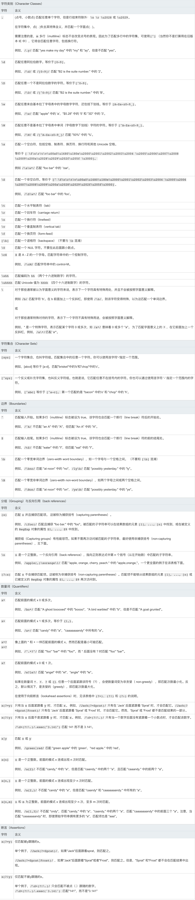
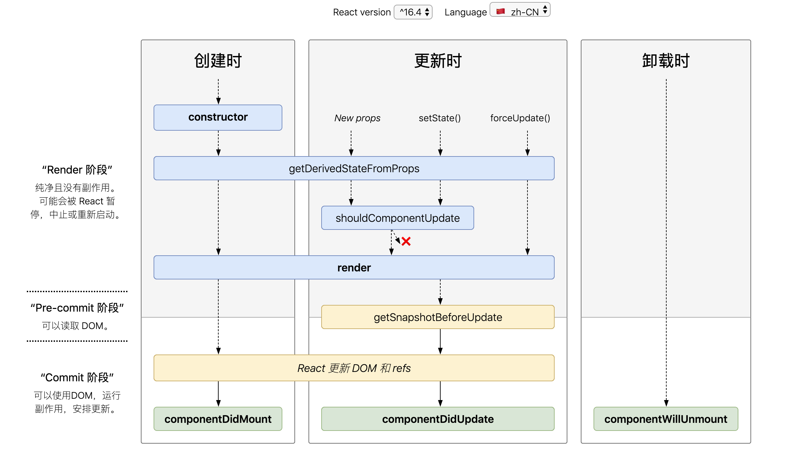

[中高级前端大厂面试秘籍，为你保驾护航金三银四，直通大厂(上)](https://juejin.im/post/5c64d15d6fb9a049d37f9c20)

[中高级前端大厂面试秘籍，寒冬中为您保驾护航，直通大厂(中)](https://juejin.im/post/5c92f499f265da612647b754)

[中高级前端大厂面试秘籍，寒冬中为您保驾护航，直通大厂(下)](https://juejin.im/post/5cc26dfef265da037b611738)

# JavaScript

## var, let 区别

- 顶级作用域 var 声明变量是 window 的属性，let\const 声明变量不是 window 的属性，变量都可以在控制台访问。
- let 声明的变量拥有块级作用域，不存在变量提升
- 暂时性死区

  只要块级作用域内存在 let 命令，它所声明的变量就“绑定”（binding）这个区域，不再受外部的影响。

  ```
    var tmp = 123;

    if (true) {
      tmp = 'abc'; // ReferenceError
      let tmp;
    }
  ```

- 不允许重复声明

## 箭头函数

> 没有自己的 `this`，`arguments`，`super` 或 `new.target`。不能用作构造函数。

- 箭头函数不会创建自己的 this，它只会从自己的作用域链的上一层继承 this

  在箭头函数出现之前，每个新定义的函数都有它自己的 this 值（在构造函数的情况下是一个新对象，在严格模式的函数调用中为 undefined，如果该函数被作为“对象方法”调用则为基础对象等）

  > 由于 箭头函数没有自己的 this 指针，通过 call() 或 apply() 方法调用一个函数时，只能传递参数（不能绑定 this---译者注），他们的第一个参数会被忽略。

- 箭头函数不绑定 Arguments 对象。
- 箭头函数不能用作构造器，和 new 一起用会抛出错误。
- **箭头函数没有 prototype 属性。**

## fetch 取消

- [AbortController](https://developer.mozilla.org/zh-CN/docs/Web/API/FetchController)

- [Abortable fetch](https://developers.google.com/web/updates/2017/09/abortable-fetch)

## symbol

- Symbol()

  Symbol 函数可以接受一个字符串作为参数，表示对 Symbol 实例的描述，主要是为了在控制台显示，或者转为字符串时，比较容易区分。

- Symbol.for()

  接受一个字符串作为参数，然后搜索有没有以该参数作为名称的 Symbol 值。如果有，就返回这个 Symbol 值，否则就新建并返回一个以该字符串为名称的 Symbol 值。

  Symbol.for()与 Symbol()这两种写法，都会生成新的 Symbol。它们的区别是，前者会被登记在全局环境中供搜索，后者不会。

- Symbol.keyFor()

  Symbol.keyFor 方法返回一个已登记的 Symbol 类型值的 key。

  <iframe src="http://es6.ruanyifeng.com/#docs/symbol" width="100%" frameborder="0" height="500px" ></iframe>

## JS 继承

- 原型链：本质是重写原型对象

  - 实现

    ```js
    function SuperType() {
      this.property = true
    }

    SuperType.prototype.getSuperValue = function() {
      return this.property
    }

    function SubType() {
      this.subProperty = false
    }

    // 继承了 SuperType
    SubType.prototype = new SuperType()

    SubType.prototype.constructor = SubType

    SubType.prototype.getSubValue = function() {
      return this.subProperty
    }

    var inst = new SubType()
    alert(inst.getSuperValue())
    ```

  - 确定原型和实例关系
    1. `instanceof`
    2. `isPrototypeOf()`
  - 问题

    1. 包含引用类型值的原型

       ```js
       function SuperType() {
         this.colors = ['red', 'blue', 'green']
       }

       function SubType() {}

       // 继承了 SuperType
       SubType.prototype = new SuperType()
       var inst1 = new SubType()
       inst1.colors.push('black')
       console.log(inst1.colors) // 'red', 'blue', 'green', 'black'

       var inst2 = new SubType()
       console.log(inst2.colors) // 'red', 'blue', 'green', 'black'
       ```

    2. 在创建子类型实例的时候，不能向超类型的构造函数中传递参数。

- 借用构造函数

  > 解决了原型中包含引用类型值所带来的问题

  > 子类构造函数中向超类构造函数传递参数

  - 实现

    ```js
    function SuperType(name) {
      this.name = name
      this.colors = ['red', 'blue', 'green']
    }

    function SubType(name, age) {
      // 继承了 SuperType, 同时还传递了参数
      SuperType.call(this, name)
      // 实例属性
      this.age = age
    }

    var inst1 = new SubType('Nicholas', 29)
    inst1.colors.push('black')
    console.log(inst1.colors) // 'red', 'blue', 'green', 'black'

    var inst2 = new SubType('Jerry', 27)
    console.log(inst2.colors) // 'red', 'blue', 'green'
    ```

  - 问题
    1. 方法都在构造函数中定义，函数复用无从谈起。
    2. 超类原型中定义的方法，子类不可见。

- 组合继承

  > 将`原型链` 和 `借用构造函数` 结合到一起

  - 实现

    ```js
    function SuperType(name) {
      this.name = name
      this.colors = ['red', 'blue', 'green']
    }

    SuperType.prototype.sayName = function() {
      console.log(this.name)
    }

    function SubType(name, age) {
      // 继承 SuperType 实例属性并传递参数
      SuperType.call(this, name)

      this.age = age
    }

    // 继承方法
    SubType.prototype = new SuperType()
    // 修复构造函数
    SubType.prototype.constructor = SubType
    SubType.prototype.sayAge = function() {
      console.log(this.age)
    }

    var inst1 = new SubType('Nicholas', 29)
    inst1.colors.push('black')
    console.log(inst1.colors) // 'red', 'blue', 'green', 'black'
    inst1.sayName()
    inst1.sayAge()

    var inst2 = new SubType('Jerry', 27)
    console.log(inst2.colors) // 'red', 'blue', 'green'
    inst2.sayName()
    inst2.sayAge()
    ```

  - 问题

    1. 组合继承无论什么情况下，都会`调用两次超类构造函数`：

       - `一次是在创建子类原型的时候`
       - `另一次是在子类构造函数内部调用超类构造函数。`

- 原型式继承

  > `Object.create()`规范化了原型式继承

  - `Object.create(proto, [propertiesObject])`

    `Object.create()` 方法创建一个新对象，使用现有的对象来提供新创建的对象的`__proto__`。

    - proto

      新创建对象的原型对象。

    - propertiesObject

      可选。如果没有指定为 undefined，则是要添加到新创建对象的可枚举属性（即其自身定义的属性，而不是其原型链上的枚举属性）对象的属性描述符以及相应的属性名称。这些属性对应 `Object.defineProperties()` 的第二个参数。

    - 实现

      ```js
      if (typeof Object.create !== 'function') {
        Object.create = function(proto, propertiesObject) {
          if (typeof proto !== 'object' && typeof proto !== 'function') {
            throw new TypeError('Object prototype may only be an Object: ' + proto)
          } else if (proto === null) {
            throw new Error(
              "This browser's implementation of Object.create is a shim and doesn't support 'null' as the first argument."
            )
          }

          if (typeof propertiesObject != 'undefined')
            throw new Error(
              "This browser's implementation of Object.create is a shim and doesn't support a second argument."
            )

          function F() {}
          F.prototype = proto

          return new F()
        }
      }
      ```

  - 问题

    在没有必要兴师动众的创建构造函数，而只是想让一个对象与另一个对象保持类似的情况下，原型式继承是完全可以胜任的。但是，**包含引用类型值的属性始终都会共享相应的值。**

- 寄生式继承

  > 创建一个仅用于封装继承过程的函数，该函数在内部以某种方式来增强对象。

  - 实现

    ```js
    function createAnother(original) {
      // 通过调用函数创建一个新对象
      var clone = Object.create(original)
      // 以某种方式来增强新对象
      clone.sayHi = function() {
        console.log('Hi')
      }
      return clone
    }

    var person = {
      name: 'Nicholas',
      friends: ['red', 'blue', 'green']
    }
    var anotherPerson = createAnother(person)
    anotherPerson.sayHi()
    ```

  - 问题

    1. 不能做到函数复用而降低效率

- 寄生组合式继承

  > 组合继承无论什么情况下，都会`调用两次超类构造函数`：

  > `一次是在创建子类原型的时候`  
  > `另一次是在子类构造函数内部调用超类构造函数。`

  ```js
  // 组合继承🌰

  function SuperType(name) {
    this.name = name
    this.colors = ['red', 'blue', 'green']
  }

  SuperType.prototype.sayName = function() {
    console.log(this.name)
  }

  function SubType(name, age) {
    SuperType.call(this, name) // 第二次调用 SuperType()

    this.age = age
  }

  SubType.prototype = new SuperType() // 第一次调用 SuperType()
  SubType.prototype.constructor = SubType
  SubType.prototype.sayAge = funciton() {
    console.log(this.age)
  }
  ```

  > 第一次调用在原型上有两个属性 `name` 和 `colors`  
  > 调用子类构造函数的时候，又会调用超类构造函数，又会在新对象上创建实例属性 `name` 和 `colors`，于是原型链上的两个同名属性就被屏蔽了

  - 实现

    ```js
    function inheritPrototype(subType, superType) {
      var prototype = Object.create(superType.prototype) // 创建对象
      prototype.constructor = subType // 增强对象
      subType.protototype = prototype // 指定对象
    }
    ```

    ```js
    function SuperType(name) {
      this.name = name
      this.colors = ['red', 'blue', 'green']
    }

    SuperType.prototype.sayName = function() {
      console.log(this.name)
    }

    function SubType(name, age) {
      SuperType.call(this, name) // 第二次调用 SuperType()

      this.age = age
    }

    inheritPrototype(SubType, SuperType)
    SubType.prototype.sayAge = function() {
      console.log(this.age)
    }
    ```

  - 引用类型最理想的继承范式

## Class 的继承

<iframe src="http://es6.ruanyifeng.com/#docs/class-extends#%E7%B1%BB%E7%9A%84-prototype-%E5%B1%9E%E6%80%A7%E5%92%8C__proto__%E5%B1%9E%E6%80%A7" width="100%" frameborder="0" height="500px" ></iframe>

## instanceof

> `instanceof` 运算符用于测试构造函数的 `prototype` 属性是否出现在对象的原型链中的任何位置.  
> 如果左操作数不是对象，则返回 false,如果右操作数不是函数，则抛出 typeError.

- 实现原理

  instanceof 主要的实现原理就是只要右边变量的 prototype 在左边变量的原型链上即可

  ```js
  function new_instance_of(leftVaule, rightVaule) {
    let rightProto = rightVaule.prototype // 取右表达式的 prototype 值
    leftVaule = leftVaule.__proto__ // 取左表达式的__proto__值
    while (true) {
      if (leftVaule === null) {
        return false
      }
      if (leftVaule === rightProto) {
        return true
      }
      leftVaule = leftVaule.__proto__
    }
  }
  ```

- 几个有趣的例子

  ```js
  Function instanceof Function // true
  Object instanceof Function // Object 本身是一个函数，由 Function 所创建，所以 `Object.__proto__` 的值是 `Function.prototype`
  Object instanceof Object // `Function.prototype` 的 `__proto__` 属性是 `Object.prototype`
  Function instanceof Object // Function.__proto__ === Function.prototype, Function.prototype 是由 Object 所创建，所以 Function.prototype.__proto__ === Object.prototype
  ```

  

## typeof

typeof 在判断一个 object 的数据的时候只能告诉我们这个数据是 object, 而不能细致的具体到是哪一种 object

最好是用 typeof 来判断基本数据类型（包括 symbol）和 function，避免对 null 的判断。

```js
typeof undefined // "undefined"
typeof true // "boolean"
typeof function() {} // "function"
typeof {} // "object"
typeof [] // "object"
typeof null // "object"
typeof new String('abc') // "object"
typeof new Date() // "object"
```

**还有一个不错的判断类型的方法，就是 Object.prototype.toString**

```js
Object.prototype.toString.call(1) // "[object Number]"
Object.prototype.toString.call('hi') // "[object String]"
Object.prototype.toString.call({ a: 'hi' }) // "[object Object]"
Object.prototype.toString.call([1, 'a']) // "[object Array]"
Object.prototype.toString.call(true) // "[object Boolean]"
Object.prototype.toString.call(() => {}) // "[object Function]"
Object.prototype.toString.call(null) // "[object Null]"
Object.prototype.toString.call(undefined) // "[object Undefined]"
Object.prototype.toString.call(Symbol(1)) // "[object Symbol]"
```

```js
let class2Type = {}[('Array', 'Date', 'RegExp', 'Error', 'Object')].forEach(
  type => (class2Type[`[object ${type}]`] = type.toLowerCase())
)

function type(obj) {
  if (obj === null) return String(null)
  return typeof obj === 'object'
    ? class2Type[Object.prototype.toString.call(obj)] || 'object'
    : typeof obj
}
```

## [typeof 和 instanceOf 的区别](https://segmentfault.com/a/1190000000730982)

> 只有字面量形式的 `string`、 `number`、 `boolean`、 `undefined`、`function` 才能分辨出来，其他都为 `object`

| Value              | Class     | Type                          |
| :----------------- | :-------- | :---------------------------- |
| "foo"              | String    | string                        |
| new String("foo")  | String    | object                        |
| 1.2                | Number    | number                        |
| new Number(1.2)    | Number    | object                        |
| true               | Boolean   | boolean                       |
| new Boolean(true)  | Boolean   | object                        |
| new Date()         | Date      | object                        |
| new Error()        | Error     | object                        |
| [1,2,3]            | Array     | object                        |
| new Array(1, 2, 3) | Array     | object                        |
| new Function("")   | Function  | function                      |
| /abc/g             | RegExp    | object (function in Nitro/V8) |
| new RegExp("meow") | RegExp    | object (function in Nitro/V8) |
| {}                 | Object    | object                        |
| new Object()       | Object    | object                        |
| null               | Null      | object                        |
| undefined          | Undefined | undefined                     |

> Class 一列表示对象的内部属性 [[Class]] 的值。  
> 为了获取对象的 [[Class]]，我们需要使用定义在 Object.prototype 上的方法 toString。

## [正则](https://developer.mozilla.org/zh-CN/docs/Web/JavaScript/Guide/Regular_Expressions)



- 标识符：
  - g: 全局
  - i: 忽略大小写
  - m: 多行模式， 在到达一行文本末尾时还会继续查找下一行中是否存在与模式匹配的项。
- 元字符：
  - `([{\^$|}?*+.])`
  - 所有的元字符都必须经过转义
- 使用 `RegExp` 构造函数
  - 由于 `RegExp` 构造函数的模式参数是个字符串，所以在某些情况下要对字符串进行双重转义
  
    | 字面量模式         | 等价的字符串          |
    | :----------------- | :-------------------- |
    | `/\[bc\]at/`       | `\\[bc\\]at`          |
    | `/\.at/`           | `\\.at`               |
    | `/name\/age/`      | `name\\/age`          |
    | `/\d.\d{1,2}/`     | `\\d.\\d{1,2}`        |
    | `/\w\\hello\\123/` | `\\w\\\\hello\\\\123` |
- ES5 明确规定，使用正则表达式字面量必须像直接调用 `RegExp` 构造函数一样，每次都创建新的 `RegExp` 实例。
- 实例属性
  - global
  - ignoreCase
  - multiline
  - source: 正则表达式的字符串表示，按照**字面量形式**而非传入构造函数的字符串模式
  - lastIndex: 开始搜索下一个匹配项的字符位置，起始 0
- 实例方法

  - exec(): 专门为捕获组而设计，返回包含第一个匹配项信息的数组，没有匹配项返回 null
    - 返回数组属性
      - 第一项是与整个模式匹配的字符串
      - 其他项是与模式中的捕获组匹配的字符串
      - index: 匹配项在字符串中的位置
      - input: 应用正则表达式的字符串
    - 模式中设置了 `g` 标志,每次也只返回一个匹配项
      - 同一个字符串多次调用 `exec()`,每次调用都会在字符串中继续查找新的匹配项
  - test(): 是否匹配
  - toLocaleString(): 返回正则表达式字面量
  - toString(): 返回正则表达式字面量

- 构造函数属性

  | 长属性名      | 短属性名                                                         | 说明                                   |
  | :------------ | :--------------------------------------------------------------- | :------------------------------------- |
  | input         | \$\_                                                             | 最近一次要匹配的字符串                 |
  | lastMatch     | \$&                                                              | 最近一次匹配项                         |
  | lastParen     | \$+                                                              | 最近一次匹配的捕获组                   |
  | leftContext   | \$`                                                              | input 字符串中 lastMatch 之前的文本    |
  | rightContext  | \$'                                                              | input 字符串中 lastMatch 之后的文本    |
  | multiline     | \$\*                                                             | 布尔值，是否所有的表达式都使用多行模式 |
  | $1,$2,...,\$9 | 存储第一到第九个捕获组，调用 exec()或 test()时，这些属性自动填充 |                                        |
  |               |                                                                  |                                        |

- [正则 test, match, exec](https://developer.mozilla.org/zh-CN/docs/Web/JavaScript/Guide/Regular_Expressions)

  - test\exec 是正则的实例方法， match 是字符串的方法
  - test 匹配与否，返回 Boolean
  - match\exec 捕获组， 如果匹配，返回数组，未匹配返回 null
    - 返回数组第一项为正则匹配的整个字符串，后面为括号对应的捕获组，index 是整个匹配从零开始的索引，Input 为被解析的原始字符串

## 实现一个 bind 函数

bind()方法创建一个新的函数，在调用时设置 this 关键字为提供的值。并在调用新函数时，将给定参数列表作为原函数的参数序列的前若干项。

`function.bind(thisArg[, arg1[, arg2[, ...]]])`

- thisArg

  调用绑定函数时作为 this 参数传递给目标函数的值。 如果使用 new 运算符构造绑定函数，则忽略该值。当使用 bind 在 setTimeout 中创建一个函数（作为回调提供）时，作为 thisArg 传递的任何原始值都将转换为 object。**如果 bind 函数的参数列表为空，执行作用域的 this 将被视为新函数的 thisArg。**

- arg1, arg2, ...

  当目标函数被调用时，预先添加到绑定函数的参数列表中的参数。

```js
if (!Function.prototype.bind) {
  Function.prototype.bind = function(oThis) {
    if (typeof this !== 'function') {
      throw new TypeError('Function.prototype.bind - what is trying to be bound is not callable')
    }

    var args = Array.prototype.slice.call(arguments, 1),
      functionToBind = this,
      functionBound = function() {
        var bindArgs = Array.prototype.slice.call(arguments)
        // this instanceof fBound === true时,说明返回的fBound被当做new的构造函数调用
        return functionToBind.apply(
          this instanceof functionBound ? this : oThis,
          // 获取调用时(fBound)的传参.bind 返回的函数入参往往是这么传递的
          args.concat(bindArgs)
        )
      }

    // 我们直接将 fBound.prototype = this.prototype，我们直接修改 fBound.prototype 的时候，也会直接修改绑定函数的 prototype。这个时候，我们可以通过一个空函数来进行中转：

    // 维护原型关系(原型链继承)
    var fNOP = function() {}
    if (this.prototype) {
      fNOP.prototype = this.prototype
    }

    functionBound.prototype = new fNOP()

    // functionbound.prototype = Object.create(this.prototype);

    return functionBound
  }
}
```

## [JavaScript 中的对象拷贝](https://juejin.im/entry/5a28ec86f265da43163cf720)

- 浅拷贝

  - Object.assign()、扩展运算符(...)
    1. 复制对象的可枚举属性
    2. 可以拷贝方法，和循环引用
    3. 复制的嵌套属性是引用，共享

- 深拷贝
  - [深入深入再深入 js 深拷贝对象](https://juejin.im/post/5ad6b72f6fb9a028d375ecf6)
  - [lodash baseClone](https://github.com/lodash/lodash/blob/master/.internal/baseClone.js)
  - JSON.parse(JSON.stringify(obj))  
    原型改变，不能复制对象方法，不能复制循环引用
  - 递归遍历属性，复制属性 Object.getOwnPropertyDescriptor
    - 可枚举属性
    - 循环引用
    - Symbol键
    - 原型上的属性
    - 不可枚举的属性：属性描述符、setters、getters 等
    ```js
      function isObject(data) {
        return data != null && (typeof data === 'object' || typeof data === 'function')
      }

      function deepClone(obj, hash = new WeakMap()) {

        if(!isObject(obj)) {
          return obj;
        }
        // 查表，防止循环拷贝
        if(hash.has(obj)) {
          return hash.get(obj);
        }

        let isArray = Array.isArray(obj)
        // 初始化拷贝对象
        let cloneObj = isArray ? [] : {};
        // 哈希表设置
        hash.set(obj, cloneObj)
        // 获取原对象的所有属性描述符
        let descriptors = Object.getOwnPropertyDescriptors(obj);
        // 获取原对象所有 symbol 类型值
        let symbolKeys = Object.getOwnPropertySymbols(obj);
        // 拷贝所有 symbol 属性
        if(symbolKeys.length >0) {
          symbolKeys.forEach(symbolKey => {
            cloneObj[symbolKey] = isObject(obj[symbolKey]) ? deepClone(obj[symbolKey], hash) : obj[symbolKey];
          })
        }

        // 拷贝不可枚举属性 ?????
        cloneObj = Object.create(Object.getPrototypeOf(cloneObj), descriptors)

        // 拷贝可枚举属性（包括原型链上的）
        for(let key in obj) {
          cloneObj[key] = isObject(obj[key]) ? deepClone(obj[key]) : obj[key];
        }

        return cloneObj;
      } 
      /**
        * 拷贝原型链
        * 拷贝属性描述符
        * 拷贝symbol属性
        */
      function cloneDeep(obj) {
        // 拷贝原型链
        let family = {};
        let parent = Object.getPrototypeOf(obj)
        while(parent != null) {
          family = completeAssign(deepClone(obj), parent) //
          parent = Object.getPrototypeOf(parent)
        }

        // 拷贝所有自有属性的属性描述符,来自于 MDN
        // https://developer.mozilla.org/zh-CN/docs/Web/JavaScript/Reference/Global_Objects/Object/assign
        function completeAssign(target, ...sources) {
          sources.forEach(source => {
            // 复制属性描述符
            let descriptors = Object.keys(source).reduce((descriptors, curKey)=>{
              descriptors[curKeys] = Object.getOwnPropertyDescriptor(source, curKey)
              return descriptors;
            }, {});

            // 复制可枚举的 symbols 属性
            Object.getOwnPropertySymbols(source).forEach(sym => {
              let descriptor = Object.getOwnPropertyDescriptor(source, sym);
              if(descriptor.enumerable) {
                descriptors[sym] = descriptor;
              }
            });

            Object.defineProperties(target, descriptors);
          });

          return target;
        }
        
        return completeAssign(deepClone(obj), family )
      }
    ```

## [深入理解 new 操作符](https://www.cnblogs.com/onepixel/p/5043523.html)

```js
  new Animal() {
    const obj = {};
    obj.__proto__ = Animal.prototype;

    const result = Animal.apply(obj, arguments);
    return result!==null && typeof result === 'object' ? result : obj; // 忽略 null

  }
```

## for...in 迭代和 for...of 有什么区别

- for...in

  > 以任意顺序遍历对象的可枚举属性 （enumerable properties），包括对象从其构造函数原型中继承的属性。

- for...of
  > 遍历可迭代对象（iterable object, 定义了 Symbol.iterator 方法） 定义的可迭代的数据 ，比如遍历 Array，Map，Set，String，TypedArray，arguments 等对象的数据。

* [for...in 和 for...of 区别](https://blog.csdn.net/wangjun5159/article/details/51479569)
* [for in 和 for of 的区别](https://www.jianshu.com/p/c43f418d6bf0)

## [深入理解 Babel 原理及其使用](https://www.jianshu.com/p/e9b94b2d52e2)

## [前端基础进阶（二）：执行上下文详细图解](https://www.jianshu.com/p/a6d37c77e8db)

### [什么是作用域和执行上下文](https://segmentfault.com/a/1190000009522006)

### [Javascript 函数声明的优先级高于变量声明的优先级，但不会覆盖变量赋值](https://blog.csdn.net/wy818/article/details/49247675)

## Set 和 Map 数据结构

<iframe src="http://es6.ruanyifeng.com/#docs/set-map" width="100%" frameborder="0" height="500px" ></iframe>

## 异步解决方案

### Promise

- [【剖析 Promise 内部结构，一步一步实现一个完整的、能通过所有 Test case 的 Promise 类】](https://github.com/xieranmaya/blog/issues/3)

* [深入 Promise(一)——Promise 实现详解](https://zhuanlan.zhihu.com/p/25178630)
* [深入 Promise(二)——进击的 Promise](https://zhuanlan.zhihu.com/p/25198178)
* [深入 Promise(三)——命名 Promise](https://zhuanlan.zhihu.com/p/25199781)

- [实现](https://github.com/xieranmaya/Promise3/blob/master/Promise3.js)

  ```js
  function Promise(executor) {
    var self = this
    self.status = 'pending'
    self.value = undefined
    self.onResolveCallback = []
    self.onRejectCallback = []

    function resolve(value) {
      if (value instanceof Promise) {
        return value.then(resolve, reject)
      }
      setTimeout(function() {
        if (self.status === 'pending') {
          self.status = 'fulfilled'
          self.value = value
          for (var i = 0; i < self.onResolveCallback.length; i++) {
            self.onResolveCallback[i](value)
          }
        }
      })
    }

    function reject(reason) {
      setTimeout(function() {
        if (self.status === 'pending') {
          self.status = 'rejected'
          self.value = reason
          for (var i = 0; i < self.onRejectCallback.length; i++) {
            self.onRejectCallback[i](reason)
          }
        }
      })
    }

    try {
      executor(resolve, reject)
    } catch (e) {
      reject(e)
    }
  }

  function resolvePromise(promise2, x, resolve, reject) {
    var then
    var thenCalledOrThrow = false

    if (promise2 === x) {
      return reject(new TypeError('Chaining cycle detected for promise!'))
    }

    if (x instanceof Promise) {
      if (x.status === 'pending') {
        x.then(function(value) {
          resolvePromise(promise2, value, resolve, reject)
        }, reject)
      } else {
        x.then(resolve, reject)
      }
      return
    }

    if (x !== null && (typeof x === 'object' || typeof x === 'function')) {
      try {
        then = x.then
        if (typeof then === 'function') {
          then.call(
            x,
            function rs(y) {
              if (thenCalledOrThrow) return
              thenCalledOrThrow = true
              return resolvePromise(promise2, y, resolve, reject)
            },
            function rj(r) {
              if (thenCalledOrThrow) return
              thenCalledOrThrow = true
              return reject(r)
            }
          )
        } else {
          resolve(x)
        }
      } catch (e) {
        if (thenCalledOrThrow) return
        thenCalledOrThrow = true
        return reject(e)
      }
    } else {
      resolve(x)
    }
  }

  Promise.prototype.then = function(onResolved, onRejected) {
    var self = this
    var promise2

    onResolved =
      typeof onResolved === 'function'
        ? onResolved
        : function(value) {
            return value
          }
    onRejected =
      typeof onRejected === 'function'
        ? onRejected
        : function(reason) {
            throw reason
          }

    if (self.status === 'fulfilled') {
      return (promise2 = new Promise(function(resolve, reject) {
        setTimeout(function() {
          try {
            var x = onResolved(self.value)
            resolvePromise(promise2, x, resolve, reject)
          } catch (e) {
            reject(e)
          }
        })
      }))
    }

    if (self.status === 'rejected') {
      return (promise2 = new Promise(function(resolve, reject) {
        setTimeout(function() {
          try {
            var x = onReject(self.value)
            resolvePromise(promise2, x, resolve, reject)
          } catch (e) {
            reject(e)
          }
        })
      }))
    }

    if (self.status === 'pending') {
      return (promise2 = new Promise(function(resolve, reject) {
        self.onResolvedCallback.push(function(value) {
          try {
            var x = onResolved(value)
            resolvePromise(promise2, x, resolve, reject)
          } catch (e) {
            reject(e)
          }
        })

        self.onRejectedCallback.push(function(reason) {
          try {
            var x = onReject(reason)
            resolvePromise(promise2, x, resolve, reject)
          } catch (e) {
            reject(e)
          }
        })
      }))
    }
  }

  Promise.prototype.catch = function(onReject) {
    return this.then(null, onReject)
  }

  Promise.deferred = Promise.defer = function() {
    var dfd = {}
    dfd.promise = new Promise(function(resolve, reject) {
      dfd.resolve = resolve
      dfd.reject = reject
    })
    return dfd
  }
  ```

### generator

<iframe src="http://es6.ruanyifeng.com/#docs/generator" width="100%" frameborder="0" height="500px" ></iframe>

### async/await

```js
function spawn(genF) {
  return new Promise(function(resolve, reject) {
    const gen = genF()

    function step(nextF) {
      let next
      try {
        next = nextF()
      } catch (err) {
        return reject(err)
      }
      if (next.done) {
        return resolve(next.value)
      }

      Promise.resolve(next.value).then(
        function(v) {
          step(function() {
            return gen.next(v)
          })
        },
        function(err) {
          step(function() {
            return gen.throw(err)
          })
        }
      )
    }

    step(function() {
      return gen.next(undefined)
    })
  })
}
```

<iframe src="http://es6.ruanyifeng.com/#docs/async#async-%E5%87%BD%E6%95%B0%E7%9A%84%E5%AE%9E%E7%8E%B0%E5%8E%9F%E7%90%86" width="100%" frameborder="0" height="500px" ></iframe>

### promise 和 async 区别

async 和 promise 都不会阻塞执行，await 只会对 async 函数内 await 之后的代码产生阻塞。

async 异常捕获用 try...catch, promise 直接用 catch(), try...catch 无法捕获 promise 异常。

async...await 是 Generator 函数语法糖。[ co 模块类似实现](#asyncawait)。

## 防抖与节流

- 防抖

  将多次高频操作优化为只在最后一次执行，通常使用的场景是：用户输入，只需再输入完成后做一次输入校验即可。

  [lodash debounce](https://github.com/lodash/lodash/blob/master/debounce.js)

  ```js
  function debounce(fn, interval) {
    let timeout = null
    return function() {
      clearTimeout(timeout)

      timeout = setTimeout(() => {
        fn.apply(this, arguments)
      }, interval)
    }
  }
  ```

- 节流

  每隔一段时间后执行一次，也就是降低频率，将高频操作优化成低频操作，通常使用场景: 滚动条事件 或者 resize 事件，通常每隔 100~500 ms 执行一次即可。

  [lodash throttle](https://github.com/lodash/lodash/blob/master/throttle.js)

  ```js
  function throttle(fn, interval) {
    let canRun = true
    return function() {
      if (!canRun) return

      canRun = false

      setTimeout(() => {
        fn.apply(this, arguments)
        canRun = true
      }, interval)
    }
  }
  ```

## this 指向

- [彻底理解 js 中 this 的指向，不必硬背。](https://www.cnblogs.com/pssp/p/5216085.html)
- [彻底理解 JavaScript 中的 this](https://juejin.im/post/5c049e6de51d45471745eb98)

## [前端基础进阶：详细图解 JavaScript 内存空间](https://juejin.im/entry/589c29a9b123db16a3c18adf)

## import 和 require 的区别

- import 是关键字， 而 require 是个局部变量

  使用 require 的时候，其实会将 module 的代码进行包装，变成如下样子的代码：

  ```js
    function (exports, require, module, __filename, __dirname) {
      const m = 1;
      module.exports.m = m;
    }
  ```

- ES6 模块的设计思想是尽量的静态化，使得编译时就能确定模块的依赖关系，以及输入和输出的变量。CommonJS 和 AMD 模块，都只能在运行时确定这些东西。

  ```js
  // CommonJS模块
  let { stat, exists, readFile } = require('fs')

  // 等同于
  let _fs = require('fs')
  let stat = _fs.stat
  let exists = _fs.exists
  let readfile = _fs.readfile
  ```

  > 上面代码的实质是整体加载 fs 模块（即加载 fs 的所有方法），生成一个对象（`_fs`），然后再从这个对象上面读取 3 个方法。这种加载称为“运行时加载”，因为只有运行时才能得到这个对象，导致完全没办法在编译时做“静态优化”。

  > ES6 模块不是对象，而是通过 export 命令显式指定输出的代码，再通过 import 命令输入。

  ```js
  // ES6模块
  import { stat, exists, readFile } from 'fs'
  ```

  > 上面代码的实质是从 fs 模块加载 3 个方法，其他方法不加载。这种加载称为“编译时加载”或者静态加载，即 ES6 可以在编译时就完成模块加载，效率要比 CommonJS 模块的加载方式高。当然，这也导致了没法引用 ES6 模块本身，因为它不是对象。

- export 语句输出的接口，与其对应的值是动态绑定关系，即通过该接口，可以取到模块内部实时的值。

  ```js
  export default function() {}
  =>
  function a(){}
  export { a as default }

  ================华丽分割线=====================

  import a from './d';
  =>
  import { default as a } from './d'
  ```

1. CommonJS 还是 ES6 Module 输出都可以看成是一个具备多个属性或者方法的对象；

- require

  理论上可以运用在代码的任何地方，甚至不需要赋值给某个变量之后再使用

  ```js
  require('./a')() // a模块是一个函数，立即执行a模块函数
  var data = require('./a').data // a模块导出的是一个对象
  var a = require('./a')[0] // a模块导出的是一个数组
  ```

## [ES6 模块与 CommonJS 模块的差异](http://es6.ruanyifeng.com/#docs/module-loader#ES6-%E6%A8%A1%E5%9D%97%E4%B8%8E-CommonJS-%E6%A8%A1%E5%9D%97%E7%9A%84%E5%B7%AE%E5%BC%82)

<iframe src="http://es6.ruanyifeng.com/#docs/module-loader#ES6-%E6%A8%A1%E5%9D%97%E4%B8%8E-CommonJS-%E6%A8%A1%E5%9D%97%E7%9A%84%E5%B7%AE%E5%BC%82" width="100%" frameborder="0" height="500px" ></iframe>

## script 属性 defer 和 async 区别

defer 要等到整个页面在内存中正常渲染结束（DOM 结构完全生成，以及其他脚本执行完成），才会执行；async 一旦下载完，渲染引擎就会中断渲染，执行这个脚本以后，再继续渲染。一句话，defer 是“渲染完再执行”，async 是“下载完就执行”。另外，如果有多个 defer 脚本，会按照它们在页面出现的顺序加载，而多个 async 脚本是不能保证加载顺序的。

“每一个 defer 属性的脚本都是在页面解析完毕之后，按照原本的顺序执行，同时会在 document 的 DOMContentLoaded 之前执行。”--------------HTML5 规范要求脚本执行应该按照脚本出现的先后顺序执行，但实际情况下，延迟脚本不一定按照先后顺序执行！！！


## 判断元素是否在视窗之内

- Element.getBoundingClientRect(): 除了 width 和 height 外的属性都是相对于视口的左上角位置而言的。
  - left
  - right
  - top
  - bottom
  - width
  - height
  - x(同left)
  - y(同top)
  
  

- IntersectionObserver
  1. 创建一个 intersection observer

      ```js
        let options = {
          root: document.querySelector('#scrollArea'),  // 指定根(root)元素，用于检查目标的可见性。必须是目标元素的父级元素。如果未指定或者为null，则默认为浏览器视窗。
          rootMargin: '0px', // root元素的外边距。类似于css中的 margin 属性，比如 "10px 20px 30px 40px" (top, right, bottom, left)。如果有指定root参数，则rootMargin也可以使用百分比来取值。该属性值是用作root元素和target发生交集时候的计算交集的区域范围，使用该属性可以控制root元素每一边的收缩或者扩张。默认值为0。
          threshold: 1.0 // 可以是单一的number也可以是number数组，target元素和root元素相交程度达到该值的时候IntersectionObserver注册的回调函数将会被执行。
        }
        let observer = new IntersectionObserver(callback, options)
      ```

  2. 为每个观察者配置一个目标

      ```js
        let target = document.querySelector('#listItem')
        observer.observe(target)

        let callback = function(entries, observer) {
          entries.forEach(entry => {
            // Each entry describes an intersection change for one observed
            // target element:
            //   entry.boundingClientRect
            //   entry.intersectionRatio
            //   entry.intersectionRect
            //   entry.isIntersecting
            //   entry.rootBounds
            //   entry.target
            //   entry.time   
          })
        }
      ```

## window.requestIdleCallback() 

> 在浏览器空闲时期依次调用函数，这就可以让开发者在主事件循环中执行后台或低优先级的任务，而且不会对像动画和用户交互这样延迟敏感的事件产生影响。函数一般会按先进先出调用的顺序执行，然而，如果回调函数指定了执行超时时间timeout，则有可能为了在超时前执行函数而打乱执行顺序。

- 语法：`let handle = window.requestIdleCallBack(callback[,options])`
  - 返回值：无符号长整数，可以传入`window.cancelIdleCallback()`结束回调
  - options
    - timeout: timeout 值被指定为正数时，当做浏览器调用 callback 的最后期限。它的单位是毫秒。当指定的时间过去后回调还没有被执行，那么回调会在下一次空闲时期被强制执行，尽管可能会对性能造成负面影响。

## window.requestAnimationFrame(callback)

> 告诉浏览器——你希望执行一个动画，并且要求浏览器在下次重绘之前调用指定的回调函数更新动画。该方法需要传入一个回调函数作为参数，该回调函数会在浏览器下一次重绘之前执行

- window.cancelAnimationFrame(id)


# 浏览器

## Cookie

- [SameSite cookies](https://developer.mozilla.org/en-US/docs/Web/HTTP/Cookies#SameSite_cookies)
  - Strict: same origin
  - Lax: 在跨站点子请求中不携带 same-site cookies，例如加载图像或帧的调用。但是当用户从外部站点导航到 URL 时将发送 same-site cookies
  ```js
    Set-Cookie: key=value; SameSite=Strict
  ```
- Secure
- HttpOnly

## [chrome 显示 12px 以下字体的解决方法](https://blog.csdn.net/u012011360/article/details/41846905)

```html
<span style="display: 'block'; font-size='16px'; transform: scale(0.5);">8px 字体</span>
```

## 跨域

- [前端常见跨域解决方案（全）](https://segmentfault.com/a/1190000011145364)
  - JSONP(JSON with padding)
  - postMessage
  - cors
  - document.domain + iFrame
  - window.name + iFrame
  - location.hash + iFrame
  - 同域服务器转发请求

    <iframe src="https://segmentfault.com/a/1190000011145364" width="100%" frameborder="0" height="500px" ></iframe>

- [CORS](http://www.ruanyifeng.com/blog/2016/04/cors.html)

  ```js
    Access-Control-Allow-Origin: *                      // 对于不需要携带身份凭证的请求，服务器可以指定该字段的值为通配符，表示允许来自所有域的请求。
    Access-Control-Allow-Methods: GET, POST, PUT
    Access-Control-Allow-Headers: X-Custom-Header       // 允许客户端在请求中携带头部
    Access-Control-Allow-Credentials: true
    Access-Control-Max-Age: 1728000                     // 指定了preflight请求的结果能够被缓存多久
    /**
      * 在跨域访问时，XMLHttpRequest对象的getResponseHeader()方法只能拿到一些最基本的响应头，Cache-Control、Content-Language、Content-Type、Expires、Last-Modified、Pragma，如果要访问其他头，则需要服务器设置本响应头。
      */
    Access-Control-Expose-Headers: X-My-Custom-Header, X-Custom-Header
  ```

  - 跨域携带 cookie

    > 对于附带身份凭证的请求，服务器不得设置 Access-Control-Allow-Origin 的值为“\*”。

    ```js
      // 服务端
      Access-Control-Allow-Credentials: true

      // 客户端
      XMLHttpRequest.withCredentials = true
    ```

    [XMLHttpRequest.withCredentials](https://developer.mozilla.org/zh-CN/docs/Web/API/XMLHttpRequest/withCredentials)

    [Request.credentials](https://developer.mozilla.org/en-US/docs/Web/API/Request/credentials)

## [跨页面通信的各种姿势](https://zhuanlan.zhihu.com/p/29368435)

- 获取句柄，postMessage

  ```js
  const childPage = window.open(strUrl, strWindowName, [strWindowFeatures])

  childPage.onload = () => {
    childPage.postMessage(message, targetOrigin, [transfer])
  }

  window.onmessage = e => {
    console.log(e.data)
    console.log(e.origin)
    console.log(e.source)
  }
  ```

- localStorage,设置共享区域的 storage，storage 会触发 storage 事件

  ```js
  localStorage.setItem('message', 'hello')

  window.onStorage = evt => {
    // evt.key evt.oldValue evt.newValue
  }
  ```

  - 触发写入操作的页面下的 **storage listener** 不会被触发
  - storage 事件只有在发生改变的时候才会触发，即重复设置相同值不会触发 listener
  - safari 隐身模式下无法设置 localStorage 值

- BroadcastChannel

  ```js
  // a.html
  const channel = new BroadcastChannel('tabs')
  channel.onmessage = evt => {
    // evt.data
  }

  // b.html
  const channel = new BroadcastChannel('tabs')
  channel.postMessage('hello')
  ```

- SharedWorker

- cookie

  一个古老的方案，有点`localStorage`的降级兼容版，我也是整理本文的时候才发现的，思路就是往`document.cookie`写入值，由于 cookie 的改变没有事件通知，所以只能采取轮询脏检查来实现业务逻辑。

- Server

## [深入浅出浏览器渲染原理](https://juejin.im/post/5c35cf62f265da615e05a67d)

  - 以下操作会导致重排或重绘
    - 增、删、改 DOM 节点
    - 修改 CSS 样式，改变元素的大小、位置，或使用 `display:none;` 时会造成重排；修改颜色 `visibility: hidden` 会造成重绘
    - 修改网页的默认字体大小会造成重排
    - Resize 窗口或滚动时
    - 内容改变时（用户输入改变也会）
    - 计算 offsetWidth 和 offsetHeight
    
  - 减少重排和重绘
    - 尽量避免style的使用，对于需要操作DOM元素节点，重新命名className，更改className名称。
    - 如果增加元素或者clone元素，可以先把元素通过documentFragment放入内存中，等操作完毕后，再appendChild到DOM元素中
    - 不要经常获取同一个元素，可以第一次获取元素后，用变量保存下来，减少遍历时间
    - 尽量少使用dispaly:none，可以使用visibility:hidden代替，dispaly:none会造成重排，visibility:hidden会造成重绘。
    - 不要使用Table布局，因为一个小小的操作，可能就会造成整个表格的重排或重绘
    - 使用resize事件时，做防抖和节流处理。
    - 对动画元素使用absolute / fixed属性。
    - 批量修改元素时，可以先让元素脱离文档流，等修改完毕后，再放入文档流。

## CSS 和 JS 解析、渲染

- [原来 CSS 与 JS 是这样阻塞 DOM 解析和渲染的](https://juejin.im/post/59c60691518825396f4f71a1)
- [css 加载会造成阻塞吗？](https://juejin.im/post/5b88ddca6fb9a019c7717096)
  - DOM 解析和 CSSOM 解析是两个并行的线程，CSS 的加载不会阻塞 DOM 的解析
  - CSS 加载会阻塞 DOM 树的渲染的
  - 由于 JS 会操作之前的 DOM 节点和 CSS 样式，因此，浏览器会维持 html 中 CSS 和 JS 的顺序。因此，CSS 会在后面的 JS 执行之前先加载执行完毕，所以 CSS 会阻塞后面 JS 的执行。
- [再谈 load 与 DOMContentLoaded](https://juejin.im/post/5b2a508ae51d4558de5bd5d1)

## Event loop

- [带你彻底弄懂 Event Loop](https://juejin.im/post/5b8f76675188255c7c653811)
- [浏览器事件循环机制（event loop）](https://juejin.im/post/5afbc62151882542af04112d)
- [JavaScript 运行机制详解：再谈 Event Loop](http://www.ruanyifeng.com/blog/2014/10/event-loop.html)

## IO 模式

- [Linux IO 模式及 select、poll、epoll 详解](https://segmentfault.com/a/1190000003063859?utm_source=Weibo&utm_medium=shareLink&utm_campaign=socialShare#articleHeader0)
- [大话 Select、Poll、Epoll](https://cloud.tencent.com/developer/article/1005481)

## V8 引擎中的垃圾回收机制

- [浅谈 V8 引擎中的垃圾回收机制](https://segmentfault.com/a/1190000000440270)

## 浏览器缓存

- [彻底搞懂浏览器缓存机制](https://juejin.im/post/5c4528a6f265da611a4822cc)
- [HTTP 缓存](https://developer.mozilla.org/zh-CN/docs/Web/HTTP/Caching_FAQ)
- [Cache-Control](https://developer.mozilla.org/zh-CN/docs/Web/HTTP/Headers/Cache-Control)
  - no-cache: 告诉浏览器、缓存服务器，不管本地副本是否过期，使用资源副本前，一定要到源服务器进行副本有效性校验。
  - must-revalidate：告诉浏览器、缓存服务器，本地副本过期前，可以使用本地副本；本地副本一旦过期，必须去源服务器进行有效性校验。

## [DNS 解析过程及 DNS 优化](https://blog.csdn.net/cat_foursi/article/details/71194397)

## 前端安全

- [前端安全知多少](https://juejin.im/entry/598d6eb46fb9a03c3a25d2c1)
- [如何防止 XSS 攻击？](https://tech.meituan.com/2018/09/27/fe-security.html)

  - xss

    > Cross-Site Scripting（跨站脚本攻击）简称 XSS，是一种代码注入攻击。攻击者通过在目标网站上注入恶意脚本，使之在用户的浏览器上运行。利用这些恶意脚本，攻击者可获取用户的敏感信息如 Cookie、SessionID 等，进而危害数据安全。

    > XSS 的本质是：恶意代码未经过滤，与网站正常的代码混在一起；浏览器无法分辨哪些脚本是可信的，导致恶意脚本被执行。

    为了和 CSS 区分，这里把攻击的第一个字母改成了 X，于是叫做 XSS。
      
    XSS 分类

    - 存储型 XSS：
    
      存储型 XSS 的攻击步骤：

      1. 攻击者将恶意代码提交到目标网站的数据库中。
      2. 用户打开目标网站时，网站服务端将恶意代码从数据库取出，拼接在 HTML 中返回给浏览器。
      3. 用户浏览器接收到响应后解析执行，混在其中的恶意代码也被执行。
      4. 恶意代码窃取用户数据并发送到攻击者的网站，或者冒充用户的行为，调用目标网站接口执行攻击者指定的操作。

      这种攻击常见于带有用户保存数据的网站功能，如论坛发帖、商品评论、用户私信等。

    - 反射型 XSS:
    
      反射型 XSS 的攻击步骤：

      1. 攻击者构造出特殊的 URL，其中包含恶意代码。
      2. 用户打开带有恶意代码的 URL 时，网站服务端将恶意代码从 URL 中取出，拼接在 HTML 中返回给浏览器。
      3. 用户浏览器接收到响应后解析执行，混在其中的恶意代码也被执行。
      4. 恶意代码窃取用户数据并发送到攻击者的网站，或者冒充用户的行为，调用目标网站接口执行攻击者指定的操作。

      > 反射型 XSS 跟存储型 XSS 的区别是：存储型 XSS 的恶意代码存在数据库里，反射型 XSS 的恶意代码存在 URL 里。

      反射型 XSS 漏洞常见于通过 URL 传递参数的功能，如网站搜索、跳转等。

      由于需要用户主动打开恶意的 URL 才能生效，攻击者往往会结合多种手段诱导用户点击。

      POST 的内容也可以触发反射型 XSS，只不过其触发条件比较苛刻（需要构造表单提交页面，并引导用户点击），所以非常少见。

    - DOM 型 XSS:
    
      DOM 型 XSS 跟前两种 XSS 的区别：DOM 型 XSS 攻击中，取出和执行恶意代码由浏览器端完成，属于前端 JavaScript 自身的安全漏洞，而其他两种 XSS 都属于服务端的安全漏洞。
      ```html
      <script>
        eval(location.hash.substr(1))
        // 而这个时候，如果用户在网址后面加上恶意代码
        ;('http://www.xss.com#alert(document.cookie)')
      </script>
      ```

    XSS 预防：

    1. 输入过滤，转义(html 转义为实体)输出、存储
    2. 在标签的 href、src 等属性中，包含 `javascript:` 等可执行代码。
    3. 避免使用 eval，new Function 等执行字符串的方法，除非确定字符串和用户输入无关。
       `new Function ([arg1[, arg2[, ...argN]],] functionBody)`
    4. 使用 innerHTML，document.write 的时候，如果数据是用户输入的，那么需要对关键字符都进行过滤与转义。
    5. 对于非客户端 cookie，比如保存用户凭证的 session，务必标识为 http only，这样 js 就获取不到这个 cookie 值了，安全性得到提高。
    6. X-XSS-Protection
    7. cookie secure\httpOnly

  - CSRF
    - [浅谈 CSRF 攻击方式](https://www.cnblogs.com/hyddd/archive/2009/04/09/1432744.html)
    - [跨站请求伪造与 Same-Site Cookie](https://www.jianshu.com/p/66f77b8f1759)
    - 预防
      - 检测 http referer 是否是同域名，通常来讲，用户提交的请求，referer 应该是来来自站内地址，所以如果发现 referer 中地址异常，那么很可能是遭到了 CSRF 攻击。
      - 避免登录的 session 长时间存储在客户端中。
      - 关键请求使用验证码或者 token 机制。在一些十分关键的操作，比如交易付款环节。这种请求中，加入验证码，可以防止被恶意用户攻击。token 机制也有一定的防御作用。具体来说就是服务器每次返回客户端页面的时候，在页面中埋上一个 token 字段，例如 `<input type=“hidden” name=“csrftoken” value=“abcd">`。 之后，客户端请求的时候带上这个 token，使用这个机制后，攻击者也就很难发起 CSRF 攻击了。
      - sameSite cookie

## [前端性能优化最佳实践](https://csspod.com/frontend-performance-best-practices/)

## [React 16 加载性能优化指南](https://juejin.im/post/5b506ae0e51d45191a0d4ec9)

## 项目性能优化

- 编码优化

  - 减少 cookie 体积: 能有效减少每次请求的体积和响应时间；
    - 去除不必要的 cookie；
    - 压缩 cookie 大小；
    - 设置 domain 与 过期时间；
  - dom 优化:
    - 减少访问 dom 的次数，如需多次，将 dom 缓存于变量中；
    - 减少重绘与回流:
      - 多次操作合并为一次；
      - 减少对计算属性的访问；
        - 例如 offsetTop， getComputedStyle 等
        - 因为浏览器需要获取最新准确的值，因此必须立即进行重排，这样会破坏了浏览器的队列整合，尽量将值进行缓存使用；
      - 大量操作时，可将 dom 脱离文档流或者隐藏，待操作完成后再重新恢复；
      - 使用 DocumentFragment / cloneNode / replaceChild 进行操作；
    - 使用事件委托，避免大量的事件绑定；
  - css 优化:
    - 层级扁平，避免过于多层级的选择器嵌套（不超过 3 层）；
    - 特定的选择器好过一层一层查找: .xxx-child-text{} 优于 .xxx .child .text{}
    - 减少使用通配符与属性选择器；
    - 减少不必要的多余属性；
    - 使用 动画属性 实现动画，动画时脱离文档流，开启硬件加速，优先使用 css 动画；
      - [用 CSS 开启硬件加速来提高网站性能（转）](https://www.cnblogs.com/rubylouvre/p/3471490.html)
    - 使用 `<link>` 替代原生 @import；
  - html 优化:
    - 减少 dom 数量，避免不必要的节点或嵌套；
    - 避免 `` 空标签，能减少服务器压力，因为 src 为空时，浏览器仍然会发起请求
    - 图片提前 **指定宽高** 或者 **脱离文档流**，能有效减少因图片加载导致的页面回流；
    - **语义化标签** 有利于 SEO 与浏览器的解析时间；
    - 减少使用 table 进行布局，避免使用`<br />`与`<hr />`；

- 页面基础优化

  - 引入位置: `css 文件<head>中引入， js 文件<body>底部引入；`

    - 影响首屏的，优先级很高的 js 也可以头部引入，甚至内联；

  - 减少请求 (http 1.0 - 1.1)，合并请求，正确设置 http 缓存；

  - 减少文件体积:

    - 删除多余代码:
      - tree-shaking
      - code-spliting
    - 混淆 / 压缩代码(UglifyJs)，开启 gzip 压缩；
    - 多份编译文件按条件引入:
      - 针对现代浏览器直接给 ES6 文件，只针对低端浏览器引用编译后的 ES5 文件；
      - 可以利用`<script type="module"> / <script type="module">`进行条件引入用
    - 动态 polyfill，只针对不支持的浏览器引入 polyfill；

  - 图片优化:

    - 根据业务场景，与 UI 探讨选择 合适质量，合适尺寸；
    - 根据需求和平台，选择合适格式，例如非透明时可用 jpg；非苹果端，使用 webp；
    - 小图片合成 雪碧图，低于 5K 的图片可以转换成 base64 内嵌；
    - 合适场景下，使用 iconfont 或者 svg；

  - 使用缓存:

    - 浏览器缓存: 通过设置请求的过期时间，合理运用浏览器缓存；
    - CDN 缓存: 静态文件合理使用 CDN 缓存技术；

      - HTML 放于自己的服务器上；
      - 打包后的图片 / js / css 等资源上传到 CDN 上，文件带上 hash 值；
      - 由于浏览器对单个域名请求的限制，可以将资源放在多个不同域的 CDN 上，可以绕开该限制；

    - 服务器缓存: 将不变的数据、页面缓存到 内存 或 远程存储(redis 等) 上；
    - 数据缓存: 通过各种存储将不常变的数据进行缓存，缩短数据的获取时间；

- 首屏渲染优化
  - css / js 分割，使首屏依赖的文件体积最小，内联首屏关键 css / js；
  - 非关键性的文件尽可能的 异步加载和懒加载，避免阻塞首页渲染；
  - 使用 dns-prefetch / preconnect / prefetch / preload 等浏览器提供的资源提示，加快文件传输；
    - [[译] 资源提示 —— 什么是 Preload，Prefetch 和 Preconnect？](https://juejin.im/post/5b5984b851882561da216311)
  - 谨慎控制好 Web 字体，一个大字体包足够让你功亏一篑；
    - 控制字体包的加载时机；
    - 如果使用的字体有限，那尽可能只将使用的文字单独打包，能有效减少体积；
  - 合理利用 Localstorage / server-worker 等存储方式进行 数据与资源缓存；
  - 重要的元素优先渲染；视窗内的元素优先渲染；
  - 优化用户感知:
    - 利用一些动画过渡效果，能有效减少用户对卡顿的感知；
    - 尽可能利用骨架屏(Placeholder) / Loading 等减少用户对白屏的感知；
    - 动画帧数尽量保证在 30 帧 以上，低帧数、卡顿的动画宁愿不要；

# CSS

## BFC

- [BFC(块格式化上下文)](https://segmentfault.com/a/1190000013647777)

  - BFC 特性
    - 一个独立的布局环境，内部的元素不会影响外部的元素，反之亦如此；
    - 内部子元素从顶端开始垂直的一个接一个的排列，子元素之间垂直的间距是由 margin 决定的；
    - 同一个 BFC 中，相邻的块级盒子的垂直外边距会发生重叠；
    - BFC 区块不会和 float 区块发生重叠；
    - BFC 能够识别并包含浮动元素，当计算其区域的高度时，浮动元素也参与计算；

  - 创建 BFC
    - 根元素或包含根元素的元素
    - 浮动元素 float: left/right/inherit(!= none);
    - 定位元素 position: absolute/fixed;
    - display:inline-block/flex/inline-flex/table-cell/table-caption
    - overflow: hidden/auto/scroll
  
  - BFC 作用
    - 清除浮动，解决浮动后高度塌陷问题
    - 避免外边距折叠（外边距折叠（Margin collapsing）只会发生在属于同一 BFC 的块级元素之间。如果它们属于不同的 BFC，它们之间的外边距则不会折叠。所以通过创建一个不同的 BFC ，就可以避免外边距折叠。）

- [关于 CSS-BFC 深入理解](https://juejin.im/post/5909db2fda2f60005d2093db)

- [10 分钟理解 BFC 原理](https://zhuanlan.zhihu.com/p/25321647)

## 清除浮动

- [清除浮动（clearfix）的常见方法](https://segmentfault.com/a/1190000008012247)

  - [clearfix（清除浮动）](https://segmentfault.com/a/1190000013664630)

    - 使用 clear 属性

      ```css
      .container::after {
        content: ' ';
        display: block;
        clear: both;
      }
      ```

      可能有些代码有添加::before,且 display：table

      ```css
      .container::before,
      .container::after {
        content: ' ';
        display: table;
      }

      .container::after {
        clear: both;
      }
      ```

      实际上添加的部分跟浮动并没有关系，他们的作用是防止子元素的 margin-top 发生重叠。但添加::before 就必须将 display 设置为 table。主要原理：display 设置为 table 时会出现一个匿名表格单元格（anonymous table-cell），从而创建一个新的 BFC（下文会提及），根据 BFC 的布局规则，会使 margin-top 不重叠。这里只是解释说明有些代码出现这种写法的原因，如果没有防止重叠的需求，完全可以精简代码，使用上一种写法。

      ```css
      .clearfix::after {
        content: '';
        display: block;
        clear: both;
        visibility: hidden;
        height: 0;
      }

      .clearfix {
        zoom: 1; /* For IE 6/7 (trigger hasLayout) */
      }
      ```

    - 添加标签
      ```html
      <br style="clear:both" />
      ```
    - 触发浮动元素父元素的 BFC

## 层叠上下文

- [深入理解 CSS 中的层叠上下文和层叠顺序](https://www.zhangxinxu.com/wordpress/2016/01/understand-css-stacking-context-order-z-index/)

  层叠顺序：background/border -> 负 z-index -> block 块状水平盒子 -> float 浮动盒子 -> inline/inline-block 水平盒子 -> z-index:auto/z-index:0/不依赖 z-index -> 正 z-index

  

## Flex 布局

- [Flex 布局教程：语法篇](http://www.ruanyifeng.com/blog/2015/07/flex-grammar.html)

  - container 属性

    - display: inline-flex/flex
    - flex-direction: `row`、`row-reverse`、`column`、`column-reverse`
    - flex-wrap: `nowrap`、`wrap`、`wrap-reverse`;
    - flex-flow: flex-direction 属性和 flex-wrap 属性的简写形式，默认值为 `row nowrap`;
    - justify-content: flex-start | flex-end | center | space-between | space-around | space-evenly;
    - align-items: flex-start | flex-end | center | baseline | stretch;
    - align-content: 多根轴线的对齐方式。flex-start | flex-end | center | space-between | space-around | stretch

  - 子项的属性
    - order
    - flex-grow: 定义项目的放大比例，默认为 0
    - flex-shrink: 定义了项目的缩小比例，默认为 1，即如果空间不足，该项目将缩小。
    - flex-basis: `<length> | auto`。 // 在分配多余空间之前，项目占据的主轴空间（main size）。默认值为 auto，即项目的本来大小。
    - flex: flex-grow, flex-shrink 和 flex-basis 的简写，默认值为 0 1 auto。后两个属性可选。该属性有两个快捷值：auto (1 1 auto) 和 none (0 0 auto)。
    - align-self: `auto | flex-start | flex-end | center | baseline | stretch`; 允许单个项目有与其他项目不一样的对齐方式，可覆盖 align-items 属性。默认值为 auto，表示继承父元素的 align-items 属性，如果没有父元素，则等同于 stretch

- [Flex 布局教程：实例篇](http://www.ruanyifeng.com/blog/2015/07/flex-examples.html)

## Grid 布局

- [写给自己看的 display: grid 布局教程](https://www.zhangxinxu.com/wordpress/2018/11/display-grid-css-css3/)

## [居中方法](https://juejin.im/post/5b94d8965188255c5a0cdc02)

- 水平居中
  - text-align: center;(针对 inline, 内联块 inline-block, 内联表 inline-table, inline-flex 元素及 img,span,button 等元素)
  - margin: 0 auto;(不定宽块状元素居中)
  - 绝对布局
    ```css
    /*已知宽度*/
    .container {
      position: relative;
    }
    .child {
      position: absolute;
      left: 50%;
      width: 100px;
      margin-left: -50px;
    }
    ```
    ```css
    /*未知高度*/
    .container {
      position: relative;
    }
    .child {
      position: absolute;
      left: 50%;
      transform: translateX(-50%);
    }
    ```
  - flex 布局
- 垂直居中
  - height: 20px; line-height: 20px;(单行内联(inline-)元素垂直居中)
  - .container{display: table;} .child {display: table-cell; vertical-align: middle;}
  - 绝对布局
    ```css
    /*已知高度*/
    .container {
      position: relative;
    }
    .child {
      position: absolute;
      top: 50%;
      height: 100px;
      margin-top: -50px;
    }
    ```
    ```css
    /*未知高度*/
    .container {
      position: relative;
    }
    .child {
      position: absolute;
      top: 50%;
      transform: translateY(-50%);
    }
    ```
  - flex 布局
- 水平垂直居中
  - flex 布局
  - grid 布局
  - 结合以上方案

## [小 tips:了解 CSS/CSS3 原生变量 var](https://www.zhangxinxu.com/wordpress/2016/11/css-css3-variables-var/)

- CSS 中原生的变量定义语法是：`--*`，变量使用语法是：`var(--*)`，其中`*`表示我们的变量名称。
  ```css
  :root {
    --1: #369;
    --深蓝: #369;
  }
  body {
    background-color: var(--1);
  }
  ```

## [CSS 实现长宽比的几种方案](https://www.w3cplus.com/css/aspect-ratio.html)

- CSS 实现自适应正方形

  ```html
  <div style="border: 1px solid; width: 10vmin; height: 10vmin;"></div>

  <div style="border: 1px solid; width: 30%; height: 0; padding-bottom: 30%;"></div>

  <style>
    div::after {
      content: '';
      display: block;
      margin-top: 100%;
    }
  </style>
  <div style="border: 1px solid; width: 30%; overflow: hidden;"></div>
  ```

- [CSS3 技巧之形状（椭圆）（border-raduis）](https://www.jianshu.com/p/f13122a9651c)

  ```html
  <div style="width: 200px; height: 100px; border-raduis: 100px 50px; border: 1px solid;"></div>
  ```

- 三角形实现

  <div
    style="box-size:border-box; width: 0px;border-left: 10px solid red; border-top: 10px solid transparent; border-bottom: 10px solid transparent;border-right: 10px solid red"
  ></div>

  ```html
  <div
    style="border-left: 10px solid red; border-top: 10px solid transparent; border-bottom: 10px solid transparent;border-right: 10px solid transparent"
  ></div>
  ```

  <div style="width: 10px; height: 10px; border-left: 10px solid red; border-top: 10px solid blue; border-bottom: 10px solid green;border-right: 10px solid yellow"></div>

  ```html
  <div
    style="width: 10px; height: 10px; border-left: 10px solid red; border-top: 10px solid blue; border-bottom: 10px solid green;border-right: 10px solid yellow"
  ></div>
  ```

## [伪类与伪元素](http://www.alloyteam.com/2016/05/summary-of-pseudo-classes-and-pseudo-elements/)

css 引入伪类和伪元素概念是为了格式化文档树以外的信息

- 伪元素

  - ::before/:before
  - ::after/:after
  - ::first-line/:first-line
  - ::first-letter
  - ::selection
  - ::placeholder
  - ::backdrop 用于改变全屏模式下的背景颜色.该伪元素只支持双冒号的形式

- 伪类
  - :link
  - :visited
  - :hover
  - :active
  - :focus
  - :not
  - :first-child
  - :last-child
  - :first-of-type
  - :last-of-type
  - :nth-child
  - :nth-of-type
  - :nth-last-child
  - :nth-last-type
  - :only-child
  - :only-of-type
  - :target
  - :checked
  - :disabled
  - :enabled
  - :root

## <a href="./index.html" target="_blank">css 布局</a>

- [css 网页的几种布局](https://juejin.im/post/5a260aaa6fb9a0451b0464f0)
- [CSS 布局说——可能是最全的](https://mp.weixin.qq.com/s/iQ8mSr4oEAC8Ve6IdiN9jQ)

## CSS 实现单行、多行文本溢出显示省略号

- 单行文本溢出显示省略号
  ```css
  overflow: hidden;
  text-overflow: ellipsis;
  white-space: nowrap;
  ```
- 多行文本溢出显示省略号

  ```css
  overflow: hidden;
  text-overflow: ellipsis;
  display: -webkit-box;
  -webkit-line-clamp: 2;
  -webkit-box-orient: vertical;
  ```

  // 比较靠谱简单的做法就是设置相对定位的容器高度，用包含省略号（...）的元素模拟实现

  ```css
  p {
    position: relative;
    line-height: 1.4em;
    /*设置容器高度为3倍行高就是显示3行*/
    height: 4.2em;
    overflow: hidden;
  }
  p::after {
    content: '...';
    font-weight: bold;
    position: absolute;
    bottom: 0;
    right: 0;
    padding: 0 20px 1px 45px;
    background: #fff;
  }
  ```

# 网络层

## http

- HTTP 响应头

  - X-Frame-Options (禁止页面被加载进 iframe 中):
    - `DENY`: 表示该页面不允许在 frame 中展示，即便是在相同域名的页面中嵌套也不允许。
    - `SAMEORIGIN`: 表示该页面可以在相同域名页面的 frame 中展示。
    - `ALLOW-FROM uri`: 表示该页面可以在指定来源的 frame 中展示。
  - X-XSS-Protection 对于反射型 XSS 进行一些防御
  - [Content-Security-Policy(内容安全策略( CSP ))](https://developer.mozilla.org/zh-CN/docs/Web/HTTP/CSP)
  - [Content-Security-Policy](https://developer.mozilla.org/zh-CN/docs/Web/HTTP/Headers/Content-Security-Policy__by_cnvoid)

    `Content-Security-Policy: default-src 'self'; img-src *; media-src media1.com media2.com; script-src userscripts.example.com`

    - 所有内容均来自站点的同一个源 (不包括其子域名)

      ```js
      Content-Security-Policy: default-src 'self';
      ```

    - 允许内容来自信任的域名及其子域名 (域名不必须与 CSP 设置所在的域名相同)

      ```js
      Content-Security-Policy: default-src 'self' *.trusted.com;
      ```

    - 所有内容均来自站点的同一个源 (不包括其子域名)

      ```js
      Content-Security-Policy: default-src 'self'; img-src *; media-src media1.com media2.com; script-src userscripts.example.com;
      ```

- [HTTP 报文](https://www.cnblogs.com/klguang/p/4618526.html)
  - 请求
    - 起始行：`method`、`path`、`HTTP version`
    - 首部
    - 主体
  - 响应
    - 起始行：`HTTP version`、`status code`、`status description`
    - 首部
    - 主体
- [HTTP 协议](https://zhuanlan.zhihu.com/p/24913080)
- [HTTP 请求方法：GET、HEAD、POST、PUT、DELETE、CONNECT、OPTIONS、TRACE、PATCH](https://itbilu.com/other/relate/EkwKysXIl.html)
  - PUT 和 PATCH 区别
    - PUT 一般是资源的整体更新，PATCH 一般是资源的部分更新
    - 当资源不存在时，PATCH 会创建一个新的资源，PUT 只会对已在资源进行更新。
- [HTTP 中 GET 与 POST 的区别](https://mp.weixin.qq.com/s?__biz=MzI3NzIzMzg3Mw==&mid=100000054&idx=1&sn=71f6c214f3833d9ca20b9f7dcd9d33e4)

  **GET 和 POST 本质上就是 TCP 链接，并无差别。但是由于 HTTP 的规定和浏览器/服务器的限制，导致他们在应用过程中体现出一些不同。**

  1. GET 在浏览器回退时是无害的，而 POST 会再次提交请求。
  2. GET 产生的 URL 地址可以被 Bookmark，而 POST 不可以。
  3. GET 请求会被浏览器主动 cache，而 POST 不会，除非手动设置。
  4. GET 请求只能进行 url 编码，而 POST 支持多种编码方式。
  5. GET 请求参数会被完整保留在浏览器历史记录里，而 POST 中的参数不会被保留。
  6. GET 请求在 URL 中传送的参数是有长度限制的，而 POST 么有。
  7. 对参数的数据类型，GET 只接受 ASCII 字符，而 POST 没有限制。
  8. GET 比 POST 更不安全，因为参数直接暴露在 URL 上，所以不能用来传递敏感信息。
  9. GET 参数通过 URL 传递，POST 放在 Request body 中。
  10. **GET 产生一个 TCP 数据包；POST 产生两个 TCP 数据包。**  
      对于 GET 方式的请求，浏览器会把 http header 和 data 一并发送出去，服务器响应 200（返回数据）；  
      而对于 POST，浏览器先发送 header，服务器响应 100 continue，浏览器再发送 data，服务器响应 200 ok（返回数据）。

- HTTP 请求优化
  - [前端性能优化之 http 请求的过程](https://juejin.im/post/59f44c5ef265da4327177b98)

## https

- [SSL/TLS 握手过程详解](https://www.jianshu.com/p/7158568e4867)
- [HTTPS 原理详解](https://zhuanlan.zhihu.com/p/27395037)
- [HTTPS](https://zhuanlan.zhihu.com/p/24854237)

## HTTP/2

- [HTTP/2 幕后原理](https://www.ibm.com/developerworks/cn/web/wa-http2-under-the-hood/index.html)
- [HTTP2 详解](https://juejin.im/post/5b88a4f56fb9a01a0b31a67e)
  1. 二进制分帧层
  2. 多路复用
  3. 服务端推送
  4. Header 压缩（使用 HPACK 算法来压缩首部内容）
  5. 流量控制

## TCP

- [三次握手的误解与错误类比(RFC 解读)](https://yonghaowu.github.io/2019/01/11/http_rfc_handshake/)

  TCP 需要 seq 序列号来做可靠重传或接收，而避免连接复用时无法分辨出 seq 是延迟或者是旧链接的 seq，因此需要三次握手来约定确定双方的 ISN（初始 seq 序列号）。

  TCP 设计中一个基本设定就是，通过 TCP 连接发送的每一个包，都有一个 sequence number。而因为每个包都是有序列号的，所以都能被确认收到这些包。

  确认机制是累计的，所以一个对 sequence number X 的确认，意味着 X 序列号之前(不包括 X) 包都是被确认接收到的。

  这条连接突然断开重连后，TCP 怎么样识别之前旧链接重发的包？——这就需要独一无二的 ISN（初始序列号）机制。

  当一个新连接建立时，初始序列号（ initial sequence number ISN）生成器会生成一个新的 32 位的 ISN。

  这个生成器会用一个 32 位长的时钟，差不多 4µs 增长一次，因此 ISN 会在大约 4.55 小时循环一次（`2^32 位的计数器，需要 2^32*4 µs 才能自增完，除以 1 小时共有多少 µs 便可算出 2^32*4 /(1*60*60*1000*1000)=4.772185884`）

  而一个段在网络中并不会比最大分段寿命（Maximum Segment Lifetime (MSL) ，默认使用 2 分钟）长，MSL 比 4.55 小时要短，所以我们可以认为 ISN 会是唯一的。

  1). A –> B SYN my sequence number is X

  2). A <– B ACK your sequence number is X, SYN my sequence number is Y

  3). A –> B ACK your sequence number is Y

- [TCP 三次握手](https://www.zhihu.com/question/24853633/answer/115173386)
- [TCP 三次握手、四次挥手](https://zhuanlan.zhihu.com/p/35768805)
  
  
  
- [通俗大白话来理解 TCP 协议的三次握手和四次分手](https://github.com/jawil/blog/issues/14)
- [TCP 的滑动窗口与拥塞窗口](https://blog.csdn.net/zhangdaisylove/article/details/47294315)
- [TCP 滑动窗口（发送窗口和接收窗口）](https://my.oschina.net/xinxingegeya/blog/485650)
- [解析 TCP 之滑动窗口(动画演示)](https://blog.csdn.net/yao5hed/article/details/81046945)
- [TCP-IP 详解：滑动窗口（Sliding Window）](https://blog.csdn.net/wdscq1234/article/details/52444277)
- [TCP 拥塞控制-慢启动、拥塞避免、快重传、快启动](https://blog.csdn.net/jtracydy/article/details/52366461)
- [TCP-IP 详解: 慢启动和拥塞控制](https://blog.csdn.net/wdscq1234/article/details/52517420)
- [TCP 协议详解(慢启动,流量控制,阻塞控制之类)](https://blog.csdn.net/rock_joker/article/details/76769404)
- [TCP 协议与 UDP 协议的区别](https://zhuanlan.zhihu.com/p/47064829)
- [TIME_WAIT 累积与端口耗尽](https://blog.csdn.net/u010585120/article/details/80826999)
- [TIME_WAIT 的意义](https://blog.csdn.net/qq_36132127/article/details/81138873)

  - 可靠地实现 TCP 全双工连接的终止

    为了保证 A 发送的最后一个 ACK 报文段能够到达 B。

    A 给 B 发送的 ACK 可能会丢失，B 收不到 A 发送的确认，B 会超时重传 FIN+ACK 报文段，此时 A 处于 2MSL 时间内，就可以收到 B 重传的 FIN+ACK 报文段，接着 A 重传一次确认，重启 2MSL 计时器。最后，A 和 B 都能够正常进入到 CLOSED 状态。

    如果 A 在发完 ACK 后直接立即释放连接，而不等待一段时间，就无法收到 B 重传的 FIN+ACK 报文段，也就不会再次发送确认报文段，这样，B 就无法按照正常步骤进入 CLOSED 状态。

  - 允许旧的报文段在网络中消逝

    MSL 全称是 Maximum Segment Lifetime，是一个 TCP 包的最大存活时间，一个 TCP 包一旦在网络上存活超过 MSL，会直接被丢弃。

    A 发送确认后，该确认报文段可能因为路由器异常在网络中发生“迷途”，并没有到达 B，该确认报文段可以称为旧的报文段。A 在超时后进行重传，  发送新的报文段，B 在收到新的报文段后进入 CLOSED 状态。在这之后，发生迷途的旧报文段可能到达了 B，通常情况下，该报文段会被丢弃，不会造成任何的影响。但是如果两个相同主机 A 和 B 之间又建立了一个具有相同端口号的新连接，那么旧的报文段可能会被看成是新连接的报文段，如果旧的报文段中数据的任何序列号恰恰在新连接的当前接收窗口中，数据就会被重新接收，对连接造成破坏。为了避免这种情况，TCP 不允许处于 TIME_WAIT 状态的连接启动一个新的连接，因为 TIME_WAIT 状态持续 2MSL，就可以保证当再次成功建立一个 TCP 连接的时，来自之前连接的旧的报文段已经在网络中消逝，不会再出现在新的连接中。

# React

- React 基础模块

  ```js
    const React = {
      Children: {...},

      createRef,
      Component,
      PureComponent,

      createContext,
      forwardRef,

      Fragment: REACT_FRAGMENT_TYPE,
      StrictMode: REACT_STRICT_MODE_TYPE,
      unstable_AsyncMode: REACT_ASYNC_MODE_TYPE,
      unstable_Profiler: REACT_PROFILER_TYPE,

      createElement,
      cloneElement,
      createFactory,
      isValidElement,

      version: ReactVersion,

      __SECRET_INTERNALS_DO_NOT_USE_OR_YOU_WILL_BE_FIRED: ReactSharedInternals,
    }
  ```

  ```js
  function Component(props, context, updater) {
    this.props = props
    this.context = context
    // If a component has string refs, we will assign a different object later.
    this.refs = emptyObject
    // We initialize the default updater but the real one gets injected by the
    // renderer.
    this.updater = updater || ReactNoopUpdateQueue
  }

  Component.prototype.isReactComponent = {}
  Component.prototype.setState = function(partialState, callback) {
    this.updater.enqueueSetState(this, partialState, callback, 'setState')
  }
  Component.prototype.forceUpdate = function(callback) {
    this.updater.enqueueForceUpdate(this, callback, 'forceUpdate')
  }
  ```

- React 渲染模块

  ```js
    const ReactDOM: Object = {
      createPortal,
      findDOMNode(
        componentOrElement: Element | ?React$Component<any, any>,
      ): null | Element | Text {
        ...
      },
      hydrate(element: React$Node, container: DOMContainer, callback: ?Function) {
        return legacyRenderSubtreeIntoContainer(null, element, container, true, callback,);
      },

      render(element: React$Element<any>, container: DOMContainer, callback: ?Function,) {
        return legacyRenderSubtreeIntoContainer(null, element, container, false, callback,);
      },
      ...
    };
  ```

- Reconciliation 模块（协调模块）：主要负责任务协调，生命周期管理

  - stack Reconciler

    > 通过递归的形式遍历 Virtual DOM，存在难以中断和恢复的问题，如果 react 更新任务运行时间过长，就会阻塞布局、动画等的运行，可能导致掉帧。

  - Fiber Reconciler

## Fiber

- [React16 源码之 React Fiber 架构](https://juejin.im/post/5b7016606fb9a0099406f8de)
- [React 16 带来了什么以及对 Fiber 的解释](https://juejin.im/post/59de1b2a51882578c70c0833)

## 生命周期

[react-lifecycle-methods](http://projects.wojtekmaj.pl/react-lifecycle-methods-diagram/)


[React v16.4 生命周期的理解](https://juejin.im/post/5b6f1800f265da282d45a79a)

- 挂载阶段

  - constructor
  - static getDerivedStateFromProps(nextProps, prevState)
  
    一个静态方法，所以不能在这个函数里面使用 this，这个函数有两个参数 props 和 state，分别指接收到的新参数和当前的 state 对象，这个函数会返回一个对象用来更新当前的 state 对象，如果不需要更新可以返回 null
    
  - <s>componentWillMount/UNSAFE_componentWillMount</s>
  
    或者 `<span style="text-decoration: line-through"></span>`
    
  - render() 纯函数
  - componentDidMount()

- 更新阶段

  - <s>componentWillReceiveProps/UNSAFE_componentWillReceiveProps</s>
  - static getDerivedStateFromProps(nextProps, prevState)
  - shouldComponentUpdate(nextProps, nextState)
  - <s>componentWillUpdate(nextProps, nextState)/UNSAFE_componentWillUpdate(nextProps, nextState)</s>
  - render()
  - getSnapshotBeforeUpdate(prevProps, prevState)
  
    函数有一个返回值，会作为第三个参数传给 componentDidUpdate，如果你不想要返回值，请返回 null，不写的话控制台会有警告
  
  - componentDidUpdate(prevProps, prevState, snapshot)

- 卸载阶段
  - componentWillUnmount // 组件卸载前的清理工作

## **setState**

- react@16.x
  - Calling setState with null no longer triggers an update. This allows you to decide in an updater function if you want to re-render.
  - Calling setState directly in render always causes an update. This was not previously the case. Regardless, you should not be calling setState from render.
  - setState callback (second argument) now fires immediately after `componentDidMount / componentDidUpdate` instead of after all components have `rendered`.
- [setState](https://imweb.io/topic/5b189d04d4c96b9b1b4c4ed6)
- [React16——看看 setState 过程中 fiber 干了什么事情](https://juejin.im/post/5afe491e6fb9a07aca7a66a7)

  组件实例中，`_reactInternalFiber` 是当前组件的 fiber，而 `_reactInternalInstance` 是在 react15 使用的对象

  - updater 更新器

  ```js
  var updater = {
    isMounted: false,
    /*
     * instance: 上一步传入的App组件实例，
     * partialState：需要执行更新的箭头函数，
     * callback：undefined
     */
    enqueueSetState: function(instance, partialState, callback) {
      //获取到当前实例上的fiber
      var fiber = get(instance)
      //计算当前fiber的到期时间（优先级）
      var expirationTime = computeExpirationForFiber(fiber)
      //一次更新需要的配置参数
      var update = {
        expirationTime: expirationTime, //优先级
        partialState: partialState, //更新的state，通常是函数而不推荐对象写法
        callback: callback, //更新之后执行的回调函数
        isReplace: false, //
        isForced: false, //是否强制更新
        capturedValue: null, //捕获的值
        next: null //
      }
      //将update上需要更新的信息添加到fiber中
      insertUpdateIntoFiber(fiber, update)
      //调度器调度fiber任务
      scheduleWork(fiber, expirationTime)
    },
    //替换更新state，不关注
    enqueueReplaceState: function(instance, state, callback) {},
    //执行强制更新state，不关注
    enqueueForceUpdate: function(instance, callback) {}
  }
  ```

## virturl Dom\diff 的原理

- [Virtual DOM 的实现和 React Fiber 简介](https://www.jianshu.com/p/b189b2949b33)
  - vDOM
    ```js
      var element = {
        type: 'ul',
        props: {
          id: 'list',
          children: [
            {type: 'li', props: { className: 'item', children: ['Item 1'] } },
            {type: 'li', props: { className: 'item', children: ['Item 2'] } },
            {type: 'li', props: { className: 'item', children: ['Item 3'] } },
            {type: 'li', props: { className: 'item', children: ['Item 4'] } }
          ]
        }
      }
    
    ```
    
    - 用 JavaScript 对象结构表示 DOM 树结构；然后用这个树构建真正的 DOM 树，插入到文档中
    - 当状态变更时，重新构建一个新的对象树，然后新旧树作对比，记录两棵树的差异
    - 把差异应用到真正的 DOM 树上，视图就更新了
- [react diff](https://zhuanlan.zhihu.com/p/20346379)

## [合成事件（SyntheticEvent）](https://reactjs.org/docs/events.html)

- SyntheticEvent object

  ```js
    boolean bubbles
    boolean cancelable
    DOMEventTarget currentTarget
    boolean defaultPrevented
    number eventPhase
    boolean isTrusted
    DOMEvent nativeEvent
    void preventDefault()
    boolean isDefaultPrevented()
    void stopPropagation()
    boolean isPropagationStopped()
    DOMEventTarget target
    number timeStamp
    string type
  ```

- Event Pooling

  SyntheticEvent 对象会被重用，并且在调用事件回调后，所有属性都将无效。**切勿异步调用访问 SyntheticEvent 对象**

  > 如果要以异步方式访问事件属性，则应在事件上调用 event.persist()，这将从池中删除合成事件，并允许用户代码保留对事件的引用。

- 捕获阶段添加事件

  事件处理程序由冒泡阶段的事件触发。要为捕获阶段注册事件处理程序，请将 Capture 附加到事件名称；例如，您可以使用 onClickCapture 来处理捕获阶段中的 click 事件，而不是使用 onClick。

- [React 合成事件和 DOM 原生事件混用须知](https://juejin.im/post/59db6e7af265da431f4a02ef)

## 受控组件和非受控组件

- [React 中受控与非受控组件](https://segmentfault.com/a/1190000012404114)
- [React 中组件间通信的几种方式](https://www.jianshu.com/p/fb915d9c99c4)

## React 性能优化

- 页面渲染 1000 个元素

  - [在 React 项目中，如何优雅的优化长列表](https://juejin.im/post/5c048f25e51d450d16620d8d)

## react-router 内部实现机制

- [单页面应用路由实现原理：以 React-Router 为例](https://github.com/youngwind/blog/issues/109)

## react-redux

```js
// Provider
class Provider extends Component {
  constructor(props) {
    super(props)

    // 获取store
    const { store } = props

    // 初始化state, storeState为初始的redux state
    this.state = {
      storeState: store.getState(),
      // 保存init store
      store
    }
  }

  componentDidMount() {
    // 文件收索_isMounted， 共三处， componentWillUnmount中赋值为false
    // 先假设为标记componentDidMount -> componentWillUnmount中
    this._isMounted = true
    // 来看下subscribe
    this.subscribe()
  }

  // 使用store.subscribe方法，保证storeState的最新
  subscribe() {
    const { store } = this.props
    // 监听subscribe
    this.unsubscribe = store.subscribe(() => {
     // 获取最新的state赋值给newStoreState
      const newStoreState = store.getState()
      // 不在本次生命周期中return
      if (!this._isMounted) {
        return
      }

      this.setState(providerState => {
        // If the value is the same, skip the unnecessary state update.
        // 如果state是相同的引用， 直接跳过state的更新
        if (providerState.storeState === newStoreState) {
          return null
        }

        // 更新当前storeState
        return { storeState: newStoreState }
      })
    })

    const postMountStoreState = store.getState()
    if (postMountStoreState !== this.state.storeState) {
      this.setState({ storeState: postMountStoreState })
    }
  }

  render() {
    // ReactReduxContext为默认context, 点过去看一下默认值。 看 -> context.js文件，createContext参数是null
    const Context = this.props.context || ReactReduxContext

    // value 为this.state
    return (
      <Context.Provider value={this.state}>
        {this.props.children}
      </Context.Provider>
    )
  }

```

```js
// connectAdvanced高阶函数

export default function connectAdvanced() {
  return function wrapWithConnect(WrappedComponent) {
    class Connect extends OuterBaseComponent {
      renderWrappedComponent(value) {
        // 获取redux state和store
        const { storeState, store } = value

        // 定义wrapperProps为this.props
        let wrapperProps = this.props

        // 导出props
        let derivedProps = this.selectDerivedProps(storeState, wrapperProps, store)

        // 返回最终的组件,传入最终的props和ref -> 看selectChildElement发放
        return this.selectChildElement(derivedProps, forwardedRef)
      }

      render() {
        // 默认情况下公用的ReactReduxContext
        const ContextToUse = this.props.context || Context

        return (
          // <Privoder />的消费者
          <ContextToUse.Consumer>{this.renderWrappedComponent}</ContextToUse.Consumer>
        )
      }
    }
    return hoistStatics(Connect, WrappedComponent)
  }
}
```

## redux 基本组成和设计单向数据流

- [redux 源码解读](https://juejin.im/post/5ae7db125188253dc6127bc7)

- [征服 JavaScript 面试：什么是纯函数？](https://zcfy.cc/article/master-the-javascript-interview-what-is-a-pure-function-2186.html)
  - 相同的输入，相同的输出
  - 没有副作用
  - 不会依赖外部状态

# Angular

- [AngularJS 脏检查深入分析](https://www.cnblogs.com/likeFlyingFish/p/6183630.html)

```js
/**
 * 藏检查的内部实现
 *
 * 每当我们将数据绑定到 UI 上，angular 就会向你的 watchList 上插入一个 $watch。
 * 只有当触发UI事件，ajax请求或者 timeout 延迟，才会触发脏检查。
 *
 * getter 和 setter 是Vue 采用的机制,我觉得他两个最大的区别就是 Angular 采用事件驱动,而Vue 采用数据驱动 .所以 Angular 是当界面事件 或者其他 来触发脏检查, 而Vue 是检测后台数据变化,一旦变化 被 setter 捕捉, 然后来触发 界面更新.
 */
function $Scope() {
  this.$$watchList = []
}

$Scope.prototype.$watch = function(name, getNewValue, listener) {
  const watch = {
    name: name,
    getNewValue: getNewValue,
    listener: listener || function() {}
  }

  this.$$watchList.push(watch)
}

$Scope.prototype.$digest = function() {
  let dirty = true
  let checkTimes = 0
  while (dirty) {
    dirty = this.$digestOnce()
    checkTimes++
    if (checkTimes > 10 && dirty) {
      throw new Error('检测次数超过10次')
    }
  }
}

$Scope.prototype.$digestOnce = function() {
  let dirty = false
  const list = this.$$watchList

  for (let i = 0, len = list.length; i < len; i++) {
    const watch = list[i]
    const newValue = watch.getNewValue(this) // 传入 scope 获取 scope 内值
    const oldValue = watch.last

    if (newValue !== oldValue) {
      watch.listen(newValue, oldValue)
      dirty = true
    }

    watch.last = newValue
  }

  return dirty
}

/***************************************************/

const scope = new $Scope()
scope.first = 1
scope.secode = 10

scope.$watch(
  'first',
  function(_scope) {
    return _scope[this.name] //  getNewValue 通过 watch.getNewValue 方式调用，this 指向 watch
  },
  function(newValue, oldValue) {
    scope.second++
    console.log('first:      newValue:' + newValue + '-----' + 'oldValue:' + oldValue)
  }
)

scope.$watch(
  'second',
  function(_scope) {
    return _scope[this.name]
  },
  function(newValue, oldValue) {
    scope.first++
    console.log('second:     newValue:' + newValue + '-----' + 'oldValue:' + oldValue)
  }
)

scope.$digest()
```

- [如何衡量一个人的 AngularJS 水平？](https://www.zhihu.com/question/36040694/answer/65624196)
- [基于 getter 和 setter 撸一个简易的 MVVM](https://www.cnblogs.com/likeFlyingFish/p/6201106.html)

# NodeJS

## [Node.js 中的模块机制](https://juejin.im/entry/5b4b5081e51d451984696cb7)

## NodeJS 的事件循环(Event Loop)

- [详解 JavaScript 中的 Event Loop（事件循环）机制](https://zhuanlan.zhihu.com/p/33058983)
- [Node.js 的事件循环(Event Loop)、Timer 和 process.nextTick()[翻译]](https://zhuanlan.zhihu.com/p/34451546)

## Stream

- [Node.js Stream: 你需要知道的一切](https://juejin.im/post/5940a9c3128fe1006a0ab176)
- [模拟实现和深入理解 Node Stream 内部机制](https://juejin.im/post/5a6c7c4df265da3e5234bf14)


## [Nodejs 进程间通信](http://www.ayqy.net/blog/nodejs%E8%BF%9B%E7%A8%8B%E9%97%B4%E9%80%9A%E4%BF%A1/)

## [单线程与多线程的区别](https://blog.csdn.net/u012134199/article/details/46290465)

## [[NodeJS] 优缺点及适用场景讨论](https://www.cnblogs.com/sysuys/p/3460614.html)

## koa 的原理,继承

```js
// application.js

module.exports = class Application extends Emitter {
  constructor() {
    super()
    this.proxy = false
    this.middleware = []
    this.env = process.env.NODE_ENV || 'development'
    this.context = Object.create(context)
    this.request = Object.create(request)
    this.response = Object.create(response)
  }

  listen(...args) {
    const server = http.createServer(this.callback())
    server.listen(...args)
  }

  use(fn) {
    if (typeof fn !== 'function') throw new TypeError('')
    if (isGeneratorFunction(fn)) {
      console.warn('')
      fn = convert(fn)
    }
    this.middleware.push(fn)
    return this
  }

  callback() {
    // 生成 handle fn
    fn = compose(this.middleware)

    // 添加默认的 error handle
    if (!this.listenCounter('error')) this.on('error', this.onerror)

    return (req, res) => {
      // 生成 ctx
      const ctx = this.createContext(req, res)
      return this.handleRequest(ctx, fn)
    }
  }

  handleRequest(ctx, fnMiddleware) {
    const res = ctx.res
    res.statusCode = 404
    const onerror = err => ctx.onerror(err)
    const handleResponse = () => respond(ctx)
    onFinished(res, onerror)
    fnMiddleware(ctx)
      .then(handleResponse)
      .catch(error => onerror)
  }

  createContext(req, res) {
    const context = Object.create(this.context)
    const request = (context.request = Object.create(this.request))
    const response = (context.response = Object.create(this.response))
    context.app = request.app = response.app = this
    context.req = request.req = response.req = req
    context.res = request.res = response.res = res
    request.ctx = response.ctx = context
    request.response = response
    response.request = request
    context.originalUrl = request.originalUrl = req.url
    context.state = {}
    return context
  }

  onerror(err) {
    if (!(err instanceof Error)) throw new TypeError(util.format('non-error thrown: %j', err))

    if (404 == err.status || err.expose) return
    if (this.silent) return

    const msg = err.stack || err.toString()
    console.error()
    console.error(msg.replace(/^/gm, '  '))
    console.error()
  }
}

function respond(ctx) {
  // allow bypassing koa
  if (false === ctx.respond) return

  const res = ctx.res
  if (!ctx.writable) return

  let body = ctx.body
  const code = ctx.status

  // ignore body
  if (statuses.empty[code]) {
    // strip headers
    ctx.body = null
    return res.end()
  }

  if ('HEAD' == ctx.method) {
    if (!res.headersSent && isJSON(body)) {
      ctx.length = Buffer.byteLength(JSON.stringify(body))
    }
    return res.end()
  }

  // status body
  if (null == body) {
    if (ctx.req.httpVersionMajor >= 2) {
      body = String(code)
    } else {
      body = ctx.message || String(code)
    }
    if (!res.headersSent) {
      ctx.type = 'text'
      ctx.length = Buffer.byteLength(body)
    }
    return res.end(body)
  }

  // responses
  if (Buffer.isBuffer(body)) return res.end(body)
  if ('string' == typeof body) return res.end(body)
  if (body instanceof Stream) return body.pipe(res)

  // body: json
  body = JSON.stringify(body)
  if (!res.headersSent) {
    ctx.length = Buffer.byteLength(body)
  }
  res.end(body)
}
```

```js
// koajs/compose  洋葱模型
function compose(middleware) {
  if (!Array.isArray(middleware)) throw new TypeError('Middleware stack must be an array!')
  for (const fn of middleware) {
    if (typeof fn !== 'function') throw new TypeError('Middleware must be composed of functions!')
  }

  /**
   * @param {Object} context
   * @return {Promise}
   * @api public
   */

  return function(context, next) {
    // last called middleware #
    let index = -1
    return dispatch(0)
    function dispatch(i) {
      if (i <= index) return Promise.reject(new Error('next() called multiple times'))
      index = i
      let fn = middleware[i]
      if (i === middleware.length) fn = next
      if (!fn) return Promise.resolve()
      try {
        return Promise.resolve(fn(context, dispatch.bind(null, i + 1)))
      } catch (err) {
        return Promise.reject(err)
      }
    }
  }
}
```

## Node 内存泄漏问题

- [nodejs 调试工具之 heapdump 简介](https://leokongwq.github.io/2016/11/08/nodejs-heapdump.html)
- [v8-profiler](https://github.com/node-inspector/v8-profiler)
- [easy-monitor](https://github.com/hyj1991/easy-monitor)

## webpack

- [超详细的 webpack 原理解读](https://segmentfault.com/a/1190000017890529)

  1. 初始化阶段

      | 事件            | 描述                                                                                                                                           |
      | :-------------- | :--------------------------------------------------------------------------------------------------------------------------------------------- |
      | 初始化参数      | 从配置文件和shell 中读取和合并参数，得出最终的参数，这个过程还会执行配置文件中插件的实例化语句 new Plugin()                                    |
      | 实例化 Compiler | 根据得到的配置文件，实例化Compiler，Compiler 负责文件监听和启动编译。在Compiler 实例中包含了完整的 webpack 配置，全局只有一个 Compiler 实例    |
      | 加载插件        | 依次调用插件的 apply 方法，让插件可以监听后续的所有事件节点。同时向插件中传入 compiler 实例的引用，以方便插件通过 compiler 调用 webpack 的 api |
      | environment     | 开始应用node.js风格的文件系统到compiler 对象，以方便后续的文件寻找和读取                                                                       |
      | Entry-option    | 读取配置的Entrys,为每个Entry实例化一个对应的EntryPlugin,为后面该Entry的递归解析工作做准备                                                      |
      | After-plugins   | 调用完所有内置的和配置的插件的apply方法                                                                                                        |
      | After-resolvers | 根据配置初始化resolver,resolver负责在文件系统中寻找指定路径的文件                                                                              |
  2. 编译阶段

      | 事件          | 描述                                                                                                                                                                                                   |
      | :------------ | :----------------------------------------------------------------------------------------------------------------------------------------------------------------------------------------------------- |
      | run           | 启动一次编译                                                                                                                                                                                           |
      | watch-run     | 在监听模式下启动编译，文件发生变化会重新编译                                                                                                                                                           |
      | compile       | 告诉插件一次新的编译将要启动，同时会给插件带上 compiler 对象                                                                                                                                           |
      | compilation   | 当webpack以开发模式运行时，每当检测到文件的变化，便有一次新的compilation被创建。一个Compilation对象包含了当前的模块资源、编译生成资源、变化的文件等。compilation对象也提供了很多事件回调给插件进行拓展 |
      | make          | 一个新的compilation对象创建完毕,即将从entry开始读取文件,根据文件类型和编译的loader对文件进行 ==编译== ,编译完后再找出该文件依赖的文件,递归地编译和解析                                                 |
      | after-compile | 一次compilation执行完成                                                                                                                                                                                |
      | invalid       | 当遇到错误会触发改事件,该事件不会导致webpack退出                                                                                                                                                       |
  3. 输出阶段

      | 事件        | 描述                                                                                                 |
      | :---------- | :--------------------------------------------------------------------------------------------------- |
      | should-emit | 所有需要输出的文件已经生成,询问插件有哪些文件需要输出,有哪些不需要输出                               |
      | emit        | 确定好要输出哪些文件后,执行文件输出, ==可以在这里获取和修改输出的内容==                              |
      | after-emit  | 文件输出完毕                                                                                         |
      | done        | 成功完成一次完整的编译和输出流程                                                                     |
      | failed      | 如果在编译和输出中出现错误,导致webpack退出,就会直接跳转到本步骤,插件可以在本事件中获取具体的错误原因 |

  ```js
    //以下代码用来包含webpack运行过程中的每个阶段
    //file:webpack.config.js

    const path = require('path');
    //插件监听事件并执行相应的逻辑
    class TestPlugin {
      constructor() {
        console.log('@plugin constructor');
      }

      apply(compiler) {
        console.log('@plugin apply');

        compiler.plugin('environment', (options) => {
          console.log('@environment');
        });

        compiler.plugin('after-environment', (options) => {
          console.log('@after-environment');
        });

        compiler.plugin('entry-option', (options) => {
          console.log('@entry-option');
        });

        compiler.plugin('after-plugins', (options) => {
          console.log('@after-plugins');
        });

        compiler.plugin('after-resolvers', (options) => {
          console.log('@after-resolvers');
        });

        compiler.plugin('before-run', (options, callback) => {
          console.log('@before-run');
          callback();
        });

        compiler.plugin('run', (options, callback) => {
          console.log('@run');
          callback();
        });

        compiler.plugin('watch-run', (options, callback) => {
          console.log('@watch-run');
          callback();
        });

        compiler.plugin('normal-module-factory', (options) => {
          console.log('@normal-module-factory');
        });

        compiler.plugin('context-module-factory', (options) => {
          console.log('@context-module-factory');
        });

        compiler.plugin('before-compile', (options, callback) => {
          console.log('@before-compile');
          callback();
        });

        compiler.plugin('compile', (options) => {
          console.log('@compile');
        });

        compiler.plugin('this-compilation', (options) => {
          console.log('@this-compilation');
        });

        compiler.plugin('compilation', (options) => {
          console.log('@compilation');
        });

        compiler.plugin('make', (options, callback) => {
          console.log('@make');
          callback();
        });

        compiler.plugin('compilation', (compilation) => {

          compilation.plugin('build-module', (options) => {
            console.log('@build-module');
          });

          compilation.plugin('normal-module-loader', (options) => {
            console.log('@normal-module-loader');
          });

          compilation.plugin('program', (options, callback) => {
            console.log('@program');
            callback();
          });

          compilation.plugin('seal', (options) => {
            console.log('@seal');
          });
        });

        compiler.plugin('after-compile', (options, callback) => {
          console.log('@after-compile');
          callback();
        });

        compiler.plugin('should-emit', (options) => {
          console.log('@should-emit');
        });

        compiler.plugin('emit', (options, callback) => {
          console.log('@emit');
          callback();
        });

        compiler.plugin('after-emit', (options, callback) => {
          console.log('@after-emit');
          callback();
        });

        compiler.plugin('done', (options) => {
          console.log('@done');
        });

        compiler.plugin('failed', (options, callback) => {
          console.log('@failed');
          callback();
        });

        compiler.plugin('invalid', (options) => {
          console.log('@invalid');
        });

      }
    }

  ```

  ```
    #在目录下执行
    webpack
    #输出以下内容
    @plugin constructor
    @plugin apply
    @environment
    @after-environment
    @entry-option
    @after-plugins
    @after-resolvers
    @before-run
    @run
    @normal-module-factory
    @context-module-factory
    @before-compile
    @compile
    @this-compilation
    @compilation
    @make
    @build-module
    @normal-module-loader
    @build-module
    @normal-module-loader
    @seal
    @after-compile
    @should-emit
    @emit
    @after-emit
    @done
  ```

## 算法

- [前端笔试&面试爬坑系列---算法](https://juejin.im/post/5b72f0caf265da282809f3b5)

## 编程

- 数字千分位处理，正则和非正则都要实现(千位加逗号)

  - `numObj.toLocaleString([locales [, options]])`

    ```js
    // 方法一
    var num = 234982347.73
    console.log(num.toLocaleString())

    // 方法二
    var num = 234982347.73
    num.toString().replace(/^\d+/, m => m.replace(/(\d{1,3})(?=(?:\d{3})+$)/g, '$1,'))
    ```

- 实现一个 flatten 方法。

  ```js
  function flatten(input) {
    if (Array.isArray(input)) {
      let output = []
      function _flatten(input) {
        for (let i = 0, len = input.length; i < len; i++) {
          let value = input[i]
          if (Array.isArray(value)) {
            _flatten(value)
          } else {
            output.push(value)
          }
        }
      }
      _flatten(input)
      return output
    } else {
      return input
    }
  }
  ```

  ```js
  function flatten(input) {
    return Array.isArray(input) ? input.toString().split(',') : input
  }
  ```

- 将一个 json 数据的所有 key 从下划线改为驼峰

  ```js
  const testData = {
    a_bbb: 123,
    a_g: [1, 2, 3, 4],
    a_d: {
      s: 2,
      s_d: 3
    },
    a_f: [
      1,
      2,
      3,
      {
        a_g: 5
      }
    ],
    a_d_s: 1
  }

  /**
   * 将一个json数据的所有key从下划线改为驼峰
   *
   * @param {object | array} value 待处理对象或数组
   * @returns {object | array} 处理后的对象或数组
   */
  function mapKeysToCamelCase(data) {
    /**
     * 如果是基本常量return
     */
    if (isBaseType(data)) {
      return data
    }

    if (Array.isArray(data)) {
      return data.map(key => {
        return isBaseType(key) ? key : mapKeysToCamelCase(key)
      })
    }

    let obj = {}

    Object.keys(data).forEach(key => {
      const _key = strToCamelCase(key)
      obj[_key] = mapKeysToCamelCase(data[key])
    })
    return obj
  }

  const isBaseType = (function() {
    const baseTypes = ['Number', 'String', 'Boolean', 'Null', 'Undefined'].map(
      item => `[object ${item}]`
    )
    return val => {
      const tp = Object.prototype.toString.call(val)
      return baseTypes.includes(tp)
    }
  })()

  function strToCamelCase(key) {
    return ('' + key).replace(/(_.{1})/g, val => val.slice(1).toUpperCase())
  }

  console.log(mapKeysToCamelCase(testData))
  ```

- JS 中判断字符串中出现次数最多的字符及出现的次数

  ```js
  function maxN(str) {
    // const obj = (''+str).split('').reduce((accu, cur, index) => {
    // accu[cur] = (accu[cur] || 0) + 1;
    // return accu
    // },
    // {}
    // );

    let obj = {};
    ('' + str).replace(/\w{1}/g, letter => {
      obj[letter] = (obj[letter] || 0 ) + 1;
      return letter;
    })

    let letter = '',
      maxNum = 0;

    for (let _letter in obj) {
      if (obj[_letter] > maxNum) {
        maxNum = obj[_letter];
        letter = _letter;
      }
    }

    return { letter, maxNum };
  }

  const str = 'qweqrtyuiqqqwrtyudfgerqtywer'
  console.log(maxN(str))
  ```

- 请编写一个 JavaScript 函数 parseQueryString ，他的用途是把 URL 参数解析为一个对象

  ```js
  function parseQueryString(url) {
    let result = {}
    let arr = url.split('?')
    if (arr.length <= 1) {
      return result
    } else {
      arr = arr[1].split('#')
      arr = arr[0].split('&')
      arr.forEach(item => {
        const [key, value] = item.split('=')
        result[key] = value
      })
    }

    return result
  }

  var url = 'http://witmax.cn/index.php?key0=0&key1=1&key2=2#location'

  console.log(parseQueryString(url))
  ```

- 在 IE6.0 下面是不支持 `position：fixed` 的，请写一个 JS 使用固定在页面的右下角。

  ```html
  <html lang="en">
    <head>
      <meta charset="UTF-8" />
      <meta name="viewport" content="width=device-width, initial-scale=1.0" />
      <meta http-equiv="X-UA-Compatible" content="ie=edge" />
      <title>Document</title>
      <style>
        .tit {
          position: absolute;
          width: 100px;
          height: 100px;
          background: red;
          right: 0;
          bottom: 0;
        }
      </style>
    </head>
    <body>
      <div id="box" class="tit"></div>
      <!-- <script>
          window.onscroll = window.onresize = window.onload = function() {
            const box = document.getElementById('box')
            const scrollTop = document.documentElement.scrollTop || document.body.scrollTop
            box.style.left = document.documentElement.clientWidth - box.offsetWidth + 'px'
            box.style.top = document.documentElement.clientHeight + scrollTop - box.offsetHeight + 'px'
          }
        </script> -->
    </body>
  </html>
  ```

- 请实现，鼠标移到页面中的任意标签，显示出这个标签的基本矩形轮廓。

  ```js
  function mouseOverShowBorder(container) {
    const children = container.childNodes;
    for (let i = 0; i < children.length; i++) {
      const child = children[i];

      if (child.nodeType === 1) {
        child.onmouseover = function(evt) {
          if(evt && evt.stopPropagation) {
            evt.stopPropagation();
          } else {
            evt.cancelBubble = true; // IE 阻止事件冒泡
          }
          this.style.border = '1px solid #ccc';
        }

        child.onmouseout = function() {
          this.style.border = '';
        }

        mouseOverShowBorder(child);
      }
    }
  }

  mouseOverShowBorder(document.body);
  ```

  nodeType:

  | 常量                             | 值   | 描述                                                                            |
  | :------------------------------- | :--- | :------------------------------------------------------------------------------ |
  | Node.ELEMENT_NODE                | 1    | 一个 元素 节点，例如 `<p>` 和 `<div>`。                                         |
  | Node.TEXT_NODE                   | 3    | Element 或者 Attr 中实际的文字                                                  |
  | Node.PROCESSING_INSTRUCTION_NODE | 7    | 一个用于XML文档的 ProcessingInstruction ，例如 `<?xml-stylesheet ... ?>` 声明。 |
  | Node.COMMENT_NODE                | 8    | 一个 Comment 节点。                                                             |
  |                                  |      |                                                                                 |
  | Node.DOCUMENT_NODE               | 9    | 一个 Document 节点。                                                            |
  | Node.DOCUMENT_TYPE_NODE          | 10   | 描述文档类型的 DocumentType 节点。例如 `<!DOCTYPE html>`  就是用于 HTML5 的。   |
  | Node.DOCUMENT_FRAGMENT_NODE      | 11   | 一个 DocumentFragment 节点                                                      |

- 排序算法

  - 冒泡排序

    ```js
    /**
     * 每次比较相邻两个值
     */
    function bubbleSort(arr) {
      if (arr === null || arr.length === 0) return

      const length = arr.length;
      
      /**
        * 从前往后冒泡
        */
      // for(let i=0; i < length -1; i++) {
      //   for(let j=0; j < length - 1 - i; j++){
      //     if(arr[j]>arr[j+1]){
      //       swap(arr, j, j+1);
      //     }
      //   }
      // }

      /**
        * 从后往前冒泡
        */
      for (let i = 0, len = length - 1; i < len; i++) {
        for (let j = length - 1; j > i; j--) {
          if (arr[j] < arr[j - 1]) {
            swap(arr, j, j - 1)
          }
        }
      }

      function swap(arr, i, j) {
        // let temp = arr[i];
        // arr[i] = arr[j];
        // arr[j] = temp;
        ;[arr[i], arr[j]] = [arr[j], arr[i]]
      }

      return arr
    }
    ```

  - 选择排序

    ```js
    function selectSort(arr) {
      if (arr === null || arr.length === 0) return

      for (let i = 0, len = arr.length - 1; i < len; i++) {
        let minIndex = i
        for (let j = i + 1, len = arr.length; j < len; j++) {
          if (arr[minIndex] > arr[j]) {
            minIndex = j
          }
        }

        if (minIndex !== i) {
          swap(arr, i, minIndex)
        }
      }

      function swap(arr, i, j) {
        ;[arr[i], arr[j]] = [arr[j], arr[i]]
      }
      return arr
    }
    ```

  - 插入排序

    ```js
    function insertSort(arr) {
      if (arr === null || arr.length === 0) return

      for (let i = 1, len = arr.length; i < len; i++) {
        // 假设第一个数是正确的
        let j = i,
          target = arr[i] //待插入的

        //后移
        while (j > 0 && target < arr[j - 1]) {
          arr[j] = arr[j - 1]
          j--
        }

        //插入
        arr[j] = target
      }

      return arr
    }
    ```

  - 数组去重

    ```js
    function unique(arr) {
      return [...new Set(arr)];
    }
    ```

    ```js
    function unique(arr) {
      return arr.filter((item, index) => arr.indexOf(item) === index)
    }
    ```

    ```js
    function unique(arr) {
      let obj = {}
      return arr.filter(item => {
        if (obj[item]) {
          return false
        }

        return obj[item] = true
      })
    }
    ```

  - 字符串去重

    ```js
    function unique(str) {
      return [...new Set(str)].join('')
    }
    ```

  - 输入 `携程C2t0r1i8p2020校招`, 输出 `2018Ctrip`

    ```js
    function handleStr(str) {
      let nums = str.match(/\d/g).join('')
      let words = str.match(/[a-zA-Z]/g).join('')

      return uniqueStr(nums) + words
    }

    function uniqueStr(str) {
      const arr = str.split('')
      return arr.filter((item, index) => arr.indexOf(item) === index).join('')
    }
    ```

  - 对一维数组，根据 type 类型分组成二维数组

    ```js
    // var input = [null, 2, "test", undefined, {
    //        "type": "product",
    //        "content": "product1"
    //      }, {
    //        "type": "product",
    //        "content": "product2"
    //      }, {
    //        "type": "tag",
    //        "content": "tag1"
    //      }, {
    //        "type": "product",
    //        "content": "product3"
    //      }, {
    //        "type": "tag",
    //        "content": "tag2"
    //      }];

    // output = [{"type":"product","contents":["product1","product2","product3"]},{"type":"tag","contents":["tag1","tag2"]}]

    function groupList(arr) {
      if (!Array.isArray(arr) || arr.length === 0) {
        return []
      }

      const validItems = getValidItems(arr)
      const result = {}

      validItems.forEach(item => {
        result[item.type] ? result[item.type].push(item) : (result[item.type] = [item])
        // if(result.hasOwnProperty(item.type)) {
        //  result[item.type].push(item)
        // } else {
        //  result[item.type] = [];
        //  result[item.type].push(item)
        // }
      })

      return resultFormat(result)
    }

    function getValidItems(arr) {
      return arr.filter(item => isPureObject(item) && item.type && item.content)
    }

    function isPureObject(obj) {
      return Object.prototype.toString.call(obj).slice(8, -1) === 'Object'
    }

    function resultFormat(obj) {
      return Object.keys(obj).map(type => {
        return { type, contents: obj[type] }
      })
    }
    ```

  - 计算目录 `/a/b/c/d/e.js` 和 `/a/b/f/g.js` 的相对目录

    ```js
    function calculateRoute(path1, path2) {
      let pathArr1 = path1.split('/'),
        pathArr2 = path2.split('/'),
        routeArr = [],
        fileArr = [],
        diff = false

      for (let i = 1, len = pathArr1.length; i < len; i++) {
        if (pathArr1[i] !== pathArr2[i] || diff) {
          if (pathArr1[i]) {
            routeArr.push('..')
          }
          if (pathArr2[i]) {
            fileArr.push(pathArr2[i])
          }
          diff = true
        } else {
          diff = false
        }
      }

      return `${routeArr.join('/')}/${fileArr.join('/')}`
    }

    let path = caculateRoute('/a/b/c/d/e.js', '/a/b/f/g.js')
    ```

  - 使用 promise 4 秒后打印’A’，然后经过 3 秒打印’B’，再经过 2 秒打印’C’，再经过一秒打印’D’。

    ```js
    let promise = new Promise(resolve => {
      setTimeout(() => {
        console.log('A')
        resolve()
      }, 4000)
    })

    promise
      .then(() => {
        return new Promise(resolve => {
          setTimeout(() => {
            console.log('B')
            resolve()
          }, 3000)
        })
      })
      .then(() => {
        return new Promise(resolve => {
          setTimeout(() => {
            console.log('C')
            resolve()
          }, 2000)
        })
      })
      .then(() => {
        return new Promise(resolve => {
          setTimeout(() => {
            console.log('D')
            resolve()
          }, 1000)
        })
      })
    ```

  - 实现一个数组中删除一个子数组的函数，要求函数中不 return 返回新的数组。

    ```js
    function removeSubArray(main, sub) {
      for (let i = 0; i < main.length; i++) {
        if (sub.includes(main[i])) {
          main.splice(i, 1)
          i--
        }
      }
    }
    ```

# Nginx

# 前端异常监控

[前端异常监控、上报及js压缩代码定位](https://juejin.im/post/5b55c3495188251acb0cf907)

## 异常处理几种方式

- try-catch
  > 处理异常的能力有限，只能捕获捉到**运行时**的**非异步错误**，对于**语法错误**和**异步错误**就显得无能为力，捕捉不到

  ```js
    // 语法错误
    try{
      var error = 'error'； // 全角分号
    }catch(err) {
      console.log('我感知不到错误');
      console.log(e);
    }

    // 异步错误
    try {
      setTimeout(() => {
        error        // 异步错误
      })
    } catch(e) {
      console.log('我感知不到错误');
      console.log(e);
    }
  ```

- window.onerror
  > 无论是异步还是非异步错误，onerror 都能捕获到运行时错误。

  > 对于语法错误还是无能为力

  > **window.onerror 函数只有在返回 true 的时候，异常才不会向上抛出，否则即使是知道异常的发生控制台还是会显示**

  > **onerror 是无法捕获到网络异常的错误**
    由于网络请求异常不会事件冒泡，因此必须在捕获阶段将其捕捉到才行，但是这种方式虽然可以捕捉到网络请求的异常，但是无法判断 HTTP 的状态是 404 还是其他比如 500 等等，所以还需要配合服务端日志才进行排查分析才可以。

  ```js
    /**
      * @param {String}  msg    错误信息
      * @param {String}  url    出错文件
      * @param {Number}  row    行号
      * @param {Number}  col    列号
      * @param {Object}  error  错误详细信息
      */
    window.onerror = function (msg, url, row, col, error) {
      console.log('我知道错误了');
      console.log({ msg,  url,  row, col, error})
      return true
    }

    // 异步错误
    window.onerror = function (msg, url, row, col, error) {
      console.log('我知道异步错误了');
      console.log({
        msg,  url,  row, col, error
      })
      return true;
    };
    setTimeout(() => {
      error;
    });

    // 网络异常捕获
    window.addEventListener('error', (...msg) => {
      console.log('我知道 404 错误了');
      console.log(
        msg, url, row, col, error
      );
      return true;
    }, true); // 捕获阶段
  ```


- Promise 错误
  > 添加一个 Promise 全局异常捕获事件 unhandledrejection。
  ```js
    window.addEventListener('unhandledrejection', function(e) {
      e.preventDefault();
      console.log(e.reason)
    })
  ```

## 异常上报方式

1. 通过 Ajax 发送数据
2. 动态创建 img 标签的形式
   ```js
    function report(error) {
      let reportUrl = 'http://xxx.com/report'
      new Image().src = reportUrl+'?error='+error
    }
   ```
3. JSONP

## 异常上报问题
1. 跨域无法获取到script错误信息，添加 crossOrigin

   ```js
    const script = document.createElement('script')
    script.crossOrigin = 'anonymous'
    script.src = url
    document.body.appendChild(script)
   ```

   ```html
    <script src='xxx/com/xxx' crossOrigin></script>
   ```
2. window.onerror 能否捕获 iframe 的错误
    1. 如果你的 iframe 页面和你的主站是同域名的话，直接给 iframe 添加 onerror 事件即可
      ```html
      <iframe src="./iframe.html" frameborder="0"></iframe>
      <script>
        window.frames[0].onerror = function (msg, url, row, col, error) {
          console.log('我知道 iframe 的错误了，也知道错误信息');
          console.log({
            msg,  url,  row, col, error
          })
          return true;
        };
      </script>
      ```
    2. 非同域，可以通过与 iframe 通信的方式将异常信息抛给主站接收

3. 压缩代码如何定位到脚本异常位置（sourceMap)

## 异常信息采集内容
1. 用户信息
2. 行为信息
3. 异常信息
4. 环境信息

## 开源方案 sentry