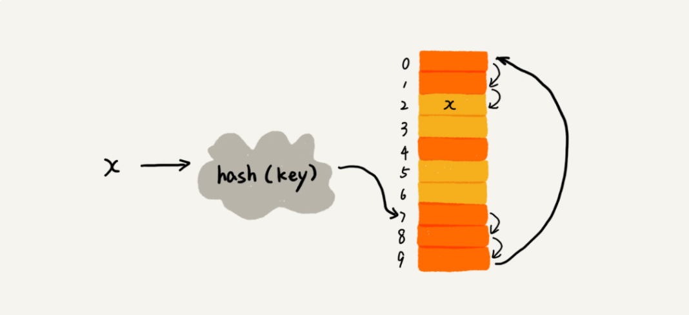

# 数据结构与算法之美

## 时间复杂度和空间复杂度

我们说空间复杂度的时候，是指除了原本的数据存储空间外，算法运行还需要额外的存储空间。

均摊时间复杂度一般都等于最好情况时间复杂度。

## 数组

数组（Array）是一种**线性表**数据结构。它用一组**连续的内存空间**，来存储一组具有**相同类型的数据**。

除了数组，链表、队列、栈等也是线性表结构。

第二个是连续的内存空间和相同类型的数据。正是因为这两个限制，它才有了一个堪称“杀手锏”的特性：“随机访问”。但有利就有弊，这两个限制也让数组的很多操作变得非常低效，比如要想在数组中删除、插入一个数据，为了保证连续性，就需要做大量的数据搬移工作。

计算机会给每个内存单元分配一个地址，计算机通过地址来访问内存中的数据。当计算机需要随机访问数组中的某个元素时，它会首先通过下面的寻址公式，计算出该元素存储的内存地址：

`a[i]_address = base_address + i * data_type_size`

二分查找，时间复杂度也是 O(logn)

数组支持随机访问，根据下标随机访问的时间复杂度为 O(1)

- 低效的“插入”和“删除”
- 数组的访问越界问题

## 链表

不需要一块连续的内存空间，它通过“指针”将一组零散的内存块串联起来使用

链表通过指针将一组零散的内存块串联在一起。其中，我们把内存块称为链表的`结点`。为了将所有的结点串起来，每个链表的结点除了存储数据之外，还需要记录链上的下一个结点的地址。如图所示，我们把这个记录下个结点地址的指针叫作`后继指针 next`。

我们习惯性地把第一个结点叫作头结点，把最后一个结点叫作尾结点。其中，头结点用来记录链表的基地址。而尾结点特殊的地方是：指针不是指向下一个结点，而是指向一个`空地址 NULL`，表示这是链表上最后一个结点。

- 单链表
- 双向链表
  - 后继指针 next
  - 前驱指针 prev
  - 数据
- 循环链表

## 栈

特定的数据结构是对特定场景的抽象，而且，数组或链表暴露了太多的操作接口，操作上的确灵活自由，但使用时就比较不可控，自然也就更容易出错。

不管是顺序栈还是链式栈，我们存储数据只需要一个大小为 n 的数组就够了。在入栈和出栈过程中，只需要一两个临时变量存储空间，所以空间复杂度是 O(1)。

不管是顺序栈还是链式栈，入栈、出栈只涉及栈顶个别数据的操作，所以时间复杂度都是 O(1)。

- 顺序栈

  ```js
  class ArrayStack<T> {
    private items: T[];
    private count: number;
    public size: number;
    constructor(size) {
      this.items = new Array(n);
      this.size = size;
      this.count = 0;
    }

    public push(item: T): boolean {
      if (count === n) return false;

      items[count] = item;
      ++count;
      return true;
    }

    public pop(): T | null {
      if (count === 0) return null;

      const tmp: T = items[count - 1];
      --count;
      return tmp;
    }
  }
  ```

- 链式栈

  ```js
  class Stack<T> {
    private node: LinkedNode<T> | null  = null
    public size: number = 0;

    public push(value: T) {
      if(!value) return ;
      const newNode = new LinkedNode<T>(value);
      if(!this.node) {
        this.node = newNode;
      } else {
        newNode.next = this.node;
        this.node = newNode;
      }
      this.size++;
    }

    public pop(): T | null {
      if(!this.node) return null;
      const value = this.node.value;
      this.node = this.node.next;
      this.size--;
      return value;
    }
  }

  class linkedNode<T> {
    value: T;
    next: LinkedNode<T> | null;

    constructor(value: T, next: LinkedNode<T> | null = null) {
      this.value = value;
      this.next = next;
    }
  }
  ```

- 支持动态扩容的顺序栈

出栈的时间复杂度仍然是 O(1)。

对于入栈操作来说，最好情况时间复杂度是 O(1)，最坏情况时间复杂度是 O(n)。

这个入栈操作的平均情况下的时间复杂度可以用摊还分析法来分析。

前提假设：

    - 栈空间不够时，我们重新申请一个是原来大小两倍的数组；
    - 为了简化分析，假设只有入栈操作没有出栈操作；
    - 定义不涉及内存搬移的入栈操作为 simple-push 操作，时间复杂度为 O(1)。

如果当前栈大小为 K，并且已满，当再有新的数据要入栈时，就需要重新申请 2 倍大小的内存，并且做 K 个数据的搬移操作，然后再入栈。但是，接下来的 K-1 次入栈操作，我们都不需要再重新申请内存和搬移数据，所以这 K-1 次入栈操作都只需要一个 simple-push 操作就可以完成。


这 K 次入栈操作，总共涉及了 K 个数据的搬移，以及 K 次 simple-push 操作。将 K 个数据搬移均摊到 K 次入栈操作，那每个入栈操作只需要一个数据搬移和一个 simple-push 操作。以此类推，入栈操作的均摊时间复杂度就为 O(1)。

- 栈在函数调用中的应用 -- 函数调用栈

  操作系统给每个线程分配了一块独立的内存空间，这块内存被组织成“栈”这种结构, 用来存储函数调用时的临时变量。每进入一个函数，就会将临时变量作为一个栈帧入栈，当被调用函数执行完成，返回之后，将这个函数对应的栈帧出栈。

  其实，我们不一定非要用栈来保存临时变量，只不过如果这个函数调用符合后进先出的特性，用栈这种数据结构来实现，是最顺理成章的选择。

  从调用函数进入被调用函数，对于数据来说，变化的是什么呢？是作用域。所以根本上，只要能保证每进入一个新的函数，都是一个新的作用域就可以。而要实现这个，用栈就非常方便。在进入被调用函数的时候，分配一段栈空间给这个函数的变量，在函数结束的时候，将栈顶复位，正好回到调用函数的作用域内。

- 栈在表达式求值中的应用 -- 表达式求值

  编译器就是通过两个栈来实现的。其中一个保存操作数的栈，另一个是保存运算符的栈。从左向右遍历表达式，当遇到数字，我们就直接压入操作数栈；当遇到运算符，就与运算符栈的栈顶元素进行比较。

  如果比运算符栈顶元素的优先级高，就将当前运算符压入栈；如果比运算符栈顶元素的优先级低或者相同，从运算符栈中取栈顶运算符，从操作数栈的栈顶取 2 个操作数，然后进行计算，再把计算完的结果压入操作数栈，继续比较。

  

- 栈在括号匹配中的应用 -- 检查表达式中的括号是否匹配

  假设表达式中只包含三种括号，圆括号 ()、方括号[]和花括号{}，并且它们可以任意嵌套。

  用栈来保存未匹配的左括号，从左到右依次扫描字符串。当扫描到左括号时，则将其压入栈中；当扫描到右括号时，从栈顶取出一个左括号。如果能够匹配，比如“(”跟“)”匹配，“[”跟“]”匹配，“{”跟“}”匹配，则继续扫描剩下的字符串。如果扫描的过程中，遇到不能配对的右括号，或者栈中没有数据，则说明为非法格式。

- 实现浏览器的前进、后退功能

  使用两个栈 X 和 Y，我们把首次浏览的页面依次压入栈 X，当点击后退按钮时，再依次从栈 X 中出栈，并将出栈的数据依次放入栈 Y。当我们点击前进按钮时，我们依次从栈 Y 中取出数据，放入栈 X 中。当栈 X 中没有数据时，那就说明没有页面可以继续后退浏览了。当栈 Y 中没有数据，那就说明没有页面可以点击前进按钮浏览了。跳转到新的页面 d 了，页面 c 就无法再通过前进、后退按钮重复查看了，所以需要清空栈 Y。

  ```js
    class Browser<T> {
      private backStack: Stack<T>;
      private forwardStack: Stack<T>;
      private current: T;

      constructor(current: T) {
        this.backStack = new Stack<T>();
        this.forwardStack = new Stack<T>();
        this.current = current;
      }

      public back(): T | null {
        if(this.backStack.size > 0) {
          this.forwardStack.push(this.current);
          this.current = this.backStack.pop();
          return this.getCurrentPage();
        }
        return null;
      }

      public forward(): T | null {
        if(this.forwardStack.size > 0) {
          this.backStack.push(this.current);
          this.current = this.forwardStack.pop();
          return this.getCurrentPage();
        }
        return null;
      }

      /**
       * 在网页点击链接
       * @params value
       */
      public linkUrl(value: T) {
        this.current && this.backStack.push(this.current);
        this.current = value;
      }

      public getCurrentPage(): T {
        return this.current;
      }
    }

    const browser = new Browser('www.baidu.com');
    browser.linkUrl('www.yuanzhoucehui.com');
    browser.linkUrl('www.github.com/jsrdxzw');
    // browser.back()
    // www.github.com/jsrdxzw
    console.log(browser.getCurrentPage())
    browser.back()
    // www.yuanzhucehui.com
    console.log(browser.getCurrentPage())
    browser.back()
    // www.baidu.com
    console.log(browser.getCurrentPage())
    browser.back()
    // www.baidu.com
    console.log(browser.getCurrentPage())
    browser.forward()
    // www.yuanzhucehui.com
    console.log(browser.getCurrentPage())
    browser.forward()
    // www.github.com/jsrdxzw
    console.log(browser.getCurrentPage())
  ```

- 内存中的栈和数据结构中的栈是不是一回事呢？

## 队列

CPU 资源是有限的，任务的处理速度与线程个数并不是线性正相关。相反，过多的线程反而会导致 CPU 频繁切换，处理性能下降。所以，线程池的大小一般都是综合考虑要处理任务的特点和硬件环境，来事先设置的。

当我们向固定大小的线程池中请求一个线程时，如果线程池中没有空闲资源了，这个时候线程池如何处理这个请求？是拒绝请求还是排队请求？各种处理策略又是怎么实现的呢？

我们一般有两种处理策略。第一种是非阻塞的处理方式，直接拒绝任务请求；另一种是阻塞的处理方式，将请求排队，等到有空闲线程时，取出排队的请求继续处理。那如何存储排队的请求呢？

我们希望公平地处理每个排队的请求，先进者先服务，所以队列这种数据结构很适合来存储排队请求。我们前面说过，队列有基于链表和基于数组这两种实现方式。这两种实现方式对于排队请求又有什么区别呢？

基于链表的实现方式，可以实现一个支持无限排队的无界队列（unbounded queue），但是可能会导致过多的请求排队等待，请求处理的响应时间过长。所以，针对响应时间比较敏感的系统，基于链表实现的无限排队的线程池是不合适的。

而基于数组实现的有界队列（bounded queue），队列的大小有限，所以线程池中排队的请求超过队列大小时，接下来的请求就会被拒绝，这种方式对响应时间敏感的系统来说，就相对更加合理。不过，设置一个合理的队列大小，也是非常有讲究的。队列太大导致等待的请求太多，队列太小会导致无法充分利用系统资源、发挥最大性能。

除了前面讲到队列应用在线程池请求排队的场景之外，队列可以应用在任何有限资源池中，用于排队请求，比如数据库连接池等。实际上，对于大部分资源有限的场景，当没有空闲资源时，基本上都可以通过“队列”这种数据结构来实现请求排队。

先进者先出，这就是典型的“队列”。最基本的操作也是两个：入队 enqueue()，放一个数据到队列尾部；出队 dequeue()，从队列头部取一个元素。

队列跟栈一样，也是一种操作受限的线性表数据结构。

- 顺序队列

  ```ts
  class ArrayQueue<T> {
    private items: Array<T>;
    private size: number;
    private head: number = 0;
    private tail: number = 0;

    constructor(size: number) {
      this.items = new Array<T>(size);
      this.size = size;
    }

    public enqueue(item: T): boolean {
      // 队列末尾没有空间了
      if (this.tail === this.size) {
        // 整个队列都沾满了
        if (this.head === 0) return false;

        // 数据迁移
        for (let i = this.head; i < this.tail; ++i) {
          // 迁移 this.head 个位置
          this.items[i - this.head] = this.items[i];
        }
        // 重新调整 head 和 tail
        this.tail -= this.head;
        this.head = 0;
      }

      this.items[this.tail] = item;
      ++this.tail;
      return true;
    }

    public dequeue(): T | null {
      if (this.head === this.tail) return null;
      const tmp = this.items[this.head];
      ++this.head;
      return tmp;
    }
  }
  ```

- 链式队列

  ```ts
  class Queue<T> {
    private head: LinkedNode<T> | null = null;
    private tail: LinkedNode<T> | null = null;

    public enqueue(value: T) {
      if (!this.tail) {
        this.head = this.tail = new LinkedNode<T>(value);
      } else {
        const newNode = new LinkedNode<T>(vlaue);
        this.tail.next = newNode;
        this.tail = newNode;
      }
    }

    public dequeue(): T | null {
      if (!this.head) return null;
      const value = this.head.value;
      this.head = this.head.next;
      return value;
    }

    public printAll(): string {
      let p = this.head;
      let res = "";
      while (p) {
        res = `${res} ${p.value}`;
        p = p.next;
      }
      return res;
    }
  }

  class LinkedNode<T> {
    value: T;
    next: LinkedNode<T> | null;

    constructor(value: T, next: LinkedNode<T> | null = null) {
      this.value = value;
      this.next = next;
    }
  }

  const queue = new SimpleQueue();
  queue.enqueue(1);
  queue.enqueue(2);
  queue.enqueue(3);
  queue.dequeue();
  queue.dequeue();
  console.log(queue.printAll());
  ```

- 循环队列

  - 队空

    `this.tail === this.head`

  - 队满

    `( this.tail + 1 ) % this.size === this.head`

    队满时 `this.tail` 指向的地址实际上是没有存储数据的，所有循环队列会浪费一个数据的存储空间。

  - 循环队列的长度设定需要对并发数据有一定的预测，否则会丢失太多请求。

  ```ts
  class CircularQueue<T> {
    private items: Array<T>;
    private size: number;
    private head: number = 0;
    private tail: number = 0;

    constructor(size: number) {
      this.items = new Array<T>(size);
      this.size = size;
    }

    public enqueue(item: T) {
      if ((this.tail + 1) % this.size === this.head) return false;

      this.items[this.tail] = item;
      this.tail = (this.tail + 1) / this.size;
      return true;
    }

    public dequeue(): T | null {
      if (this.head === this.tail) return null;
      const tmp = this.items[this.head];
      this.head = (this.head + 1) % this.size;
      return tmp;
    }
  }
  ```

- 阻塞队列(生产者--消费者)

  阻塞队列其实就是在队列基础上增加了阻塞操作。

  简单来说，就是在队列为空的时候，从队头取数据会被阻塞。因为此时还没有数据可取，直到队列中有了数据才能返回；如果队列已经满了，那么插入数据的操作就会被阻塞，直到队列中有空闲位置后再插入数据，然后再返回。

- 并发队列

  在多线程情况下，会有多个线程同时操作队列，这个时候就会存在线程安全问题，那如何实现一个线程安全的队列呢？

  线程安全的队列我们叫作并发队列。

  最简单直接的实现方式是直接在 enqueue()、dequeue() 方法上加锁，但是锁粒度大并发度会比较低，同一时刻仅允许一个存或者取操作。实际上，基于数组的循环队列，利用 CAS 原子操作，可以实现非常高效的并发队列。这也是循环队列比链式队列应用更加广泛的原因。

  - 如何实现无锁并发队列

    cas + 数组

## 递归

## 排序

[十大经典排序算法（动图演示）](https://www.cnblogs.com/onepixel/articles/7674659.html)

- 冒泡

  比较相邻的两个数。一次冒泡会让至少一个元素移动到它应该在的位置。

  最好时间复杂度 O(n), 最坏时间复杂度 O(n²), 平均时间复杂度 O(n²)。

  ```js
  function bubbleSort(
    arr: Array<number>,
    compare: (a: number, b: number): number
  ) {
    const { length: len } = arr;
    if (len < 2) return;

    // 从前往后排序
    // for (let i = 0; i < len - 1; i++) {
    //   let flag: boolean = false;
    //   // 最后一个元素下标 len - 1, 每循环一次就绪一个数，内层循环上限 - 1（即第i次循环 - i）
    //   for (let j = 0; j < len - 1 - i; j++) {
    //     if (compare(arr[j], arr[j + 1]) > 0) {
    //       swap(arr, j, j+1);
    //       flag = true; // 有数据交换
    //     }
    //   }

    //   if (!flag) break;
    // }

    // 从后往前排序
    for(let i = 0; i < len - 1; i++) {
      let flag = false;
      for(let j = len - 1; j > i; j--) {
        if(compare(arr[j-1], arr[j])>0) {
          swap(arr, j-1, j);
          flag = true;
        }
      }
      if(!flag) break;
    }

    function swap(arr, i, j) {
      let tmp = arr[j];
      arr[j] = arr[i];
      arr[i] = tmp;

      // [arr[i], arr[j]] = [arr[j], arr[i]];
    }

  }

  ```

- 插入排序

  将数组中的数据分为两个区间，已排序区间和未排序区间。初始已排序区间是数组中的第一个元素。取未排序元素在已排序区间中找到合适的位置插入，并保证已排序区间的数据一直有序。重复步骤，直到未排序区间中元素为空。

  最好时间复杂度 O(n), 最坏时间复杂度 O(n²), 平均时间复杂度 O(n²)。

  ```js
  function insertionSort(arr: Array<number>) {
    const { length: len } = arr;
    if (len < 2) return;
    for (let i = 1; i < len; i++) {
      const target = a[i]; //待插入的值
      let j = i - 1;
      for (; j >= 0; j--) {
        if (a[j] > target) {
          a[j + 1] = a[j]; // 数据后移
        } else {
          break; //前面已经有序，所以 break 循环
        }
      }
      a[j + 1] = target; // 插入数据
    }
  }
  ```

  ```js
  function insertionSort(arr: Array<number>) {
    const { length: len } = arr;
    if (len < 2) return;
    for (let i = 1; i < len; i++) {
      const target = a[i]; //待插入的值
      let j = i - 1;
      while (j >= 0 && a[j] > target) {
        a[j + 1] = a[j]; // 数据后移
        j--;
      }
      a[j + 1] = target; // 插入数据
    }
  }
  ```

- 希尔排序（Shell sort)

  第一个突破 O(n2)的排序算法，是简单插入排序的改进版。它与插入排序的不同之处在于，它会优先比较距离较远的元素。希尔排序又叫缩小增量排序。

  先计算 gap（间隔），如 10 个数，gap 就是 5，依次比较 `a[0]和a[5]`,`a[1]和a[6]`, `a[2]和a[7]`...如果`a[5]<a[0]`,那么`a[0]=a[5]`,继续向前间隔比较

  一轮比较结束后，重新计算间隔 gap = Math.floor(gap/2), 依次比较`a[0]和a[2]`,`a[1]和a[3]`, `a[2]和a[4]`...如果`a[4]<a[2]`,那么`a[2]=a[4]`，继续向前间隔比较， 如果`a[2]<a[0]`,那么`a[0]=a[2]`，继续向前间隔比较

  直到间隔为 0 时，退出比较，排序结束

  ```js
  function shellSort(arr) {
    const { length: len } = arr;
    for (let gap = Math.floor(len / 2); gap > 0; gap = Math.floor(gap / 2)) {
      for (let i = gap; i < len; i++) {
        let j = i;
        const current = arr[i];
        while (j - gap >= 0 && current < arr[j - gap]) {
          // swap
          arr[j] = arr[j - gap];
          j = j - gap;
        }
        arr[j] = current;
      }
    }
    return arr;
  }
  ```

- 选择排序

  将数据分为已排序区间和未排序区间。初始已排序区间为空。每次从未排序区间中选出最小的元素插入已排序区间的末尾，直到未排序区间为空。

  最好时间复杂度 O(n²), 最坏时间复杂度 O(n²), 平均时间复杂度 O(n²)。

  ```js
  function selectionSort(arr: Array<number>) {
    const { length: len } = arr;
    if (len < 2) return;

    let minIndex; // 存储最小数索引
    // 跑 len - 1 次就可就绪
    for (let i = 0; i < len - 1; i++) {
      minIndex = i;
      for (let j = i + 1; j < len; j++) {
        // 寻找最小数
        if (arr[j] < arr[minIndex]) {
          minIndex = j; // 将最小数的索引保存
        }
      }
      if (minIndex !== i) {
        swap(arr, i, minIndex);
      }
    }

    function swap(arr, i, j) {
      [arr[i], arr[j]] = [arr[j], arr[i]];
    }
  }
  ```

- 归并排序(分治思想)

  我们先把数组从中间分成前后两部分，然后对前后两部分分别排序，再将排好序的两部分合并在一起，这样整个数组就都有序了。

  最好情况、最坏情况，还是平均情况，时间复杂度都是 O(nlogn)。非原地排序，空间复杂度 O(n)。稳定排序

  ```js
  function mergeSort(arr: Array<number>) {
    const { length: len } = arr;
    if (len < 2) return arr;

    const middle = Math.floor(len / 2),
      left = arr.slice(0, middle),
      right = arr.slice(middle);
    return merge(mergeSort(left), mergeSort(right));

    function merge(left: Array<number>, right: Array<number>) {
      let result = [];
      while (left.length > 0 && right.length > 0) {
        if (left[0] <= right[0]) {
          result.push(left.shift());
        } else {
          result.push(right.shift());
        }
      }

      while (left.length) {
        result.push(left.shift());
      }

      while (right.length) {
        result.push(right.shift());
      }
      return result;
    }
  }
  ```

- 快速排序(分治思想)

  非稳定排序

  ```js
  /**
   * 1. 选择一个“基准”（pivot）元素
   * 2. 将所有小于基准值的元素放在基准值的左边，所有大于基准值的元素放在基准值的右边
   * 3. 对分割后的两个子序列重复上述步骤
   */
  function quickSort(arr: Array<T>, compare: (a: T, b: T): number): Array<T> {
    if (arr.length < 2) return arr;
    let left: Array<T> = [],
      right: Array<T> = [],
      current: T = arr.splice(0, 1); // 取第一个作为基准

    for (let i = 0, len = arr.length; i < len; i++) {
      if (compare(arr[i], current)> 0) {
        left.push(arr[i]);
      } else {
        right.push(arr[i]);
      }
    }

    return quickSort(left, compare).concat(current, quickSort(right, compare));
  }
  ```

  ```js
  /**
   * 原地快排
   **/
  function quickSort(arr: Array<T>, left?: number, right?: number) {
    const { length: len } = arr;
    if (len < 2) return arr;
    let partitionIndex,
      left = typeof left !== "number" ? 0 : left,
      right = typeof right !== "number" ? len - 1 : right;

    if (left < right) {
      partitionIndex = partition(arr, left, right);
      quickSort(arr, left, partitionIndex - 1);
      quickSort(arr, partitionIndex + 1, right);
    }

    function partition(arr: Array<T>, left?: number, right?: number) {
      let pivot = left,
        index = pivot + 1; // 记录小于基准值的右界线（不包括index）

      // 循环找到所有小于基准值的数据，依次放到基准值后面
      for (let i = index; i <= right; i++) {
        if (arr[i] < arr[pivot]) {
          swap(arr, i, index);
          index++;
        }
      }

      swap(arr, pivot, index - 1); // 交换基准值和最后一个小于基准值的位置
      return index - 1; // 基准值位置
    }

    function swap(arr, i, j) {
      const tmp = arr[i];
      arr[i] = arr[j];
      arr[j] = tmp;
    }
  }
  ```

- 桶排序（Bucket sort)

  假设输入数据服从均匀分布，将数据分到有限数量的桶里，每个桶再分别排序（有可能再使用别的排序算法或是以递归方式继续使用桶排序进行排）。

  将要排序的数据分到几个有序的桶里，每个桶里的数据再单独进行排序。桶内排完序之后，再把每个桶里的数据按照顺序依次取出，组成的序列就是有序的了。

  如果要排序的数据有 n 个，我们把它们均匀地划分到 m 个桶内，每个桶里就有 k=n/m 个元素。每个桶内部使用快速排序，时间复杂度为 `O(k _ logk)`。m 个桶排序的时间复杂度就是 `O(m _ k * logk)`，因为`k=n/m`，所以整个桶排序的时间复杂度就是`O(n*log(n/m))`。当桶的个数 m 接近数据个数 n 时，`log(n/m)` 就是一个非常小的常量，这个时候桶排序的时间复杂度接近 O(n)。

  

  要排序的数据需要很容易就能划分成 m 个桶，并且，桶与桶之间有着天然的大小顺序。这样每个桶内的数据都排序完之后，桶与桶之间的数据不需要再进行排序。

  其次，数据在各个桶之间的分布是比较均匀的。如果数据经过桶的划分之后，有些桶里的数据非常多，有些非常少，很不平均，那桶内数据排序的时间复杂度就不是常量级了。在极端情况下，如果数据都被划分到一个桶里，那就退化为 O(nlogn) 的排序算法了。

  **桶排序比较适合用在外部排序中。所谓的外部排序就是数据存储在外部磁盘中，数据量比较大，内存有限，无法将数据全部加载到内存中。**

  ```js
  function bucketSort(arr, bucketSize) {
    const { length: len } = arr;
    if (len === 0) return arr;

    let minValue = arr[0],
      maxValue = arr[0];
    // 找出最大最小值
    for (let i = 1; i < len; i++) {
      if (arr[i] < minValue) {
        minValue = arr[i];
      } else if (arr[i] > maxValue) {
        maxValue = arr[i];
      }
    }

    // 桶初始化
    let DEFAULT_BUCKET_SIZE = 5;
    bucketSize = bucketSize || DEFAULT_BUCKET_SIZE; // 桶容量
    const bucketCount = Math.floor((maxValue - minValue) / bucketSize) + 1; // 桶数量
    const buckets = new Array(bucketCount);
    for (let i = 0; i < bucketCount; i++) {
      buckets[i] = [];
    }

    // 利用映射函数将数据分配到各个桶中
    for (let i = 0; i < len; i++) {
      buckets[math.floor((arr[i] - minValue) / bucketSize)].push(arr[i]);
    }

    for (let i = 0; i < buckets.length; i++) {
      insertionSort(buckets[i]); // 对每个桶进行排序，这里使用了插入排序
      for (let j = 0; j < buckets[i].length; j++) {
        arr.push(buckets[i][j]);
      }
    }

    return arr;
  }
  ```

- 计数排序（Counting Sort）

  不是基于比较的排序算法，核心在于将输入的数据值转化为键存储在额外开辟的数组空间中。

  作为一种线性时间复杂度的排序，计数排序要求输入的数据必须是有确定范围的整数。

  > 场景：考生的满分是 900 分，最小是 0 分，这个数据的范围很小，所以我们可以分成 901 个桶，对应分数从 0 分到 900 分。根据考生的成绩，我们将这 50 万考生划分到这 901 个桶里。桶内的数据都是分数相同的考生，所以并不需要再进行排序。我们只需要依次扫描每个桶，将桶内的考生依次输出到一个数组中，就实现了 50 万考生的排序。因为只涉及扫描遍历操作，所以时间复杂度是 O(n)。

  > 计数排序只能用在数据范围不大的场景中，如果数据范围 k 比要排序的数据 n 大很多，就不适合用计数排序了。而且，计数排序只能给非负整数排序，如果要排序的数据是其他类型的，要将其在不改变相对大小的情况下，转化为非负整数。

  ```js
  /**
   * 1. 找出待排序的数组中最大和最小的元素；
   * 2. 统计数组中每个值为i的元素出现的次数，存入数组C的第i项；
   * 3. 对所有的计数累加（从C中的第一个元素开始，每一项和前一项相加）；
   * 4. 反向填充目标数组：将每个元素i放在新数组的第C(i)项，每放一个元素就将C(i)减去1。
   */
  function countingSort(arr: Array<number>) {
    const { length: len } = arr;
    if (len === 0) return arr;

    // 计算最大值
    let maxValue = arr[0];
    for(let i=1; i< len; i++) {
      if(maxValue < arr[i]) {
        maxValue = arr[i];
      }
    }

    const bucketCount = maxValue + 1;
    let buckets = new Array(bucketCount),

    // 统计数组中每个值为arr[i]的元素出现的次数
    for (let i = 0; i < len; i++) {
      const value = arr[i];
      if (!buckets[value]) {
        buckets[value] = 0; // 初始化计数
      }
      buckets[value]++;
    }

    // 依次累加
    for(let i=1; i< bucketCount; i++) {
      buckets[i] = buckets[i-1]+ buckets[i];
    }

    // 临时数组 r, 存储排序之后的结果
    let r = new Array(len)
    for(let i = len - 1; i >=0; i--) {
      const value = arr[i];
      const index = buckets[value] - 1; // 计算位置
      r[index] = value; //值存储到相应的位置
      buckets[value]--; // 值放到相应位置后，计数减一
    }

    // 将结果拷贝给 arr 数组
    for(let i=0; i< len; i++) {
      arr[i] = r[i];
    }

    return arr;
  }
  ```

- 基数排序（Radix Sort）

  按照低位先排序，然后收集；再按照高位排序，然后再收集；依次类推，直到最高位。有时候有些属性是有优先级顺序的，先按低优先级排序，再按高优先级排序。最后的次序就是高优先级高的在前，高优先级相同的低优先级高的在前。

  时间复杂度: 最好 O(n), 最坏 O(nlogn), 平均 O(n)

  空间复杂度: O(n+k)，其中 k 为桶的数量。一般来说 n>>k，因此额外空间需要大概 n 个左右

  稳定排序。

  > 场景： 有 10 万个手机号码，希望将这 10 万个手机号码从小到大排序

  > 场景： 排序牛津字典中的 20 万个英文单词，最短的只有 1 个字母，最长的有 45 个字母。我们可以把所有的单词补齐到相同长度，位数不够的可以在后面补“0”，因为根据 ASCII 值，所有字母都大于“0”，所以补“0”不会影响到原有的大小顺序。

  基数排序对要排序的数据是有要求的，需要可以分割出独立的“位”来比较，而且位之间有递进的关系，如果 a 数据的高位比 b 数据大，那剩下的低位就不用比较了。除此之外，每一位的数据范围不能太大，要可以用线性排序算法来排序，否则，基数排序的时间复杂度就无法做到 O(n) 了。

  ```js
  /**
   *
   * @params {maxDigit} 最大位数
   */
  function radixSort(arr, maxDigit) {
    let mod = 10,
      dev = 1;
    // 从低位到高位排序
    for (let i = 0; i < maxDigit; i++, dev *= 10, mod *= 10) {
      // 桶排序
      let counter = [];
      for (let j = 0; j < arr.length; j++) {
        const value = arr[j];
        // value % mod 得到后 i 位数， 再除以 dev 得到 倒数 i 位置的数
        const bucket = parseInt((value % mod) / dev);
        if (!counter[bucket]) {
          counter[bucket] = [];
        }
        counter[bucket].push(value);
      }
      // 回填基于低位排序后的数据，回填完成后继续循环高位排序
      let pos = 0;
      for (let j = 0, len = counter.length; j < len; j++) {
        let value = null;
        if (counter[j]) {
          while (!!(value = counter[j].shift())) {
            arr[pos++] = value;
          }
        }
      }
    }
    return arr;
  }
  ```

- 堆排序(Heap sort)

  - 构建大顶堆
  - 交换堆顶元素和最后一个叶子节点
  - 继续构建次大顶堆

  ```js
  function heapSort(arr) {
    let { length: len } = arr;

    buildMaxHeap(arr); // 构建大顶堆

    for (let i = len - 1; i > 0; i--) {
      swap(arr, 0, i); // 交换堆顶元素和最后一个叶子节点
      len--;
      heapify(arr, 0); // 继续构建次大顶堆
    }

    function buildMaxHeap(arr) {
      // 建立大顶堆
      for (let i = Math.floor(len / 2); i >= 0; i--) {
        heapify(arr, i);
      }
    }

    function heapify(arr, i) {
      // 堆调整
      const left = 2 * i + 1,
        right = 2 * i + 2;
      let largest = i;

      if (left < len && arr[left] > arr[largest]) {
        largest = left;
      }

      if (right < len && arr[right] > arr[largest]) {
        largest = right;
      }

      if (largest !== i) {
        swap(arr, i, largest);
        heapify(arr, largest);
      }
    }

    function swap(arr, i, j) {
      [arr[i], arr[j]] = [arr[j], arr[i]];
    }

    return arr;
  }
  ```

## 二分查找

## 跳表

动态数据结构，可以支持快速的插入、删除、查找操作。Redis 中的有序集合（Sorted Set）就是用跳表来实现的。

链表加多级索引的结构，就是跳表。


时间复杂度：O(mlogn)， m 是每一次遍历的节点个数（一般 m 很小可以忽略）， logn 是总层数

空间复杂度：O(n)

每 k 个节点抽取一个索引节点个数，k 越大，占用的空间越小。在实际开发中，原始链表中存储的有可能是很大的对象，而索引节点只需要存储关键值和几个指针，并不需要存储对象，所以当对象比索引节点大很多时，那索引占用的额外空间就可以忽略。

当链表的长度 n 比较大时，比如 1000、10000 的时候，在构建索引之后，查找效率的提升就会非常明显。

- 插入数据

  查找某个数据应该插入的位置，复杂度 O(logn)，插入节点的时间复杂度 O(1)

- 删除数据

  如果这个结点在索引中也有出现，我们除了要删除原始链表中的结点，还要删除索引中的。因为单链表中的删除操作需要拿到要删除结点的前驱结点，然后通过指针操作完成删除。所以在查找要删除的结点的时候，一定要获取前驱结点。当然，如果我们用的是双向链表，就不需要考虑这个问题了。

- 跳表索引动态更新

  当我们不停地往跳表中插入数据时，如果我们不更新索引，就有可能出现某 2 个索引结点之间数据非常多的情况。极端情况下，跳表还会退化成单链表。

  当我们往跳表中插入数据的时候，我们可以选择同时将这个数据插入到部分索引层中。我们通过一个随机函数，来决定将这个结点插入到哪几级索引中，比如随机函数生成了值 K，那我们就将这个结点添加到第一级到第 K 级这 K 级索引中

  

## 散列表（Hash Table）

散列表用的是数组支持按照下标随机访问数据的特性，所以散列表其实就是数组的一种扩展，由数组演化而来。可以说，如果没有数组，就没有散列表。

假如我们有 89 名选手参加学校运动会。为了方便记录成绩，每个选手胸前都会贴上自己的参赛号码。这 89 名选手的编号依次是 1 到 89。参赛编号不能设置得这么简单，要加上年级、班级这些更详细的信息，所以我们把编号的规则稍微修改了一下，用 6 位数字来表示。比如 051167。

参赛选手的编号我们叫作**键**（key）或者**关键字**。我们用它来标识一个选手。

把参赛编号转化为数组下标的映射方法就叫作**散列函数**（或“Hash 函数”、“哈希函数”）

散列函数计算得到的值就叫作**散列值**（或“Hash 值”、“哈希值”）。


散列表用的就是数组支持按照下标随机访问的时候，时间复杂度是 O(1) 的特性。我们通过散列函数把元素的键值映射为下标，然后将数据存储在数组中对应下标的位置。当我们按照键值查询元素时，我们用同样的散列函数，将键值转化数组下标，从对应的数组下标的位置取数据。

- 散列函数

  三点散列函数设计的基本要求：

  - 散列函数计算得到的散列值是一个非负整数
  - 如果 key1 = key2，那 hash(key1) == hash(key2)
  - 如果 key1 ≠ key2，那 hash(key1) ≠ hash(key2)

    - 要想找到一个不同的 key 对应的散列值都不一样的散列函数，几乎是不可能的。即便像业界著名的 MD5、SHA、CRC 等哈希算法，也无法完全避免这种**散列冲突**。而且，因为数组的存储空间有限，也会加大散列冲突的概率。几乎无法找到一个完美的无冲突的散列函数

  - 散列函数的设计不能太复杂

    过于复杂的散列函数，势必会消耗很多计算时间，也就间接的影响到散列表的性能

  - 散列函数生成的值要尽可能随机并且均匀分布

    这样才能避免或者最小化散列冲突，而且即便出现冲突，散列到每个槽里的数据也会比较平均，不会出现某个槽内数据特别多的情况。

- 散列冲突

  再好的散列函数也无法避免散列冲突。

  常用的散列冲突解决方法有两类：

  - 开放寻址法（open addressing）

    如果出现了散列冲突，我们就重新探测一个空闲位置，将其插入。

    - 优点：

      - 散列表中的数据都存储在数组中，可以有效地利用 CPU 缓存加快查询速度。
      - 这种方法实现的散列表，序列化起来比较简单。

    - 缺点：

      - 删除数据的时候比较麻烦，需要特殊标记已经删除掉的数据
      - 所有的数据都存储在一个数组中，比起链表法来说，冲突的代价更高
      - 使用开放寻址法解决冲突的散列表，装载因子的上限不能太大。这也导致这种方法比链表法更浪费内存空间

    - 方法

      - 线性探测

        当我们往散列表中**插入数据**时，如果某个数据经过散列函数散列之后，存储位置已经被占用了，我们就从当前位置开始，依次往后查找，看是否有空闲位置，直到找到为止。（如果遍历到尾部没有找到空闲位置，再从表头开始找，直到找到空闲位置）

        

        **查找**元素的过程有点儿类似插入过程。通过散列函数求出要查找元素的键值对应的散列值，然后比较数组中下标为散列值的元素和要查找的元素。如果相等，则说明就是我们要找的元素；否则就顺序往后依次查找。如果遍历到数组中的空闲位置，还没有找到，就说明要查找的元素并没有在散列表中。

        

        将**删除**的元素，特殊标记为 deleted。当线性探测查找的时候，遇到标记为 deleted 的空间，并不是停下来，而是继续往下探测。

        

        当散列表中插入的数据越来越多时，散列冲突发生的可能性就会越来越大，空闲位置会越来越少，线性探测的时间就会越来越久。极端情况下，我们可能需要探测整个散列表，所以最坏情况下的时间复杂度为 O(n)。同理，在删除和查找时，也有可能会线性探测整张散列表，才能找到要查找或者删除的数据。

      - 二次探测（Quadratic probing）

        二次探测探测的步长就变成了原来的“二次方”，也就是说，它探测的下标序列就是 hash(key)+0，hash(key)+12，hash(key)+22…

      - 双重散列（Double hashing）

        使用一组散列函数 hash1(key)，hash2(key)，hash3(key)……我们先用第一个散列函数，如果计算得到的存储位置已经被占用，再用第二个散列函数，依次类推，直到找到空闲的存储位置。

    不管采用哪种探测方法，当散列表中空闲位置不多的时候，散列冲突的概率就会大大提高。为了尽可能保证散列表的操作效率，一般情况下，我们会尽可能保证散列表中有一定比例的空闲槽位。我们用**装载因子（load factor）**来表示空位的多少。

    `散列表的装载因子=填入表中的元素个数/散列表的长度`

    装载因子越大，说明空闲位置越少，冲突越多，散列表的性能会下降。

    当数据量比较小、装载因子小的时候，适合采用开放寻址法

  - 链表法（chaining）

    在散列表中，每个“桶（bucket）”或者“槽（slot）”会对应一条链表，所有散列值相同的元素我们都放到相同槽位对应的链表中。

    当插入的时候，我们只需要通过散列函数计算出对应的散列槽位，将其插入到对应链表中即可，所以插入的时间复杂度是 O(1)。当查找、删除一个元素时，我们同样通过散列函数计算出对应的槽，然后遍历链表查找或者删除。

    查找、删除操作的时间复杂度跟链表的长度 k 成正比，也就是 O(k)。对于散列比较均匀的散列函数来说，理论上讲，k=n/m，其中 n 表示散列中数据的个数，m 表示散列表中“槽”的个数。

    - 优点

      - 链表法对内存的利用率比开放寻址法要高。链表结点可以在需要的时候再创建，并不需要像开放寻址法那样事先申请好。

      - 链表法比起开放寻址法，对大装载因子的容忍度更高。

        只要散列函数的值随机均匀，即便装载因子变成 10，也就是链表的长度变长了而已，虽然查找效率有所下降，但是比起顺序查找还是快很多。

    - 缺点

      - 链表因为要存储指针，所以对于比较小的对象的存储，是比较消耗内存的，还有可能会让内存的消耗翻倍。

        如果我们存储的是大对象，也就是说要存储的对象的大小远远大于一个指针的大小（4 个字节或者 8 个字节），那链表中指针的内存消耗在大对象面前就可以忽略了

      - 因为链表中的结点是零散分布在内存中的，不是连续的，所以对 CPU 缓存是不友好的

    将链表法中的链表改造为其他高效的动态数据结构，比如跳表、红黑树。这样，即便出现散列冲突，极端情况下，所有的数据都散列到同一个桶内，那最终退化成的散列表的查找时间也只不过是 O(logn)。这样也就有效避免了前面讲到的散列碰撞攻击。

    基于链表的散列冲突处理方法比较适合存储大对象、大数据量的散列表，而且，比起开放寻址法，它更加灵活，支持更多的优化策略，比如用红黑树代替链表

- 场景

  - Word 文档中单词拼写检查功能是如何实现的？

    常用的英文单词有 20 万个左右，假设单词的平均长度是 10 个字母，平均一个单词占用 10 个字节的内存空间，那 20 万英文单词大约占 2MB 的存储空间，就算放大 10 倍也就是 20MB。对于现在的计算机来说，这个大小完全可以放在内存里面。所以我们可以用散列表来存储整个英文单词词典。

    当用户输入某个英文单词时，我们拿用户输入的单词去散列表中查找。如果查到，则说明拼写正确；如果没有查到，则说明拼写可能有误，给予提示。借助散列表这种数据结构，我们就可以轻松实现快速判断是否存在拼写错误。

  - LRU 缓存淘汰算法

    维护一个按照访问时间从大到小有序排列的链表结构。因为缓存大小有限，当缓存空间不够，需要淘汰一个数据的时候，我们就直接将链表头部的结点删除。

    当要缓存某个数据的时候，先在链表中查找这个数据。如果没有找到，则直接将数据放到链表的尾部；如果找到了，我们就把它移动到链表的尾部。因为查找数据需要遍历链表，所以单纯用链表实现的 LRU 缓存淘汰算法的时间复杂很高，是 O(n)。

    如果我们将散列表和链表两种数据结构组合使用，可以将添加、删除、查找操作的时间复杂度都降低到 O(1)。

    

    我们的散列表是通过链表法解决散列冲突的，所以每个结点会在两条链中。一个链是刚刚我们提到的双向链表，另一个链是散列表中的拉链。前驱和后继指针是为了将结点串在双向链表中，hnext 指针是为了将结点串在散列表的拉链中。

    散列表中查找数据的时间复杂度接近 O(1)，所以通过散列表，我们可以很快地在缓存中找到一个数据。当找到数据之后，我们还需要将它移动到双向链表的尾部。

    我们来看如何删除一个数据。我们需要找到数据所在的结点，然后将结点删除。借助散列表，我们可以在 O(1) 时间复杂度里找到要删除的结点。因为我们的链表是双向链表，双向链表可以通过前驱指针 O(1) 时间复杂度获取前驱结点，所以在双向链表中，删除结点只需要 O(1) 的时间复杂度。

    最后，我们来看如何添加一个数据。添加数据到缓存稍微有点麻烦，我们需要先看这个数据是否已经在缓存中。如果已经在其中，需要将其移动到双向链表的尾部；如果不在其中，还要看缓存有没有满。如果满了，则将双向链表头部的结点删除，然后再将数据放到链表的尾部；如果没有满，就直接将数据放到链表的尾部。

    这整个过程涉及的查找操作都可以通过散列表来完成。其他的操作，比如删除头结点、链表尾部插入数据等，都可以在 O(1) 的时间复杂度内完成。所以，这三个操作的时间复杂度都是 O(1)。至此，我们就通过散列表和双向链表的组合使用，实现了一个高效的、支持 LRU 缓存淘汰算法的缓存系统原型。

  - LinkedHashMap

    通过双向链表和散列表这两种数据结构组合实现的。LinkedHashMap 中的“Linked”实际上是指的是双向链表，并非指用链表法解决散列冲突。

- 散列表碰撞攻击

  在极端情况下，有些恶意的攻击者，还有可能通过精心构造的数据，使得所有的数据经过散列函数之后，都散列到同一个槽里。如果我们使用的是基于链表的冲突解决方法，那这个时候，散列表就会退化为链表，查询的时间复杂度就从 O(1) 急剧退化为 O(n)。

  如果散列表中有 10 万个数据，退化后的散列表查询的效率就下降了 10 万倍。这样就有可能因为查询操作消耗大量 CPU 或者线程资源，导致系统无法响应其他请求，从而达到拒绝服务攻击（DoS）的目的。

- 为什么散列表和链表经常会一起使用

  散列表这种数据结构虽然支持非常高效的数据插入、删除、查找操作，但是散列表中的数据都是通过散列函数打乱之后无规律存储的。也就说，它无法支持按照某种顺序快速地遍历数据。如果希望按照顺序遍历散列表中的数据，那我们需要将散列表中的数据拷贝到数组中，然后排序，再遍历。因为散列表是动态数据结构，不停地有数据的插入、删除，所以每当我们希望按顺序遍历散列表中的数据的时候，都需要先排序，那效率势必会很低。为了解决这个问题，我们将散列表和链表（或者跳表）结合在一起使用。

## 哈希算法

将任意长度的二进制值串映射为固定长度的二进制串，这个映射规则就是**哈希算法**。通过原始数据映射之后得到的二进制值串就是**哈希值**。

- 哈希算法需要满足的几点要求：

  - 从哈希值不能反向推导出原始数据（所以哈希算法也叫单向哈希算法）。
  - 对输入的数据非常敏感，哪怕原始数据只修改一个 Bit，最后的到的哈希值也大不相同。
  - 散列冲突的概率要很小，对于不同的原始数据，哈希值相同的概率非常小。
  - 哈希算法的执行效率要尽量高效，针对较长的文本，也能快速的计算出哈希值。

- 为什么哈希算法无法做到零冲突？（**鸽巢原理（也叫抽屉原理）**）

  - 哈希算法产生的哈希值的长度是固定且有限的

    MD5 的例子，哈希值是固定的 128 位二进制串，能表示的数据是有限的，最多能表示 2^128 个数据，而我们要哈希的数据是无穷的

    一般情况下，哈希值越长的哈希算法，散列冲突的概率越低。

- 应用场景

  - 安全加密

    - 最常用于加密的哈希算法是 MD5（MD5 Message-Digest Algorithm，MD5 消息摘要算法）和 SHA（Secure Hash Algorithm，安全散列算法）。

    - 还有很多其他加密算法，比如 DES（Data Encryption Standard，数据加密标准）、AES（Advanced Encryption Standard，高级加密标准）。

  - 唯一标识（对大数据做信息摘要）

    查找相同图片，拿要查找的图片的二进制码串与图库中所有图片的二进制码串一一比对，比对起来非常耗时。可以给每个图片取一个唯一标识（信息摘要），把每个图片标识和图片文件在图库中的路径信息都存储在散列表中。当要查看某个图片是不是在图库中的时候，我们先通过哈希算法对这个图片取唯一标识，然后在散列表中查找是否存在这个唯一标识。如果不存在，那就说明这个图片不在图库中；如果存在，我们再通过散列表中存储的文件路径，获取到这个已经存在的图片，跟现在要插入的图片做全量的比对，看是否完全一样。如果一样，就说明已经存在；如果不一样，说明两张图片尽管唯一标识相同，但是并不是相同的图片。

  - 数据校验（校验文件块的安全、正确、完整）

    BT 下载的原理是基于 P2P 协议的。我们从多个机器上并行下载一个 2GB 的电影，这个电影文件可能会被分割成很多文件块（比如可以分成 100 块，每块大约 20MB）。等所有的文件块都下载完成之后，再组装成一个完整的电影文件就行了。

    通过哈希算法，对 100 个文件块分别取哈希值，并且保存在种子文件中。当文件块下载完成之后，我们可以通过相同的哈希算法，对下载好的文件块逐一求哈希值，然后跟种子文件中保存的哈希值比对。如果不同，说明这个文件块不完整或者被篡改了，需要再重新从其他宿主机器上下载这个文件块。

  - 散列函数

    散列函数也是哈希算法的一种应用。散列函数对于散列算法冲突的要求要低很多。即便出现个别散列冲突，只要不是过于严重，我们都可以通过开放寻址法或者链表法解决。

    散列函数中用到的散列算法，更加关注散列后的值是否能平均分布。

  - 负载均衡

    我们可以通过哈希算法，对客户端 IP 地址或者会话 ID 计算哈希值，将取得的哈希值与服务器列表的大小进行取模运算，最终得到的值就是应该被路由到的服务器编号。

  - 数据分片

    我们可以先对数据进行分片，然后采用多台机器处理的方法，来提高处理速度。通过哈希函数计算哈希值，然后再跟 n 取模，最终得到的值，就是应该被分配到的机器编号。哈希值相同的搜索关键词就被分配到了同一个机器上。

    借助这种分片的思路，可以突破单机内存、CPU 等资源的限制。

  - 分布式存储

    通过哈希算法对数据取哈希值，然后对机器个数取模，扩容时所有的数据都要重新计算哈希值，然后重新搬移到正确的机器上。这样就相当于，缓存中的数据一下子就都失效了。所有的数据请求都会穿透缓存，直接去请求数据库。这样就可能发生雪崩效应，压垮数据库。

    **一致性哈希算法**

- 字典攻击

  用户信息被“脱库”，黑客虽然拿到是加密之后的密文，但可以通过“猜”的方式来破解密码。

  需要维护一个常用密码的字典表，把字典中的每个密码用哈希算法计算哈希值，然后拿哈希值跟脱库后的密文比对。如果相同，基本上就可以认为，这个加密之后的密码对应的明文就是字典中的这个密码。

  针对字典攻击，我们可以引入一个盐（salt），跟用户的密码组合在一起，增加密码的复杂度。

  安全和攻击是一种博弈关系，不存在绝对的安全。所有的安全措施，只是增加攻击的成本而已。

## 二叉树

- 树

  - 根节点
  - 叶子节点
  - 父节点
  - 子节点
  - 兄弟节点
  - 高度
  - 深度
  - 层（level)

  

- 二叉树（Binary Tree）

  每个节点最多有两个“叉”，也就是两个子节点，分别是左子节点和右子节点。

  - 满二叉树

    叶子节点全都在最底层，除了叶子节点之外，每个节点都有左右两个子节点，这种二叉树就叫作满二叉树。

  - 完全二叉树

    叶子节点都在最底下两层，最后一层的叶子节点都靠左排列，并且除了最后一层，其他层的节点个数都要达到最大，这种二叉树叫作完全二叉树。

  - 存储一棵二叉树：

    - 基于指针或者引用的二叉链式存储法

      

    - 基于数组的顺序存储法

      

      如果某棵二叉树是一棵完全二叉树，那用数组存储无疑是最节省内存的一种方式。如果是非完全二叉树，其实会浪费比较多的数组存储空间。

      堆其实就是一种完全二叉树，最常用的存储方式就是数组。

  - 二叉树的遍历

    > 前、中、后序，表示的是节点与它的左右子树节点遍历打印的先后顺序。

    > 时间复杂度： O(n)

    - 前序遍历

      先打印这个节点，然后再打印它的左子树，最后打印它的右子树。

      `preOrder(r) = print r -> preOrder(r -> left) -> preOrder(r -> right)`

      ```js
      function preOrder(root) {
        if (root === null) return;
        console.log(root.data);
        preOrder(root.left);
        preOrder(root.right);
      }
      ```

    - 中序遍历

      先打印它的左子树，然后再打印它本身，最后打印它的右子树。

      `inOrder(r) = inOrder(r -> left) -> print r -> inOrder(r -> right)`

      ```js
      function inOrder(root) {
        if (root === null) return;
        inOrder(root.left);
        console.log(root.data);
        inOrder(root.right);
      }
      ```

    - 后续遍历

      先打印它的左子树，然后再打印它的右子树，最后打印这个节点本身。

      `postOrder(r) = postOrder(r -> left) -> postOrder(r -> right) -> print r`

      ```js
      function preOrder(root) {
        if (root === null) return;
        preOrder(root.left);
        preOrder(root.right);
        console.log(root.data);
      }
      ```

    - 层次遍历

      ```js
      function levelOrder(root) {
        if (root === null) return;
        let queue = [root];
        while (queue.length) {
          const curNode = queue.pop();
          console.log(curNode.data);
          if (cruNode.left !== null) {
            queue.push(curNode.left);
          }
          if (cruNode.right !== null) {
            queue.push(curNode.right);
          }
        }
      }
      ```

- 二叉查找树（Binary Search Tree）

  二叉查找树要求，在树中的任意一个节点，其左子树中的每个节点的值，都要小于这个节点的值，而右子树节点的值都大于这个节点的值。

  - 查找

    先取根节点，如果它等于我们要查找的数据，那就返回。如果要查找的数据比根节点的值小，那就在左子树中递归查找；如果要查找的数据比根节点的值大，那就在右子树中递归查找。

    ```js
    class Node<T>{
      private data: T;
      private left: Node;
      private right: Node;

      constructor(data: T) {
        this.data = data;
      }
    }

    class BinarySearchTree<T> {
      private tree: Node<T>;

      constructor(tree: Node) {
        this.tree = tree;
      }

      public find(data: T) {
        let p = tree;
        while(p !== null) {
          if(data < p.data) p = p.left;
          else if(data > p.data) p = p.right;
          else return p;
        }
        return null;
      }
    }
    ```

  - 插入

    从根节点开始，依次比较要插入的数据和节点的大小关系。如果要插入的数据比节点的数据大，并且节点的右子树为空，就将新数据直接插到右子节点的位置；如果不为空，就再递归遍历右子树，查找插入位置。同理，如果要插入的数据比节点数值小，并且节点的左子树为空，就将新数据插入到左子节点的位置；如果不为空，就再递归遍历左子树，查找插入位置。

    ```js
    class BinarySearchTree<T> {
      public insert(data: T) {
        if(tree === null) {
          tree = new Node(data);
          return;
        }

        let p: Node = tree;
        while(p !== null) {
          if(data === p.data) {
            return;
          }else if(data > p.data) {
            if(p.right === null) {
              p.right = new Node(data);
              return;
            }
            p = p.right;
          } else {
            if(p.left === null) {
              p.left = new Node(data);
              return;
            }
            p = p.left;
          }
        }
      }
    }
    ```

  - 删除

    1. 如果要删除的节点没有子节点，我们只需要直接将父节点中指向要删除节点的指针置为 null。

    2. 如果要删除的节点只有一个子节点（只有左子节点或者右子节点），我们只需要更新父节点中指向要删除节点的指针，让它指向要删除节点的子节点就可以了。

    3. 如果要删除的节点有两个子节点，这就比较复杂了。我们需要找到这个节点的右子树中的最小节点，把它替换到要删除的节点上。然后再删除掉这个最小节点，因为最小节点肯定没有左子节点（如果有左子结点，那就不是最小节点了），所以，我们可以应用上面两条规则来删除这个最小节点。

    ```js
    class BinarySearchTree<T> {
      public delete(data: T) {
        let p: Node = tree; // p 指向要删除的节点，初始化指向根节点
        let pParent: Node = null; // pp 记录的是p的父节点
        while(p !== null && p.data !== data) {
          pParent = p;
          if(data > p.data) p = p.right;
          else p = p.left;
        }
        if(p === null) return ;// 没有找到

        // 如果要删除的节点有两个子节点
        if(p.left !== null && p.right !== null) {
          let minP = p.right;
          let minPParent = p;
          // 找到最小的节点
          while(minP.left !== null) {
            minPParent = minP;
            minP = minP.left
          }
          p.data = minP.data; // 将minP的数据替换到p中
          p = minP; // 下面就变成了删除minP了
          pParent = minPParent;
        }

        // 删除节点是叶子节点或者仅有一个子节点
        let child: Node;
        if(p.left !== null) child = p.left;
        else if(p.right !== null) child = p.right;
        else child = null;

        if(pParent === null) tree = child; // 删除的是根节点
        else if(pParent.left == p) pParent.left = child;
        else pParent.right = child;
      }
    }

    ```

  - 查找最大节点和最小节点
  - 查找前驱节点和后继节点

  - 中序遍历二叉查找树，可以输出有序的数据序列，时间复杂度是 O(n)，非常高效。

  - 复杂度
    - 时间复杂度
      - 最坏： 退化成链表了，O(n)
      - 最好：完全二叉树，O(height)。 平衡二叉查找树的高度接近 logn,所以插入、删除、查找操作的时间复杂度也是比较稳定，是 O(logn)。

- 散列表和二叉查找树优劣：

  - 散列表中的数据是无序存储的，如果要输出有序的数据，需要先进行排序。而对于二叉查找树来说，我们只需要中序遍历，就可以在 O(n) 的时间复杂度内，输出有序的数据序列。
  - 散列表扩容耗时很多，而且当遇到散列冲突时，性能不稳定，尽管二叉查找树的性能不稳定，但是在工程中，我们最常用的平衡二叉查找树的性能非常稳定，时间复杂度稳定在 O(logn)。
  - 笼统地来说，尽管散列表的查找等操作的时间复杂度是常量级的，但因为哈希冲突的存在，这个常量不一定比 logn 小，所以实际的查找速度可能不一定比 O(logn) 快。加上哈希函数的耗时，也不一定就比平衡二叉查找树的效率高。
  - 散列表的构造比二叉查找树要复杂，需要考虑的东西很多。比如散列函数的设计、冲突解决办法、扩容、缩容等。平衡二叉查找树只需要考虑平衡性这一个问题，而且这个问题的解决方案比较成熟、固定。
  - 为了避免过多的散列冲突，散列表装载因子不能太大，特别是基于开放寻址法解决冲突的散列表，不然会浪费一定的存储空间。

- 求一棵二叉树的确切高度
