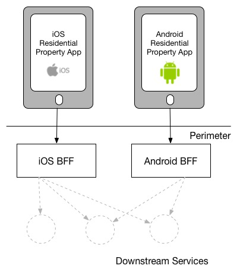
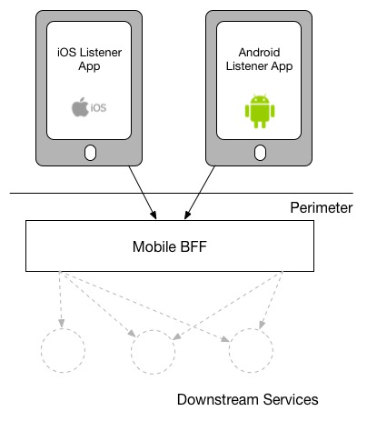
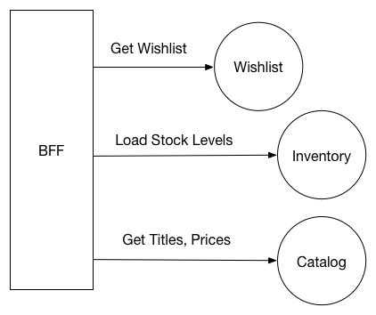
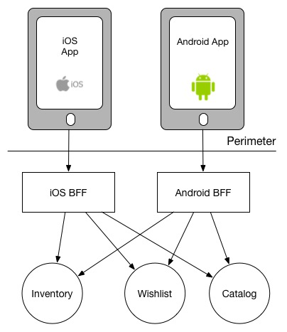
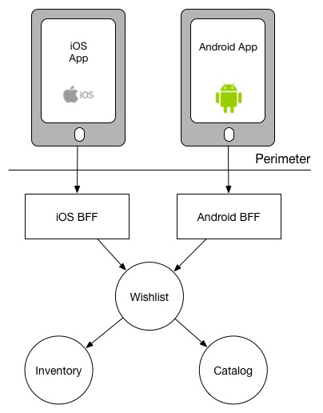

# 架构

## [大型网站技术架构核心原理](./大型网站技术架构核心原理.xmind)

## BFF

- [Pattern: Backends For Frontends](https://samnewman.io/patterns/architectural/bff/)

  - 通用 API 后端
    - 同一套 API 带给不同类型的 UI 的体验大不相同，所以我们需要针对不同的 UI 提供不同的功能。
    - 由于为不同的应用程序提供功能，代码膨胀，后期维护不便
    - 需要专门的团队去维护。团队需要平衡不同客户团队的优先级，并且还要和多个下游团队合作
  - BFF

    - 为通用 API 后端提供了一个替代方案（每个应用程序有一个后端，而不是有一个通用的 API 后端）
      > 将应用程序视为两部分：客户端应用程序和 服务端程序(BFF)
    - BFF 与特定用户体验紧密耦合，通常由与用户界面相同的团队维护，从而使 UI 更容易定义和调整 API，同时还简化了客户端和服务器的发布排队流程。
    - BFF 紧紧关注单个 UI，而且只关注 UI。这使它成为焦点，因此会更小。
    - How many BFFs？

      - 每种不同类型的客户端严格拥有一个 BFF（one experience, one BFF）

        > 相同功能的代码重复开发  
        > 对前端同学的能力要求提高

        

      - 每种类型的用户界面使用一个 BFF。Android 和 iOS 版本的应用程序使用相同的 BFF：

        > 使用同一个 BFF 的客户端程序越多，越容易变得臃肿

        

    - 聚合多个下游微服务调用以提供用户功能

      - 如果某个下游服务器宕机，可以灵活的降低功能。

        

        | Product Name                | Store Nums                     | price   | operation                              |
        | :-------------------------- | :----------------------------- | :------ | :------------------------------------- |
        | The Brakes - Give Blood     | In Stock! (14 items remaining) | \$5.99  | <button class="btn">Order Now</button> |
        | Blue Juice - Retrospectable | Out Of Stock                   | \$17.50 | <button class="btn">Pre Order</button> |
        | Hot Chip - Why Make Sense?  | Going fast (2 items left)      | \$9.99  | <button class="btn">Order Now</button> |

        

    - 重用

      > 组织倾向于为服务器端组件提供通用技术堆栈，因此可以更容易地发现具有重复的多个 BFF。

      - The first, which is often cheapest but more fraught, is to extract a shared library of some sort.
      - 将聚合责任推向更下游的服务

        
        

    - 自治

      - 可以快速迭代

      

    - 使用 BFF 来实现通用边界问题，例如身份验证/授权或请求记录

- [了解 BFF 架构](https://segmentfault.com/a/1190000009558309)
  - BFF 理念中，最重要的一点是：**服务自治，谁使用谁开发，即它应该由前端同学去维护。**
    - 服务自治减少了沟通成本，带来了灵活和高效。
    - BFF 并不限制具体技术，团队根据自己的技术栈来选型
    - 在大部分前端团队中，都会倾向于选择生态更优，语法更熟悉的 Node.js 。
    - 研发成本一定程度上的增加，对开发者的能力要求增加。
