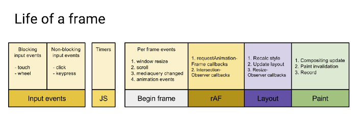

# 浏览器

## 事件冒泡

- stopPropagation

  > 元素绑定了两个 click 事件的监听函数。stopPropagation 方法只能阻止这个事件向其他元素传播。因此，第二个监听函数会触发。输出结果会先是 1，然后是 2。

  ```js
  p.addEventListener('click', function(event) {
    event.stopPropagation();
    console.log(1);
  });

  p.addEventListener('click', function(event) {
    // 会触发
    console.log(2);
  });
  ```

- stopImmediatePropagation

  > 彻底阻止这个事件传播，使得后面绑定的所有 click 监听函数都不再触发。所以，只会输出 1，不会输出 2。

  ```js
  p.addEventListener('click', function(event) {
    event.stopImmediatePropagation();
    console.log(1);
  });

  p.addEventListener('click', function(event) {
    // 不会被触发
    console.log(2);
  });
  ```

- Event.currentTarget，Event.target

  - Event.currentTarget 属性返回事件当前所在的节点，即正在执行的监听函数所绑定的那个节点。
  - Event.target 属性返回原始触发事件的那个节点，即事件最初发生的节点。

- 事件委托

  - 统一处理事件，降低代码耦合性，维护方便
  - 动态子元素无需操作绑定事件
  - 减少内存占用，减少事件注册

  > Note: 减少绑定的层级，遍历就少了好多层级，效率高。

## Cookie

- Set-Cookie

  - expires
    - 指定浏览器可发送 Cookie 的有效期。当省略 expires 属性时，Cookie 仅在浏览器关闭之前有效。
  - path
    - Cookie 的 path 属性可用于限制指定 Cookie 的发送范围的文件目录
  - domain

    - 通过 Cookie 的 domain 属性指定的域名可做到与结尾匹配一致。比如， 当指定 `http://example.com` 后， 除 `http://example.com` 以外，Example Domain 或 www2.example.com 等都可以发送 Cookie。因此，除了针对具体指定的多个域名发送 Cookie 之外，不指定 domain 属性显得更安全。

  - [SameSite cookies](https://developer.mozilla.org/en-US/docs/Web/HTTP/Cookies#SameSite_cookies)

    - Strict: same origin
    - Lax: 在跨站点子请求中不携带 same-site cookies，例如加载图像或帧的调用。但是当用户从外部站点导航到 URL 时将发送 same-site cookies

    ```js
      Set-Cookie: key=value; SameSite=Strict
    ```

  - Secure
  - HttpOnly
    - 使 JavaScript 脚本无法获得 Cookie。其主要目的为防止跨站脚本攻击（Cross-sitescripting，XSS）对 Cookie 的信息窃取。

## [chrome 显示 12px 以下字体的解决方法](https://blog.csdn.net/u012011360/article/details/41846905)

```html
<span style="display: inline-block; font-size: 16px; transform: scale(0.5);">8px 字体</span>
```

<span style="display: inline-block; font-size: 16px; transform: scale(0.5);">8px 字体</span>

## 跨域

- [前端常见跨域解决方案（全）](https://segmentfault.com/a/1190000011145364)

  - JSONP(JSON with padding)
  - postMessage
  - document.domain + iFrame
  - window.name + iFrame
  - location.hash + iFrame
  - 同域服务器转发请求
  - [CORS](http://www.ruanyifeng.com/blog/2016/04/cors.html)

    ```js
    Access-Control-Allow-Origin: *                      // 对于不需要携带身份凭证的请求，服务器可以指定该字段的值为通配符，表示允许来自所有域的请求。
    Access-Control-Allow-Methods: GET, POST, PUT
    Access-Control-Allow-Headers: X-Custom-Header       // 允许客户端在请求中携带头部
    Access-Control-Allow-Credentials: true
    Access-Control-Max-Age: 1728000                     // 指定了preflight请求的结果能够被缓存多久
    /**
      * 在跨域访问时，XMLHttpRequest对象的getResponseHeader()方法只能拿到一些最基本的响应头，Cache-Control、Content-Language、Content-Type、Expires、Last-Modified、Pragma，如果要访问其他头，则需要服务器设置本响应头。
      */
    Access-Control-Expose-Headers: X-My-Custom-Header, X-Custom-Header
    ```

    > Note: 由于同源策略的限制，所读取的 cookie 为跨域请求接口所在域的 cookie，而非当前页。

    - 跨域携带 cookie

      > 对于附带身份凭证的请求，服务器不得设置 Access-Control-Allow-Origin 的值为“\*”。

      ```js
        // 服务端
        Access-Control-Allow-Credentials: true

        // 客户端
        XMLHttpRequest.withCredentials = true
      ```

      [XMLHttpRequest.withCredentials](https://developer.mozilla.org/zh-CN/docs/Web/API/XMLHttpRequest/withCredentials)

      [Request.credentials](https://developer.mozilla.org/en-US/docs/Web/API/Request/credentials)

  - nginx 解决 iconfont 跨域

    浏览器跨域访问 js、css、img 等常规静态资源被同源策略许可，但 iconfont 字体文件(eot|otf|ttf|woff|svg)例外，此时可在 nginx 的静态资源服务器中加入以下配置：

    ```nginx
      location / {
        add_header Access-Control-Allow-Origin *;
      }
    ```

## [跨页面通信的各种姿势](https://zhuanlan.zhihu.com/p/29368435)

- 获取句柄，postMessage

  ```js
  const childPage = window.open(strUrl, strWindowName, [strWindowFeatures]);

  childPage.onload = () => {
    childPage.postMessage(message, targetOrigin, [transfer]);
  };

  window.onmessage = e => {
    console.log(e.data);
    console.log(e.origin);
    console.log(e.source);
  };
  ```

- localStorage,设置共享区域的 storage，storage 会触发 storage 事件

  ```js
  localStorage.setItem('message', 'hello');

  window.onStorage = evt => {
    // evt.key evt.oldValue evt.newValue
  };
  ```

  - 触发写入操作的页面下的 **storage listener** 不会被触发
  - storage 事件只有在发生改变的时候才会触发，即重复设置相同值不会触发 listener
  - safari 隐身模式下无法设置 localStorage 值

- BroadcastChannel

  ```js
  // a.html
  const channel = new BroadcastChannel('tabs');
  channel.onmessage = evt => {
    // evt.data
  };

  // b.html
  const channel = new BroadcastChannel('tabs');
  channel.postMessage('hello');
  ```

- SharedWorker

- cookie

  一个古老的方案，有点`localStorage`的降级兼容版，我也是整理本文的时候才发现的，思路就是往`document.cookie`写入值，由于 cookie 的改变没有事件通知，所以只能采取轮询脏检查来实现业务逻辑。

- Server

## [深入浅出浏览器渲染原理](https://juejin.im/post/5c35cf62f265da615e05a67d)

- [requestAnimationFrame Scheduling For Nerds](https://medium.com/@paul_irish/requestanimationframe-scheduling-for-nerds-9c57f7438ef4)



- 以下操作会导致重排或重绘

  - 增、删、改 DOM 节点
  - 修改 CSS 样式，改变元素的大小、位置，或使用 `display:none;` 时会造成重排；修改颜色 `visibility: hidden` 会造成重绘
  - 修改网页的默认字体大小会造成重排
  - Resize 窗口或滚动时
  - 内容改变时（用户输入改变也会）
  - 计算 offsetWidth 和 offsetHeight

- 减少重排和重绘
  - 尽量避免 style 的使用，对于需要操作 DOM 元素节点，重新命名 className，更改 className 名称。
  - 如果增加元素或者 clone 元素，可以先把元素通过 documentFragment 放入内存中，等操作完毕后，再 appendChild 到 DOM 元素中
  - 不要经常获取同一个元素，可以第一次获取元素后，用变量保存下来，减少遍历时间
  - 尽量少使用 dispaly:none，可以使用 visibility:hidden 代替，dispaly:none 会造成重排，visibility:hidden 会造成重绘。
  - 不要使用 Table 布局，因为一个小小的操作，可能就会造成整个表格的重排或重绘
  - 使用 resize 事件时，做防抖和节流处理。
  - 对动画元素使用 absolute / fixed 属性。
  - 批量修改元素时，可以先让元素脱离文档流，等修改完毕后，再放入文档流。

## CSS 和 JS 解析、渲染

- [原来 CSS 与 JS 是这样阻塞 DOM 解析和渲染的](https://juejin.im/post/59c60691518825396f4f71a1)
- [css 加载会造成阻塞吗？](https://juejin.im/post/5b88ddca6fb9a019c7717096)
  - DOM 解析和 CSSOM 解析是两个并行的线程，CSS 的加载不会阻塞 DOM 的解析
  - CSS 加载会阻塞 DOM 树的渲染的
  - 由于 JS 会操作之前的 DOM 节点和 CSS 样式，因此，浏览器会维持 html 中 CSS 和 JS 的顺序。因此，CSS 会在后面的 JS 执行之前先加载执行完毕，所以 CSS 会阻塞后面 JS 的执行。
- [再谈 load 与 DOMContentLoaded](https://juejin.im/post/5b2a508ae51d4558de5bd5d1)

## Event loop

- [带你彻底弄懂 Event Loop](https://juejin.im/post/5b8f76675188255c7c653811)
- [浏览器事件循环机制（event loop）](https://juejin.im/post/5afbc62151882542af04112d)
  - UI rendering 的节点是由浏览器自行判断决定的，只要执行 UI rendering，它的节点是在执行完所有的 microtask 之后，下一个 macrotask 之前，紧跟着执行 UI render。
- [JavaScript 运行机制详解：再谈 Event Loop](http://www.ruanyifeng.com/blog/2014/10/event-loop.html)
- Node event loop: v11 之后与浏览器保持一致

  - 宏队列
    - timers 阶段：这个阶段执行 setTimeout 和 setInterval 预定的 callback
    - I/O callback 阶段：执行除了 close 事件的 callbacks、被 timers 设定的 callbacks、setImmediate()设定的 callbacks 这些之外的 callbacks
    - idle: 仅 node 内部使用
    - prepare: 仅 node 内部使用
    - poll: 获取新的 I/O 事件，适当的条件下 node 将阻塞在这里
    - check 阶段：执行 setImmediate() 设定的 callbacks
    - close callback 阶段：执行 socket.on('close', ....)这些 callbacks
  - 微队列
    - nextTick: process.nextTick()
    - others: Promise
  - setTimeout(fn, 0) 和 setImmediate(fn)
    - setTimeout(fn, 0) 不是严格的 0，一般是 setTimeout(fn, 3) 或什么，会有一定的延迟时间，当 setTimeout(fn, 0) 和 setImmediate(fn) 出现在同一段同步代码中时，就会存在两种情况。
    - 第 1 种情况：同步代码执行完了，Timer 还没到期，setImmediate 回调先注册到 Check Queue 中，开始执行微队列，然后是宏队列，先从 Timers Queue 中开始，发现没回调，往下走直到 Check Queue 中有回调，执行，然后 timer 到期（只要在执行完 Timer Queue 后到期效果就都一样），timer 回调注册到 Timers Queue 中，下一轮循环执行到 Timers Queue 中才能执行那个 timer 回调；所以，这种情况下，setImmediate(fn)回调先于 setTimeout(fn, 0)回调执行。
    - 第 2 种情况：同步代码还没执行完，timer 先到期，timer 回调先注册到 Timers Queue 中，执行到 setImmediate 了，它的回调再注册到 Check Queue 中。 然后，同步代码执行完了，执行微队列，然后开始先执行 Timers Queue，先执行 Timer 回调，再到 Check Queue，执行 setImmediate 回调；所以，这种情况下，setTimeout(fn, 0)回调先于 setImmediate(fn)回调执行。
    - 所以，在同步代码中同时调 setTimeout(fn, 0)和 setImmediate 情况是不确定的，但是如果把他们放在一个 IO 的回调，比如 readFile('xx', function () {// ....})回调中，那么 IO 回调是在 IO Queue 中，setTimeout 到期回调注册到 Timers Queue，setImmediate 回调注册到 Check Queue，IO Queue 执行完到 Check Queue，timer Queue 得到下个周期，所以 setImmediate 回调这种情况下肯定比 setTimeout(fn, 0)回调先执行。

- 一道题浅说 JavaScript 的事件循环

  ```js
  async function async1() {
    console.log('async1 start');
    await async2();
    console.log('async1 end');
  }
  async function async2() {
    console.log('async2');
  }

  console.log('script start');

  setTimeout(function() {
    console.log('setTimeout');
  }, 0);

  async1();

  new Promise(function(resolve) {
    console.log('promise1');
    resolve();
  }).then(function() {
    console.log('promise2');
  });
  console.log('script end');

  /**
   * script start
   * async1 start
   * async2
   * promise1
   * script end
   * async1 end
   * promise2
   * setTimeout
   */
  ```

  ```js
  setTimeout(() => {
    console.log(1);
  }, 0);

  new Promise((resolved, rejected) => {
    console.log(2);
    resolved();
  })
    .then(() => {
      setTimeout(() => {
        console.log(4);
      }, 0);
      return new Promise((resolved, rejected) => {
        console.log(5);
        resolved();
      });
    })
    .then(() => {
      console.log(6);
    });

  console.log(7);
  /**
  `* 2
   * 7
   * 5
   * 6
   * 1
   * 4
   */
  ```

## V8 引擎中的垃圾回收机制

- [浅谈 V8 引擎中的垃圾回收机制](https://segmentfault.com/a/1190000000440270)

## 浏览器缓存

- [彻底搞懂浏览器缓存机制](https://juejin.im/post/5c4528a6f265da611a4822cc)
  - 三级缓存原理 (访问缓存优先级)
    - memory cache
    - disk cache
    - 重新请求
  - 强缓存
    - expires
    - cache-control
      - no-store：禁止使用缓存，每一次都要重新请求数据。
      - no-catch：告诉浏览器、缓存服务器，不管本地副本是否过期，使用资源副本前，一定要到源服务器进行副本有效性校验。
      - max-age
      - must-revalidate：告诉浏览器、缓存服务器，本地副本过期前，可以使用本地副本；本地副本一旦过期，必须去源服务器进行有效性校验。
      - private
      - public
  - 协商缓存（304 Not Modified）
    - Last-Modify/If-Modify-Since
    - ETag/If-No-Match
- [HTTP 缓存](https://developer.mozilla.org/zh-CN/docs/Web/HTTP/Caching_FAQ)
- [Cache-Control](https://developer.mozilla.org/zh-CN/docs/Web/HTTP/Headers/Cache-Control)

## [DNS 解析过程及 DNS 优化](https://blog.csdn.net/cat_foursi/article/details/71194397)

- 递归查询
- 迭代查询

## 前端安全

- [前端安全知多少](https://juejin.im/entry/598d6eb46fb9a03c3a25d2c1)
- [如何防止 XSS 攻击？](https://tech.meituan.com/2018/09/27/fe-security.html)

  - xss

    > Cross-Site Scripting（跨站脚本攻击）简称 XSS，是一种代码注入攻击。攻击者通过在目标网站上注入恶意脚本，使之在用户的浏览器上运行。利用这些恶意脚本，攻击者可获取用户的敏感信息如 Cookie、SessionID 等，进而危害数据安全。

    > XSS 的本质是：恶意代码未经过滤，与网站正常的代码混在一起；浏览器无法分辨哪些脚本是可信的，导致恶意脚本被执行。

    为了和 CSS 区分，这里把攻击的第一个字母改成了 X，于是叫做 XSS。

    XSS 分类

    - 存储型 XSS：

      存储型 XSS 的攻击步骤：

      1. 攻击者将恶意代码提交到目标网站的数据库中。
      2. 用户打开目标网站时，网站服务端将恶意代码从数据库取出，拼接在 HTML 中返回给浏览器。
      3. 用户浏览器接收到响应后解析执行，混在其中的恶意代码也被执行。
      4. 恶意代码窃取用户数据并发送到攻击者的网站，或者冒充用户的行为，调用目标网站接口执行攻击者指定的操作。

      这种攻击常见于带有用户保存数据的网站功能，如论坛发帖、商品评论、用户私信等。

    - 反射型 XSS:

      反射型 XSS 的攻击步骤：

      1. 攻击者构造出特殊的 URL，其中包含恶意代码。
      2. 用户打开带有恶意代码的 URL 时，网站服务端将恶意代码从 URL 中取出，拼接在 HTML 中返回给浏览器。
      3. 用户浏览器接收到响应后解析执行，混在其中的恶意代码也被执行。
      4. 恶意代码窃取用户数据并发送到攻击者的网站，或者冒充用户的行为，调用目标网站接口执行攻击者指定的操作。

      > 反射型 XSS 跟存储型 XSS 的区别是：存储型 XSS 的恶意代码存在数据库里，反射型 XSS 的恶意代码存在 URL 里。

      反射型 XSS 漏洞常见于通过 URL 传递参数的功能，如网站搜索、跳转等。

      由于需要用户主动打开恶意的 URL 才能生效，攻击者往往会结合多种手段诱导用户点击。

      POST 的内容也可以触发反射型 XSS，只不过其触发条件比较苛刻（需要构造表单提交页面，并引导用户点击），所以非常少见。

    - DOM 型 XSS:

      DOM 型 XSS 跟前两种 XSS 的区别：DOM 型 XSS 攻击中，取出和执行恶意代码由浏览器端完成，属于前端 JavaScript 自身的安全漏洞，而其他两种 XSS 都属于服务端的安全漏洞。

      ```html
      <script>
        eval(location.hash.substr(1));
        // 而这个时候，如果用户在网址后面加上恶意代码
        ('http://www.xss.com#alert(document.cookie)');
      </script>
      ```

    XSS 预防：

    1. 输入过滤，转义(html 转义为实体)输出、存储
    2. 在标签的 href、src 等属性中，包含 `javascript:` 等可执行代码。
    3. 避免使用 eval，new Function 等执行字符串的方法，除非确定字符串和用户输入无关。
       `new Function ([arg1[, arg2[, ...argN]],] functionBody)`
    4. 使用 innerHTML，document.write 的时候，如果数据是用户输入的，那么需要对关键字符都进行过滤与转义。
    5. 对于非客户端 cookie，比如保存用户凭证的 session，务必标识为 http only，这样 js 就获取不到这个 cookie 值了，安全性得到提高。
    6. X-XSS-Protection
    7. cookie secure\httpOnly

  - CSRF
    - [浅谈 CSRF 攻击方式](https://www.cnblogs.com/hyddd/archive/2009/04/09/1432744.html)
    - [跨站请求伪造与 Same-Site Cookie](https://www.jianshu.com/p/66f77b8f1759)
    - 预防
      - 检测 http referer 是否是同域名，通常来讲，用户提交的请求，referer 应该是来来自站内地址，所以如果发现 referer 中地址异常，那么很可能是遭到了 CSRF 攻击。
      - 避免登录的 session 长时间存储在客户端中。
      - 关键请求使用验证码或者 token 机制。在一些十分关键的操作，比如交易付款环节。这种请求中，加入验证码，可以防止被恶意用户攻击。token 机制也有一定的防御作用。具体来说就是服务器每次返回客户端页面的时候，在页面中埋上一个 token 字段，例如 `<input type=“hidden” name=“csrftoken” value=“abcd">`。 之后，客户端请求的时候带上这个 token，使用这个机制后，攻击者也就很难发起 CSRF 攻击了。
      - sameSite cookie

## [前端性能优化最佳实践](https://csspod.com/frontend-performance-best-practices/)

## [React 16 加载性能优化指南](https://juejin.im/post/5b506ae0e51d45191a0d4ec9)

## 项目性能优化

- 编码优化

  - 减少 cookie 体积: 能有效减少每次请求的体积和响应时间；
    - 去除不必要的 cookie；
    - 压缩 cookie 大小；
    - 设置 domain 与 过期时间；
  - dom 优化:
    - 减少访问 dom 的次数，如需多次，将 dom 缓存于变量中；
    - 减少重绘与回流:
      - 多次操作合并为一次；
      - 减少对计算属性的访问；
        - 例如 offsetTop， getComputedStyle 等
        - 因为浏览器需要获取最新准确的值，因此必须立即进行重排，这样会破坏了浏览器的队列整合，尽量将值进行缓存使用；
      - 大量操作时，可将 dom 脱离文档流或者隐藏，待操作完成后再重新恢复；
      - 使用 DocumentFragment / cloneNode / replaceChild 进行操作；
    - 使用事件委托，避免大量的事件绑定；
  - css 优化:
    - 层级扁平，避免过于多层级的选择器嵌套（不超过 3 层）；
    - 特定的选择器好过一层一层查找: .xxx-child-text{} 优于 .xxx .child .text{}
    - 减少使用通配符与属性选择器；
    - 减少不必要的多余属性；
    - 使用 动画属性 实现动画，动画时脱离文档流，开启硬件加速，优先使用 css 动画；
      - [用 CSS 开启硬件加速来提高网站性能（转）](https://www.cnblogs.com/rubylouvre/p/3471490.html)
    - 使用 `<link>` 替代原生 @import；
  - html 优化:
    - 减少 dom 数量，避免不必要的节点或嵌套；
    - 避免 `` 空标签，能减少服务器压力，因为 src 为空时，浏览器仍然会发起请求
    - 图片提前 **指定宽高** 或者 **脱离文档流**，能有效减少因图片加载导致的页面回流；
    - **语义化标签** 有利于 SEO 与浏览器的解析时间；
    - 减少使用 table 进行布局，避免使用`<br />`与`<hr />`；

- 页面基础优化

  - 引入位置: `css 文件<head>中引入， js 文件<body>底部引入；`

    - 影响首屏的，优先级很高的 js 也可以头部引入，甚至内联；

  - 减少请求 (http 1.0 - 1.1)，合并请求，正确设置 http 缓存；

  - 减少文件体积:

    - 删除多余代码:
      - tree-shaking
      - code-spliting
    - 混淆 / 压缩代码(UglifyJs)，开启 gzip 压缩；
    - 多份编译文件按条件引入:
      - 针对现代浏览器直接给 ES6 文件，只针对低端浏览器引用编译后的 ES5 文件；
      - 可以利用`<script type="module"> / <script type="module">`进行条件引入用
    - 动态 polyfill，只针对不支持的浏览器引入 polyfill；

  - 图片优化:

    - 根据业务场景，与 UI 探讨选择 合适质量，合适尺寸；
    - 根据需求和平台，选择合适格式，例如非透明时可用 jpg；非苹果端，使用 webp；
    - 小图片合成 雪碧图，低于 5K 的图片可以转换成 base64 内嵌；
    - 合适场景下，使用 iconfont 或者 svg；

  - 使用缓存:

    - 浏览器缓存: 通过设置请求的过期时间，合理运用浏览器缓存；
    - CDN 缓存: 静态文件合理使用 CDN 缓存技术；

      - HTML 放于自己的服务器上；
      - 打包后的图片 / js / css 等资源上传到 CDN 上，文件带上 hash 值；
      - 由于浏览器对单个域名请求的限制，可以将资源放在多个不同域的 CDN 上，可以绕开该限制；

    - 服务器缓存: 将不变的数据、页面缓存到 内存 或 远程存储(redis 等) 上；
    - 数据缓存: 通过各种存储将不常变的数据进行缓存，缩短数据的获取时间；

- 首屏渲染优化

  - css / js 分割，使首屏依赖的文件体积最小，内联首屏关键 css / js；
  - 非关键性的文件尽可能的 异步加载和懒加载，避免阻塞首页渲染；
  - 使用 preconnect / prefetch / preload 等浏览器提供的资源提示，加快文件传输；

    - [[译] 资源提示 —— 什么是 Preload，Prefetch 和 Preconnect？](https://juejin.im/post/5b5984b851882561da216311)
    - Preload

      ```html
      <link rel="preload" href="/css/mystyles.css" as="style" />
      <link rel="preload" href="https://example.com/fonts/font.woff" as="font" crossorigin />
      ```

      ```js
      <script>
        var res = document.createElement("link"); res.rel = "preload"; res.as = "style"; res.href = "css/mystyles.css";
        document.head.appendChild(res);
      </script>
      ```

    - Prefetch

      - Link Prefetching

      ```html
      <link rel="prefetch" href="/uploads/images/pic.png" />
      ```

      - DNS Prefetching

        ```html
        <link rel="dns-prefetch" href="//fonts.googleapis.com" />
        <link rel="dns-prefetch" href="//www.google-analytics.com" />
        <link rel="dns-prefetch" href="//opensource.keycdn.com" />
        <link rel="dns-prefetch" href="//cdn.domain.com" />
        ```

    - Prerendering

      > prerendering 在后台渲染了整个页面，整个页面所有的资源。

      ```html
      <link rel="prerender" href="https://www.keycdn.com" />
      ```

    - preconnect

      > 允许浏览器在一个 HTTP 请求正式发给服务器前预先执行一些操作，这包括 DNS 解析，TLS 协商，TCP 握手

      ```html
      <link href="https://cdn.domain.com" rel="preconnect" crossorigin />
      ```

- 谨慎控制好 Web 字体，一个大字体包足够让你功亏一篑；
  - 控制字体包的加载时机；
  - 如果使用的字体有限，那尽可能只将使用的文字单独打包，能有效减少体积；
- 合理利用 Localstorage / server-worker 等存储方式进行 数据与资源缓存；
- 重要的元素优先渲染；视窗内的元素优先渲染；
- 优化用户感知:
  - 利用一些动画过渡效果，能有效减少用户对卡顿的感知；
  - 尽可能利用骨架屏(Placeholder) / Loading 等减少用户对白屏的感知；
  - 动画帧数尽量保证在 30 帧 以上，低帧数、卡顿的动画宁愿不要；

# [WebP 相对于 PNG、JPG 有什么优势？](https://www.zhihu.com/question/27201061)

- WebP 的优势在于它具有更优的图像数据压缩算法，在拥有肉眼无法识别差异的图像质量前提下，带来更小的图片体积，同时具备了无损和有损的压缩模式、Alpha 透明以及动画的特性，在 JPEG 和 PNG 上的转化效果都非常优秀、稳定和统一。

# [动态拆分 JavaScript 加载性能优化--考虑加载性能因素](https://developers.google.com/web/fundamentals/performance/optimizing-javascript/code-splitting/?hl=zh-cn)

- “预算”

  - 如果在项目中使用 webpack，则可以将应用程序配置为通过 [performance](https://webpack.docschina.org/configuration/performance/) 配置对象以构建产出过大的资产时抛出错误。可以有效地限制资产大小的预算:

    ```js
    module.exports = {
      // ...
      performance: {
        hints: 'error',
        maxAssetSize: 102400,
        maxEntrypointSize: 250000,
        // 此属性允许 webpack 控制用于计算性能提示的文件。默认函数如下：
        // function assetFilter(assetFilename) {
        //   return !(/\.map$/.test(assetFilename));
        // }
        assetFilter: function(assetFilename) {
          return assetFilename.endsWith('.js');
        }
      }
    };
    ```

- 使用 [Service Worker](https://juejin.im/post/5ba0fe356fb9a05d2c43a25c) 预缓存脚本

  在初始化时 Service Worker 预先缓存剩余的路由和功能。可以通过以下方式有效地进行预处理：

  - 它不会影响应用程序初始的加载性能，因为 Service Worker 会在页面加载完成（load）后注册并开始进行预缓存。
  - 使用 Service Worker 预缓存剩余路由和功能可确保在以后请求时可以立即使用。

  [Workbox](https://developers.google.com/web/tools/workbox/?hl=zh-cn) 有一个 webpack 插件，可以轻松地为您的应用程序生成服务工作线程。

  - 安装 [workbox-webpack-plugin](https://www.npmjs.com/package/workbox-webpack-plugin) 并将其加入您的 webpack 配置中，如下所示：

    ```js
    const { GenerateSW } = require('workbox-webpack-plugin');
    ```

    将一个 GenerateSW 实例添加到 plugins 配置中：

    ```js
    module.exports = {
      // ...
      plugins: [
        // ... other plugins omitted
        new GenerateSW()
      ]
    };
    ```

    通过此配置，Workbox 会生成一个 Service Worker ，可以预缓存应用程序中的所有 JavaScript。对于小型应用程序来说这可能很好，但对于大型应用程序，您可能**希望限制需要预处理的内容。可以通过插件的 chunks 添加白名单来实现**：

    ```js
    module.exports = {
      // ...
      plugins: [
        new GenerateSW({
          chunks: ['main', 'Favorites', 'PedalDetail', 'vendors']
        })
      ]
      // ...
    };
    ```

    使用白名单，我们可以确保 Service Worker 只预缓存我们需要的脚本。要查看示例应用中如何使用 Workbox，请查看 repo 的 [webpack-dynamic-splitting-precache](https://github.com/malchata/code-splitting-example/tree/webpack-dynamic-splitting-precache) 分支！

- 预提取和预加载脚本

  `rel=prefetch` 和 `rel=preload` 都是在浏览器之前获取指定资源的资源提示，可以通过屏蔽延迟来提高加载性能。尽管乍一看它们非常相似，但它们的表现却截然不同：

      - rel=prefetch 是对以后要使用的非关键资源的低优先级提取。当浏览器空闲时，rel=prefetch 会启动请求。
      - rel=preload 是当前路由使用的关键资源的高优先级提取。 rel=preload 启动的资源请求可能比浏览器发现它们时更早发生。但是，预加载是非常敏感的，因此您可能需要查看本指南 （以及可能的规范 ）以获得指导。

  - Prefetch

    - 为合理确定用户将访问或使用的路由或功能预取脚本可能是合理的，但先不要这样做。本指南的示例应用中预提取的一个很好的用例发生在我们将应用程序的 Router 组件安装在 index.js 入口的地方：
      ```js
      render(
        <Router>
          <Search path="/" default />
          <AsyncRoute
            path="/pedal/:id"
            getComponent={() =>
              import(/* webpackChunkName: "PedalDetail" */ './components/PedalDetail/PedalDetail').then(
                module => module.default
              )
            }
          />
          <AsyncRoute
            path="/favorites"
            getComponent={() =>
              import(
                /* webpackPrefetch: true, webpackChunkName: "Favorites" */ './components/Favorites/Favorites'
              ).then(module => module.default)
            }
          />
        </Router>,
        document.getElementById('app')
      );
      ```

  - Preload

    - webpackPreload 内联指令可以像 webpackPrefetch 为预提取一样调用预加载。然而，根据我的经验，使用 webpackPreload 预加载动态导入的内容与将给定路径的所有功能捆绑到一整个代码块中区别不大。
    - webpackPreload 仅适用于动态 import()调用，因此为了预加载对示例应用中初始路由至关重要的代码块，我们需要依赖另一个名为 preload-webpack-plugin 的插件。

      ```js
      const PreloadWebpackPlugin = require('preload-webpack-plugin');

      plugins: [
        // Other plugins omitted...
        new PreloadWebpackPlugin({
          rel: 'preload',
          include: ['main', 'vendors']
        })
      ];
      ```

      此配置将通过`<head>`中的`<link>`元素为 vendors 和 main 代码块提供预加载提示。
