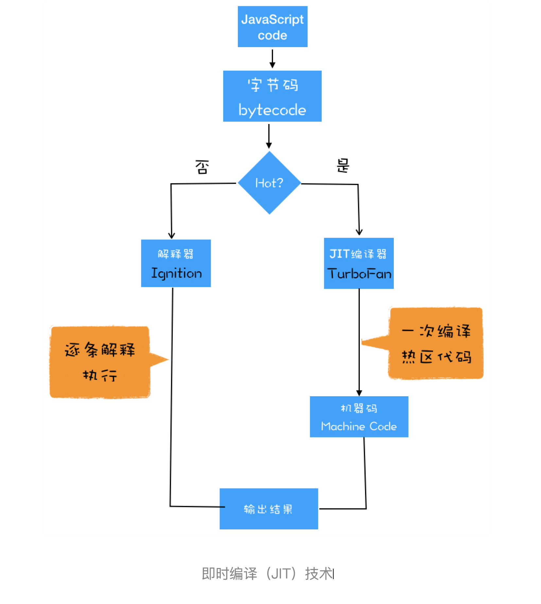

# 浏览器工作原理与实战

## 浏览器多进程架构

### 进程和线程

- 并行处理
  > 计算机中的并⾏处理就是同⼀时刻处理多个任务  
  > 使⽤并⾏处理能⼤⼤提升性能。
- 线程 VS 进程
  - 多线程可以并⾏处理任务，但是线程是不能单独存在的，它是由进程来启动和管理的。
  - ⼀个进程就是⼀个程序的运⾏实例
    > 启动⼀个程序的时候，操作系统会为该程序创建⼀块内存，⽤来存放代码、运⾏中的数据和⼀个执⾏任务的主线程，我们把这样的⼀个运⾏环境叫进程
  - 线程是依附于进程的，⽽进程中使⽤多线程并⾏处理能提升运算效率。
  - 进程和线程之间的关系
    - 进程中的任意⼀线程执⾏出错，都会导致整个进程的崩溃
    - 线程之间共享进程中的数据
    - 当⼀个进程关闭之后，操作系统会回收进程所占⽤的内存
      > 当⼀个进程退出时，操作系统会回收该进程所申请的所有资源；即使其中任意线程因为操作不当导致内存泄漏，当进程退出时，这些内存也会被正确回收。
    - 进程之间的内容相互隔离
      > 进程隔离是为保护操作系统中进程互不⼲扰的技术，每⼀个进程只能访问⾃⼰占有的数据，也就避免出现进程 A 写⼊数据到进程 B 的情况。正是因为进程之间的数据是严格隔离的，所以⼀个进程如果崩溃了，或者挂起了，是不会影响到其他进程的。如果进程之间需要进⾏数据的通信，这时候，就需要使⽤⽤于进程间通信（IPC）的机制了。
- chrome 进程架构
  - 1 个浏览器（Browser）主进程
    > 主要负责界⾯显示、⽤户交互、⼦进程管理，同时提供存储等功能
  - 1 个 GPU 进程
    > 其实，Chrome 刚开始发布的时候是没有 GPU 进程的。⽽ GPU 的使⽤初衷是为了实现 3D CSS 的效果，只是随后⽹⻚、Chrome 的 UI 界⾯都选择采⽤ GPU 来绘制，这使得 GPU 成为浏览器普遍的需求。最后，Chrome 在其多进程架构上也引⼊了 GPU 进程。
  - 1 个⽹络（NetWork）进程
    > 主要负责⻚⾯的⽹络资源加载，之前是作为⼀个模块运⾏在浏览器进程⾥⾯的，直⾄最近才独⽴出来，成为⼀个单独的进程。
  - 多个渲染进程
    > 核⼼任务是将 HTML、CSS 和 JavaScript 转换为⽤户可以与之交互的⽹⻚，`排版引擎 Blink` 和 `JavaScript 引擎 V8` 都是运⾏在该进程中，默认情况下，Chrome 会为每个 Tab 标签创建⼀个渲染进程。`出于安全考虑，渲染进程都是运⾏在沙箱模式下`。
  - 多个插件进程
    > 主要是负责插件的运⾏，因插件易崩溃，所以需要通过插件进程来隔离，以保证插件进程崩溃不会对浏览器和⻚⾯造成影响。
- 多进程架构问题
  - 更⾼的资源占⽤
    > 因为每个进程都会包含公共基础结构的副本（如 JavaScript 运⾏环境），这就意味着浏览器会消耗更多的内存资源。
  - 更复杂的体系架构
    > 浏览器各模块之间耦合性⾼、扩展性差等问题，会导致现在的架构已经很难适应新的需求了。
- SOA 架构（面向服务的架构 - `Services Oriented Architecture`）

  - Chrome 整体架构会朝向现代操作系统所采⽤的“⾯向服务的架构” ⽅向发展，原来的各种模块会被重构成独⽴的服务（Service），每个服务（Service）都可以在独⽴的进程中运⾏，访问服务（Service）必须使⽤定义好的接⼝，通过 IPC 来通信，从⽽构建⼀个更内聚、松耦合、易于维护和扩展的系统，更好实现 Chrome 简单、稳定、⾼速、安全的⽬标。
  - Chrome“⾯向服务的架构”的进程模型图

    

  - 弹性架构

    

- `process-per-site-instance`

  > 将“同⼀站点”定义为根域名（例如，geekbang.org）加上协议（例如，https:// 或者http://），还包含了该根域名下的所有⼦域名和不同的端⼝，⽐如下⾯这三个：  
  > https://time.geekbang.org  
  > https://www.geekbang.org  
  > https://www.geekbang.org:8080  
  > Chrome 的默认策略是，每个标签对应⼀个渲染进程。但是如果从⼀个⻚⾯打开了新⻚⾯，⽽新⻚⾯和当前⻚⾯属于同⼀站点时，那么新⻚⾯会复⽤⽗⻚⾯的渲染进程。官⽅把这个默认策略叫 process-per-site-instance。  
  > 所以，这种情况下，⼀个⻚⾯崩溃了，会导致同⼀站点的⻚⾯同时崩溃，因为他们使⽤了同⼀个渲染进程。

## 从输⼊ URL 到⻚⾯展示，这中间发⽣了什么


### 导航流程

> ⽤户发出 URL 请求到⻚⾯开始解析的这个过程，就叫做导航

- ⾸先，浏览器进程接收到⽤户输⼊的 URL 请求，浏览器进程便将该 URL 转发给⽹络进程。
  > 当⽤户输⼊关键字并键⼊回⻋之后，这意味着当前⻚⾯即将要被替换成新的⻚⾯，不过在这个流程继续之前，浏览器还给了当前⻚⾯⼀次执⾏ beforeunload 事件的机会，`beforeunload 事件允许⻚⾯在退出之前执⾏⼀些数据清理操作`，还可以询问⽤户是否要离开当前⻚⾯，⽐如当前⻚⾯可能有未提交完成的表单等情况，因此⽤户可以通过 beforeunload 事件来取消导航，让浏览器不再执⾏任何后续⼯作
- 然后，在⽹络进程中发起真正的 URL 请求。

  > 浏览器进程会通过进程间通信（IPC）把 URL 请求发送⾄⽹络进程

- 接着⽹络进程接收到了响应头数据，便解析响应头数据，并将数据转发给浏览器进程。
- 浏览器进程接收到⽹络进程的响应头数据之后，发送“提交导航 (CommitNavigation)”消息到渲染进程，发送 CommitNavigation 时会携带响应头、等基本信息。

  - 准备渲染进程

    > 默认情况下，Chrome 会为每个⻚⾯分配⼀个渲染进程，也就是说，每打开⼀个新⻚⾯就会配套创建⼀个新的渲染进程。但是，也有⼀些例外，在某些情况下，浏览器会让多个⻚⾯直接运⾏在同⼀个渲染进程中。

    > Chrome 的默认策略是，每个标签对应⼀个渲染进程。但如果**从⼀个⻚⾯打开了另⼀个新⻚⾯，⽽新⻚⾯和当前⻚⾯属于同⼀站点的话，那么新⻚⾯会复⽤⽗⻚⾯的渲染进程**。官⽅把这个默认策略叫 process-per-site-instance。

    

    > 渲染进程准备好之后，还不能⽴即进⼊⽂档解析状态，因为此时的⽂档数据还在⽹络进程中，并没有提交给渲染进程，所以下⼀步就进⼊了提交⽂档阶段。

  - 提交文档

    > 所谓提交⽂档，就是指浏览器进程将⽹络进程接收到的 HTML 数据提交给渲染进程

    - ⾸先当浏览器进程接收到⽹络进程的响应头数据之后，便向渲染进程发起“提交⽂档”的消息
    - 渲染进程接收到“提交⽂档”的消息后，会和⽹络进程建⽴传输数据的“管道”
    - 等⽂档数据传输完成之后，渲染进程会返回“确认提交”的消息给浏览器进程
    - 浏览器进程在收到“确认提交”的消息后，会更新浏览器界⾯状态，包括了安全状态、地址栏的 URL、前进后退的历史状态，并更新 Web ⻚⾯

      

- 渲染进程接收到“提交导航”的消息之后，便开始准备接收 HTML 数据，接收数据的⽅式是直接和⽹络进程建⽴数据管道；
- 最后渲染进程会向浏览器进程“确认提交”，这是告诉浏览器进程：“已经准备好接受和解析⻚⾯数据了”。
- 浏览器进程接收到渲染进程“提交⽂档”的消息之后，便开始移除之前旧的⽂档，然后更新浏览器进程中的⻚⾯状态。

> 到这里，⼀个完整的导航流程就“⾛”完了，这之后就要进⼊渲染阶段了。

> 多个⻚⾯公⽤⼀个渲染进程，也就意味着多个⻚⾯公⽤同⼀个主线程，所有⻚⾯的任务都是在同⼀个主线程上执⾏，这些任务包括渲染流程，JavaScript 执⾏，⽤户交互的事件的响应等等。但是如果⼀个标签⻚⾥⾯执⾏⼀个死循环，那么意味着该 JavaScript 代码会⼀直霸占主线程，这样就导致了其它的⻚⾯⽆法使⽤该主线程，从⽽让所有⻚⾯都失去响应！

> ⻚⾯进程关闭后，浏览器进程会接收到关闭的消息，然后浏览器进程会通知⽹络进程主动断开该⻚⾯的所有 tcp 连接。

> 接受到第⼀批 inde.html 的数据就会发送提交⽂档的消息

> 边下载边解析的，接收到第⼀批数据，便开始做 DOM 解析了！

> 等所有资源加载完毕 (js、css、image) 等算渲染进程接收完数据

### 渲染流程

> ⼀旦⽂档被提交，渲染进程便开始⻚⾯解析和⼦资源加载了

- 构建 DOM 树

  > 浏览器⽆法直接理解和使⽤ HTML，所以需要将 HTML 转换为浏览器能够理解的结构 —— DOM 树

- 样式计算（Recalculate Style）

  > 计算出 DOM 节点中每个元素的具体样式

  - 把 CSS 转换为浏览器能够理解的结构

    > 当渲染引擎接收到 CSS 文本时，会执行一个转换操作，将 CSS 文本转换为浏览器可以理解的结构 —— `styleSheets`

    > 可在 Chrome 控制台中查看其结构，输入 document.styleSheets 即可看到

    

    > styleSheets 只包含通过 link 引入的样式和 style 标记内的样式

  - 转换样式表中的属性值，使其标准化

    > CSS ⽂本中有很多属性值，如 2em、blue、bold，这些类型数值不容易被渲染引擎理解，所以需要将所有值转换为渲染引擎容易理解的、标准化的计算值，这个过程就是属性值标准化

    

  - 计算出 DOM 树中每个节点的具体样式

    - CSS 的继承规则： 每个 DOM 节点都包含有⽗节点的样式。
    - CSS 的层叠规则

- 布局阶段

  > 计算出 DOM 树中**可见元素**的几何位置

  - 创建布局树
    - 遍历 DOM 树中的所有可见节点， 并把这些节点加到布局树中
    - 不可见的节点会被忽略掉，如 head 标签下的全部内容，再比如属性包含 `display: none`, 所以这些元素也没有被包进布局树
  - 布局计算
    > 执行布局操作的时候，会把布局运算结果重新写回布局树中，所以布局树即是输入内容，也是输出内容，这是布局阶段一个不合理的地方，因为在布局阶段并没有清晰的将输入内容和输出内容区分开来。针对这个问题，Chrome 团队正在重构布局代码，下一代布局系统叫 LayoutNG，试图更清晰的分离输入和输出，从而让新设计的布局算法更加简单。

- 分层

  > ⻚⾯中有很多复杂的效果，如⼀些复杂的 3D 变换、⻚⾯滚动，或者使⽤ z-index 做 z 轴排序等，为了更加⽅便地实现这些效果，渲染引擎还需要**为特定的节点⽣成专⽤的图层，并⽣成⼀棵对应的图层树（LayerTree）**。

  > 浏览器的页面实际上被分成了很多图层，这些图层叠加后合成了最终的页面

  > 如果一个节点没有对应的层，那么这个节点就从属于父节点的图层。

  - 满足以下两点中任意一点的元素就有可能被提升为单独的一层
    - 拥有层叠上下文属性的元素会被提升为单独的一层
      - 明确定位属性的元素
      - 定义透明属性的元素
      - 使用 CSS 滤镜的元素
      - 使用 z-index 的元素
    - 需要剪裁（clip）的地方也会被创建图层
      - 容器不足以显示内部子元素而裁剪容器的部分用于显示，渲染引擎会为超出的子元素单独创建一个层，如果出现滚动条，滚动条也会被提升为单独的层

- 图层绘制

  - 渲染引擎会把一个图层的绘制拆分成很多小的绘制指令，然后把这些指令按照顺序组成一个待绘制列表

    

    > 可以打开“开发者工具”的“Layers”标签，选择 document 层，来实际体验下绘制列表

    

    > 区域 1 就是 document 的绘制列表，拖动区域 2 中的进度条可以重现列表的绘制过程

- 栅格化（raster）操作

  绘制列表只是⽤来记录绘制顺序和绘制指令的列表，⽽实际上绘制操作是由渲染引擎中的合成线程来完成的。你可以结合下图来看下渲染主线程和合成线程之间的关系

  

  当图层的绘制列表准备好后，主线程会把该绘制列表提交（commit）给合成线程

  通常⼀个⻚⾯可能很⼤，但是⽤户只能看到其中的⼀部分，我们把⽤户可以看到的这个部分叫做视⼝（viewport）。

  在有些情况下，有的图层可以很⼤，⽐如有的⻚⾯你使⽤滚动条要滚动好久才能滚动到底部，但是通过视⼝，⽤户只能看到⻚⾯的很⼩⼀部分，所以在这种情况下，要绘制出所有图层内容的话，就会产⽣太⼤的开销，⽽且也没有必要。

  基于这个原因，合成线程会将图层划分为图块（tile），这些图块的⼤⼩通常是 256x256 或者 512x512。

  然后合成线程会按照视⼝附近的图块来优先⽣成位图，实际⽣成位图的操作是由栅格化来执⾏的。所谓栅格化，是指将图块转换为位图。⽽图块是栅格化执⾏的最⼩单位。渲染进程维护了⼀个栅格化的线程池，所有的图块栅格化都是在线程池内执⾏的，运⾏⽅式如下图所示：

  

  通常，栅格化过程都会使⽤ GPU 来加速⽣成，使⽤ GPU ⽣成位图的过程叫快速栅格化，或者 GPU 栅格化，⽣成的位图被保存在 GPU 内存中。

  GPU 操作是运⾏在 GPU 进程中，如果栅格化操作使⽤了 GPU，那么最终⽣成位图的操作是在 GPU 中完成的，这就涉及到了跨进程操作。

- 合成和显示

  ⼀旦所有图块都被光栅化，合成线程就会⽣成⼀个绘制图块的命令——“DrawQuad”，然后将该命令提交给浏览器进程。

  浏览器进程⾥⾯有⼀个叫 viz 的组件，⽤来接收合成线程发过来的 DrawQuad 命令，然后根据 DrawQuad 命令，将其⻚⾯内容绘制到内存中，最后再将内存显示在屏幕上。

- 渲染流⽔线⼤总结

  

- 重排、重绘、合成

  - 更新了元素的集合属性（重排）
    
  - 更新元素的绘制属性（重绘）
    
  - 更改一个既不要布局也不要绘制的属性（合成）
    

## 变量提升

所谓的变量提升，是指在 JavaScript 代码执行过程中，JavaScript 引擎把变量的声明部分和函数的声明部分提升到代码的开头的“行为”。变量被提升后，会给变量设置默认值 undefined

- JavaScript 代码的执⾏流程

  实际上变量和函数声明在代码⾥的位置是不会改变的，⽽且是在编译阶段被 JavaScript 引擎放⼊内存中。

  - 编译阶段

    - 变量提升
      ```js
      var myName = undefined;
      function showName() {
        console.log("showName 被执行");
      }
      ```
    - 执行代码
      ```js
      showName();
      console.log(myName);
      myName = "极客时间";
      ```

    

    经过编译后，会生成两部分内容：**执行上下文（Execution context）**和**可执行代码**

    执行上下文是执行一段代码的运行环境。

    JavaScript 引擎会把声明以外的代码编译为字节码。

  - 执行阶段

    按照顺序一行一行的执行

- 代码出现相同的变量或者函数怎么办

  ```js
  function showName() {
    console.log("showName A");
  }
  showName(); // showName B
  function showName() {
    console.log("showName B");
  }
  showName(); // showName B
  ```

  后者的声明会覆盖前者的声明。

  ```js
  var showName = "showName string";
  function showName() {
    console.log("showName has been called");
  }
  console.log(showName); // showName string
  showName(); // Uncaught TypeError: showName is not a function
  ```

  同一个标识符的情况下，变量声明与函数声明都会提升；函数声明会覆盖变量声明，但不会覆盖变量赋值，即：如果声明变量的同时初始化或赋值那么变量优先级高于函数。

  ```js
  showName(); // 1
  var showName = function () {
    console.log(2);
  };
  function showName() {
    console.log(1);
  }
  ```

### JS 变量声明及初始化

- [深入理解 JavaScript 系列（12）：变量对象（Variable Object）](https://www.cnblogs.com/TomXu/archive/2012/01/16/2309728.html)

  - 只有全局上下文的变量对象允许通过 VO 的属性名称来间接访问(因为在全局上下文里，全局对象自身就是变量对象，稍后会详细介绍)，在其它上下文中是不能直接访问 VO 对象的，因为它只是内部机制的一个实现。
  - 在 DOM 中，全局对象的 window 属性就可以引用全局对象自身(当然，并不是所有的具体实现都是这样)

    ```js
      global = {
        Math: <...>,
        String: <...>
        ...
        ...
        window: global //引用自身
      };
    ```

  - 未传值的形参和 arguments 内的值不共享

    ```js
    function foo(x, y, z) {
      // 声明的函数参数数量arguments (x, y, z)
      alert(foo.length); // 3

      // 真正传进来的参数个数(only x, y)
      alert(arguments.length); // 2

      // 参数的callee是函数自身
      alert(arguments.callee === foo); // true

      // 参数共享

      alert(x === arguments[0]); // true
      alert(x); // 10

      arguments[0] = 20;
      alert(x); // 20

      x = 30;
      alert(arguments[0]); // 30

      // 不过，没有传进来的参数z，和参数的第3个索引值是不共享的

      z = 40;
      alert(arguments[2]); // undefined

      arguments[2] = 50;
      alert(z); // 40
    }

    foo(10, 20);
    ```

  - 当进入执行上下文(代码执行之前)时，VO 里已经包含了下列属性(前面已经说了)：
    - 函数的所有形参(如果我们是在函数执行上下文中)
      - 由名称和对应值组成的一个变量对象的属性被创建；没有传递对应参数的话，那么由名称和 undefined 值组成的一种变量对象的属性也将被创建。
    - 所有函数声明(FunctionDeclaration, FD)
      - 由名称和对应值（函数对象(function-object)）组成一个变量对象的属性被创建；如果变量对象已经存在相同名称的属性，则完全替换这个属性。
    - 所有变量声明(var, VariableDeclaration)
      - 由名称和对应值（undefined）组成一个变量对象的属性被创建；如果变量名称跟已经声明的形式参数或函数相同，则变量声明不会干扰已经存在的这类属性。
  - 变量声明在顺序上跟在函数声明和形式参数声明之后，而且在这个进入上下文阶段，变量声明不会干扰 VO 中已经存在的同名函数声明或形式参数声明

[Javascript 函数声明的优先级高于变量声明的优先级，但不会覆盖变量赋值](https://blog.csdn.net/wy818/article/details/49247675)

### 执行上下文

#### [前端基础进阶（二）：执行上下文详细图解](https://www.jianshu.com/p/a6d37c77e8db)

- JS 运行环境大概包括三种情况：
  - 全局环境： JavaScript 代码运行起来会首先进入该环境
  - 函数环境：当函数被调用执行时，会进入当前函数中执行代码
  - eval（不建议使用，可忽略）

因此在一个 JavaScript 程序中，必定会产生多个执行上下文，在我的上一篇文章中也有提到，JavaScript 引擎会以栈的方式来处理它们，这个栈，我们称其为函数调用栈(call stack)。栈底永远都是全局上下文，而栈顶就是当前正在执行的上下文。

- 全局上下文在浏览器窗口关闭后出栈。
- 函数中，遇到 return 能直接终止可执行代码的执行，因此会直接将当前上下文弹出栈。

#### [JavaScript 深入之执行上下文](https://github.com/mqyqingfeng/Blog/issues/8)

```js
var scope = "global scope";

function checkScope() {
  var scope = "local scope";

  function f() {
    return scope;
  }

  return f();
}

checkScope(); // local scope
```

```js
var scope = "global scope";
function checkScope() {
  var scope = "local scope";

  function f() {
    return scope;
  }

  return f;
}

checkScope()(); // local scope
```

#### [什么是作用域和执行上下文](https://segmentfault.com/a/1190000009522006)

## 调用栈

可以使用断点（debugger) 或者 console.trace() 来查看调用栈信息

调用栈大小有两个指标： 最大栈容量和最大调用深度。满足其中一个就会栈溢出。

- 栈溢出

  调用栈是有大小的，当入栈的执行上下文超过一定数目，JavaScript 引擎就会报错，我们把这种错误叫做栈溢出

- 尾递归优化（TCO）

  ```js
  function runStack(n) {
    if (n === 0) return 100;
    return runStack(n - 2);
  }
  runStack(50000);
  ```

  各大浏览器（除了 safari）没有部署尾调用优化

  V8 引擎实际上已经实现了尾调用优化，但是默认是关闭该功能的

  - [尾递归的后续探究](https://imweb.io/topic/5a244260a192c3b460fce275)

## 块级作用域

正是由于 JavaScript 存在变量提升这种特性，从⽽导致了很多与直觉不符的代码，这也是 JavaScript 的⼀个重要设计缺陷。

由于 JavaScript 的变量提升存在着变量覆盖、变量污染等设计缺陷，所以 ES6 引入了块级作用域关键字来解决这些问题。

- 作用域

  作⽤域就是变量与函数的可访问范围，即作⽤域控制着变量和函数的可⻅性和⽣命周期。

  - 全局作用域
  - 函数作用域
  - 块级作用域

    ```js
    function foo() {
      var a = 1;
      let b = 2;
      {
        let b = 3;
        var c = 4;
        let d = 5;
        console.log(a);
        console.log(b);
      }
      console.log(b);
      console.log(c);
      console.log(d);
    }
    foo();
    ```

    - 编译并创建执行上下文
      

      - 函数内部通过 var 声明的变量，在编译阶段全部被放到**变量环境**中
      - 通过 let 声明的变量，在编译阶段会被存放到**词法环境（Lexical Environment）**中

      

      在词法环境内部维护了一个小型栈结构，栈底是函数最外层的变量，进入一个块级作用域后，就会把该作用域快内部的变量压到栈顶；当作用域执行完成后，该作用域的信息就会从栈顶弹出，这就是词法环境的结构

## 作用域链

在 JavaScript 执行过程中，其作用域链是由词法作用域决定的

- 词法作用域

  词法作⽤域就是指**作⽤域是由代码中函数声明的位置来决定的**，所以词法作⽤域是**静态的作⽤域**，通过它就能够预测代码在执⾏过程中如何查找标识符。

- 闭包

  本来函数外部是无权访问函数内部的函数或者变量，但是通过外部变量引用或者返回函数方式使得函数能够在外部调用，在调用时执行上下文创建和执行过程中保留了变量对象和作用域链使其不会被垃圾回收的过程就是闭包

[前端基础进阶（六）：在 chrome 开发者工具中观察函数调用栈、作用域链与闭包](https://www.jianshu.com/p/73122bb3d262)

## this

在对象内部的⽅法中使⽤对象内部的属性是⼀个⾮常普遍的需求。但是 JavaScript 的作⽤域机制并不⽀持这⼀点，基于这个需求，JavaScript ⼜搞出来另外⼀套 this 机制。


- [彻底理解 js 中 this 的指向，不必硬背。](https://www.cnblogs.com/pssp/p/5216085.html)
- [彻底理解 JavaScript 中的 this](https://juejin.im/post/5c049e6de51d45471745eb98)

## 栈空间和堆空间

### 语言类型

- 在使⽤之前就需要确认其变量数据类型的称为静态语⾔。相反地，我们把在运⾏过程中需要检查数据类型的语⾔称为动态语⾔。
- 偷偷转换的操作称为隐式类型转换。⽀持隐式类型转换的语⾔称为弱类型语⾔，不⽀持隐式类型转换的语⾔称为强类型语⾔。


### 内存空间

- 代码空间： 存储可执⾏代码
- 栈空间
  - JavaScript 引擎需要⽤栈来维护程序执⾏期间上下⽂的状态，如果栈空间⼤了话，所有的数据都存放在栈空间⾥⾯，那么会影响到上下⽂切换的效率，进⽽⼜影响到整个程序的执⾏效率
  - ESP（记录当前执⾏状态的指针），指向当前的执行上下文。当当前的函数执行结束后，JavaScript 会将 ESP 下移（上下文出栈）。上⾯的执⾏上下⽂虽然保存在栈内存中，但是已经是⽆效内存了。⽐如当调⽤另外⼀个函数时，这块内容会被直接覆盖掉，⽤来存放另外⼀个函数的执⾏上下⽂。
- 堆空间
  - 分代垃圾回收

[前端基础进阶：详细图解 JavaScript 内存空间](https://juejin.im/entry/589c29a9b123db16a3c18adf)

在 JS 中，每一个数据都需要一个内存空间。内存空间又被分为两种，栈内存(stock)与堆内存(heap)。

- 基础数据类型，这些值都有固定的大小，往往都保存在栈内存中，由系统自动分配存储空间。可以直接操作保存在栈内存空间的值，因此基础数据类型都是按值访问。
- 引用数据类型，比如数组 Array，它们值的大小是不固定的。引用数据类型的值是保存在堆内存中的对象。JavaScript 不允许直接访问堆内存中的位置，因此我们不能直接操作对象的堆内存空间。在操作对象时，实际上是在操作对象的引用而不是实际的对象。因此，引用类型的值都是按引用访问的。这里的引用，我们可以粗浅地理解为保存在栈内存中的一个地址，该地址与堆内存的实际值相关联。

## 编译器和解释器

### 语言分类

按语⾔的执⾏流程，可以把语⾔划分为编译型语⾔和解释型语⾔。


- 编译型语⾔

  在程序执⾏之前，需要经过编译器的编译过程，并且编译之后会直接保留机器能读懂的⼆进制⽂件，这样每次运⾏程序时，都可以直接运⾏该⼆进制⽂件，⽽不需要再次重新编译了。⽐如 C/C++、GO 等都是编译型语⾔。

- 解释型语⾔

  在每次运⾏时都需要通过解释器对程序进⾏动态解释和执⾏

### V8 执行 JavaScript 的过程


- ⽣成抽象语法树（AST）和执⾏上下⽂
  - 词法分析
    将一行行的源码拆解成一个个的 token
  - 语法分析
  - 有了 AST 之后生成该段代码的执行上下文
- 生成字节码

  > 字节码就是介于 AST 和机器码之间的⼀种代码。但是与特定类型的机器码⽆关，字节码需要通过解释器将其转换为机器码后才能执⾏。

  解释器 Ignition 会根据 AST ⽣成字节码，并解释执⾏字节码。

  ⼀开始 V8 并没有字节码，⽽是直接将 AST 转换为机器码，由于执⾏机器码的效率是⾮常⾼效的，所以这种⽅式在发布后的⼀段时间内运⾏效果是⾮常好的。但是随着 Chrome 在⼿机上⼴泛普及，特别是运⾏在 512M 内存的⼿机上，内存占⽤问题也暴露出来了，因为 **V8 需要消耗⼤量的内存来存放转换后的机器码**。为了解决内存占⽤问题，V8 团队⼤幅重构了引擎架构，引⼊字节码，并且抛弃了之前的编译器，最终花了将进四年的时间，实现了现在的这套架构。

  机器码所占⽤的空间远远超过了字节码，所以使⽤字节码可以减少系统的内存使⽤。

- 执行代码

  如果有⼀段第⼀次执⾏的字节码，解释器 Ignition 会逐条解释执⾏。到了这⾥，相信你已经发现了，解释器 Ignition 除了负责⽣成字节码之外，它还有另外⼀个作⽤，就是解释执⾏字节码。在 Ignition 执⾏字节码的过程中，如果发现有热点代码（HotSpot），⽐如⼀段代码被重复执⾏多次，这种就称为热点代码，那么后台的编译器 TurboFan 就会把该段热点的字节码编译为⾼效的机器码，然后当再次执⾏这段被优化的代码时，只需要执⾏编译后的机器码就可以了，这样就⼤⼤提升了代码的执⾏效率。


