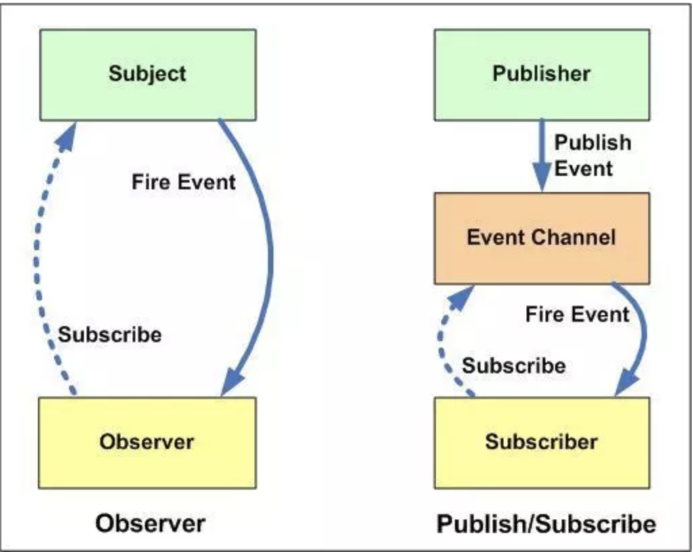

# JS 设计模式

- [观察者模式，发布订阅模式（Publish/Subscribe）](https://www.cnblogs.com/TomXu/archive/2012/03/02/2355128.html)

  观察者模式，他定义了一种多对多的关系，让多个观察者对象同时监听某一个主题对象，这个主题对象的状态发生变化时就会通知所有的观察者对象，使得他们能够自己更新自己。

  ```js
  class PubSub {
    constructor() {
      this.eventPoll = {};
    }

    subscribe(topicName, fn) {
      if (!this.eventPool[topicName]) {
        this.eventPool[topicName] = [];
      }
      this.eventPool[topicName].push(fn);

      return () => {
        const topic = this.eventPool[topicName];
        if (!topic || !topic.includes(fn)) return false;
        this.eventPool[topicName] = topic.filter(_fn => _fn !== fn);
        return true;
      };
    }

    dispatch(topicName, ...args) {
      this.eventPool[topicName] && this.eventPool[topicName].forEach(fn => fn(...args));
    }

    removeTopic(topicName) {
      this.eventPool[topicName] = [];
    }
  }
  ```

  - 观察者模式和订阅-发布模式的区别
    
    - 发布-订阅模式就好像报社、邮局和个人的关系，报纸的订阅和分发是由邮局来完成的。报社只负责将报纸发送给邮局。
    - 观察者模式就好像个体奶农和个人的关系。奶农负责统计有多少人订了产品，所以个人都会有一个相同拿牛奶的方法。奶农有新奶了就负责调用这个方法。

- 单例模式（singleton）

  ```js
  function Singleton() {
    let instance;
    function _Singleton(...args) {
      this.name = 'SingletonTester';
      this.a = args[0] || 6;
      this.b = args[1] || 10;
    }

    return {
      getInstance: function(...args) {
        if (!instance) {
          instance = new _Singleton(...args);
        }
        return instance;
      }
    };
  }
  ```

  ```js
  function Singleton(Fn) {
    let instance;

    return {
      getInstance: function(...args) {
        if (!instance) {
          instance = new Fn(...args);
        }
        return instance;
      }
    };
  }

  function createWindow() {
    const div = document.createElement('div');
    div.innerHTML = '我是弹窗内容';
    div.style.display = 'none';
    document.body.appendChild(div);
    return div;
  }

  function createIframe() {
    const iframe = document.createElement('iframe');
    document.body.appendChild(iframe);
    return iframe;
  }

  const createSingleDiv = Singleton(createWindow);
  document.getElementById('id').onclick=function() {
  const win = createSingleDiv.getInstance();
  win.style.display = 'block;
  }

  const createSingleIframe = Singleton(createIframe);
  document.getElementById('id').onclick = function() {
  const iframe = createSingleIframe.getInstance();
  iframe.src = "http://cnblogs.com";
  }

  ```

- 装饰者模式(decorator)

  > 装饰者(decorator)模式能够在不改变对象自身的基础上，在程序运行期间给对像动态的添加职责。与继承相比，装饰者是一种更轻便灵活的做法。

  > 在传统面向对象语言中，为对象添加功能常使用继承
  > 但是继承有很多缺点：
  > 超类子类强耦合，超类改变导致子类改变
  > 超类内部细节对子类可见，破坏了封装性
  > 完成功能复用同时，可能会创造大量子类

  > 装饰者模式是为已有功能动态地添加更多功能的一种方式，把每个要装饰的功能放在单独的函数里，然后用该函数包装所要装饰的已有函数对象，因此，当需要执行特殊行为的时候，调用代码就可以根据需要有选择地、按顺序地使用装饰功能来包装对象。优点是把类（函数）的核心职责和装饰功能区分开了。

  ```js
  function Plan() {}

  Plan.prototype.fire = function() {
    console.log('发射普通子弹');
  };

  function MissileDecorator(plan) {
    this.plan = plan;
  }

  MissileDecorator.prototype.fire = function() {
    this.plan.fire();
    console.log('发射导弹!');
  };

  let plan = new Plan();
  plan = new MissileDecorator(plan);
  plan.fire();
  ```

  ```js
  // ES7 装饰器
  function isAnimal(target) {
    target.isAnimal = true;
    return target;
  }

  @isAnimal
  class Cat {}

  console.log(Cat.isAnimal); // true

  function readonly(target, name, descriptor) {
    discriptor.writable = false;
    return discriptor;
  }

  class Cat {
    @readonly
    say() {
      console.log('miao ~');
    }
  }

  const kitty = new Cat();
  kitty.say = function() {
    console.log('woof !);
  }
  kitty.say();
  ```

  > 装饰链叠加了函数作用域，如果过长也会产生性能问题  
  > 如果原函数上保存了属性，返回新函数后属性会丢失

- Minin 混合模式

  > 这个模式和 decorator 有点类似，只是它的功能更加垂直。  
  > **就是在原有的对象上面增加、覆盖对象的行为。**  
  > 相比于 extends、Object.assign 等方法，mixin 模式更富有表现力。  
  > mixin 模式不能一概而论，可能依据不同的数据类型有不同的 mixin 策略，比如 vue.mixin

  ```js
  ```

- 工厂模式

  - 简单工厂模式

    > 解决多个相似的问题

    ```js
    function CreatePerson(name, age, sex) {
      const obj = new Object();
      obj.name = name;
      obj.age = age;
      obj.sex = sex;
      obj.sayName = function() {
        return this.name;
      };
      return obj;
    }

    const p1 = new CreatePerson('longen', '28', '男');
    const p2 = new CreatePerson('tugenhua', '27', '女');

    // 返回的都是object 无法识别对象的类型 不知道是哪个对象的实例
    console.log(typeof p1); // object
    console.log(typeof p2); // object
    console.log(p1 instanceof Object); // true
    ```

    - 能解决多个相似的问题（实列化对象产生重复的问题）
    - 对象识别问题

  - 复杂工厂模式（寄生式组合继承）

    其实就是封装一个继承过程

    将实列化推迟到子类中，子类可以重写父类接口方法以便创建的时候指定自己的对象类型。

    父类只对创建过程中的一般性问题进行处理，这些处理会被子类继承，子类之间是相互独立的，具体的业务逻辑会放在子类中进行编写。

    父类就变成了一个抽象类，但是父类可以执行子类中相同类似的方法，具体的业务逻辑需要放在子类中去实现；比如我现在开几个自行车店，那么每个店都有几种型号的自行车出售。我们现在来使用工厂模式来编写这些代码;

    ```js
    /**
     * 寄生式组合继承
     */
    function BicycleShop(name) {
      this.name = name;
      this.method = function() {
        return this.name;
      };
    }

    BicycleShop.prototype = {
      constructor: BicycleShop,
      sellBicycle: function(model) {
        const bicycle = this.createBicycle(model);
        bicycle.A();
        bicycle.B();
        return bicycle;
      },
      createBicycle: function(model) {
        throw new Error('父类是抽象类不能直接调用，需要子类重写该方法');
      }
    };

    // 实现原型继承
    function extend(Sub, Sup) {
      function F() {}
      F.prototype = Sup.prototype;
      Sub.prototype = new F();

      Sub.prototype.constructor = Sub;
      Sub.sup = Sup.prototype;

      if (Sup.prototype.constructor === Object.prototype.constuctor) {
        Sup.prototype.constructor = Sup;
      }
    }

    function BicycleChild(name) {
      BicycleShop.call(this, name);
    }

    extend(BicycleChild, BicycleShop);
    BicycleChild.prototype.createBicycle = function() {
      function A() {
        console.log('执行A业务操作');
      }
      function B() {
        console.log('执行B业务操作');
      }

      return {
        A: A,
        B: B
      };
    };

    const childClass = new BicycleChild('🐉恩');
    console.log(childClass);
    ```

  - 适用场景
    - 对象的构建十分复杂
    - 需要依赖具体环境创建不同实例
    - 处理大量具有相同属性的小对象

- 模块模式

  模块模式的思路是为单体模式添加私有变量和私有方法能够减少全局变量的使用

  ```js
  const singleMode = (function() {
    // 创建私有变量
    const privateNum = 112;
    // 创建私有函数
    function privateFun() {
      // 实现自己的业务逻辑代码
    }

    return {
      publicMethod: publicMethod
    };
  })();
  ```

- 代理模式

  代理是一个对象，它可以用来控制对本体对象的访问，它与本体对象实现了同样的接口，代理对象会把所有的调用方法传递给本体对象的；代理模式最基本的形式是对访问进行控制，而本体对象则负责执行所分派的那个对象的函数或者类，简单的来讲本地对象注重的去执行页面上的代码，代理则控制本地对象何时被实例化，何时被使用

  ```js
  const target = {};
  const handler = {
    get(target, property) {
      if (property in target) {
        return target[property];
      } else {
        throw new ReferenceError(`Property ${property} does not exist.`);
      }
    }
  };
  const p = new Proxy(target, handler);
  p.a = 3;
  console.log(p.c);
  ```

- 中介者模式

  用一个中介对象来封装一系列的对象交互。中介者使各对象不需要显式地相互引用，从而使其耦合松散，而且可以独立地改变它们之间的交互。

  ```js
  // 汽车
  class Bus {
    constructor() {
      // 初始化所有乘客
      this.passengers = {};
    }

    // 发布广播
    broadcast(passenger, message = passenger) {
      // 如果车上有乘客
      if (Object.keys(this.passengers).length) {
        // 如果是针对某个乘客发的，就单独给他听
        if (passenger.id && passenger.listen) {
          // 乘客他爱听不听
          if (this.passengers[passenger.id]) {
            this.passengers[passenger.id].listen(message);
          }

          // 不然就广播给所有乘客
        } else {
          Object.keys(this.passengers).forEach(passenger => {
            if (this.passengers[passenger].listen) {
              this.passengers[passenger].listen(message);
            }
          });
        }
      }
    }

    // 乘客上车
    aboard(passenger) {
      this.passengers[passenger.id] = passenger;
    }

    // 乘客下车
    debus(passenger) {
      this.passengers[passenger.id] = null;
      delete this.passengers[passenger.id];
      console.log(`乘客${passenger.id}下车`);
    }

    // 开车
    start() {
      this.broadcast({ type: 1, content: '前方无障碍，开车！Over' });
    }

    // 停车
    end() {
      this.broadcast({ type: 2, content: '老司机翻车，停车！Over' });
    }
  }

  // 乘客
  class Passenger {
    constructor(id) {
      this.id = id;
    }

    // 听广播
    listen(message) {
      console.log(`乘客${this.id}收到消息`, message);
      // 乘客发现停车了，于是自己下车
      if (Object.is(message.type, 2)) {
        this.debus();
      }
    }

    // 下车
    debus() {
      console.log(`我是乘客${this.id}，我现在要下车`, bus);
      bus.debus(this);
    }
  }

  // 创建一辆汽车
  const bus = new Bus();

  // 创建两个乘客
  const passenger1 = new Passenger(1);
  const passenger2 = new Passenger(2);

  // 俩乘客分别上车
  bus.aboard(passenger1);
  bus.aboard(passenger2);

  // 2秒后开车
  setTimeout(bus.start.bind(bus), 2000);

  // 3秒时司机发现2号乘客没买票，2号乘客被驱逐下车
  setTimeout(() => {
    bus.broadcast(passenger2, { type: 3, content: '同志你好，你没买票，请下车!' });
    bus.debus(passenger2);
  }, 3000);

  // 4秒后到站停车
  setTimeout(bus.end.bind(bus), 3600);

  // 6秒后再开车，车上已经没乘客了
  setTimeout(bus.start.bind(bus), 6666);
  ```

- [策略模式](https://www.cnblogs.com/TomXu/archive/2012/03/05/2358552.html)
- [适配器模式](https://www.cnblogs.com/TomXu/archive/2012/04/11/2435452.html)
