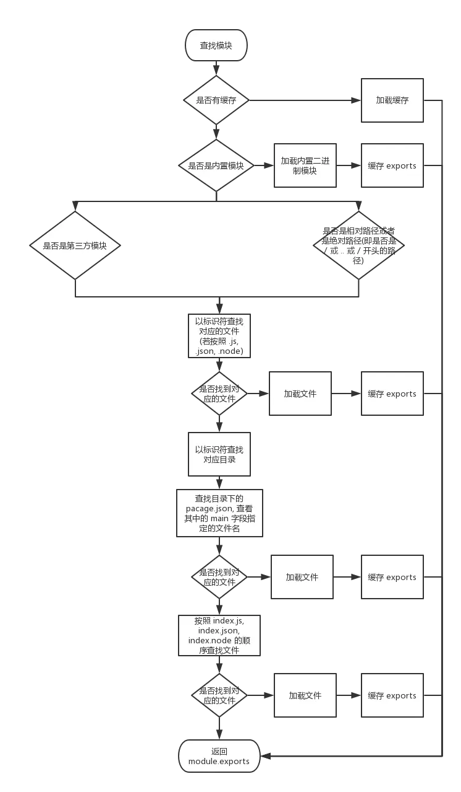

# NodeJS

## [Node.js 中的模块机制](https://juejin.im/entry/5b4b5081e51d451984696cb7)

- 模块查找流程

  - 缓存
  - 内置模块
  - 绝对路径、相对路径
    - 解析得到真实路径，按照后缀名 `.js`、`.json` 、`.node` 尝试加载
    - 当做目录查找
      - 寻找 package.json 文件，解析 main 字段， 根据 main 字段中指定的文件路径查找指定文件
      - 在该目录按照 `index.js`、`index.json`、`index.node` 顺序加载
      - 如果还没有找到，就抛出错误
  - NPM 模块包

    > 加载顺序是可以使用 module.paths 来查看。module.paths 返回是一个数组，第一个元素是文件当前目录下的 node_modules 文件夹，越往后就是上一级目录的 node_modules 文件夹，直到查找到 home 目录下的 node_modules 文件夹。

    ```shell
    [
      'D:\\side project\\test\\node_modules',
      'D:\\side project\\node_modules',
      'D:\\node_modules'
    ];
    ```

    > node 会在各个 node_modules 下先查找以标识符为主的分别是 .js, .json, .node 后缀的文件，如果没有找到，那么就当作是一个目录来进行来查找目录下的 package.json, 并解析出其中的 main 字段指定的文件路径，如果没有文件路径或者文件路径错误，目录下的 index.js, index.json, index.node, 如果没有查找到上述的文件，那么就会抛出一个错误。

  

## NodeJS 的事件循环(Event Loop)

- [详解 JavaScript 中的 Event Loop（事件循环）机制](https://zhuanlan.zhihu.com/p/33058983)
- [Node.js 的事件循环(Event Loop)、Timer 和 process.nextTick()[翻译]](https://zhuanlan.zhihu.com/p/34451546)

## Stream

- [Node.js Stream: 你需要知道的一切](https://juejin.im/post/5940a9c3128fe1006a0ab176)
- [模拟实现和深入理解 Node Stream 内部机制](https://juejin.im/post/5a6c7c4df265da3e5234bf14)


## [Nodejs 进程间通信](http://www.ayqy.net/blog/nodejs%E8%BF%9B%E7%A8%8B%E9%97%B4%E9%80%9A%E4%BF%A1/)

- 创建进程四种方式
  - spawn()
  - exec()
  - execFile()
  - fork()
- 通信方式

  - 通过 stdin/stdout 传递 json

    ```js
    const { spawn } = require('child_process');

    const child = spawn('node', ['./stdio-child.js']);
    child.stdout.setEncoding('utf8');
    child.stdin.write(
      JSON.stringify({
        type: 'handshake',
        payload: '你好吖'
      })
    );

    child.stdout.on('data', function(chunk) {
      let data = chunk.toString();
      let message = JSON.parse(data);
      console.log(`${message.type} ${message.payload}`);
    });
    ```

    ```js
    // ./stdio-child.js
    // 子进程-收
    process.stdin.on('data', chunk => {
      let data = chunk.toString();
      let message = JSON.parse(data);
      switch (message.type) {
        case 'handshake':
          // 子进程-发
          process.stdout.write(
            JSON.stringify({
              type: 'message',
              payload: message.payload + ' : hoho'
            })
          );
          break;
        default:
          break;
      }
    });
    ```

  - 原生 IPC 通信

    spawn()及 fork()的例子，进程之间可以借助内置的 IPC 机制通信。

    ```
    父进程：

      process.on('message')收

      child.send()发

    子进程：

      process.on('message')收

      process.send()发
    ```

  - socket

    借助网络来完成进程间通信，不仅能跨进程，还能跨机器

    node-ipc 就采用这种方案，例如：

    ```js
    // server

    const ipc = require('../../../node-ipc');

    ipc.config.id = 'world';
    ipc.config.retry = 1500;
    ipc.config.maxConnections = 1;

    ipc.serveNet(function() {
      ipc.server.on('message', function(data, socket) {
        ipc.log('got a message : ', data);
        ipc.server.emit(socket, 'message', data + ' world!');
      });

      ipc.server.on('socket.disconnected', function(data, socket) {
        console.log('DISCONNECTED\n\n', arguments);
      });
    });
    ipc.server.on('error', function(err) {
      ipc.log('Got an ERROR!', err);
    });
    ipc.server.start();

    // client
    const ipc = require('node-ipc');

    ipc.config.id = 'hello';
    ipc.config.retry = 1500;

    ipc.connectToNet('world', function() {
      ipc.of.world.on('connect', function() {
        ipc.log('## connected to world ##', ipc.config.delay);
        ipc.of.world.emit('message', 'hello');
      });
      ipc.of.world.on('disconnect', function() {
        ipc.log('disconnected from world');
      });
      ipc.of.world.on('message', function(data) {
        ipc.log('got a message from world : ', data);
      });
    });
    ```

  - 消息队列

## [单线程与多线程的区别](https://blog.csdn.net/u012134199/article/details/46290465)

## [[NodeJS] 优缺点及适用场景讨论](https://www.cnblogs.com/sysuys/p/3460614.html)

## koa 的原理,继承

```js
// application.js

module.exports = class Application extends Emitter {
  constructor() {
    super();
    this.proxy = false;
    this.middleware = [];
    this.env = process.env.NODE_ENV || 'development';
    this.context = Object.create(context);
    this.request = Object.create(request);
    this.response = Object.create(response);
  }

  listen(...args) {
    const server = http.createServer(this.callback());
    server.listen(...args);
  }

  use(fn) {
    if (typeof fn !== 'function') throw new TypeError('');
    if (isGeneratorFunction(fn)) {
      console.warn('');
      fn = convert(fn);
    }
    this.middleware.push(fn);
    return this;
  }

  callback() {
    // 生成 handle fn
    fn = compose(this.middleware);

    // 添加默认的 error handle
    if (!this.listenCounter('error')) this.on('error', this.onerror);

    return (req, res) => {
      // 生成 ctx
      const ctx = this.createContext(req, res);
      return this.handleRequest(ctx, fn);
    };
  }

  handleRequest(ctx, fnMiddleware) {
    const res = ctx.res;
    res.statusCode = 404;
    const onerror = err => ctx.onerror(err);
    const handleResponse = () => respond(ctx);
    onFinished(res, onerror);
    fnMiddleware(ctx)
      .then(handleResponse)
      .catch(error => onerror);
  }

  createContext(req, res) {
    const context = Object.create(this.context);
    const request = (context.request = Object.create(this.request));
    const response = (context.response = Object.create(this.response));
    context.app = request.app = response.app = this;
    context.req = request.req = response.req = req;
    context.res = request.res = response.res = res;
    request.ctx = response.ctx = context;
    request.response = response;
    response.request = request;
    context.originalUrl = request.originalUrl = req.url;
    context.state = {};
    return context;
  }

  onerror(err) {
    if (!(err instanceof Error)) throw new TypeError(util.format('non-error thrown: %j', err));

    if (404 == err.status || err.expose) return;
    if (this.silent) return;

    const msg = err.stack || err.toString();
    console.error();
    console.error(msg.replace(/^/gm, '  '));
    console.error();
  }
};

function respond(ctx) {
  // allow bypassing koa
  if (false === ctx.respond) return;

  const res = ctx.res;
  if (!ctx.writable) return;

  let body = ctx.body;
  const code = ctx.status;

  // ignore body
  if (statuses.empty[code]) {
    // strip headers
    ctx.body = null;
    return res.end();
  }

  if ('HEAD' == ctx.method) {
    if (!res.headersSent && isJSON(body)) {
      ctx.length = Buffer.byteLength(JSON.stringify(body));
    }
    return res.end();
  }

  // status body
  if (null == body) {
    if (ctx.req.httpVersionMajor >= 2) {
      body = String(code);
    } else {
      body = ctx.message || String(code);
    }
    if (!res.headersSent) {
      ctx.type = 'text';
      ctx.length = Buffer.byteLength(body);
    }
    return res.end(body);
  }

  // responses
  if (Buffer.isBuffer(body)) return res.end(body);
  if ('string' == typeof body) return res.end(body);
  if (body instanceof Stream) return body.pipe(res);

  // body: json
  body = JSON.stringify(body);
  if (!res.headersSent) {
    ctx.length = Buffer.byteLength(body);
  }
  res.end(body);
}
```

```js
// koajs/compose  洋葱模型
function compose(middleware) {
  if (!Array.isArray(middleware)) throw new TypeError('Middleware stack must be an array!');
  for (const fn of middleware) {
    if (typeof fn !== 'function') throw new TypeError('Middleware must be composed of functions!');
  }

  /**
   * @param {Object} context
   * @return {Promise}
   * @api public
   */

  return function(context, next) {
    // last called middleware #
    let index = -1;
    return dispatch(0);
    function dispatch(i) {
      if (i <= index) return Promise.reject(new Error('next() called multiple times'));
      index = i;
      let fn = middleware[i];
      if (i === middleware.length) fn = next;
      if (!fn) return Promise.resolve();
      try {
        return Promise.resolve(fn(context, dispatch.bind(null, i + 1)));
      } catch (err) {
        return Promise.reject(err);
      }
    }
  };
}
```

## Node 内存泄漏问题

- [nodejs 调试工具之 heapdump 简介](https://leokongwq.github.io/2016/11/08/nodejs-heapdump.html)
- [v8-profiler](https://github.com/node-inspector/v8-profiler)
- [easy-monitor](https://github.com/hyj1991/easy-monitor)

## IO 模式

- [Linux IO 模式及 select、poll、epoll 详解](https://segmentfault.com/a/1190000003063859?utm_source=Weibo&utm_medium=shareLink&utm_campaign=socialShare#articleHeader0)

- [大话 Select、Poll、Epoll](https://cloud.tencent.com/developer/article/1005481)

## webpack

- [超详细的 webpack 原理解读](https://segmentfault.com/a/1190000017890529)

  1. 初始化阶段

     | 事件            | 描述                                                                                                                                           |
     | :-------------- | :--------------------------------------------------------------------------------------------------------------------------------------------- |
     | 初始化参数      | 从配置文件和 shell 中读取和合并参数，得出最终的参数，这个过程还会执行配置文件中插件的实例化语句 new Plugin()                                   |
     | 实例化 Compiler | 根据得到的配置文件，实例化 Compiler，Compiler 负责文件监听和启动编译。在 Compiler 实例中包含了完整的 webpack 配置，全局只有一个 Compiler 实例  |
     | 加载插件        | 依次调用插件的 apply 方法，让插件可以监听后续的所有事件节点。同时向插件中传入 compiler 实例的引用，以方便插件通过 compiler 调用 webpack 的 api |
     | environment     | 开始应用 node.js 风格的文件系统到 compiler 对象，以方便后续的文件寻找和读取                                                                    |
     | Entry-option    | 读取配置的 Entrys,为每个 Entry 实例化一个对应的 EntryPlugin,为后面该 Entry 的递归解析工作做准备                                                |
     | After-plugins   | 调用完所有内置的和配置的插件的 apply 方法                                                                                                      |
     | After-resolvers | 根据配置初始化 resolver,resolver 负责在文件系统中寻找指定路径的文件                                                                            |

  2. 编译阶段

     | 事件          | 描述                                                                                                                                                                                                          |
     | :------------ | :------------------------------------------------------------------------------------------------------------------------------------------------------------------------------------------------------------ |
     | run           | 启动一次编译                                                                                                                                                                                                  |
     | watch-run     | 在监听模式下启动编译，文件发生变化会重新编译                                                                                                                                                                  |
     | compile       | 告诉插件一次新的编译将要启动，同时会给插件带上 compiler 对象                                                                                                                                                  |
     | compilation   | 当 webpack 以开发模式运行时，每当检测到文件的变化，便有一次新的 compilation 被创建。一个 Compilation 对象包含了当前的模块资源、编译生成资源、变化的文件等。compilation 对象也提供了很多事件回调给插件进行拓展 |
     | make          | 一个新的 compilation 对象创建完毕,即将从 entry 开始读取文件,根据文件类型和编译的 loader 对文件进行 ==编译== ,编译完后再找出该文件依赖的文件,递归地编译和解析                                                  |
     | after-compile | 一次 compilation 执行完成                                                                                                                                                                                     |
     | invalid       | 当遇到错误会触发改事件,该事件不会导致 webpack 退出                                                                                                                                                            |

  3. 输出阶段

     | 事件        | 描述                                                                                                   |
     | :---------- | :----------------------------------------------------------------------------------------------------- |
     | should-emit | 所有需要输出的文件已经生成,询问插件有哪些文件需要输出,有哪些不需要输出                                 |
     | emit        | 确定好要输出哪些文件后,执行文件输出, ==可以在这里获取和修改输出的内容==                                |
     | after-emit  | 文件输出完毕                                                                                           |
     | done        | 成功完成一次完整的编译和输出流程                                                                       |
     | failed      | 如果在编译和输出中出现错误,导致 webpack 退出,就会直接跳转到本步骤,插件可以在本事件中获取具体的错误原因 |

  ```js
  //以下代码用来包含webpack运行过程中的每个阶段
  //file:webpack.config.js

  const path = require('path');
  //插件监听事件并执行相应的逻辑
  class TestPlugin {
    constructor() {
      console.log('@plugin constructor');
    }

    apply(compiler) {
      console.log('@plugin apply');

      compiler.plugin('environment', options => {
        console.log('@environment');
      });

      compiler.plugin('after-environment', options => {
        console.log('@after-environment');
      });

      compiler.plugin('entry-option', options => {
        console.log('@entry-option');
      });

      compiler.plugin('after-plugins', options => {
        console.log('@after-plugins');
      });

      compiler.plugin('after-resolvers', options => {
        console.log('@after-resolvers');
      });

      compiler.plugin('before-run', (options, callback) => {
        console.log('@before-run');
        callback();
      });

      compiler.plugin('run', (options, callback) => {
        console.log('@run');
        callback();
      });

      compiler.plugin('watch-run', (options, callback) => {
        console.log('@watch-run');
        callback();
      });

      compiler.plugin('normal-module-factory', options => {
        console.log('@normal-module-factory');
      });

      compiler.plugin('context-module-factory', options => {
        console.log('@context-module-factory');
      });

      compiler.plugin('before-compile', (options, callback) => {
        console.log('@before-compile');
        callback();
      });

      compiler.plugin('compile', options => {
        console.log('@compile');
      });

      compiler.plugin('this-compilation', options => {
        console.log('@this-compilation');
      });

      compiler.plugin('compilation', options => {
        console.log('@compilation');
      });

      compiler.plugin('make', (options, callback) => {
        console.log('@make');
        callback();
      });

      compiler.plugin('compilation', compilation => {
        compilation.plugin('build-module', options => {
          console.log('@build-module');
        });

        compilation.plugin('normal-module-loader', options => {
          console.log('@normal-module-loader');
        });

        compilation.plugin('program', (options, callback) => {
          console.log('@program');
          callback();
        });

        compilation.plugin('seal', options => {
          console.log('@seal');
        });
      });

      compiler.plugin('after-compile', (options, callback) => {
        console.log('@after-compile');
        callback();
      });

      compiler.plugin('should-emit', options => {
        console.log('@should-emit');
      });

      compiler.plugin('emit', (options, callback) => {
        console.log('@emit');
        callback();
      });

      compiler.plugin('after-emit', (options, callback) => {
        console.log('@after-emit');
        callback();
      });

      compiler.plugin('done', options => {
        console.log('@done');
      });

      compiler.plugin('failed', (options, callback) => {
        console.log('@failed');
        callback();
      });

      compiler.plugin('invalid', options => {
        console.log('@invalid');
      });
    }
  }
  ```

  ```
    #在目录下执行
    webpack
    #输出以下内容
    @plugin constructor
    @plugin apply
    @environment
    @after-environment
    @entry-option
    @after-plugins
    @after-resolvers
    @before-run
    @run
    @normal-module-factory
    @context-module-factory
    @before-compile
    @compile
    @this-compilation
    @compilation
    @make
    @build-module
    @normal-module-loader
    @build-module
    @normal-module-loader
    @seal
    @after-compile
    @should-emit
    @emit
    @after-emit
    @done
  ```
