# 数据结构与算法之美

## 时间复杂度和空间复杂度

我们说空间复杂度的时候，是指除了原本的数据存储空间外，算法运行还需要额外的存储空间。

均摊时间复杂度一般都等于最好情况时间复杂度。

## 数组

数组（Array）是一种**线性表**数据结构。它用一组**连续的内存空间**，来存储一组具有**相同类型的数据**。

除了数组，链表、队列、栈等也是线性表结构。

第二个是连续的内存空间和相同类型的数据。正是因为这两个限制，它才有了一个堪称“杀手锏”的特性：“随机访问”。但有利就有弊，这两个限制也让数组的很多操作变得非常低效，比如要想在数组中删除、插入一个数据，为了保证连续性，就需要做大量的数据搬移工作。

计算机会给每个内存单元分配一个地址，计算机通过地址来访问内存中的数据。当计算机需要随机访问数组中的某个元素时，它会首先通过下面的寻址公式，计算出该元素存储的内存地址：

`a[i]_address = base_address + i * data_type_size`

二分查找，时间复杂度也是 O(logn)

数组支持随机访问，根据下标随机访问的时间复杂度为 O(1)

- 低效的“插入”和“删除”
- 数组的访问越界问题

## 链表

不需要一块连续的内存空间，它通过“指针”将一组零散的内存块串联起来使用

链表通过指针将一组零散的内存块串联在一起。其中，我们把内存块称为链表的`结点`。为了将所有的结点串起来，每个链表的结点除了存储数据之外，还需要记录链上的下一个结点的地址。如图所示，我们把这个记录下个结点地址的指针叫作`后继指针 next`。

我们习惯性地把第一个结点叫作头结点，把最后一个结点叫作尾结点。其中，头结点用来记录链表的基地址。而尾结点特殊的地方是：指针不是指向下一个结点，而是指向一个`空地址 NULL`，表示这是链表上最后一个结点。

- 单链表
- 双向链表
  - 后继指针 next
  - 前驱指针 prev
  - 数据
- 循环链表

- 从尾到头打印链表

  - 递归法(栈溢出问题)

    ```js
    /**
     * 输入一个链表的头节点，从尾到头反过来返回每个节点的值（用数组返回）。
     * 输入：head = [1,3,2]
     * 输出：[2,3,1]
     * function ListNode(val) {
     *     this.val = val;
     *     this.next = null;
     * }
     * @param {ListNode} head
     * @return {number[]}
     */
    var reversePrint = function (head) {
      return _reversePrint(head);
      function _reversePrint(head, ret = []) {
        if (head !== null) {
          return _reversePrint(head.next, [head.val].concat(ret));
        }
        return ret;
      }
    };
    ```

  - 辅助栈法(数组代替了)

    ```js
    /**
     * 输入一个链表的头节点，从尾到头反过来返回每个节点的值（用数组返回）。
     * 输入：head = [1,3,2]
     * 输出：[2,3,1]
     * function ListNode(val) {
     *     this.val = val;
     *     this.next = null;
     * }
     * @param {ListNode} head
     * @return {number[]}
     */
    var reversePrint = function (head) {
      let stack = [];
      while (head !== null) {
        stack.unshift(head.val);
        head = head.next;
      }
      return stack;
    };
    ```

- 删除链表的节点

  ```js
  /**
   * 给定单向链表的头指针和一个要删除的节点的值，定义一个函数删除该节点。返回删除后的链表的头节点。
   *
   */
  class ListNode {
    val: number;
    next: ListNode;
    constructor(val) {
      this.val = val;
      this.next = null;
    }
  }
  function deleteNode(head: ListNode, val: number) {
    if (head === null) return null;
    if (head.val === val) return head.next;
    let pre: ListNode = head,
      cur: ListNode = head.next;

    while (cur !== null && cur.val !== val) {
      pre = cur;
      cur = cur.next;
    }
    if (cur !== null) {
      pre.next = cur.next;
    }
    return head;
  }
  ```

  ```js
  /**
   *
   * 添加哨兵
   */
  function deleteNode(head, val) {
    let pre = new ListNode(-1); // 哨兵节点
    pre.next = head;

    let node = pre;
    while (node.next) {
      if (node.next.val === val) {
        node.next = node.next.next;
        break;
      }
      node = node.next;
    }
    return pre.next;
  }
  ```

- 链表中倒数第 k 个节点

  输入一个链表，输出该链表中倒数第 k 个节点。为了符合大多数人的习惯，本题从 1 开始计数，即链表的尾节点是倒数第 1 个节点。例如，一个链表有 6 个节点，从头节点开始，它们的值依次是 1、2、3、4、5、6。这个链表的倒数第 3 个节点是值为 4 的节点。

  ```js
  /**
   * 双指针法
   *
   */
  function ListNode(val) {
    this.val = val;
    this.next = null;
  }
  /**
   * @param {ListNode} head
   * @param {number} k
   * @return {ListNode}
   */
  function getKthFromEnd(head, k) {
    let former = head,
      latter = head;

    if (head === null || k === 0) {
      return null;
    }

    // 前指针先走 k 步
    for (let i = 0; i < k; i++) {
      if (former === null) {
        return null;
      }
      former = former.next;
    }

    while (former !== null) {
      former = former.next;
      latter = latter.next;
    }
    return latter;
  }
  ```

  ```js
  /**
   * 入栈出栈法
   *
   */
  function ListNode(val) {
    this.val = val;
    this.next = null;
  }
  /**
   * @param {ListNode} head
   * @param {number} k
   * @return {ListNode}
   */
  function getKthFromEnd(head, k) {
    let stack = [],
      ret;

    // 所有节点入栈
    while (head) {
      stack.push(head);
      head = head.next;
    }

    // 出栈 k 个元素
    while (k > 0) {
      ret = stack.pop();
      k--;
    }

    return ret;
  }
  ```

- 链表反转

  定义一个函数，输入一个链表的头节点，反转该链表并输出反转后链表的头节点。

  ```js
  function ListNode(val) {
    this.val = val;
    this.next = null;
  }
  /**
   * 双指针
   */
  function reverseList(head) {
    let pre = null,
      cur = head,
      temp;
    while (cur !== null) {
      temp = cur.next; // 修改前先记住下一个节点
      cur.next = pre; // 第一个节点prev是null
      pre = cur; // cur通过temp指向下一节点
      cur = temp; // 记录前一个节点，供下次循环使用
    }
    return pre;
  }
  /**
   * 递归
   */
  function reverseList(head) {
    if (head === null || head.next === null) return head;
    let ret = reverseList(head.next);
    head.next.next = head;
    head.next = null;
    return ret;
  }
  /**
   * 双指针
   */
  function reverseList(head) {
    if (head === null) return null;
    let cur = head;

    while (head.next !== null) {
      let t = head.next.next;
      head.next.next = cur;
      cur = head.next;
      head.next = t;
    }
    return cur;
  }
  ```

- 合并两个排序的链表

  输入两个递增排序的链表，合并这两个链表并使新链表中的节点仍然是递增排序的。

  时间复杂度 O(M + N), 空间复杂度 O(1)

  ```js
  /**
   * 迭代
   *
   */

  function mergeTwoLists(l1, l2) {
    let head = new ListNode(-1),
      cur = head;
    while (l1 !== null && l2 !== null) {
      if (l1.val < l2.val) {
        cur.next = l1;
        l1 = l1.next;
      } else {
        cur.next = l2;
        l2 = l2.next;
      }
      cur = cur.next;
    }
    cur.next = l1 !== null ? l1 : l2;
    return head.next;
  }
  ```

  ```js
  /**
   * 递归
   *
   */

  function mergeTwoLists(l1, l2) {
    if (l1 === null) return l2;
    if (l2 === null) return l1;
    if (l1.val < l2.val) {
      l1.next = mergeTwoLists(l1.next, l2);
      return l1;
    } else {
      l2.next = mergeTwoLists(l1, l2.next);
      return l2;
    }
  }
  ```

- 复杂链表的复制

  请实现 copyRandomList 函数，复制(深拷贝)一个复杂链表。在复杂链表中，每个节点除了有一个 next 指针指向下一个节点，还有一个 random 指针指向链表中的任意节点或者 null

  ```js
  /**
   *
   *
   */

  function Node(val, next, random) {
    this.val = val;
    this.next = next;
    this.random = random;
  }
  function copyRandomList(head) {
    if (!head) return null;

    const map = new Map();
    let node = head;
    const newHead = new Node(node.val);
    let newNode = newHead;
    map.set(node, newNode);

    while (node.next) {
      newNode.next = new Node(node.next.val);
      node = node.next;
      newNode = newNode.next;
      map.set(node, newNode);
    }

    newNode = newHead;
    node = head;
    while (newNode) {
      newNode.random = map.get(node.random);
      newNode = newNode.next;
      node = node.next;
    }
    return newHead;
  }
  ```

- 两个链表的第一个公共节点

  ```js
  /**
   *
   * 两个链表长度分别为L1+C、L2+C， C为公共部分的长度，按照楼主的做法： 第一个人走了L1+C步后，回到第二个人起点走L2步；第2个人走了L2+C步后，回到第一个人起点走L1步。 当两个人走的步数都为L1+L2+C时就相遇了。如果两个链表不相交，走完也会相遇 node1,node2 都为 null
   * @param {ListNode} headA
   * @param {ListNode} headB
   * @return {ListNode}
   */

  function ListNode(val) {
    this.val = val;
    this.next = null;
  }
  function getIntersectionNode(headA, headB) {
    let node1 = headA,
      node2 = headB;
    while (node1 !== node2) {
      node1 = node1 !== null ? node1.next : headB;
      node2 = node2 !== null ? node2.next : headA;
    }
    return node1;
  }
  ```

## 栈

特定的数据结构是对特定场景的抽象，而且，数组或链表暴露了太多的操作接口，操作上的确灵活自由，但使用时就比较不可控，自然也就更容易出错。

不管是顺序栈还是链式栈，我们存储数据只需要一个大小为 n 的数组就够了。在入栈和出栈过程中，只需要一两个临时变量存储空间，所以空间复杂度是 O(1)。

不管是顺序栈还是链式栈，入栈、出栈只涉及栈顶个别数据的操作，所以时间复杂度都是 O(1)。

- 顺序栈

  ```js
  class ArrayStack<T> {
    private items: T[];
    private count: number;
    public size: number;
    constructor(size) {
      this.items = new Array(n);
      this.size = size;
      this.count = 0;
    }

    public push(item: T): boolean {
      if (count === n) return false;

      items[count] = item;
      ++count;
      return true;
    }

    public pop(): T | null {
      if (count === 0) return null;

      const tmp: T = items[count - 1];
      --count;
      return tmp;
    }
  }
  ```

- 链式栈

  ```js
  class Stack<T> {
    private node: LinkedNode<T> | null  = null
    public size: number = 0;

    public push(value: T) {
      if(!value) return ;
      const newNode = new LinkedNode<T>(value);
      if(!this.node) {
        this.node = newNode;
      } else {
        newNode.next = this.node;
        this.node = newNode;
      }
      this.size++;
    }

    public pop(): T | null {
      if(!this.node) return null;
      const value = this.node.value;
      this.node = this.node.next;
      this.size--;
      return value;
    }
  }

  class linkedNode<T> {
    value: T;
    next: LinkedNode<T> | null;

    constructor(value: T, next: LinkedNode<T> | null = null) {
      this.value = value;
      this.next = next;
    }
  }
  ```

- 支持动态扩容的顺序栈

出栈的时间复杂度仍然是 O(1)。

对于入栈操作来说，最好情况时间复杂度是 O(1)，最坏情况时间复杂度是 O(n)。

这个入栈操作的平均情况下的时间复杂度可以用摊还分析法来分析。

前提假设：

    - 栈空间不够时，我们重新申请一个是原来大小两倍的数组；
    - 为了简化分析，假设只有入栈操作没有出栈操作；
    - 定义不涉及内存搬移的入栈操作为 simple-push 操作，时间复杂度为 O(1)。

如果当前栈大小为 K，并且已满，当再有新的数据要入栈时，就需要重新申请 2 倍大小的内存，并且做 K 个数据的搬移操作，然后再入栈。但是，接下来的 K-1 次入栈操作，我们都不需要再重新申请内存和搬移数据，所以这 K-1 次入栈操作都只需要一个 simple-push 操作就可以完成。


这 K 次入栈操作，总共涉及了 K 个数据的搬移，以及 K 次 simple-push 操作。将 K 个数据搬移均摊到 K 次入栈操作，那每个入栈操作只需要一个数据搬移和一个 simple-push 操作。以此类推，入栈操作的均摊时间复杂度就为 O(1)。

- 栈在函数调用中的应用 -- 函数调用栈

  操作系统给每个线程分配了一块独立的内存空间，这块内存被组织成“栈”这种结构, 用来存储函数调用时的临时变量。每进入一个函数，就会将临时变量作为一个栈帧入栈，当被调用函数执行完成，返回之后，将这个函数对应的栈帧出栈。

  其实，我们不一定非要用栈来保存临时变量，只不过如果这个函数调用符合后进先出的特性，用栈这种数据结构来实现，是最顺理成章的选择。

  从调用函数进入被调用函数，对于数据来说，变化的是什么呢？是作用域。所以根本上，只要能保证每进入一个新的函数，都是一个新的作用域就可以。而要实现这个，用栈就非常方便。在进入被调用函数的时候，分配一段栈空间给这个函数的变量，在函数结束的时候，将栈顶复位，正好回到调用函数的作用域内。

- 栈在表达式求值中的应用 -- 表达式求值

  编译器就是通过两个栈来实现的。其中一个保存操作数的栈，另一个是保存运算符的栈。从左向右遍历表达式，当遇到数字，我们就直接压入操作数栈；当遇到运算符，就与运算符栈的栈顶元素进行比较。

  如果比运算符栈顶元素的优先级高，就将当前运算符压入栈；如果比运算符栈顶元素的优先级低或者相同，从运算符栈中取栈顶运算符，从操作数栈的栈顶取 2 个操作数，然后进行计算，再把计算完的结果压入操作数栈，继续比较。

  

- 栈在括号匹配中的应用 -- 检查表达式中的括号是否匹配

  假设表达式中只包含三种括号，圆括号 ()、方括号[]和花括号{}，并且它们可以任意嵌套。

  用栈来保存未匹配的左括号，从左到右依次扫描字符串。当扫描到左括号时，则将其压入栈中；当扫描到右括号时，从栈顶取出一个左括号。如果能够匹配，比如“(”跟“)”匹配，“[”跟“]”匹配，“{”跟“}”匹配，则继续扫描剩下的字符串。如果扫描的过程中，遇到不能配对的右括号，或者栈中没有数据，则说明为非法格式。

- 实现浏览器的前进、后退功能

  使用两个栈 X 和 Y，我们把首次浏览的页面依次压入栈 X，当点击后退按钮时，再依次从栈 X 中出栈，并将出栈的数据依次放入栈 Y。当我们点击前进按钮时，我们依次从栈 Y 中取出数据，放入栈 X 中。当栈 X 中没有数据时，那就说明没有页面可以继续后退浏览了。当栈 Y 中没有数据，那就说明没有页面可以点击前进按钮浏览了。跳转到新的页面 d 了，页面 c 就无法再通过前进、后退按钮重复查看了，所以需要清空栈 Y。

  ```js
    class Browser<T> {
      private backStack: Stack<T>;
      private forwardStack: Stack<T>;
      private current: T;

      constructor(current: T) {
        this.backStack = new Stack<T>();
        this.forwardStack = new Stack<T>();
        this.current = current;
      }

      public back(): T | null {
        if(this.backStack.size > 0) {
          this.forwardStack.push(this.current);
          this.current = this.backStack.pop();
          return this.getCurrentPage();
        }
        return null;
      }

      public forward(): T | null {
        if(this.forwardStack.size > 0) {
          this.backStack.push(this.current);
          this.current = this.forwardStack.pop();
          return this.getCurrentPage();
        }
        return null;
      }

      /**
       * 在网页点击链接
       * @params value
       */
      public linkUrl(value: T) {
        this.current && this.backStack.push(this.current);
        this.current = value;
      }

      public getCurrentPage(): T {
        return this.current;
      }
    }

    const browser = new Browser('www.baidu.com');
    browser.linkUrl('www.yuanzhoucehui.com');
    browser.linkUrl('www.github.com/jsrdxzw');
    // browser.back()
    // www.github.com/jsrdxzw
    console.log(browser.getCurrentPage())
    browser.back()
    // www.yuanzhucehui.com
    console.log(browser.getCurrentPage())
    browser.back()
    // www.baidu.com
    console.log(browser.getCurrentPage())
    browser.back()
    // www.baidu.com
    console.log(browser.getCurrentPage())
    browser.forward()
    // www.yuanzhucehui.com
    console.log(browser.getCurrentPage())
    browser.forward()
    // www.github.com/jsrdxzw
    console.log(browser.getCurrentPage())
  ```

- 内存中的栈和数据结构中的栈是不是一回事呢？

- 栈的压入、弹出序列

  输入两个整数序列，第一个序列表示栈的压入顺序，请判断第二个序列是否为该栈的弹出顺序。假设压入栈的所有数字均不相等。例如，序列 {1,2,3,4,5} 是某栈的压栈序列，序列 {4,5,3,2,1} 是该压栈序列对应的一个弹出序列，但 {4,3,5,1,2} 就不可能是该压栈序列的弹出序列。

  ```js
  function validateStackSequences(pushed, popped) {
    let stack = [],
      idx = 0;
    for (let i = 0, { length: len } = pushed; i < len; i++) {
      stack.push(pushed[i]); // 入栈
      while (stack.length && stack[stack.length - 1] === popped[idx]) {
        // 循环判断与出栈
        stack.pop();
        idx++;
      }
    }
    return !stack.length;
  }
  ```

## 队列

CPU 资源是有限的，任务的处理速度与线程个数并不是线性正相关。相反，过多的线程反而会导致 CPU 频繁切换，处理性能下降。所以，线程池的大小一般都是综合考虑要处理任务的特点和硬件环境，来事先设置的。

当我们向固定大小的线程池中请求一个线程时，如果线程池中没有空闲资源了，这个时候线程池如何处理这个请求？是拒绝请求还是排队请求？各种处理策略又是怎么实现的呢？

我们一般有两种处理策略。第一种是非阻塞的处理方式，直接拒绝任务请求；另一种是阻塞的处理方式，将请求排队，等到有空闲线程时，取出排队的请求继续处理。那如何存储排队的请求呢？

我们希望公平地处理每个排队的请求，先进者先服务，所以队列这种数据结构很适合来存储排队请求。我们前面说过，队列有基于链表和基于数组这两种实现方式。这两种实现方式对于排队请求又有什么区别呢？

基于链表的实现方式，可以实现一个支持无限排队的无界队列（unbounded queue），但是可能会导致过多的请求排队等待，请求处理的响应时间过长。所以，针对响应时间比较敏感的系统，基于链表实现的无限排队的线程池是不合适的。

而基于数组实现的有界队列（bounded queue），队列的大小有限，所以线程池中排队的请求超过队列大小时，接下来的请求就会被拒绝，这种方式对响应时间敏感的系统来说，就相对更加合理。不过，设置一个合理的队列大小，也是非常有讲究的。队列太大导致等待的请求太多，队列太小会导致无法充分利用系统资源、发挥最大性能。

除了前面讲到队列应用在线程池请求排队的场景之外，队列可以应用在任何有限资源池中，用于排队请求，比如数据库连接池等。实际上，对于大部分资源有限的场景，当没有空闲资源时，基本上都可以通过“队列”这种数据结构来实现请求排队。

先进者先出，这就是典型的“队列”。最基本的操作也是两个：入队 enqueue()，放一个数据到队列尾部；出队 dequeue()，从队列头部取一个元素。

队列跟栈一样，也是一种操作受限的线性表数据结构。

- 顺序队列

  ```ts
  class ArrayQueue<T> {
    private items: Array<T>;
    private size: number;
    private head: number = 0;
    private tail: number = 0;

    constructor(size: number) {
      this.items = new Array<T>(size);
      this.size = size;
    }

    public enqueue(item: T): boolean {
      // 队列末尾没有空间了
      if (this.tail === this.size) {
        // 整个队列都沾满了
        if (this.head === 0) return false;

        // 数据迁移
        for (let i = this.head; i < this.tail; ++i) {
          // 迁移 this.head 个位置
          this.items[i - this.head] = this.items[i];
        }
        // 重新调整 head 和 tail
        this.tail -= this.head;
        this.head = 0;
      }

      this.items[this.tail] = item;
      ++this.tail;
      return true;
    }

    public dequeue(): T | null {
      if (this.head === this.tail) return null;
      const tmp = this.items[this.head];
      ++this.head;
      return tmp;
    }
  }
  ```

- 链式队列

  ```ts
  class Queue<T> {
    private head: LinkedNode<T> | null = null;
    private tail: LinkedNode<T> | null = null;

    public enqueue(value: T) {
      if (!this.tail) {
        this.head = this.tail = new LinkedNode<T>(value);
      } else {
        const newNode = new LinkedNode<T>(vlaue);
        this.tail.next = newNode;
        this.tail = newNode;
      }
    }

    public dequeue(): T | null {
      if (!this.head) return null;
      const value = this.head.value;
      this.head = this.head.next;
      return value;
    }

    public printAll(): string {
      let p = this.head;
      let res = "";
      while (p) {
        res = `${res} ${p.value}`;
        p = p.next;
      }
      return res;
    }
  }

  class LinkedNode<T> {
    value: T;
    next: LinkedNode<T> | null;

    constructor(value: T, next: LinkedNode<T> | null = null) {
      this.value = value;
      this.next = next;
    }
  }

  const queue = new SimpleQueue();
  queue.enqueue(1);
  queue.enqueue(2);
  queue.enqueue(3);
  queue.dequeue();
  queue.dequeue();
  console.log(queue.printAll());
  ```

- 循环队列

  - 队空

    `this.tail === this.head`

  - 队满

    `( this.tail + 1 ) % this.size === this.head`

    队满时 `this.tail` 指向的地址实际上是没有存储数据的，所有循环队列会浪费一个数据的存储空间。

  - 循环队列的长度设定需要对并发数据有一定的预测，否则会丢失太多请求。

  ```ts
  class CircularQueue<T> {
    private items: Array<T>;
    private size: number;
    private head: number = 0;
    private tail: number = 0;

    constructor(size: number) {
      this.items = new Array<T>(size);
      this.size = size;
    }

    public enqueue(item: T) {
      if ((this.tail + 1) % this.size === this.head) return false;

      this.items[this.tail] = item;
      this.tail = (this.tail + 1) / this.size;
      return true;
    }

    public dequeue(): T | null {
      if (this.head === this.tail) return null;
      const tmp = this.items[this.head];
      this.head = (this.head + 1) % this.size;
      return tmp;
    }
  }
  ```

- 双栈实现队列

  ```js
  /**
   * 用两个栈实现一个队列。队列的声明如下，请实现它的两个函数 appendTail 和 deleteHead ，
   * 分别完成在队列尾部插入整数和在队列头部删除整数的功能。(若队列中没有元素，deleteHead 操作返回 -1 )
   */
  class Queue<T> {
    private stack1: T[];
    private stack2: T[];
    constructor() {
      this.stack1 = [];
      this.stack2 = [];
    }

    appendTail(value: T) {
      stack1.push(value);
    }

    deleteHead(): T || -1 {
      if(this.stack2.length) {
        return this.stack2.pop();
      }
      while(this.stack1.length) {
        this.stack2.push(this.stack1.pop())
      }
      return this.stack2.pop() || -1
    }
  }
  ```

- 阻塞队列(生产者--消费者)

  阻塞队列其实就是在队列基础上增加了阻塞操作。

  简单来说，就是在队列为空的时候，从队头取数据会被阻塞。因为此时还没有数据可取，直到队列中有了数据才能返回；如果队列已经满了，那么插入数据的操作就会被阻塞，直到队列中有空闲位置后再插入数据，然后再返回。

- 并发队列

  在多线程情况下，会有多个线程同时操作队列，这个时候就会存在线程安全问题，那如何实现一个线程安全的队列呢？

  线程安全的队列我们叫作并发队列。

  最简单直接的实现方式是直接在 enqueue()、dequeue() 方法上加锁，但是锁粒度大并发度会比较低，同一时刻仅允许一个存或者取操作。实际上，基于数组的循环队列，利用 CAS 原子操作，可以实现非常高效的并发队列。这也是循环队列比链式队列应用更加广泛的原因。

  - 如何实现无锁并发队列

    cas + 数组

## 递归

- 斐波那契数列

  ```js
  /**
   * 递归 + 备忘录
   * 写一个函数，输入 n ，求斐波那契（Fibonacci）数列的第 n 项。斐波那契数列的定义如下：
   * F(0) = 0,   F(1) = 1, F(2) = 1
   * F(N) = F(N - 1) + F(N - 2), 其中 N > 1.
   * 斐波那契数列由 0 和 1 开始，之后的斐波那契数就是由之前的两数相加而得出。
   */
  function fibonacci(n, cache = [0, 1]) {
    if (n < 2 || cache[n]) return cache[n];
    cache[n] = fibonacci(n - 1, cache) + fibonacci(n - 2, cache);
    return cache[n];
  }
  ```

  ```js
  /**
   * 尾递归优化
   * 写一个函数，输入 n ，求斐波那契（Fibonacci）数列的第 n 项。斐波那契数列的定义如下：
   * F(0) = 0,   F(1) = 1
   * F(N) = F(N - 1) + F(N - 2), 其中 N > 1.
   * 斐波那契数列由 0 和 1 开始，之后的斐波那契数就是由之前的两数相加而得出。
   */
  function fibonacci(n, a = 1, b = 1) {
    if (n < 2) return n;
    if (n === 2) return b;
    return fibonacci(n - 1, b, a + b);
  }
  ```

  ```js
  /**
   * 循环求余法
   * 写一个函数，输入 n ，求斐波那契（Fibonacci）数列的第 n 项。斐波那契数列的定义如下：
   * F(0) = 0,   F(1) = 1
   * F(N) = F(N - 1) + F(N - 2), 其中 N > 1.
   * 斐波那契数列由 0 和 1 开始，之后的斐波那契数就是由之前的两数相加而得出。
   */
  function fibonacci(n) {
    if (n < 2) return n;
    let a = 0,
      b = 1;
    let i = 2;
    while (i <= n) {
      [a, b] = [b, a + b];
      i++;
    }
    return b;
  }
  ```

  ```js
  /**
   * 动态规划
   * 写一个函数，输入 n ，求斐波那契（Fibonacci）数列的第 n 项。斐波那契数列的定义如下：
   * F(0) = 0,   F(1) = 1
   * F(N) = F(N - 1) + F(N - 2), 其中 N > 1.
   * 斐波那契数列由 0 和 1 开始，之后的斐波那契数就是由之前的两数相加而得出。
   */
  function fibonacci(n) {
    if (n < 2) return n;
    let dp = [0, 1];
    for (let i = 2; i <= n; i++) {
      dp[i] = dp[i - 1] + dp[i - 2];
    }
    return dp[n];
  }
  ```

- 青蛙跳台阶问题

  ```js
  /**
   * 动态规划
   * 一只青蛙一次可以跳上1级台阶，也可以跳上2级台阶。求该青蛙跳上一个 n 级的台阶总共有多少种跳法。
   * F(0) = 1, F(1) = 1, F(2)=2
   *  动态规划解析：
   * 状态定义： 设 dp 为一维数组，其中 dp[i] 的值代表 斐波那契数列第 i 个数字 。
   * 转移方程： dp[i + 1] = dp[i] + dp[i - 1]，即对应数列定义 f(n + 1) = f(n) + f(n - 1)；
   * 初始状态： dp[0] = 1, dp[1] = 1，即初始化前两个数字；
   * 返回值： dp[n] ，即斐波那契数列的第 n 个数字。
  
   */
  function numWays(n) {
    if (n <= 1) return 1;
    let dp = [1, 1, 2];
    for (let i = 2; i <= n; i++) {
      dp[i] = dp[i - 1] + dp[i - 2];
    }
    return dp[n];
  }
  ```

## 排序

[十大经典排序算法（动图演示）](https://www.cnblogs.com/onepixel/articles/7674659.html)

- 冒泡

  比较相邻的两个数。一次冒泡会让至少一个元素移动到它应该在的位置。

  最好时间复杂度 O(n), 最坏时间复杂度 O(n²), 平均时间复杂度 O(n²)。

  ```js
  function bubbleSort(
    arr: Array<number>,
    compare: (a: number, b: number): number
  ) {
    const { length: len } = arr;
    if (len < 2) return;

    // 从前往后排序
    // for (let i = 0; i < len - 1; i++) {
    //   let flag: boolean = false;
    //   // 最后一个元素下标 len - 1, 每循环一次就绪一个数，内层循环上限 - 1（即第i次循环 - i）
    //   for (let j = 0; j < len - 1 - i; j++) {
    //     if (compare(arr[j], arr[j + 1]) > 0) {
    //       swap(arr, j, j+1);
    //       flag = true; // 有数据交换
    //     }
    //   }

    //   if (!flag) break;
    // }

    // 从后往前排序
    for(let i = 0; i < len - 1; i++) {
      let flag = false;
      for(let j = len - 1; j > i; j--) {
        if(compare(arr[j-1], arr[j])>0) {
          swap(arr, j-1, j);
          flag = true;
        }
      }
      if(!flag) break;
    }

    function swap(arr, i, j) {
      let tmp = arr[j];
      arr[j] = arr[i];
      arr[i] = tmp;

      // [arr[i], arr[j]] = [arr[j], arr[i]];
    }

  }

  ```

- 插入排序

  将数组中的数据分为两个区间，已排序区间和未排序区间。初始已排序区间是数组中的第一个元素。取未排序元素在已排序区间中找到合适的位置插入，并保证已排序区间的数据一直有序。重复步骤，直到未排序区间中元素为空。

  最好时间复杂度 O(n), 最坏时间复杂度 O(n²), 平均时间复杂度 O(n²)。

  ```js
  function insertionSort(arr: Array<number>) {
    const { length: len } = arr;
    if (len < 2) return;
    for (let i = 1; i < len; i++) {
      const target = a[i]; //待插入的值
      let j = i - 1;
      for (; j >= 0; j--) {
        if (a[j] > target) {
          a[j + 1] = a[j]; // 数据后移
        } else {
          break; //前面已经有序，所以 break 循环
        }
      }
      a[j + 1] = target; // 插入数据
    }
  }
  ```

  ```js
  function insertionSort(arr: Array<number>) {
    const { length: len } = arr;
    if (len < 2) return;
    for (let i = 1; i < len; i++) {
      const target = a[i]; //待插入的值
      let j = i - 1;
      while (j >= 0 && a[j] > target) {
        a[j + 1] = a[j]; // 数据后移
        j--;
      }
      a[j + 1] = target; // 插入数据
    }
  }
  ```

- 希尔排序（Shell sort)

  第一个突破 O(n2)的排序算法，是简单插入排序的改进版。它与插入排序的不同之处在于，它会优先比较距离较远的元素。希尔排序又叫缩小增量排序。

  先计算 gap（间隔），如 10 个数，gap 就是 5，依次比较 `a[0]和a[5]`,`a[1]和a[6]`, `a[2]和a[7]`...如果`a[5]<a[0]`,那么`a[0]=a[5]`,继续向前间隔比较

  一轮比较结束后，重新计算间隔 gap = Math.floor(gap/2), 依次比较`a[0]和a[2]`,`a[1]和a[3]`, `a[2]和a[4]`...如果`a[4]<a[2]`,那么`a[2]=a[4]`，继续向前间隔比较， 如果`a[2]<a[0]`,那么`a[0]=a[2]`，继续向前间隔比较

  直到间隔为 0 时，退出比较，排序结束

  ```js
  function shellSort(arr) {
    const { length: len } = arr;
    for (let gap = Math.floor(len / 2); gap > 0; gap = Math.floor(gap / 2)) {
      for (let i = gap; i < len; i++) {
        let j = i;
        const current = arr[i];
        while (j - gap >= 0 && current < arr[j - gap]) {
          // swap
          arr[j] = arr[j - gap];
          j = j - gap;
        }
        arr[j] = current;
      }
    }
    return arr;
  }
  ```

- 选择排序

  将数据分为已排序区间和未排序区间。初始已排序区间为空。每次从未排序区间中选出最小的元素插入已排序区间的末尾，直到未排序区间为空。

  最好时间复杂度 O(n²), 最坏时间复杂度 O(n²), 平均时间复杂度 O(n²)。

  ```js
  function selectionSort(arr: Array<number>) {
    const { length: len } = arr;
    if (len < 2) return;

    let minIndex; // 存储最小数索引
    // 跑 len - 1 次就可就绪
    for (let i = 0; i < len - 1; i++) {
      minIndex = i;
      for (let j = i + 1; j < len; j++) {
        // 寻找最小数
        if (arr[j] < arr[minIndex]) {
          minIndex = j; // 将最小数的索引保存
        }
      }
      if (minIndex !== i) {
        swap(arr, i, minIndex);
      }
    }

    function swap(arr, i, j) {
      [arr[i], arr[j]] = [arr[j], arr[i]];
    }
  }
  ```

- 归并排序(分治思想)

  我们先把数组从中间分成前后两部分，然后对前后两部分分别排序，再将排好序的两部分合并在一起，这样整个数组就都有序了。

  最好情况、最坏情况，还是平均情况，时间复杂度都是 O(nlogn)。非原地排序，空间复杂度 O(n)。稳定排序

  ```js
  function mergeSort(arr: Array<number>) {
    const { length: len } = arr;
    if (len < 2) return arr;

    const middle = Math.floor(len / 2),
      left = arr.slice(0, middle),
      right = arr.slice(middle);
    return merge(mergeSort(left), mergeSort(right));

    function merge(left: Array<number>, right: Array<number>) {
      let result = [];
      while (left.length > 0 && right.length > 0) {
        if (left[0] <= right[0]) {
          result.push(left.shift());
        } else {
          result.push(right.shift());
        }
      }

      while (left.length) {
        result.push(left.shift());
      }

      while (right.length) {
        result.push(right.shift());
      }
      return result;
    }
  }
  ```

- 快速排序(分治思想)

  非稳定排序

  ```js
  /**
   * 1. 选择一个“基准”（pivot）元素
   * 2. 将所有小于基准值的元素放在基准值的左边，所有大于基准值的元素放在基准值的右边
   * 3. 对分割后的两个子序列重复上述步骤
   */
  function quickSort(arr: Array<T>, compare: (a: T, b: T): number): Array<T> {
    if (arr.length < 2) return arr;
    let left: Array<T> = [],
      right: Array<T> = [],
      current: T = arr.splice(0, 1); // 取第一个作为基准

    for (let i = 0, len = arr.length; i < len; i++) {
      if (compare(arr[i], current)> 0) {
        left.push(arr[i]);
      } else {
        right.push(arr[i]);
      }
    }

    return quickSort(left, compare).concat(current, quickSort(right, compare));
  }
  ```

  ```js
  /**
   * 原地快排
   **/
  function quickSort(arr: Array<T>, left?: number, right?: number) {
    const { length: len } = arr;
    if (len < 2) return arr;
    let partitionIndex,
      left = typeof left !== "number" ? 0 : left,
      right = typeof right !== "number" ? len - 1 : right;

    if (left < right) {
      partitionIndex = partition(arr, left, right);
      quickSort(arr, left, partitionIndex - 1);
      quickSort(arr, partitionIndex + 1, right);
    }

    function partition(arr: Array<T>, left?: number, right?: number) {
      let pivot = left,
        index = pivot + 1; // 记录小于基准值的右界线（不包括index）

      // 循环找到所有小于基准值的数据，依次放到基准值后面
      for (let i = index; i <= right; i++) {
        if (arr[i] < arr[pivot]) {
          swap(arr, i, index);
          index++;
        }
      }

      swap(arr, pivot, index - 1); // 交换基准值和最后一个小于基准值的位置
      return index - 1; // 基准值位置
    }

    function swap(arr, i, j) {
      const tmp = arr[i];
      arr[i] = arr[j];
      arr[j] = tmp;
    }
  }
  ```

- 桶排序（Bucket sort)

  假设输入数据服从均匀分布，将数据分到有限数量的桶里，每个桶再分别排序（有可能再使用别的排序算法或是以递归方式继续使用桶排序进行排）。

  将要排序的数据分到几个有序的桶里，每个桶里的数据再单独进行排序。桶内排完序之后，再把每个桶里的数据按照顺序依次取出，组成的序列就是有序的了。

  如果要排序的数据有 n 个，我们把它们均匀地划分到 m 个桶内，每个桶里就有 k=n/m 个元素。每个桶内部使用快速排序，时间复杂度为 `O(k _ logk)`。m 个桶排序的时间复杂度就是 `O(m _ k * logk)`，因为`k=n/m`，所以整个桶排序的时间复杂度就是`O(n*log(n/m))`。当桶的个数 m 接近数据个数 n 时，`log(n/m)` 就是一个非常小的常量，这个时候桶排序的时间复杂度接近 O(n)。

  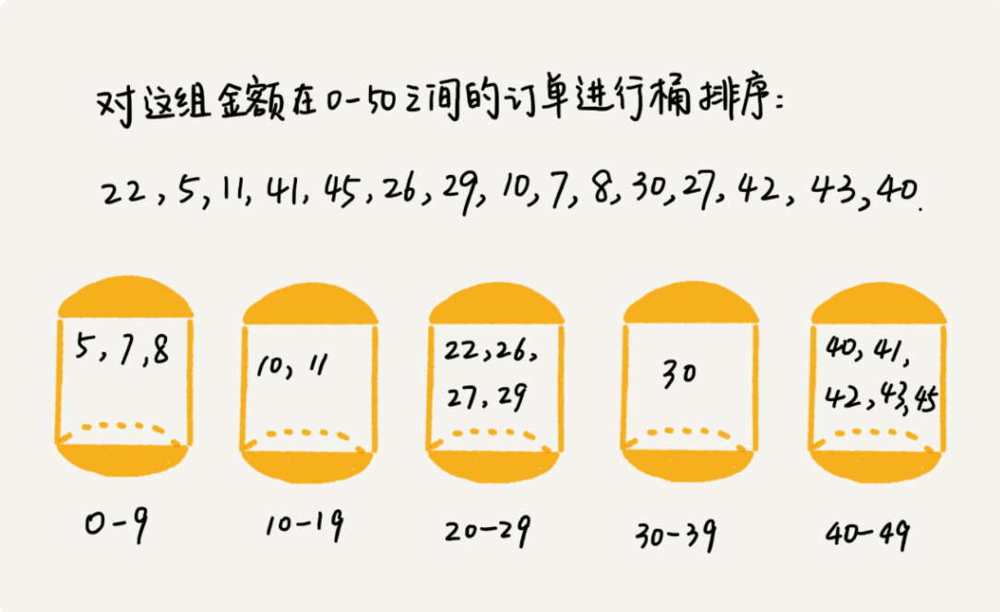

  要排序的数据需要很容易就能划分成 m 个桶，并且，桶与桶之间有着天然的大小顺序。这样每个桶内的数据都排序完之后，桶与桶之间的数据不需要再进行排序。

  其次，数据在各个桶之间的分布是比较均匀的。如果数据经过桶的划分之后，有些桶里的数据非常多，有些非常少，很不平均，那桶内数据排序的时间复杂度就不是常量级了。在极端情况下，如果数据都被划分到一个桶里，那就退化为 O(nlogn) 的排序算法了。

  **桶排序比较适合用在外部排序中。所谓的外部排序就是数据存储在外部磁盘中，数据量比较大，内存有限，无法将数据全部加载到内存中。**

  ```js
  function bucketSort(arr, bucketSize) {
    const { length: len } = arr;
    if (len === 0) return arr;

    let minValue = arr[0],
      maxValue = arr[0];
    // 找出最大最小值
    for (let i = 1; i < len; i++) {
      if (arr[i] < minValue) {
        minValue = arr[i];
      } else if (arr[i] > maxValue) {
        maxValue = arr[i];
      }
    }

    // 桶初始化
    let DEFAULT_BUCKET_SIZE = 5;
    bucketSize = bucketSize || DEFAULT_BUCKET_SIZE; // 桶容量
    const bucketCount = Math.floor((maxValue - minValue) / bucketSize) + 1; // 桶数量
    const buckets = new Array(bucketCount);
    for (let i = 0; i < bucketCount; i++) {
      buckets[i] = [];
    }

    // 利用映射函数将数据分配到各个桶中
    for (let i = 0; i < len; i++) {
      buckets[math.floor((arr[i] - minValue) / bucketSize)].push(arr[i]);
    }

    for (let i = 0; i < buckets.length; i++) {
      insertionSort(buckets[i]); // 对每个桶进行排序，这里使用了插入排序
      for (let j = 0; j < buckets[i].length; j++) {
        arr.push(buckets[i][j]);
      }
    }

    return arr;
  }
  ```

- 计数排序（Counting Sort）

  不是基于比较的排序算法，核心在于将输入的数据值转化为键存储在额外开辟的数组空间中。

  作为一种线性时间复杂度的排序，计数排序要求输入的数据必须是有确定范围的整数。

  > 场景：考生的满分是 900 分，最小是 0 分，这个数据的范围很小，所以我们可以分成 901 个桶，对应分数从 0 分到 900 分。根据考生的成绩，我们将这 50 万考生划分到这 901 个桶里。桶内的数据都是分数相同的考生，所以并不需要再进行排序。我们只需要依次扫描每个桶，将桶内的考生依次输出到一个数组中，就实现了 50 万考生的排序。因为只涉及扫描遍历操作，所以时间复杂度是 O(n)。

  > 计数排序只能用在数据范围不大的场景中，如果数据范围 k 比要排序的数据 n 大很多，就不适合用计数排序了。而且，计数排序只能给非负整数排序，如果要排序的数据是其他类型的，要将其在不改变相对大小的情况下，转化为非负整数。

  ```js
  /**
   * 1. 找出待排序的数组中最大和最小的元素；
   * 2. 统计数组中每个值为i的元素出现的次数，存入数组C的第i项；
   * 3. 对所有的计数累加（从C中的第一个元素开始，每一项和前一项相加）；
   * 4. 反向填充目标数组：将每个元素i放在新数组的第C(i)项，每放一个元素就将C(i)减去1。
   */
  function countingSort(arr: Array<number>) {
    const { length: len } = arr;
    if (len === 0) return arr;

    // 计算最大值
    let maxValue = arr[0];
    for(let i=1; i< len; i++) {
      if(maxValue < arr[i]) {
        maxValue = arr[i];
      }
    }

    const bucketCount = maxValue + 1;
    let buckets = new Array(bucketCount),

    // 统计数组中每个值为arr[i]的元素出现的次数
    for (let i = 0; i < len; i++) {
      const value = arr[i];
      if (!buckets[value]) {
        buckets[value] = 0; // 初始化计数
      }
      buckets[value]++;
    }

    // 依次累加
    for(let i=1; i< bucketCount; i++) {
      buckets[i] = buckets[i-1]+ buckets[i];
    }

    // 临时数组 r, 存储排序之后的结果
    let r = new Array(len)
    for(let i = len - 1; i >=0; i--) {
      const value = arr[i];
      const index = buckets[value] - 1; // 计算位置
      r[index] = value; //值存储到相应的位置
      buckets[value]--; // 值放到相应位置后，计数减一
    }

    // 将结果拷贝给 arr 数组
    for(let i=0; i< len; i++) {
      arr[i] = r[i];
    }

    return arr;
  }
  ```

- 基数排序（Radix Sort）

  按照低位先排序，然后收集；再按照高位排序，然后再收集；依次类推，直到最高位。有时候有些属性是有优先级顺序的，先按低优先级排序，再按高优先级排序。最后的次序就是高优先级高的在前，高优先级相同的低优先级高的在前。

  时间复杂度: 最好 O(n), 最坏 O(nlogn), 平均 O(n)

  空间复杂度: O(n+k)，其中 k 为桶的数量。一般来说 n>>k，因此额外空间需要大概 n 个左右

  稳定排序。

  > 场景： 有 10 万个手机号码，希望将这 10 万个手机号码从小到大排序

  > 场景： 排序牛津字典中的 20 万个英文单词，最短的只有 1 个字母，最长的有 45 个字母。我们可以把所有的单词补齐到相同长度，位数不够的可以在后面补“0”，因为根据 ASCII 值，所有字母都大于“0”，所以补“0”不会影响到原有的大小顺序。

  基数排序对要排序的数据是有要求的，需要可以分割出独立的“位”来比较，而且位之间有递进的关系，如果 a 数据的高位比 b 数据大，那剩下的低位就不用比较了。除此之外，每一位的数据范围不能太大，要可以用线性排序算法来排序，否则，基数排序的时间复杂度就无法做到 O(n) 了。

  ```js
  /**
   *
   * @params {maxDigit} 最大位数
   */
  function radixSort(arr, maxDigit) {
    let mod = 10,
      dev = 1;
    // 从低位到高位排序
    for (let i = 0; i < maxDigit; i++, dev *= 10, mod *= 10) {
      // 桶排序
      let counter = [];
      for (let j = 0; j < arr.length; j++) {
        const value = arr[j];
        // value % mod 得到后 i 位数， 再除以 dev 得到 倒数 i 位置的数
        const bucket = parseInt((value % mod) / dev);
        if (!counter[bucket]) {
          counter[bucket] = [];
        }
        counter[bucket].push(value);
      }
      // 回填基于低位排序后的数据，回填完成后继续循环高位排序
      let pos = 0;
      for (let j = 0, len = counter.length; j < len; j++) {
        let value = null;
        if (counter[j]) {
          while (!!(value = counter[j].shift())) {
            arr[pos++] = value;
          }
        }
      }
    }
    return arr;
  }
  ```

- 堆排序(Heap sort)

  - 构建大顶堆
  - 交换堆顶元素和最后一个叶子节点
  - 继续构建次大顶堆

  ```js
  function heapSort(arr) {
    let { length: len } = arr;

    buildMaxHeap(arr); // 构建大顶堆

    for (let i = len - 1; i > 0; i--) {
      swap(arr, 0, i); // 交换堆顶元素和最后一个叶子节点
      len--;
      heapify(arr, 0); // 继续构建次大顶堆
    }

    function buildMaxHeap(arr) {
      // 建立大顶堆
      for (let i = Math.floor(len / 2); i >= 0; i--) {
        heapify(arr, i);
      }
    }

    function heapify(arr, i) {
      // 堆调整
      const left = 2 * i + 1,
        right = 2 * i + 2;
      let largest = i;

      if (left < len && arr[left] > arr[largest]) {
        largest = left;
      }

      if (right < len && arr[right] > arr[largest]) {
        largest = right;
      }

      if (largest !== i) {
        swap(arr, i, largest);
        heapify(arr, largest);
      }
    }

    function swap(arr, i, j) {
      [arr[i], arr[j]] = [arr[j], arr[i]];
    }

    return arr;
  }
  ```

## 二分查找

- 一维数组查找

  ```js
  /**
   * 递归
   */
  function binarySearch(arr, target, start = 0, end = arr.length) {
    if (start > end) {
      return -1;
    }
    let midIndex = Math.floor((start + end) / 2);
    let mid = arr[midIndex];

    if (target === mid) {
      return midIndex;
    }

    if (target < mid) {
      return binarySearch(arr, target, 0, midIndex - 1);
    }

    if (target > mid) {
      return binarySearch(arr, target, midIndex + 1, end);
    }

    return -1;
  }
  ```

  ```js
  /**
   * 非递归
   */
  function binarySearch(arr, target) {
    let min = 0;
    let max = arr.length - 1;

    while (min <= max) {
      let mid = Math.floor((min + max) / 2);
      if (target < arr[mid]) {
        max = mid - 1;
      } else if (target > arr[mid]) {
        min = mid + 1;
      } else {
        return mid;
      }
    }
    return -1;
  }
  ```

- 旋转数组的最小数字

  ```js
  /**
   * 把一个数组最开始的若干个元素搬到数组的末尾，我们称之为数组的旋转。输入一个
   * 递增排序的数组的一个旋转，输出旋转数组的最小元素。例如，数组 [3,4,5,1,2]
   * 为 [1,2,3,4,5] 的一个旋转，该数组的最小值为1。
   */
  function minArray(numbers) {
    for (let i = 0, { length: len } = numbers; i < len; i++) {
      if (numbers[i] < numbers[0]) return numbers[i];
    }
    return numbers[0];
  }
  ```

  ```js
  /**
   * 把一个数组最开始的若干个元素搬到数组的末尾，我们称之为数组的旋转。输入一个
   * 递增排序的数组的一个旋转，输出旋转数组的最小元素。例如，数组 [3,4,5,1,2]
   * 为 [1,2,3,4,5] 的一个旋转，该数组的最小值为1。
   */
  function minArray(numbers) {
    let i = 0,
      j = numbers.length - 1;
    while (i < j) {
      const m = i + Math.floor((j - i) >> 1);
      if (numbers[m] > numbers[j]) {
        // m 在左排序数组
        i = m + 1;
      } else if (numbers[m] < numbers[j]) {
        // m 在右排序数组，此处不能 m-1, 可能会刚好错过旋转点
        j = m;
      } else {
        // numbers[m] === numbers[j]
        j--;
      }
    }
    return numbers[i];
  }
  ```

- 二维数组查找

  ```js
  var findNumberIn2DArray = function (matrix, target) {
    const { length: rows } = matrix;
    if (rows === 0 || matrix[0].length === 0) return false;

    let i = 0,
      j = matrix[i].length - 1;
    while (i < rows && j >= 0) {
      if (target < matrix[i][j]) {
        j--;
      } else if (target > matrix[i][j]) {
        i++;
      } else {
        return true;
      }
    }
    return false;
  };
  ```

  ```js
  /**
   * 在一个 n * m 的二维数组中，每一行都按照从左到右递增的顺序排序，每一列都按照从上到下递增的顺序排序。请完成一个函数，输入这样的一个二维数组和一个整数，判断数组中是否含有该整数。
   * @param {number[][]} matrix
   * @param {number} target
   * @return {boolean}
   * 给定 target = 5，返回 true。
   * 给定 target = 20，返回 false。
   * 时间复杂度： O(logk!), k = min(m, n)
   * 空间复杂度： O(1)
   */

  var matrix = [
    [1, 4, 7, 11, 15],
    [2, 5, 8, 12, 19],
    [3, 6, 9, 16, 22],
    [10, 13, 14, 17, 24],
    [18, 21, 23, 26, 30],
  ];

  var findNumberIn2DArray = function (matrix, target) {
    const { length: n } = matrix; // 行
    const { length: m } = matrix[0] || []; // 列

    if (m === 0 || matrix[0][0] > target || matrix[n - 1][m - 1] < target)
      return false;

    for (let i = 0, minLen = Math.min(n, m); i < minLen; i++) {
      const vFound = binarySearch(matrix, target, i, true); // 垂直方向是否找到
      const hFound = binarySearch(matrix, target, i, false); // 水平是否找到
      if (vFound || hFound) {
        return true;
      }
    }
    return false;

    function binarySearch(matrix, target, start, vertical) {
      let low = start,
        high = vertical ? matrix.length - 1 : matrix[0].length - 1;
      while (low <= high) {
        let mid = Math.floor(low + ((high - low) >> 1));
        let val = vertical ? matrix[mid][start] : matrix[start][mid];
        if (vertical) {
          if (val === target) {
            return true;
          } else if (val > target) {
            high = mid - 1;
          } else {
            low = mid + 1;
          }
        } else {
          if (val === target) {
            return true;
          } else if (val > target) {
            high = mid - 1;
          } else {
            low = mid + 1;
          }
        }
      }
    }
  };
  ```

- 数值的整数次方

  实现函数 `myPow(base, exponent)`，求 base 的 exponent 次方。不得使用库函数，同时不需要考虑大数问题。

  ```js
  /**
   * 二分法
   */
  function myPow(x, n) {
    if (n === 0) return 1;
    if (n === 1) return x;
    if (n < 0) return 1 / myPow(x, -n);

    if (n % 2 === 1) return x * myPow(x, n - 1);
    return myPow(x * x, n / 2);
  }
  ```

## 跳表

动态数据结构，可以支持快速的插入、删除、查找操作。Redis 中的有序集合（Sorted Set）就是用跳表来实现的。

链表加多级索引的结构，就是跳表。

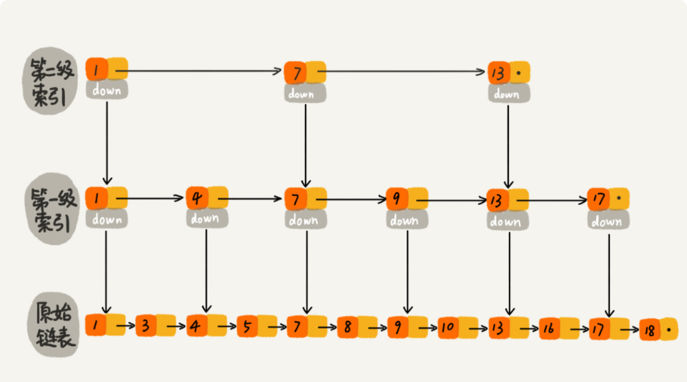

时间复杂度：O(mlogn)， m 是每一次遍历的节点个数（一般 m 很小可以忽略）， logn 是总层数

空间复杂度：O(n)

每 k 个节点抽取一个索引节点个数，k 越大，占用的空间越小。在实际开发中，原始链表中存储的有可能是很大的对象，而索引节点只需要存储关键值和几个指针，并不需要存储对象，所以当对象比索引节点大很多时，那索引占用的额外空间就可以忽略。

当链表的长度 n 比较大时，比如 1000、10000 的时候，在构建索引之后，查找效率的提升就会非常明显。

- 插入数据

  查找某个数据应该插入的位置，复杂度 O(logn)，插入节点的时间复杂度 O(1)

- 删除数据

  如果这个结点在索引中也有出现，我们除了要删除原始链表中的结点，还要删除索引中的。因为单链表中的删除操作需要拿到要删除结点的前驱结点，然后通过指针操作完成删除。所以在查找要删除的结点的时候，一定要获取前驱结点。当然，如果我们用的是双向链表，就不需要考虑这个问题了。

- 跳表索引动态更新

  当我们不停地往跳表中插入数据时，如果我们不更新索引，就有可能出现某 2 个索引结点之间数据非常多的情况。极端情况下，跳表还会退化成单链表。

  当我们往跳表中插入数据的时候，我们可以选择同时将这个数据插入到部分索引层中。我们通过一个随机函数，来决定将这个结点插入到哪几级索引中，比如随机函数生成了值 K，那我们就将这个结点添加到第一级到第 K 级这 K 级索引中

  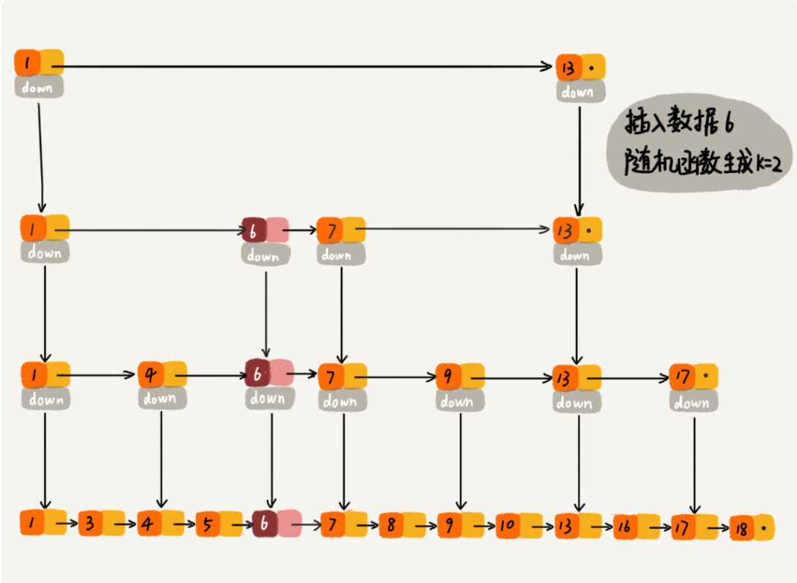

## 散列表（Hash Table）

散列表用的是数组支持按照下标随机访问数据的特性，所以散列表其实就是数组的一种扩展，由数组演化而来。可以说，如果没有数组，就没有散列表。

假如我们有 89 名选手参加学校运动会。为了方便记录成绩，每个选手胸前都会贴上自己的参赛号码。这 89 名选手的编号依次是 1 到 89。参赛编号不能设置得这么简单，要加上年级、班级这些更详细的信息，所以我们把编号的规则稍微修改了一下，用 6 位数字来表示。比如 051167。

参赛选手的编号我们叫作**键**（key）或者**关键字**。我们用它来标识一个选手。

把参赛编号转化为数组下标的映射方法就叫作**散列函数**（或“Hash 函数”、“哈希函数”）

散列函数计算得到的值就叫作**散列值**（或“Hash 值”、“哈希值”）。

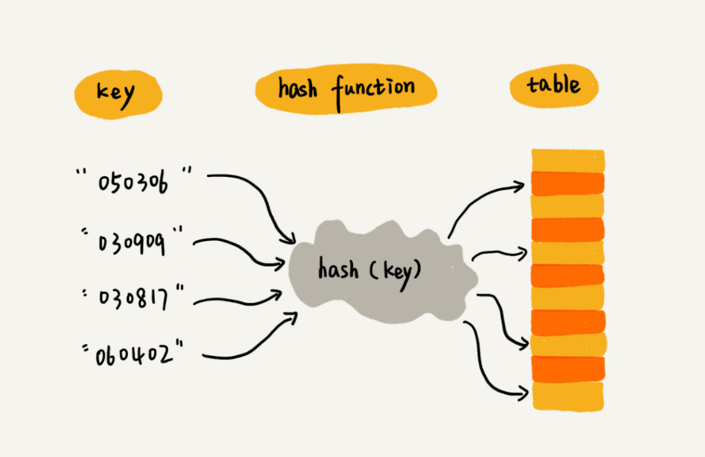

散列表用的就是数组支持按照下标随机访问的时候，时间复杂度是 O(1) 的特性。我们通过散列函数把元素的键值映射为下标，然后将数据存储在数组中对应下标的位置。当我们按照键值查询元素时，我们用同样的散列函数，将键值转化数组下标，从对应的数组下标的位置取数据。

- 散列函数

  三点散列函数设计的基本要求：

  - 散列函数计算得到的散列值是一个非负整数
  - 如果 key1 = key2，那 hash(key1) == hash(key2)
  - 如果 key1 ≠ key2，那 hash(key1) ≠ hash(key2)

    - 要想找到一个不同的 key 对应的散列值都不一样的散列函数，几乎是不可能的。即便像业界著名的 MD5、SHA、CRC 等哈希算法，也无法完全避免这种**散列冲突**。而且，因为数组的存储空间有限，也会加大散列冲突的概率。几乎无法找到一个完美的无冲突的散列函数

  - 散列函数的设计不能太复杂

    过于复杂的散列函数，势必会消耗很多计算时间，也就间接的影响到散列表的性能

  - 散列函数生成的值要尽可能随机并且均匀分布

    这样才能避免或者最小化散列冲突，而且即便出现冲突，散列到每个槽里的数据也会比较平均，不会出现某个槽内数据特别多的情况。

- 散列冲突

  再好的散列函数也无法避免散列冲突。

  常用的散列冲突解决方法有两类：

  - 开放寻址法（open addressing）

    如果出现了散列冲突，我们就重新探测一个空闲位置，将其插入。

    - 优点：

      - 散列表中的数据都存储在数组中，可以有效地利用 CPU 缓存加快查询速度。
      - 这种方法实现的散列表，序列化起来比较简单。

    - 缺点：

      - 删除数据的时候比较麻烦，需要特殊标记已经删除掉的数据
      - 所有的数据都存储在一个数组中，比起链表法来说，冲突的代价更高
      - 使用开放寻址法解决冲突的散列表，装载因子的上限不能太大。这也导致这种方法比链表法更浪费内存空间

    - 方法

      - 线性探测

        当我们往散列表中**插入数据**时，如果某个数据经过散列函数散列之后，存储位置已经被占用了，我们就从当前位置开始，依次往后查找，看是否有空闲位置，直到找到为止。（如果遍历到尾部没有找到空闲位置，再从表头开始找，直到找到空闲位置）

        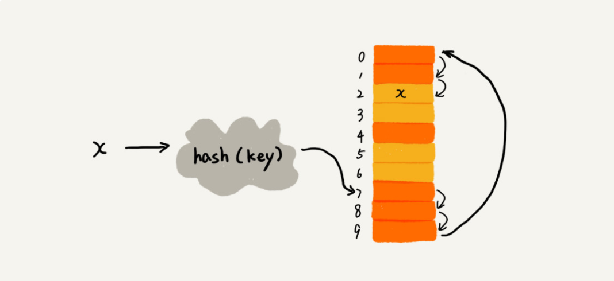

        **查找**元素的过程有点儿类似插入过程。通过散列函数求出要查找元素的键值对应的散列值，然后比较数组中下标为散列值的元素和要查找的元素。如果相等，则说明就是我们要找的元素；否则就顺序往后依次查找。如果遍历到数组中的空闲位置，还没有找到，就说明要查找的元素并没有在散列表中。

        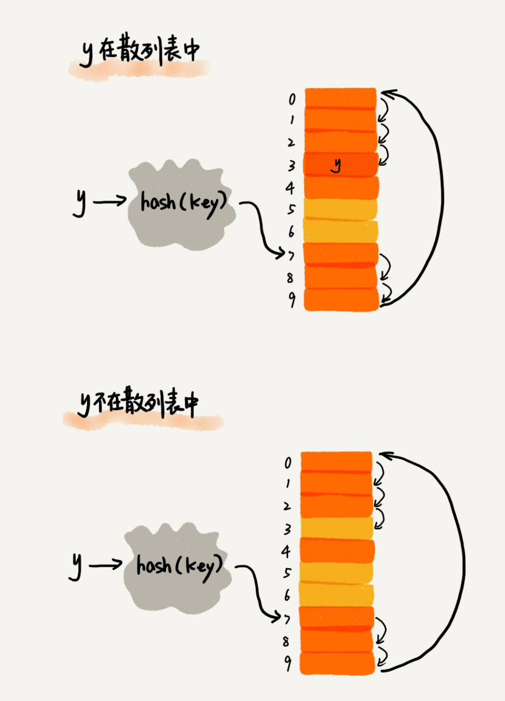

        将**删除**的元素，特殊标记为 deleted。当线性探测查找的时候，遇到标记为 deleted 的空间，并不是停下来，而是继续往下探测。

        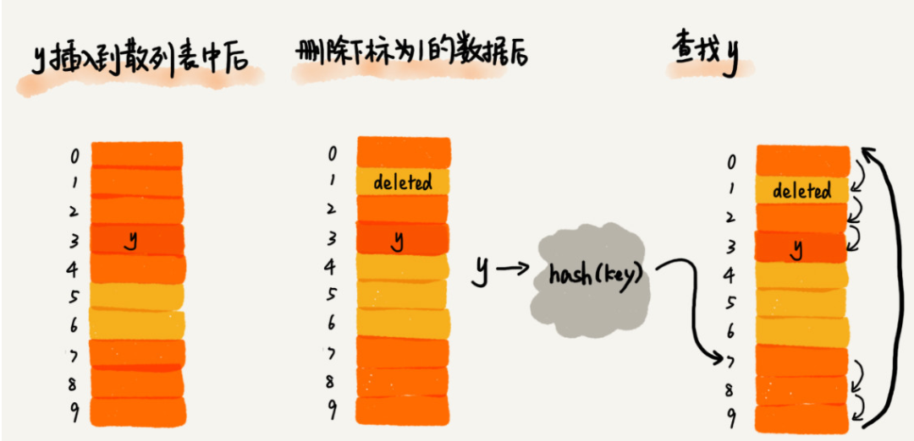

        当散列表中插入的数据越来越多时，散列冲突发生的可能性就会越来越大，空闲位置会越来越少，线性探测的时间就会越来越久。极端情况下，我们可能需要探测整个散列表，所以最坏情况下的时间复杂度为 O(n)。同理，在删除和查找时，也有可能会线性探测整张散列表，才能找到要查找或者删除的数据。

      - 二次探测（Quadratic probing）

        二次探测探测的步长就变成了原来的“二次方”，也就是说，它探测的下标序列就是 hash(key)+0，hash(key)+12，hash(key)+22…

      - 双重散列（Double hashing）

        使用一组散列函数 hash1(key)，hash2(key)，hash3(key)……我们先用第一个散列函数，如果计算得到的存储位置已经被占用，再用第二个散列函数，依次类推，直到找到空闲的存储位置。

    不管采用哪种探测方法，当散列表中空闲位置不多的时候，散列冲突的概率就会大大提高。为了尽可能保证散列表的操作效率，一般情况下，我们会尽可能保证散列表中有一定比例的空闲槽位。我们用**装载因子（load factor）**来表示空位的多少。

    `散列表的装载因子=填入表中的元素个数/散列表的长度`

    装载因子越大，说明空闲位置越少，冲突越多，散列表的性能会下降。

    当数据量比较小、装载因子小的时候，适合采用开放寻址法

  - 链表法（chaining）

    在散列表中，每个“桶（bucket）”或者“槽（slot）”会对应一条链表，所有散列值相同的元素我们都放到相同槽位对应的链表中。

    当插入的时候，我们只需要通过散列函数计算出对应的散列槽位，将其插入到对应链表中即可，所以插入的时间复杂度是 O(1)。当查找、删除一个元素时，我们同样通过散列函数计算出对应的槽，然后遍历链表查找或者删除。

    查找、删除操作的时间复杂度跟链表的长度 k 成正比，也就是 O(k)。对于散列比较均匀的散列函数来说，理论上讲，k=n/m，其中 n 表示散列中数据的个数，m 表示散列表中“槽”的个数。

    - 优点

      - 链表法对内存的利用率比开放寻址法要高。链表结点可以在需要的时候再创建，并不需要像开放寻址法那样事先申请好。

      - 链表法比起开放寻址法，对大装载因子的容忍度更高。

        只要散列函数的值随机均匀，即便装载因子变成 10，也就是链表的长度变长了而已，虽然查找效率有所下降，但是比起顺序查找还是快很多。

    - 缺点

      - 链表因为要存储指针，所以对于比较小的对象的存储，是比较消耗内存的，还有可能会让内存的消耗翻倍。

        如果我们存储的是大对象，也就是说要存储的对象的大小远远大于一个指针的大小（4 个字节或者 8 个字节），那链表中指针的内存消耗在大对象面前就可以忽略了

      - 因为链表中的结点是零散分布在内存中的，不是连续的，所以对 CPU 缓存是不友好的

    将链表法中的链表改造为其他高效的动态数据结构，比如跳表、红黑树。这样，即便出现散列冲突，极端情况下，所有的数据都散列到同一个桶内，那最终退化成的散列表的查找时间也只不过是 O(logn)。这样也就有效避免了前面讲到的散列碰撞攻击。

    基于链表的散列冲突处理方法比较适合存储大对象、大数据量的散列表，而且，比起开放寻址法，它更加灵活，支持更多的优化策略，比如用红黑树代替链表

- 场景

  - Word 文档中单词拼写检查功能是如何实现的？

    常用的英文单词有 20 万个左右，假设单词的平均长度是 10 个字母，平均一个单词占用 10 个字节的内存空间，那 20 万英文单词大约占 2MB 的存储空间，就算放大 10 倍也就是 20MB。对于现在的计算机来说，这个大小完全可以放在内存里面。所以我们可以用散列表来存储整个英文单词词典。

    当用户输入某个英文单词时，我们拿用户输入的单词去散列表中查找。如果查到，则说明拼写正确；如果没有查到，则说明拼写可能有误，给予提示。借助散列表这种数据结构，我们就可以轻松实现快速判断是否存在拼写错误。

  - LRU 缓存淘汰算法

    维护一个按照访问时间从大到小有序排列的链表结构。因为缓存大小有限，当缓存空间不够，需要淘汰一个数据的时候，我们就直接将链表头部的结点删除。

    当要缓存某个数据的时候，先在链表中查找这个数据。如果没有找到，则直接将数据放到链表的尾部；如果找到了，我们就把它移动到链表的尾部。因为查找数据需要遍历链表，所以单纯用链表实现的 LRU 缓存淘汰算法的时间复杂很高，是 O(n)。

    如果我们将散列表和链表两种数据结构组合使用，可以将添加、删除、查找操作的时间复杂度都降低到 O(1)。

    

    我们的散列表是通过链表法解决散列冲突的，所以每个结点会在两条链中。一个链是刚刚我们提到的双向链表，另一个链是散列表中的拉链。前驱和后继指针是为了将结点串在双向链表中，hnext 指针是为了将结点串在散列表的拉链中。

    散列表中查找数据的时间复杂度接近 O(1)，所以通过散列表，我们可以很快地在缓存中找到一个数据。当找到数据之后，我们还需要将它移动到双向链表的尾部。

    我们来看如何删除一个数据。我们需要找到数据所在的结点，然后将结点删除。借助散列表，我们可以在 O(1) 时间复杂度里找到要删除的结点。因为我们的链表是双向链表，双向链表可以通过前驱指针 O(1) 时间复杂度获取前驱结点，所以在双向链表中，删除结点只需要 O(1) 的时间复杂度。

    最后，我们来看如何添加一个数据。添加数据到缓存稍微有点麻烦，我们需要先看这个数据是否已经在缓存中。如果已经在其中，需要将其移动到双向链表的尾部；如果不在其中，还要看缓存有没有满。如果满了，则将双向链表头部的结点删除，然后再将数据放到链表的尾部；如果没有满，就直接将数据放到链表的尾部。

    这整个过程涉及的查找操作都可以通过散列表来完成。其他的操作，比如删除头结点、链表尾部插入数据等，都可以在 O(1) 的时间复杂度内完成。所以，这三个操作的时间复杂度都是 O(1)。至此，我们就通过散列表和双向链表的组合使用，实现了一个高效的、支持 LRU 缓存淘汰算法的缓存系统原型。

  - LinkedHashMap

    通过双向链表和散列表这两种数据结构组合实现的。LinkedHashMap 中的“Linked”实际上是指的是双向链表，并非指用链表法解决散列冲突。

- 散列表碰撞攻击

  在极端情况下，有些恶意的攻击者，还有可能通过精心构造的数据，使得所有的数据经过散列函数之后，都散列到同一个槽里。如果我们使用的是基于链表的冲突解决方法，那这个时候，散列表就会退化为链表，查询的时间复杂度就从 O(1) 急剧退化为 O(n)。

  如果散列表中有 10 万个数据，退化后的散列表查询的效率就下降了 10 万倍。这样就有可能因为查询操作消耗大量 CPU 或者线程资源，导致系统无法响应其他请求，从而达到拒绝服务攻击（DoS）的目的。

- 为什么散列表和链表经常会一起使用

  散列表这种数据结构虽然支持非常高效的数据插入、删除、查找操作，但是散列表中的数据都是通过散列函数打乱之后无规律存储的。也就说，它无法支持按照某种顺序快速地遍历数据。如果希望按照顺序遍历散列表中的数据，那我们需要将散列表中的数据拷贝到数组中，然后排序，再遍历。因为散列表是动态数据结构，不停地有数据的插入、删除，所以每当我们希望按顺序遍历散列表中的数据的时候，都需要先排序，那效率势必会很低。为了解决这个问题，我们将散列表和链表（或者跳表）结合在一起使用。

## 哈希算法

将任意长度的二进制值串映射为固定长度的二进制串，这个映射规则就是**哈希算法**。通过原始数据映射之后得到的二进制值串就是**哈希值**。

- 哈希算法需要满足的几点要求：

  - 从哈希值不能反向推导出原始数据（所以哈希算法也叫单向哈希算法）。
  - 对输入的数据非常敏感，哪怕原始数据只修改一个 Bit，最后的到的哈希值也大不相同。
  - 散列冲突的概率要很小，对于不同的原始数据，哈希值相同的概率非常小。
  - 哈希算法的执行效率要尽量高效，针对较长的文本，也能快速的计算出哈希值。

- 为什么哈希算法无法做到零冲突？（**鸽巢原理（也叫抽屉原理）**）

  - 哈希算法产生的哈希值的长度是固定且有限的

    MD5 的例子，哈希值是固定的 128 位二进制串，能表示的数据是有限的，最多能表示 2^128 个数据，而我们要哈希的数据是无穷的

    一般情况下，哈希值越长的哈希算法，散列冲突的概率越低。

- 应用场景

  - 安全加密

    - 最常用于加密的哈希算法是 MD5（MD5 Message-Digest Algorithm，MD5 消息摘要算法）和 SHA（Secure Hash Algorithm，安全散列算法）。

    - 还有很多其他加密算法，比如 DES（Data Encryption Standard，数据加密标准）、AES（Advanced Encryption Standard，高级加密标准）。

  - 唯一标识（对大数据做信息摘要）

    查找相同图片，拿要查找的图片的二进制码串与图库中所有图片的二进制码串一一比对，比对起来非常耗时。可以给每个图片取一个唯一标识（信息摘要），把每个图片标识和图片文件在图库中的路径信息都存储在散列表中。当要查看某个图片是不是在图库中的时候，我们先通过哈希算法对这个图片取唯一标识，然后在散列表中查找是否存在这个唯一标识。如果不存在，那就说明这个图片不在图库中；如果存在，我们再通过散列表中存储的文件路径，获取到这个已经存在的图片，跟现在要插入的图片做全量的比对，看是否完全一样。如果一样，就说明已经存在；如果不一样，说明两张图片尽管唯一标识相同，但是并不是相同的图片。

  - 数据校验（校验文件块的安全、正确、完整）

    BT 下载的原理是基于 P2P 协议的。我们从多个机器上并行下载一个 2GB 的电影，这个电影文件可能会被分割成很多文件块（比如可以分成 100 块，每块大约 20MB）。等所有的文件块都下载完成之后，再组装成一个完整的电影文件就行了。

    通过哈希算法，对 100 个文件块分别取哈希值，并且保存在种子文件中。当文件块下载完成之后，我们可以通过相同的哈希算法，对下载好的文件块逐一求哈希值，然后跟种子文件中保存的哈希值比对。如果不同，说明这个文件块不完整或者被篡改了，需要再重新从其他宿主机器上下载这个文件块。

  - 散列函数

    散列函数也是哈希算法的一种应用。散列函数对于散列算法冲突的要求要低很多。即便出现个别散列冲突，只要不是过于严重，我们都可以通过开放寻址法或者链表法解决。

    散列函数中用到的散列算法，更加关注散列后的值是否能平均分布。

  - 负载均衡

    我们可以通过哈希算法，对客户端 IP 地址或者会话 ID 计算哈希值，将取得的哈希值与服务器列表的大小进行取模运算，最终得到的值就是应该被路由到的服务器编号。

  - 数据分片

    我们可以先对数据进行分片，然后采用多台机器处理的方法，来提高处理速度。通过哈希函数计算哈希值，然后再跟 n 取模，最终得到的值，就是应该被分配到的机器编号。哈希值相同的搜索关键词就被分配到了同一个机器上。

    借助这种分片的思路，可以突破单机内存、CPU 等资源的限制。

  - 分布式存储

    通过哈希算法对数据取哈希值，然后对机器个数取模，扩容时所有的数据都要重新计算哈希值，然后重新搬移到正确的机器上。这样就相当于，缓存中的数据一下子就都失效了。所有的数据请求都会穿透缓存，直接去请求数据库。这样就可能发生雪崩效应，压垮数据库。

    **一致性哈希算法**

- 字典攻击

  用户信息被“脱库”，黑客虽然拿到是加密之后的密文，但可以通过“猜”的方式来破解密码。

  需要维护一个常用密码的字典表，把字典中的每个密码用哈希算法计算哈希值，然后拿哈希值跟脱库后的密文比对。如果相同，基本上就可以认为，这个加密之后的密码对应的明文就是字典中的这个密码。

  针对字典攻击，我们可以引入一个盐（salt），跟用户的密码组合在一起，增加密码的复杂度。

  安全和攻击是一种博弈关系，不存在绝对的安全。所有的安全措施，只是增加攻击的成本而已。

## 二叉树

### 树

- 根节点
- 叶子节点
- 父节点
- 子节点
- 兄弟节点
- 高度
- 深度
- 层（level)

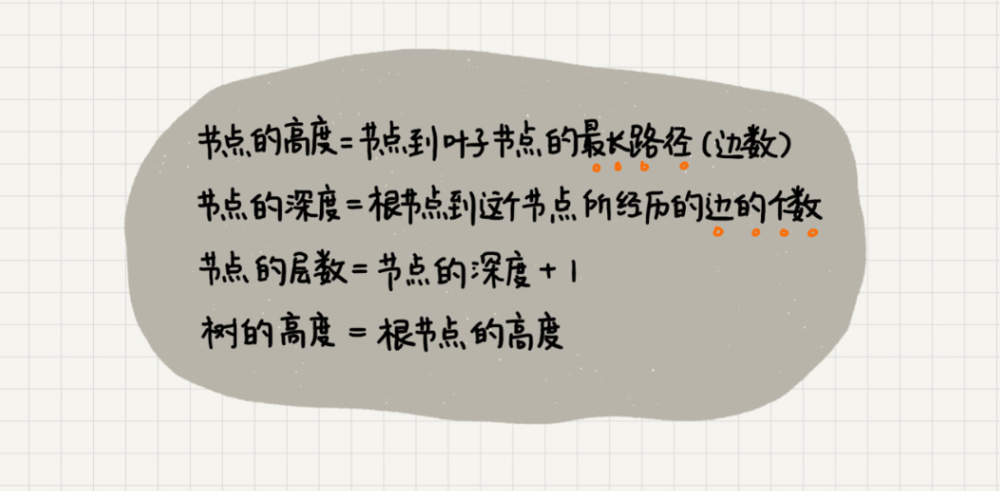

### 二叉树（Binary Tree）

每个节点最多有两个“叉”，也就是两个子节点，分别是左子节点和右子节点。

- 满二叉树

  叶子节点全都在最底层，除了叶子节点之外，每个节点都有左右两个子节点，这种二叉树就叫作满二叉树。

- 完全二叉树

  叶子节点都在最底下两层，最后一层的叶子节点都靠左排列，并且除了最后一层，其他层的节点个数都要达到最大，这种二叉树叫作完全二叉树。

- 存储一棵二叉树：

  - 基于指针或者引用的二叉链式存储法

    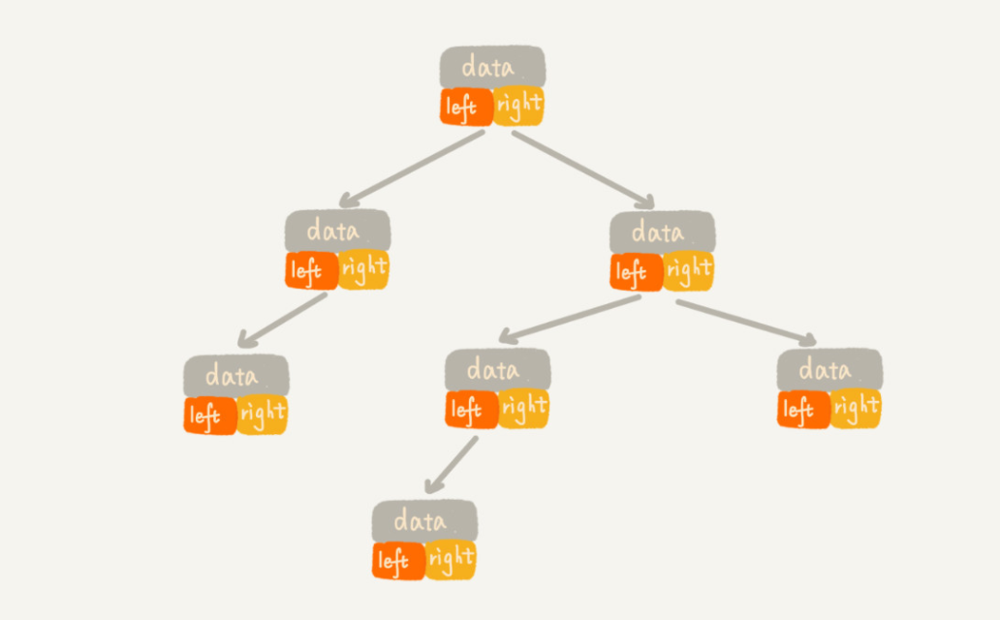

  - 基于数组的顺序存储法

    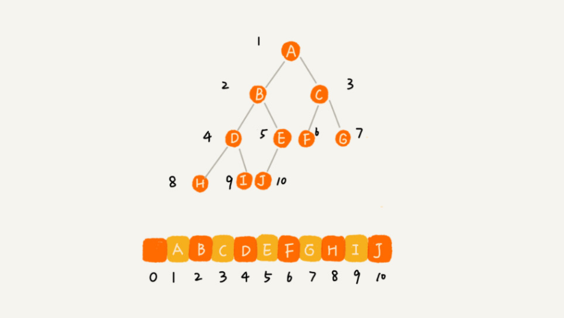

    如果某棵二叉树是一棵完全二叉树，那用数组存储无疑是最节省内存的一种方式。如果是非完全二叉树，其实会浪费比较多的数组存储空间。

    堆其实就是一种完全二叉树，最常用的存储方式就是数组。

- 二叉树的遍历

  > 前、中、后序，表示的是节点与它的左右子树节点遍历打印的先后顺序。

  > 时间复杂度： O(n)

  - 前序遍历

    先打印这个节点，然后再打印它的左子树，最后打印它的右子树。

    `preOrder(r) = print r -> preOrder(r -> left) -> preOrder(r -> right)`

    ```js
    function preOrder(root) {
      if (root === null) return;
      console.log(root.data);
      preOrder(root.left);
      preOrder(root.right);
    }
    ```

  - 中序遍历

    先打印它的左子树，然后再打印它本身，最后打印它的右子树。

    `inOrder(r) = inOrder(r -> left) -> print r -> inOrder(r -> right)`

    ```js
    function inOrder(root) {
      if (root === null) return;
      inOrder(root.left);
      console.log(root.data);
      inOrder(root.right);
    }
    ```

  - 后续遍历

    先打印它的左子树，然后再打印它的右子树，最后打印这个节点本身。

    `postOrder(r) = postOrder(r -> left) -> postOrder(r -> right) -> print r`

    ```js
    function postOrder(root) {
      if (root === null) return;
      postOrder(root.left);
      postOrder(root.right);
      console.log(root.data);
    }
    ```

  - 层次遍历(广度优先搜索 BFS-- 通常借助 队列 的先入先出特性来实现)

    ```js
    /**
     * 一起输出
     */
    function levelOrder(root) {
      if (root === null) return;
      let queue = [root];
      while (queue.length) {
        const curNode = queue.shift();
        console.log(curNode.data);
        if (curNode.left !== null) {
          queue.push(curNode.left);
        }
        if (curNode.right !== null) {
          queue.push(curNode.right);
        }
      }
    }
    ```

    ```js
    /**
     * 分层输出
     */
    function levelOrder(root) {
      if (root === null) return [];
      let queue = [root],
        res = [];
      while (queue.length) {
        let tmp = [];
        for (let i = 0, { length: len } = queue; i < len; i++) {
          const curNode = queue.shift();
          tmp.push(curNode.data);
          if (curNode.left !== null) {
            queue.push(curNode.left);
          }
          if (curNode.right !== null) {
            queue.push(curNode.right);
          }
        }
        res.push(tmp);
      }
      return res;
    }

    function levelOrder(root) {
      if (root === null) return [];
      let queue = [root],
        res = [];
      while (queue.length) {
        let tmp = [];
        let { length: levelNum } = queue;
        while (levelNum--) {
          const curNode = queue.shift();
          tmp.push(curNode.data);
          if (curNode.left !== null) {
            queue.push(curNode.left);
          }
          if (curNode.right !== null) {
            queue.push(curNode.right);
          }
        }

        res.push(tmp);
      }
      return res;
    }
    ```

- 重建二叉树

  输入某二叉树的前序遍历和中序遍历的结果，请重建该二叉树。假设输入的前序遍历和中序遍历的结果中都不含重复的数字。

  ```js
  /**
   * 递归
   * 前序遍历 preOrder = [3,9,20,15,7]
   * 中序遍历 inOrder = [9,3,15,20,7]
   *
   * function TreeNode(val) {
   *     this.val = val;
   *     this.left = this.right = null;
   * }
   *
   * @param {number[]} preOrder
   * @param {number[]} inOrder
   * @return {TreeNode}
   */
  function TreeNode(val) {
    this.val = val;
    this.left = this.right = null;
  }

  var buildBTree = function (
    preOrder,
    preOrderStart,
    preOrderEnd,
    inOrder,
    inOrderStart,
    inOrderEnd
  ) {
    if (typeof preOrderStart !== "number") {
      preOrderStart = 0;
      preOrderEnd = preOrder.length - 1;
      inOrderStart = 0;
      inOrderEnd = inOrder.length - 1;
    }
    if (
      preOrder.length === 0 ||
      inOrder.length === 0 ||
      preOrderStart > preOrderEnd ||
      inOrderStart > inOrderEnd
    ) {
      return null;
    }

    const val = preOrder[preOrderStart];
    let node = new TreeNode(val);
    let idx = inOrder.indexOf(val);
    node.left = buildBTree(
      preOrder,
      preOrderStart + 1,
      preOrderStart + (idx - inOrderStart) /* 左子树的个数 */,
      inOrder,
      inOrderStart,
      idx - 1
    );
    node.right = buildBTree(
      preOrder,
      preOrderStart + (idx - inOrderStart) /* 左子树的个数 */ + 1,
      preOrderEnd,
      inOrder,
      idx + 1,
      inOrderEnd
    );
    return node;
  };
  ```

  ```js
  /**
   * 迭代
   * 前序遍历 preOrder = [3,9,20,15,7]
   * 中序遍历 inOrder = [9,3,15,20,7]
   *
   * function TreeNode(val) {
   *     this.val = val;
   *     this.left = this.right = null;
   * }
   *
   * @param {number[]} preOrder
   * @param {number[]} inOrder
   * @return {TreeNode}
   */
  function TreeNode(val) {
    this.val = val;
    this.left = this.right = null;
  }

  var buildBTree = function (preOrder, inOrder) {
    if (preOrder.length === 0 || inOrder.length === 0) {
      return null;
    }
    let root = new TreeNode(preOrder[0]);
    let stack = [root];
    let inOrderIndex = 0;
    for (let i = 1, { length: len } = preOrder; i < len; i++) {
      const preOrderVal = preOrder[i];
      let node = stack.pop();
      stack.push(node);
      if (node.val !== inOrder[inOrderIndex]) {
        node.left = new TreeNode(preOrderVal);
        stack.push(node.left);
      } else {
        let _node;
        while (
          stack.length &&
          stack.push((_node = stack.pop())) &&
          _node.val === inOrder[inOrderIndex]
        ) {
          node = stack.pop();
          inOrderIndex++;
        }
        node.right = new TreeNode(preOrderVal);
        stack.push(node.right);
      }
    }
    return root;
  };
  ```

- 输入两棵二叉树 A 和 B，判断 B 是不是 A 的子结构。(约定空树不是任意一个树的子结构。B 是 A 的子结构， 即 A 中有出现和 B 相同的结构和节点值。)

  ```js
  function TreeNode(val) {
    this.val = val;
    this.left = this.right = null;
  }
  /**
   * @param {TreeNode} A
   * @param {TreeNode} B
   * @return {boolean}
   */
  function isSubStructure(A, B) {
    if (B === null || A === null) return false;
    return (
      recur(A, B) || isSubStructure(A.left, B) || isSubStructure(A.right, B)
    );
  }

  function recur(A, B) {
    if (B === null) return true;
    if (A === null || A.val !== B.val) return false;
    return recur(A.left, B.left) && recur(A.right, B.right);
  }
  ```

- 输入一个二叉树，输出它的镜像(左右子树互换)

  ```js
  function TreeNode(val) {
    this.val = val;
    this.left = this.right = null;
  }
  /**
   * 递归
   *
   */
  function mirrorTree(root) {
    if (root === null) return null;
    let temp = root.left;
    root.left = mirrorTree(root.right);
    root.right = mirrorTree(temp);
    return root;
  }
  /**
   * 辅助栈(迭代法)
   *
   */
  function mirrorTree(root) {
    if (root === null) return null;
    let stack = [root];
    while (stack.length) {
      let node = stack.pop();
      if (node.left !== null) stack.push(node.left);
      if (node.right !== null) stack.push(node.right);
      let temp = node.left;
      node.left = node.right;
      node.right = temp;
    }
    return root;
  }
  ```

- 判断一棵二叉树是否对称。（如果一棵二叉树和它的镜像一样，那么他是对称的）

  ```js
  function TreeNode(val) {
    this.val = val;
    this.left = this.right = null;
  }

  /**
   * 递归
   *
   */
  function isSymmetric(root) {
    return root === null ? true : recur(root.left, root.right);
  }

  function recur(left, right) {
    if (left === null && right === null) return true;
    if (left === null || right === null || left.val !== right.val) return false;
    return recur(left.left, right.right) && recur(left.right, right.left);
  }
  ```

- 二叉树中和为某一值的路径

  输入一棵二叉树和一个整数，打印出二叉树中节点值的和为输入整数的所有路径。从树的根节点开始往下一直到叶节点所经过的节点形成一条路径。

  ```js
  function pathSum(root, sum) {
    let res = [];

    _pathSum(root, sum);
    return res;

    function _pathSum(root, sum, path = []) {
      if (root === null) return;
      path = path.concat(root.val);
      sum -= root.val;
      if (sum === 0 && root.left === null && root.right === null) {
        res.push(path);
        return;
      }
      _pathSum(root.left, sum, path);
      _pathSum(root.right, sum, path);
    }
  }
  ```

- 序列化二叉树

  请实现两个函数，分别用来序列化和反序列化二叉树。

  ```js

  function TreeNode(val) {
    this.val = val;
    this.left = this.right = null;
  }
  /**
   * Encodes a tree to a single string.
   *
   * @param {TreeNode} root
   * @return {string}
   */
  function serialize(root) {
    if(!root) return '[]'

    let res = '['
    let queue = [root];
    while(queue.length) {
      let node = queue.shift();
      if(node) {
        res += node.val;
        queue.push(node.left);
        queue.push(node.right);
      }else {
        res += 'null'
      }
      res += ','
    }
    res = res.substring(0, res.length - 1); // 去掉末尾的,
    res += ']'
    return res;
  }
  /**
    * Decodes your encoded data to tree.
    *
    * @param {string} data
    * @return {TreeNode}
    */
  deserialize(data) {
    if(data === '[]') return null;
    const vals = data.substring(1, data.length -1).split(',')
    let root = new TreeNode(vals[0] == 'null' ? vals[0] : +vals[0]);
    let queue = [root];
    let i = 1;
    while(queue.length) {
      const node = queue.shift();
      if(vals[i] !== 'null') {
        node.left = new TreeNode(+vals[i]);
        queue.push(node.left);
      }
      i++;
      if(vals[i] !== 'null') {
        node.right = new TreeNode(+vals[i])
        queue.push(node.right)
      }
      i++;
    }
    return root;
  }

  ```

### 二叉查找树（Binary Search Tree）

二叉查找树要求，在树中的任意一个节点，其左子树中的每个节点的值，都要小于这个节点的值，而右子树节点的值都大于这个节点的值。

- 查找

  先取根节点，如果它等于我们要查找的数据，那就返回。如果要查找的数据比根节点的值小，那就在左子树中递归查找；如果要查找的数据比根节点的值大，那就在右子树中递归查找。

  ```js
  class Node<T>{
    private data: T;
    private left: Node;
    private right: Node;

    constructor(data: T) {
      this.data = data;
    }
  }

  class BinarySearchTree<T> {
    private tree: Node<T>;

    constructor(tree: Node) {
      this.tree = tree;
    }

    public find(data: T) {
      let p = tree;
      while(p !== null) {
        if(data < p.data) p = p.left;
        else if(data > p.data) p = p.right;
        else return p;
      }
      return null;
    }
  }
  ```

- 插入

  从根节点开始，依次比较要插入的数据和节点的大小关系。如果要插入的数据比节点的数据大，并且节点的右子树为空，就将新数据直接插到右子节点的位置；如果不为空，就再递归遍历右子树，查找插入位置。同理，如果要插入的数据比节点数值小，并且节点的左子树为空，就将新数据插入到左子节点的位置；如果不为空，就再递归遍历左子树，查找插入位置。

  ```js
  class BinarySearchTree<T> {
    public insert(data: T) {
      if(tree === null) {
        tree = new Node(data);
        return;
      }

      let p: Node = tree;
      while(p !== null) {
        if(data === p.data) {
          return;
        }else if(data > p.data) {
          if(p.right === null) {
            p.right = new Node(data);
            return;
          }
          p = p.right;
        } else {
          if(p.left === null) {
            p.left = new Node(data);
            return;
          }
          p = p.left;
        }
      }
    }
  }
  ```

- 删除

  1. 如果要删除的节点没有子节点，我们只需要直接将父节点中指向要删除节点的指针置为 null。

  2. 如果要删除的节点只有一个子节点（只有左子节点或者右子节点），我们只需要更新父节点中指向要删除节点的指针，让它指向要删除节点的子节点就可以了。

  3. 如果要删除的节点有两个子节点，这就比较复杂了。我们需要找到这个节点的右子树中的最小节点，把它替换到要删除的节点上。然后再删除掉这个最小节点，因为最小节点肯定没有左子节点（如果有左子结点，那就不是最小节点了），所以，我们可以应用上面两条规则来删除这个最小节点。

  ```js
  class BinarySearchTree<T> {
    public delete(data: T) {
      let p: Node = tree; // p 指向要删除的节点，初始化指向根节点
      let pParent: Node = null; // pp 记录的是p的父节点
      while(p !== null && p.data !== data) {
        pParent = p;
        if(data > p.data) p = p.right;
        else p = p.left;
      }
      if(p === null) return ;// 没有找到

      // 如果要删除的节点有两个子节点
      if(p.left !== null && p.right !== null) {
        let minP = p.right;
        let minPParent = p;
        // 找到最小的节点
        while(minP.left !== null) {
          minPParent = minP;
          minP = minP.left
        }
        p.data = minP.data; // 将minP的数据替换到p中
        p = minP; // 下面就变成了删除minP了
        pParent = minPParent;
      }

      // 删除节点是叶子节点或者仅有一个子节点
      let child: Node;
      if(p.left !== null) child = p.left;
      else if(p.right !== null) child = p.right;
      else child = null;

      if(pParent === null) tree = child; // 删除的是根节点
      else if(pParent.left == p) pParent.left = child;
      else pParent.right = child;
    }
  }

  ```

- 查找最大节点和最小节点
- 查找前驱节点和后继节点

- 中序遍历二叉查找树，可以输出有序的数据序列，时间复杂度是 O(n)，非常高效。

- 复杂度

  - 时间复杂度
    - 最坏： 退化成链表了，O(n)
    - 最好：完全二叉树，O(height)。 平衡二叉查找树的高度接近 logn,所以插入、删除、查找操作的时间复杂度也是比较稳定，是 O(logn)。

- 散列表和二叉查找树优劣：

  - 散列表中的数据是无序存储的，如果要输出有序的数据，需要先进行排序。而对于二叉查找树来说，我们只需要中序遍历，就可以在 O(n) 的时间复杂度内，输出有序的数据序列。
  - 散列表扩容耗时很多，而且当遇到散列冲突时，性能不稳定，尽管二叉查找树的性能不稳定，但是在工程中，我们最常用的平衡二叉查找树的性能非常稳定，时间复杂度稳定在 O(logn)。
  - 笼统地来说，尽管散列表的查找等操作的时间复杂度是常量级的，但因为哈希冲突的存在，这个常量不一定比 logn 小，所以实际的查找速度可能不一定比 O(logn) 快。加上哈希函数的耗时，也不一定就比平衡二叉查找树的效率高。
  - 散列表的构造比二叉查找树要复杂，需要考虑的东西很多。比如散列函数的设计、冲突解决办法、扩容、缩容等。平衡二叉查找树只需要考虑平衡性这一个问题，而且这个问题的解决方案比较成熟、固定。
  - 为了避免过多的散列冲突，散列表装载因子不能太大，特别是基于开放寻址法解决冲突的散列表，不然会浪费一定的存储空间。

- 求一棵二叉树的确切高度(二叉树的深度)

  ```js
  function TreeNode(val) {
    this.val = val;
    this.left = this.right = null;
  }

  /**
   *
   * 后序遍历，递归
   *
   */
  function maxDepth(root) {
    if (root === null) return 0;
    return Math.max(maxDepth(root.left), maxDepth(root.right)) + 1;
  }

  /**
   *
   * 层序遍历
   *
   */
  function maxDepth(root) {
    if (root === null) return 0;
    let queue = [root];
    let res = 0;
    while (queue.length) {
      for (let i = 0, { length: len } = queue; i < len; i++) {
        const node = queue.shift();
        if (node.left !== null) queue.push(node.left);
        if (node.right !== null) queue.push(node.right);
      }
      res++;
    }
    return res;
  }
  ```

- 二叉搜索树的后序遍历序列

  输入一个整数数组，判断该数组是不是某二叉搜索树的后序遍历结果。如果是则返回 true，否则返回 false。假设输入的数组的任意两个数字都互不相同。

  ```js
  /**
   * 递归分治
   *
   */
  function verifyPostOrder(postOrder, i = 0, j = postOrder.length - 1) {
    // 当 i≥j ，说明此子树节点数量 ≤1 ，无需判别正确性，因此直接返回 true ；
    if (i >= j) {
      return true;
    }
    //  遍历后序遍历的 [i,j] 区间元素，寻找第一个大于根节点的节点，索引记为 m 。此时，可划分出左子树区间 [i,m−1] 、右子树区间 [m, j - 1]
    // 根节点索引 j 。
    let p = i;
    while (postOrder[p] < postOrder[j]) p++; // 左子树小于根节点
    let m = p;
    while (postOrder[p] > postOrder[j]) p++; // 右子树大于根节点
    return (
      p === j &&
      verifyPostOrder(postOrder, i, m - 1) &&
      verifyPostOrder(postOrder, m, j - 1)
    );
  }
  ```

  ```js
  /**
   * 辅助单调栈
   *
   */
  function verifyPostOrder(postOrder) {
    let stack = [];
    let root = Number.MAX_VALUE;
    for (let i = postOrder.length - 1; i >= 0; i--) {
      if (postOrder[i] > root) return false;
      while (stack.length && stack[stack.length - 1] > postOrder[i]) {
        root = stack.pop();
      }
      stack.push(postOrder[i]);
    }
    return true;
  }
  ```

- 给定一个二叉搜索树，找出其中第 K 大的节点

  ```js
  /**
   * 二叉搜索树的中序遍历为 递增序列, 二叉搜索树的 中序遍历倒序 为 递减序列 。
   * 求 “二叉搜索树第 k 大的节点” 可转化为求 “此树的中序遍历倒序的第 k 个节点”。
   *
   */
  function TreeNode(val) {
    this.val = val;
    this.left = this.right = null;
  }
  function kthLargest(root, k) {
    let res;

    dfs(root);
    return res;

    function dfs(root) {
      if (root === null) return;
      dfs(root.right);
      if (k === 0) return;
      if (--k === 0) res = root.val;
      dfs(root.left);
    }
  }
  ```

### 平衡二叉查找树

二叉树中任何一个节点的左右子树的高度相差不能大于 1。

平衡二叉查找树的初衷，是为了解决二叉查找树因为动态更新导致的性能退化问题。

平衡二叉查找树中“平衡”的意思，其实就是让整棵树左右看起来比较“对称”、比较“平衡”，不要出现左子树很高、右子树很矮的情况。这样就能让整棵树的高度相对来说低一些，相应的插入、删除、查找等操作的效率高一些。

- 红黑树

  一种不严格的平衡二叉查找树

  - 红黑树需要满足的要求：
    - 根节点是黑色的
    - 每个叶子节点都是黑色的空节点（null），也就是说，叶子节点不存储数据
    - 任何相邻的节点都不能同时为红色，也就是说，红色节点是被黑色节点隔开的
    - 每个节点，从该节点到达其科大叶子节点的所有路径，都包含相同数目的黑色节点
  - 左旋，右旋

- 判断一棵树是不是平衡二叉树

  此树的深度 等于 左子树的深度 与 右子树的深度 中的 最大值 +1。

  ```js
  /**
   * 后续遍历 + 剪枝
   *
   */
  function TreeNode(val) {
    this.val = val;
    this.left = this.right = null;
  }
  function isBalanced(root) {
    return dfs(root) !== -1;

    function dfs(root) {
      if (root === null) return 0;
      let left = dfs(root.left);
      if (left === -1) return -1; // 左右组数高度大于1
      let right = dfs(root.right);
      if (right === -1) return -1; // 左右组数高度大于1
      return Math.abs(left - right) < 2 ? Math.max(left, right) + 1 : -1;
    }
  }
  ```

  ```js
  /**
   * 先序遍历 + 判断深度
   *
   */
  function TreeNode(val) {
    this.val = val;
    this.left = this.right = null;
  }
  function isBalanced(root) {
    if (root === null) return true;

    return (
      Math.abs(depth(root.left) - depth(root.right)) <= 1 &&
      isBalanced(root.left) &&
      isBalanced(root.right)
    );

    function depth(root) {
      if (root === null) return 0;
      return Math.max(depth(root.left), depth(root.right)) + 1;
    }
  }
  ```

### 递归树

- 分析快速排序的时间复杂度
- 分析斐波那契数列的时间复杂度
- 分析全排列的时间复杂度

### 堆（Heap）

堆是一种特殊的树。

- 满足条件

  - 堆是一个完全二叉树
  - 堆中每一个节点的值都必须大于等于（或小于等于）其子树中每个节点的值。

- 大顶堆

  对于每个节点的值都大于等于子树中每个节点值的堆

- 小顶堆

  对于每个节点的值都小于等于子树中每个节点值的堆

- 往堆中插入一个元素

  - 堆化（heapify）： 新插入的元素放到堆的最后，需要进行调整，让其重新满足堆的特性，这个过程就叫堆化。
    - 从下往上
    - 从上往下

  ```js
  class Heap {
    let a;
    let n;
    let count;

    constructor(capacity) {
      a = new Array(capacity+1);
      n = capacity;
      count = 0;
    }

    insert(data) {
      if(count >= n) return;
      ++count;
      a[count] = data;
      let i = count;
      while(i/2 > 0 && a[i] > a[i/2]) {// 自下往上堆化
        swap(a, i, i/2);
        i = i/2;
      }
    }
  }
  ```

- 删除堆顶元素
- 堆排序

## 图

图中的元素我们就叫作**顶点（vertex）**。图中的一个顶点可以与任意其他顶点建立连接关系。我们把这种建立的关系叫作**边（edge）**。

- 有向图
  - 入度（in-degree）：有多少条边指向这个顶点。（粉丝）
  - 出度（out-degree）：有多少条边是以这个顶点为起点指向其他顶点。（关注）
- 无向图
  度： 每个顶点有多少条边，就是顶点的**度（degree）**
- 带权图： 每条边都有权重。（亲密度）
- 稀疏图： 顶点很多，每个顶点的边并不多。

- 图的存储方法

  - 邻接矩阵（Adjacency Matrix）

    用二维数组来存储。对于无向图来说，如果顶点 i ����� 顶点 j 之间有边，我们就将 A[i][j]和 A[j][i]标记为 1；对于有向图来说，如果顶点 i 到顶点 j 之间，有一条箭头从顶点 i 指向顶点 j 的边，那我们就将 A[i][j]标记为 1。如果有一条箭头从顶点 j 指向顶点 i 的边，我们就将 A[j][i]标记为 1。对于带权图，数组中就存储相应的权重。

    - 缺点

      - 浪费存储空间

        如果是无向图，以对角线分为上一半或者下一半空间，只需要利用上一半或者下一半空间就足够了。稀疏图更加浪费存储空间。（比如微信有好几亿的用户，对应到图上就是好几亿的顶点。但是每个用户的好友并不会很多，一般也就三五百个而已。如果我们用邻接矩阵来存储，那绝大部分的存储空间都被浪费了。）

    - 优点
      - 邻接矩阵的存储方式简单、直接，因为基于数组，所以在获取两个顶点的关系时，就非常高效。
      - 用邻接矩阵存储图的另外一个好处是方便计算。这是因为，用邻接矩阵的方式存储图，可以将很多图的运算转换成矩阵之间的运算。

  - 邻接表（Adjacency List）

    每个顶点对应一条链表，链表中存储的是与这个顶点相连接的其他顶点。

    邻接表存储起来比较节省空间，但是使用起来就比较耗时间。链表的存储方式对缓存不友好。所以，比起邻接矩阵的存储方式，在邻接表中查询两个顶点之间的关系就没那么高效了。

    为了提高查找效率，我们可以将链表换成其他更加高效的数据结构，比如平衡二叉查找树等。

    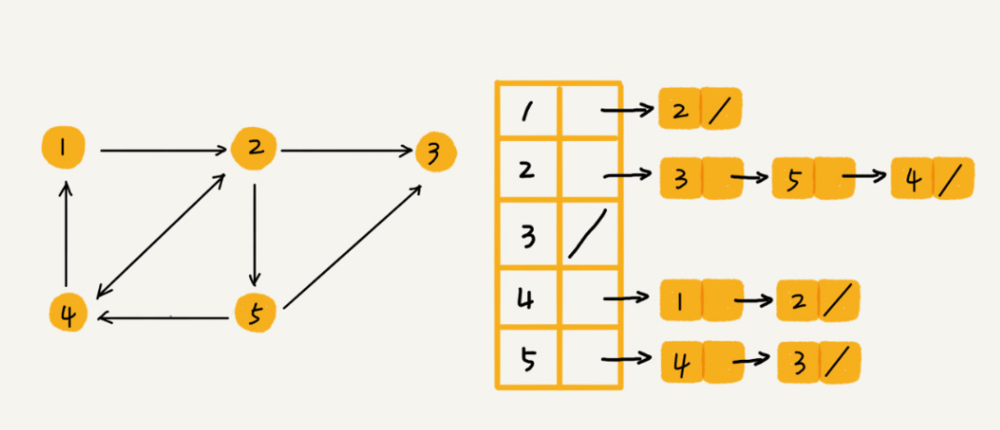

    ```ts
    // 无向图
    class Graph<number> {
      vertices: number; // 顶点的个数
      adj: Array<Array<number>>;

      constructor(vertices: number) {
        this.vertices = vertices;
        this.adj = new Array(this.vertices);
        for (let i = 0; i < this.vertices; i++) {
          this.adj[i] = [];
        }
      }

      addEdge(s: number, t: number) {
        // 无向图一条边存两次
        this.adj[s].push(t);
        this.adj[t].push(s);
      }
    }
    ```

- 社交网络[六度分割理论](https://zh.wikipedia.org/wiki/%E5%85%AD%E5%BA%A6%E5%88%86%E9%9A%94%E7%90%86%E8%AE%BA)
- 广度优先搜索（BFS: Breadth-First-Search）

  寻找社交用户的所有三度好友关系

  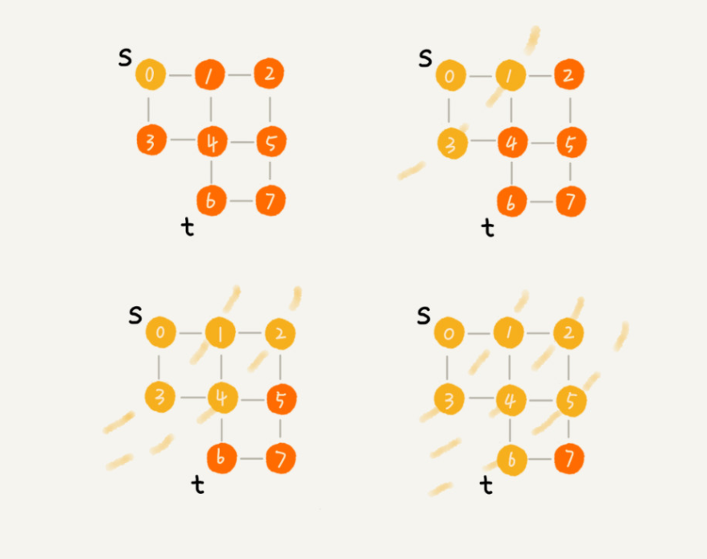

  ```ts
  class Graph<number> {
    /**
     * 搜索一条从 S 到 T 的路径，得到的路径就是从 S 到 T 的最短路径
     */
    bfs(s: number, t: number) {
      if (s === t) return;
      let visited = new Array(this.vertices); // 记录已经被访问的顶点，用来避免顶点被重复访问
      let queue = []; // 存储已经被访问、但相连的顶点还没有被访问的顶点
      let prev = new Array(this.vertices); // 用来记录搜索路径
      for (let i = 0; i < this.vertices; i++) {
        prev[i] = -1;
      }

      visited[s] = true;
      queue.push(s);

      while (queue.length) {
        const curVertice = queue.shift();
        const relatedVertices = this.adj[curVertice];
        for (let j = 0, len = relatedVertices.length; j < len; j++) {
          let v = relatedVertices[j];
          if (!visited[v]) {
            prev[v] = curVertice; // prev[w]存储的是，顶点 w 是从哪个前驱顶点遍历过来的
            if (v === t) {
              this.print(prev, s, t);
              return;
            }
            visited[v] = true;
            queue.push(v);
          }
        }
      }
    }

    print(prev: number[], s: number, t: number) {
      // 递归打印
      if (prev[t] !== -1 && t !== s) {
        print(prev, s, t);
      }
      console.log(t + " ");
    }
  }
  ```

  最坏情况下，终止顶点 t 离起始顶点 s 很远，需要遍历完整个图才能找到。这个时候，每个顶点都要进出一遍队列，每个边也都会被访问一次，所以，广度优先搜索的时间复杂度是 O(V+E)，其中，V 表示顶点的个数，E 表示边的个数。当然，对于一个连通图来说，也就是说一个图中的所有顶点都是连通的，E 肯定要大于等于 V-1，所以，广度优先搜索的时间复杂度也可以简写为 O(E)。

  广度优先搜索的空间消耗主要在几个辅助变量 visited 数组、queue 队列、prev 数组上。这三个存储空间的大小都不会超过顶点的个数，所以空间复杂度是 O(V)。

- 深度优先搜索（DFS: Depth-First-Search)--回溯思想

  - 走迷宫

    ```ts
    class Graph {
      dfs(s: number, t: number) {
        let found = false;
        let visited = new Array(this.vertices);
        let prev = [];
        for (let i = 0; i < this.vertices; i++) {
          prev[i] = -1;
        }

        _dfs(s, t, visited, prev);
        this.print(prev, s, t);

        function _dfs(v, t, visited, prev) {
          if (found === true) return;
          visited[v] = true;
          if (v === t) {
            found = true;
            return;
          }
          const relatedVertices = this.adj[v];
          for (let j = 0, len = relatedVertices.length; j < len; j++) {
            const nextV = relatedVertices[j];
            if (!visited[nextV]) {
              prev[nextV] = v;
              _dfs(nextV, t, visited, prev);
            }
          }
        }
      }

      print(prev: number[], s: number, t: number) {
        // 递归打印
        if (prev[t] !== -1 && t !== s) {
          print(prev, s, t);
        }
        console.log(t + " ");
      }
    }
    ```

    每条边最多会被访问两次，一次是遍历，一次是回退。所以，图上的深度优先搜索算法的时间复杂度是 O(E)，E 表示边的个数。

    深度优先搜索算法的消耗内存主要是 visited、prev 数组和递归调用栈。visited、prev 数组的大小跟顶点的个数 V 成正比，递归调用栈的最大深度不会超过顶点的个数，所以总的空间复杂度就是 O(V)。

  - 矩阵中的路径

    ```js
    /**
     * 请设计一个函数，用来判断在一个矩阵中是否存在一条包含某字符串所有字符的路径。路径可以从矩阵中的任意一格
     * 开始，每一步可以在矩阵中向左、右、上、下移动一格。如果一条路径经过了矩阵的某一格，那么该路径不能再次进
     * 入该格子。例如，在下面的3×4的矩阵中包含一条字符串“bfce”的路径（路径中的字母用加粗标出）。
     * 输入：board = [["A","B","C","E"],["S","F","C","S"],["A","D","E","E"]], word = "ABCCED"
     * 输出：true
     */
    function exist(board, word) {
      const { length: xLen } = board;
      const { length: yLen } = board[0];
      for (let x = 0; x < xLen; x++) {
        for (let y = 0; y < yLen; y++) {
          if (_exist(board, word, x, y, 0, xLen, yLen)) return true;
        }
      }

      return false;
      //用于判断board[x][y]的上下左右是否有work[k+1]，若有返回true
      function _exist(board, word, x, y, k, xLen, yLen) {
        if (
          x < 0 ||
          x >= xLen ||
          y < 0 ||
          y >= yLen ||
          board[x][y] !== word[k]
        ) {
          return false;
        }
        // word 到尾部了
        if (k === word.length - 1) {
          return true;
        }
        let tmp = board[x][y];
        board[x][y] = "-"; // 当前元素暂时不能再访问
        const isExist =
          _exist(board, word, x - 1, y, k + 1, xLen, yLen) /* 上 */ ||
          _exist(board, word, x + 1, y, k + 1, xLen, yLen) /* 下 */ ||
          _exist(board, word, x, y - 1, k + 1, xLen, yLen) /* 左 */ ||
          _exist(board, word, x, y + 1, k + 1, xLen, yLen); /* 右 */
        board[x][y] = tmp;
        return isExist;
      }
    }
    ```

  - 机器人的运动范围

    ```js
    /**
     * 地上有一个m行n列的方格，从坐标 [0,0] 到坐标 [m-1,n-1] 。一个机器人从
     * 坐标 [0, 0] 的格子开始移动，它每次可以向左、右、上、下移动一格（不能移动到方格外），\
     * 也不能进入行坐标和列坐标的数位之和大于k的格子。例如，当k为18时，机器人能够进入方格 [35, 37] ，
     * 因为3+5+3+7=18。但它不能进入方格 [35, 38]，因为3+5+3+8=19。请问该机器人能够到达多少个格子？
     *
     * 输入：m = 2, n = 3, k = 1        输入：m = 3, n = 1, k = 0
     * 输出：3                          输出：1
     */
    function movingCount(m, n, k) {
      let set = new Set();
      return dfs(0, 0);

      function dfs(x, y) {
        let key = `${x}-${y}`;
        if (
          x < 0 ||
          x >= m ||
          y < 0 ||
          y >= n ||
          getSum(x, y) > k ||
          set.has(key)
        ) {
          return 0;
        }
        set.add(key);
        return 1 + dfs(x + 1, y) /* 下 */ + dfs(x, y + 1); /* 右 */
      }

      function getSum(...nums) {
        let sum = 0;
        for (let i = 0, { length: len } = nums; i < len; i++) {
          let num = nums[i];
          while (num) {
            sum += num % 10;
            num = Math.floor(num / 10);
          }
        }
        return sum;
      }
    }
    ```

## 字符串匹配

- BF(Brute Force -- 暴力匹配算法) 算法

  - 主串和模式串

    我们在字符串 A 中查找字符串 B，那字符串 A 就是主串，字符串 B 就是模式串。

  - 算法思想

    在主串中，检查起始位置分别是 0、1、2…n-m 且长度为 m 的 n-m+1 个子串，看有没有跟模式串匹配的。

  - 最坏情况时间复杂度：每次都比对 m 个字符，要比对 n-m+1 次，所以，这种算法的最坏情况时间复杂度是 `O(n*m)`。
    - 实际的软件开发中，大部分情况下，模式串和主串的长度都不会太长。而且每次模式串与主串中的子串匹配的时候，当中途遇到不能匹配的字符的时候，就可以就停止了，不需要把 m 个字符都比对一下。所以，尽管理论上的最坏情况时间复杂度是 `O(n*m)`，但是，统计意义上，大部分情况下，算法执行效率要比这个高很多。
    - 算法思想简单，代码实现也非常简单。

- RK（Rabin-Karp）算法

  通过哈希算法对主串中的 n-m+1 个子串分别求哈希值，然后逐个与模式串的哈希值比较大小。如果某个子串的哈希值与模式串相等，那就说明对应的子串和模式串匹配了（这里先不考虑哈希冲突的问题，后面我们会讲到）。因为哈希值是一个数字，数字之间比较是否相等是非常快速的，所以模式串和子串比较的效率就提高了。

  通过哈希算法计算子串的哈希值的时候，我们需要遍历子串中的每个字符。尽管模式串与子串比较的效率提高了，但是，算法整体的效率并没有提高。有没有方法可以提高哈希算法计算子串哈希值的效率呢？

  假设要匹配的字符串的字符集中只包含 K 个字符，我们可以用一个 K 进制数来表示一个子串，这个 K 进制数转化成十进制数，作为子串的哈希值。

  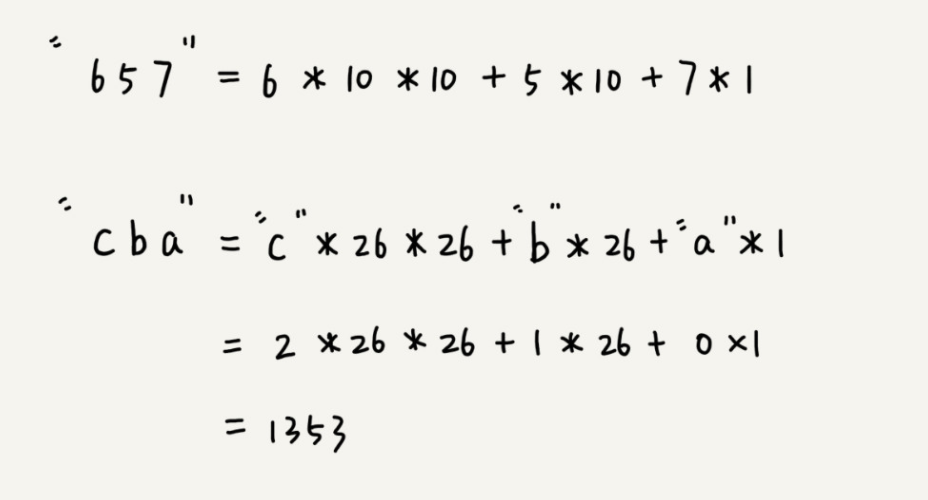

  在主串中，相邻两个子串 s[i-1]和 s[i]（i 表示子串在主串中的起始位置，子串的长度都为 m）的哈希值 h[i-1]和 h[i]的计算公式有一定关系。

  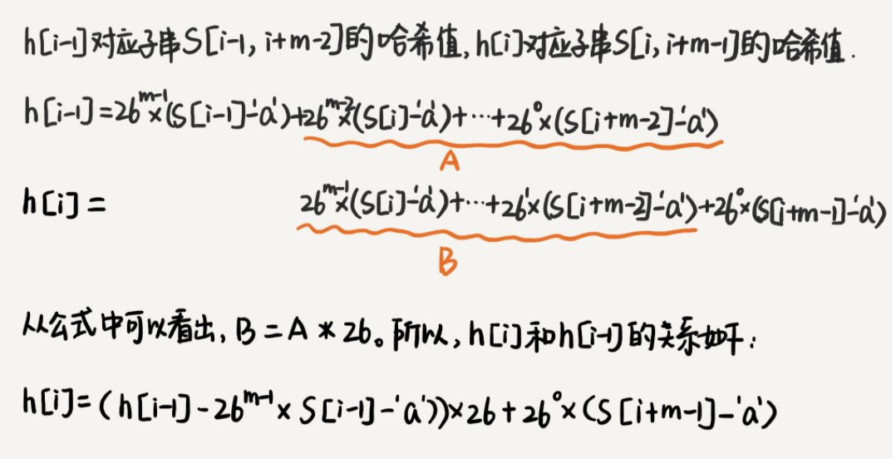

  ```
    h[i] = (h[i-1] - (26^(m-1))*(s[i-1]-'a'))*26 + (26^0)* (s[i+ m -1] - 'a')
  ```

  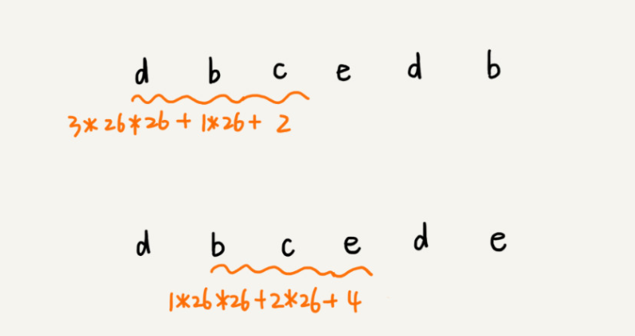

  26^(m-1) 这部分的计算，我们可以通过查表的方法来提高效率。我们事先计算好 26^0、26^1、26^2……26^(m-1)，并且存储在一个长度为 m 的数组中，公式中的“次方”就对应数组的下标。当我们需要计算 26 的 x 次方的时候，就可以从数组的下标为 x 的位置取值，直接使用，省去了计算的时间。

  - 时间复杂度

    只需要扫描一遍主串就能计算出所有子串的哈希值了，所以这部分的时间复杂度是 O(n)

    模式串哈希值与每个子串哈希值之间的比较的时间复杂度是 O(1)，总共需要比较 n-m+1 个子串的哈希值，所以，这部分的时间复杂度也是 O(n)。所以，RK 算法整体的时间复杂度就是 O(n)。

- BM（Boyer-Moore）算法

  BM 算法包含两部分，分别是坏字符规则（bad character rule）和好后缀规则（good suffix shift）。

  1. 坏字符规则

     前面两种算法的匹配顺序是按照模式串的下标从小到大的顺序匹配的，BM 算法的匹配顺序是按照模式串下标从大到小的顺序倒着匹配的。

     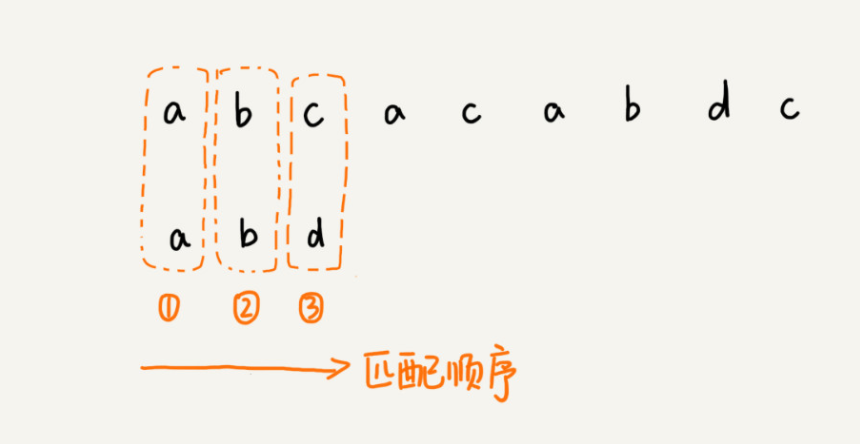

     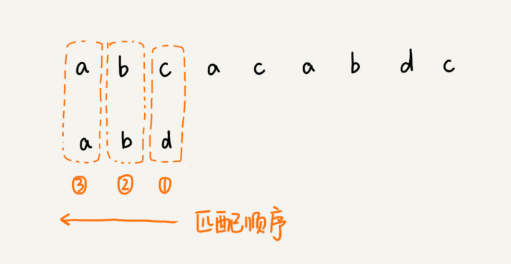

     从模式串的末尾往前倒着匹配，把没有匹配的字符叫做坏字符（主串中的字符）。

     拿坏字符 c 在模式串中查找，发现模式串中并不存在这个字符，也就是说，字符 c 与模式串中的任何字符都不可能匹配。这个时候，我们可以将模式串直接往后滑动三位，将模式串滑动到 c 后面的位置，再从模式串的末尾字符开始比较。

     坏字符 a 在模式串中是存在的，模式串中下标是 0 的位置也是字符 a。这种情况下，我们可以将模式串往后滑动两位，让两个 a 上下对齐，然后再从模式串的末尾字符开始，重新匹配。

     当发生不匹配的时候，我们把坏字符对应的模式串中的字符下标记作 si。如果坏字符在模式串中存在，我们把这个坏字符在模式串中的下标记作 xi。如果不存在，我们把 xi 记作 -1。那模式串往后移动的位数就等于 si-xi。（注意，我这里说的下标，都是字符在模式串的下标）。

     

     如果坏字符在模式串里多处出现，那我们在计算 xi 的时候，选择最靠后的那个，因为这样不会让模式串滑动过多，导致本来可能匹配的情况被滑动略过。

     不过，单纯使用坏字符规则还是不够的。因为根据 si-xi 计算出来的移动位数，有可能是负数，比如主串是 aaaaaaaaaaaaaaaa，模式串是 baaa。不但不会向后滑动模式串，还有可能倒退。所以，BM 算法还需要用到“好后缀规则”。

  2. 好后缀规则

     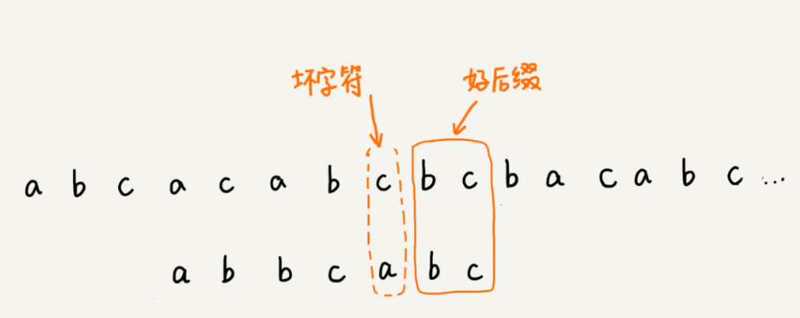

     把已经匹配的 bc 叫作好后缀，记作{u}。我们拿它在模式串中查找，如果找到了另一个跟{u}相匹配的子串{u*}，那我们就将模式串滑动到子串{u*}与主串中{u}对齐的位置。

     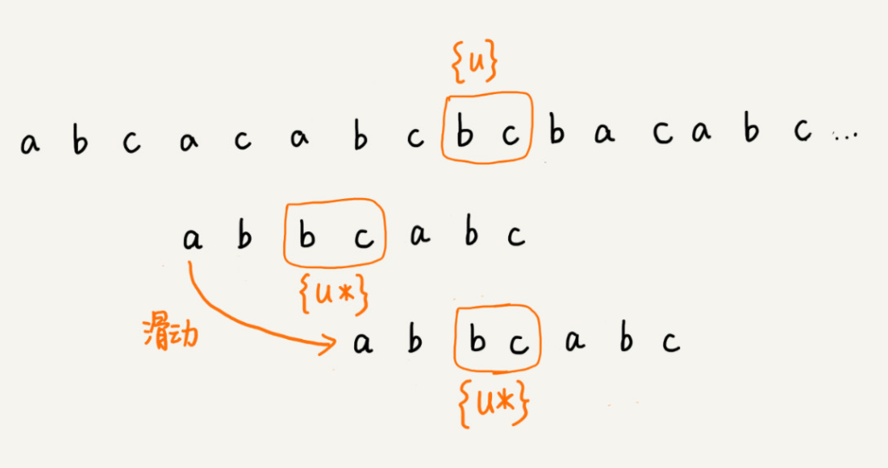

     如果在模式串中找不到另一个等于{u}的子串，我们就直接将模式串，滑动到主串中{u}的后面，因为之前的任何一次往后滑动，都没有匹配主串中{u}的情况。

     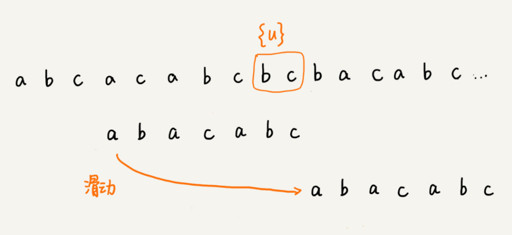

     如果好后缀在模式串中不存在可匹配的子串，那在我们一步一步往后滑动模式串的过程中，只要主串中的{u}与模式串有重合，那肯定就无法完全匹配。但是当模式串滑动到前缀与主串中{u}的后缀有部分重合的时候，并且重合的部分相等的时候，就有可能会存在完全匹配的情况。

     针对这种情况，我们不仅要看好后缀在模式串中，是否有另一个匹配的子串，我们还要考察好后缀的后缀子串，是否存在跟模式串的前缀子串匹配的。

  3. 算法实现

     ```js
     const SIZE = 256;
     function bm(a /*主串*/, b /*模式串*/) {
       let bc = new Array(SIZE); // 记录模式串中每个字符最后出现的位置
       const { length: bLen } = b;
       const { length: aLen } = a;
       generateBC(b, bLen, bc); // 构建坏字符哈希表\
       let suffix = new Array(bLen);
       let prefix = new Array(bLen);
       generateGS(b, bLen, suffix, prefix);
       let i = 0; // j表示主串与模式串匹配的第一个字符
       while (i <= aLen - bLen) {
         let j;
         for (j = bLen - 1; j >= 0; --j) {
           // 模式串从后往前匹配
           if (a[i + j] != b[j]) break; // 坏字符对应模式串中的下标是j
         }
         if (j < 0) {
           return i; // 匹配成功，返回主串与模式串第一个匹配的字符的位置
         }
         let x = j - bc[a[i + j]];
         let y = 0;
         if (j < bLen - 1) {
           // 如果有好后缀的话
           y = moveByGS(j, bLen, suffix, prefix);
         }
         i = i + Math.max(x, y);
       }
       return -1;
     }
     // j表示坏字符对应的模式串中的字符下标; m表示模式串长度
     function moveByGS(j, m, suffix, prefix) {
       let k = m - 1 - j; // 好后缀长度
       if (suffix[k] != -1) return j - suffix[k] + 1;
       for (let r = j + 2; r <= m - 1; ++r) {
         if (prefix[m - r] == true) {
           return r;
         }
       }
       return m;
     }

     function generateBC(b, m, bc) {
       for (let i = 0; i < SIZE; ++i) {
         bc[i] = -1; // 初始化bc
       }
       for (let i = 0; i < m; ++i) {
         let ascii = b[i]; // 计算b[i]的ASCII值
         bc[ascii] = i;
       }
     }

     // b表示模式串，m表示长度，suffix，prefix数组事先申请好了
     function generateGS(b, m, suffix, prefix) {
       for (let i = 0; i < m; ++i) {
         // 初始化
         suffix[i] = -1;
         prefix[i] = false;
       }
       for (let i = 0; i < m - 1; ++i) {
         // b[0, i]
         let j = i;
         let k = 0; // 公共后缀子串长度
         while (j >= 0 && b[j] == b[m - 1 - k]) {
           // 与b[0, m-1]求公共后缀子串
           --j;
           ++k;
           suffix[k] = j + 1; //j+1表示公共后缀子串在b[0, i]中的起始下标
         }
         if (j == -1) prefix[k] = true; //如果公共后缀子串也是模式串的前缀子串
       }
     }
     ```

- KMP(Knuth Morris Pratt) 算法

## Trie 树(“字典树”)

> 场景：搜索引擎的搜索关键词提示功能

Trie 树的本质，就是利用字符串之间的公共前缀，将重复的前缀合并在一起。

我们有 6 个字符串，它们分别是：how，hi，her，hello，so，see。我们希望在里面多次查找某个字符串是否存在。


- 实现

  ```ts
  class TrieNode {
    data: string;
    children: TrieNode = new Array<TrieNode>(26);
    isEndingChar = false;
    constructor(data: string) {
      this.data = data;
    }
  }

  class Trie {
    root: TrieNode = new TrieNode("/"); // 存储无意义字符

    // 往 Trie 树中插入一个字符串
    insert(text: string) {
      let p: TrieNode = root;
      for (let i = 0; i < text.length; i++) {
        const index = text[i] - "a";
        if (p.children[index] === null) {
          const newNode = new TrieNode(text[i]);
          p.children[index] = newNode;
        }
        p = p.children[index];
      }
      p.isEndingChar = true;
    }

    // 在Trie树中查找一个字符串
    find(pattern: string) {
      let p: TrieNode = root;
      for (let i = 0; i < pattern.length; i++) {
        const index = pattern[i] - "a";
        if (p.children[index] == null) {
          return false; // 不存在pattern
        }
        p = p.children[index];
      }
      if (p.isEndingChar == false) return false;
      // 不能完全匹配，只是前缀
      else return true; // 找到 pattern
    }
  }
  ```

- 查找某个字符串的时间复杂度

  构建 Trie 树的过程，需要扫描所有的字符串，时间复杂度是 O(n)（n 表示所有字符串的长度和）。

  每次查询时，如果要查询的字符串长度是 k，那我们只需要比对大约 k 个节点，就能完成查询操作。跟原本那组字符串的长度和个数没有任何关系。所以说，构建好 Trie 树后，在其中查找字符串的时间复杂度是 O(k)，k 表示要查找的字符串的长度。

- 空间复杂度

  在重复的前缀并不多的情况下，Trie 树不但不能节省内存，还有可能会浪费更多的内存。

  我们可以稍微牺牲一点查询的效率，将每个节点中的数组换成其他数据结构，来存储一个节点的子节点指针。用哪种数据结构呢？我们的选择其实有很多，比如有序数组、跳表、散列表、红黑树等。

- 使用场景

  - 字符串中包含的字符集不能太大。
  - 要求字符串的前缀重合比较多，不然空间消耗会变大很多。
  - 通过指针串起来的数据块是不连续的，而 Trie 树中用到了指针，所以，对缓存并不友好，性能上会打个折扣。
  - 如果要用 Trie 树解决问题，那我们就要自己从零开始实现一个 Trie 树，还要保证没有 bug，这个在工程上是将简单问题复杂化，除非必须，一般不建议这样做。

## 分治算法(divide and conquer)

- 求出一组数据的有序对个数或者逆序对个数?

  ```js
  /**
   * 逆序对个数
   */
  function count(arr) {
    let num = 0;
    mergeSortCounting(arr, 0, arr.length - 1);
    return num;

    function mergeSortCounting(arr, left, right) {
      if (left >= right) return;
      const mid = Math.floor(left + (right - left) / 2);
      mergeSortCounting(arr, left, mid);
      mergeSortCounting(arr, mid + 1, right);
      merge(arr, left, mid, right);

      function merge(arr, left, mid, right) {
        let i = left,
          j = mid + 1,
          k = 0;
        let tmp = new Array(right - left + 1);
        while (i <= mid && j <= right) {
          if (arr[i] <= arr[j]) {
            tmp[k++] = arr[i++];
          } else {
            num += mid - i + 1; // i 后面的都大于arr[j]
            tmp[k++] = arr[j++];
          }
        }

        while (i <= mid) {
          tmp[k++] = arr[i++];
        }

        while (j <= right) {
          tmp[k++] = arr[j++];
        }

        for (let i = 0, { length: len } = tmp; i < len; i++) {
          arr[left + i] = tmp[i];
        }
      }
    }
  }
  ```

- 二维平面上有 n 个点，如何快速计算出两个距离最近的点对？
- 有两个 `n*n` 的矩阵 A，B，如何快速求解两个矩阵的乘积 `C=A*B`？

## 回溯算法

为了避免生成那些不可能产生最佳解的问题状态，要不断地利用限界函数(bounding function)来处死那些实际上不可能产生所需解的活结点，以减少问题的计算量。这种具有限界函数的深度优先生成法称为回溯法。

- 八皇后问题

  有一个 8x8 的棋盘，希望往里放 8 个棋子（皇后），每个棋子所在的行、列、对角线都不能有另一个棋子。

  ```js
  class EightQueens {
    result = new Array(8); // 下标表示行，值表示 queen 存储在那一列
    calc8Queens(row = 0) {
      if (row === 8) {
        // 八个棋子都放置好了，打印结果
        this.printQueens();
        return;
      }

      for (let column = 0; column < 8; column++) {
        // 方法是否满足要求
        if (this.isOK(row, column)) {
          this.result[row] = column; //第 row 行棋子放到 column 列
          this.calc8Queens(row + 1); // 继续下一行
        }
      }
    }

    /**
     * 判断 row 行 column 列放置是否合适
     */
    isOK(row, column) {
      // 左上角，右上角
      let leftUp = column - 1,
        rightUp = column + 1;
      // 逐行往上检查每一行
      for (let i = row - 1; i >= 0; i--) {
        if (this.result[i] === column) return false; // 第 i 行的 column 是不是有棋子
        if (leftUp >= 0) {
          if (this.result[i] === leftUp) return false; // 左上角是否有棋子
        }
        if (rightUp < 8) {
          if (this.result[i] === rightUp) return false; // 右上角是否有棋子
        }
        leftUp--;
        rightUp++;
      }
      return true;
    }

    printQueens() {
      let str = "";
      for (let row = 0; row < 8; row++) {
        for (let column = 0; column < 8; column++) {
          if (this.result[row] === column) {
            str += "Q ";
          } else {
            str += "* ";
          }
        }
        str += "\n";
      }
      console.log(str, "\n");
    }
  }
  ```

- `0-1`背包

  有 n 个物品，它们有各自的体积和价值，现有给定容量的背包，如何让背包里装入的物品具有最大的价值总和？

  eg：number ＝ 4，capacity ＝ 8

  ```js
  const items = [2, 2, 4, 6, 3];
  let maxW = 0;
  // cw 表示当前已经装进去的物品的重量和；i 表示考察到哪个物品了；
  // w 背包重量；items 表示每个物品的重量；n 表示物品个数
  // 假设背包可承受重量 9，物品重量存储在数组 items 中，那可以这样调用函数：
  // f(0, 0, items, 5, 9)
  function f(i, cw, items, w) {
    if (cw === w || i === items.length) {
      if (cw > maxW) maxW = cw;
      return;
    }

    f(i + 1, cw, items, w); // 当前物品不放进背包
    if (cw + items[i] <= w) {
      f(i + 1, cw + items[i], items, w); // 当前物品装进背包
    }
  }
  ```

  ```js
  /**
   * 引入价值
   * items 物品重量
   * values 物品价值
   * n 物品个数
   * w 背包承受的最大重量
   * f(0, 0, 0, )
   */
  let maxV = 0;
  function f(i, cw, cv, items, w) {
    if (cw === w || i === items.length) {
      if (cv > maxV) maxV = cv;
      return;
    }
    f(i + 1, cw, cv, items, w);
    if (cw + items[i] <= w) {
      f(i + 1, cw + items[i], cv + values[i], items, w);
    }
  }
  ```

- 正则表达式

  ```js
  class Pattern {
    matched = false;
    pattern; // 正则表达式
    pLen; // 正则表达式长度

    constructor(pattern) {
      this.pattern = pattern;
      this.pLen = pattern.length;
    }

    match(text) {
      // 文本串及长度
      this.matched = false;
      const { length: len } = text;
      this.rMatch(0, 0, text, len);
      return this.matched;
    }

    rMatch(ti, pj, text, tLen) {
      if (this.matched) return; // 如果已经匹配了就不需要继续递归了
      if (pj === this.pLen) {
        // 正则表达式到结尾了
        if (ti === tLen) this.matched = true; // 文本串也到结尾了
        return;
      }
      if (this.pattern[pj] == "*") {
        // *匹配任意个字符
        for (let k = 0; k <= tLen - ti; k++) {
          this.rMatch(ti + k, pj + 1, text, tLen);
        }
      } else if (this.pattern[pj] == "?") {
        // ?匹配0个或者1个字符
        this.rMatch(ti, pj + 1, text, tLen);
        this.rMatch(ti + 1, pj + 1, text, tLen);
      } else if (ti < tLen && this.pattern[pj] === text[ti]) {
        // 纯字符匹配才行
        this.rMatch(ti + 1, pj + 1, text, tLen);
      }
    }
  }
  ```

## 动态规划

- `0-1` 背包问题

  ```js
  function knapsack(weight, n, w) {
    let states = new Array(n);
    for (let i = 0; i < n; i++) {
      states[i] = new Array(w + 1);
    }

    states[0][0] = true; // 未放第一个
    if (weight[0] <= w) {
      states[0][weight[0]] = true; // 放入第一个
    }

    for (let i = 0; i < n; i++) {
      // 不放如第i个物品的情况
      for (let j = 0; j <= w; j++) {
        if (states[i - 1][j]) states[i][j] = states[i - 1][j];
      }

      // 放入第i个物品的情况
      for (let j = 0; j <= w - weight[i]; j++) {
        if (states[i - 1][j]) states[i][j + weight[i]] = true;
      }
    }

    // 输出结果
    for (let i = w; i >= 0; i--) {
      if (states[n - 1][i]) return i;
    }
    return 0;
  }
  ```

  ```js
  /**
   * weight 物品重量
   * n 物品个数
   * w 背包承受的最大重量
   */
  function knapsack2(weight, n, w) {
    let states = new Array(w + 1);
    // 第一行的数据要特殊处理，可以利用哨兵优化
    states[0] = true;
    if (weight[0] <= w) {
      states[weight[0]] = true;
    }

    // 动态规划
    for (let i = 1; i < n; i++) {
      //把第i个物品放入背包
      for (let j = w - weight[i]; j >= 0; j--) {
        if (states[j]) states[j + weight[i]] = true;
      }
    }

    // 输出结果
    for (let i = w; i >= 0; i--) {
      if (states[i]) return i;
    }
    return 0;
  }
  ```

  ```js
  /**
   * 引入价值
   * 时间复杂度 O(n*w), 空间复杂度 O(n*w)
   */
  function knapsack3(weight, values, n, w) {
    let states = new Array(n);
    for (let i = 0; i < n; i++) {
      states[i] = new Array(w + 1);
      for (let j = 0; j < w + 1; j++) {
        states[i][j] = -1;
      }
    }

    states[0][0] = 0;
    if (weight[0] < w) {
      states[0][weight[0]] = values[0];
    }

    for (let i = 1; i < n; i++) {
      for (let j = 0; j <= w; j++) {
        if (states[i - 1][j] >= 0) states[i][j] = states[i - 1][j];
      }
      for (let j = 0; i < w - weight[i]; j++) {
        if (states[i - 1][j] >= 0) {
          let v = states[i - 1][j] + values[i];
          if (v > states[i][j + weight[i]]) {
            states[i][j + weight[i]] = v;
          }
        }
      }
    }

    let maxV = -1;
    for (let j = 0; j <= w; j++) {
      if (states[n - 1][j] > maxV) maxV = states[n - 1][j];
    }
    return maxV;
  }
  ```

  ```js
  /**
   * 引入价值
   * 时间复杂度 O(n*w), 空间复杂度 O(w)
   */
  function knapsack4(weight, values, n, w) {
    let states = new Array(w + 1);
    for (let i = 0; i < w + 1; i++) {
      states[i] = -1;
    }

    states[0] = 0;
    if (weight[0] <= w) {
      states[weight[0]] = values[0];
    }

    for (let i = 0; i < n; i++) {
      for (let j = w - weight[i]; j >= 0; i--) {
        if (states[j] > 0) {
          let v = states[j] + values[i];
          if (v > states[j + weight[i]]) {
            states[j + weight[i]] = v;
          }
        }
      }
    }

    let maxV = -1;
    for (let j = w; j >= 0; j--) {
      if (states[j] > maxV) {
        maxV = states[j];
      }
    }
    return maxV;
  }
  ```

- 淘宝的“双十一”购物节有各种促销活动，比如“满 200 元减 50 元”。假设你女朋友的购物车中有 n 个（n>100）想买的商品，她希望从里面选几个，在凑够满减条件的前提下，让选出来的商品价格总和最大程度地接近满减条件（200 元），这样就可以极大限度地“薅羊毛”。

  ```js
  // price商品价格，n商品个数, w表示满减条件，比如200
  function double11advance(price, n, w) {
    let states = new Array(n);
    for (let i = 0; i < n; i++) {
      states[i] = new Array(3 * w + 1); //超过3倍就没有薅羊毛的价值了
    }

    states[0][0] = true; // 第一行的数据要特殊处理
    if (price[0] <= 3 * w) {
      states[0][price[0]] = true;
    }

    for (let i = 1; i < n; i++) {
      // 动态规划
      for (let j = 0; j <= 3 * w; j++) {
        // 不购买第i个商品
        if (states[i - 1][j] === true) states[i][j] = states[i - 1][j];
      }
      for (let j = 0; j <= 3 * w - price[i]; j++) {
        //购买第i个商品
        if (states[i - 1][j] === true) states[i][j + price[i]] = true;
      }
    }

    let j;
    for (j = w; j < 3 * w + 1; j++) {
      if (states[n - 1][j] === true) break; // 输出结果大于等于w的最小值
    }
    if (j === 3 * w + 1) return; // 没有可行解
    for (let i = n - 1; i >= 1; i--) {
      // i表示二维数组中的行，j表示列
      if (j - price[i] >= 0 && states[i - 1][j - price[i]] === true) {
        console.log(price[i] + " "); // 购买这个商品
        j = j - price[i];
      } // else 没有购买这个商品，j不变。
    }
    if (j !== 0) console.log(price[0]);
  }
  ```

- 有一个 n 乘以 n 的矩阵 w[n][n]。矩阵存储的都是正整数。棋子起始位置在左上角，终止位置在右下角。我们将棋子从左上角移动到右下角。每次只能向右或者向下移动一位。从左上角到右下角，会有很多不同的路径可以走。我们把每条路径经过的数字加起来看作路径的长度。那从左上角移动到右下角的最短路径长度是多少呢？

  ```js
  //回溯
  let minDist = Number.MAX_VALUE;

  function minDistBackTracing(i, j, dist, w) {
    const { length: len } = w;
    // 到达了 n-1, n-1 这个位置了，
    if (i === n || j === n) {
      if (dist < minDist) minDist = dist;
      return;
    }

    if (i < n) {
      // 往下走，更新i=i+1, j = j
      minDistBackTracing(i + 1, j, dist + w[i][j], w);
    }

    if (j < n) {
      // 往右走，更新i = i, j = j+1
      minDistBackTracing(i, j + 1, dist + w[i][j], w);
    }
  }
  ```

  ```js
  // 状态表转移法
  function minDistDp(matrix) {
    const { length: len } = matrix;

    let states = new Array(len);
    for (let i = 0; i < len; i++) {
      states[i] = new Array(len);
    }

    // 初始化首行首列
    let sum1 = 0,
      sum2 = 0;
    for (let j = 0; j < len; j++) {
      // 初始化states第一行数据
      sum1 += matrix[0][j];
      states[0][j] = sum1;
      // 初始化states第一列数据
      sum2 += matrix[j][0];
      states[j][0] = sum2;
    }

    for (let i = 1; i < len; i++) {
      for (let j = 1; j < len; j++) {
        states[i][j] =
          matrix[i][j] + Math.min(states[i - 1][j], states[i][j - 1]);
      }
    }
    return states[n - 1][n - 1];
  }
  ```

  ```js
  // 状态转移方程法
  const matrix = [[1,3,5,9], [2,1,3,4],[5,2,6,7],[6,8,4,3]];
  let mem = new Array(4);// 缓存
  for(let i=0; i<4;i++) {
    mem[i] = new Array(4);
  }

  function minDist(i, j) {
    if (i === 0 && j === 0) {
      return matrix[0][0];
    }
    if(mem[i][j] > 0) return mem[i][j];
    let minLeft = Number.MAX_VALUE;
    if(j-1 > =0) {
      minLeft = minDist(i, j-1);
    }
    let minUp = Number.MAX_VALUE;
    if(i-1>=0) {
      minUp = minDist(i-1, j);
    }

    let curMinDist = matrix[i][j] + Math.min(minLeft, minUp);
    mem[i][j] = curMinDist;
    return curMinDist;
  }
  ```

- 实现搜索引擎中的拼写纠错功能

  - 如何量化两个字符串的相似度--编辑距离（Edit Distance）

    指的就是，将一个字符串转化成另一个字符串，需要的最少编辑操作次数（比如增加一个字符、删除一个字符、替换一个字符）。编辑距离越大，说明两个字符串的相似程度越小；相反，编辑距离就越小，说明两个字符串的相似程度越大。对于两个完全相同的字符串来说，编辑距离就是 0。

  - 莱文斯坦距离（Levenshtein distance）

    - 允许增加、删除、替换字符这三个编辑操作
    - 莱文斯坦距离的大小，表示两个字符串差异的大小；

  - 最长公共子串长度（Longest common substring length）

    - 只允许增加、删除字符这两个编辑操作
    - 最长公共子串的大小，表示两个字符串相似程度的大小。

  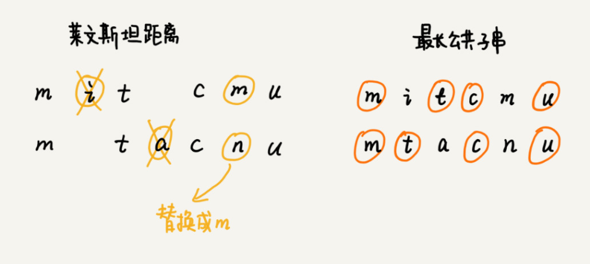

- 计算莱文斯坦距离

  ```js
  /**
   * 回溯
   */
  const a = "mitcmu",
    b = "mtacnu",
    lenA = a.length,
    lenB = b.length;
  let minDist = Number.MAX_VALUE;
  // 调用方式 lwstBT(0, 0, 0);
  function lwstBT(i, j, eDist) {
    if (i === lenA || j === lenB) {
      if (j < lenA) eDist += lenA - i;
      if (j < lenB) eDist += lenB - j;
      if (eDist < minDist) minDist = eDist;
      return;
    }

    if (a[i] === b[j]) {
      // 两个字符串匹配
      lwstBT(i + 1, j + 1, eDist);
    } else {
      // 两个字符串不匹配
      lwstBT(i + 1, j, eDist + 1); // 删除a[i]或者b[j]前添加一个字符
      lwstBT(i, j + 1, eDist + 1); // 删除b[j]或者在a[i]前添加一个字符
      lwstBT(i + 1, j + 1, eDist + 1); // 将a[i] 和 b[j] 替换为相同字符
    }
  }
  ```

  ```js
  function lwstDP(a, b) {
    const lenA = a.length,
      lenB = b.length;
    let minDist = new Array(lenA);
    for (let i = 0; i < lenA; i++) {
      minDist[i] = new Array(lenB);
    }

    for (let j = 0; j < lenB; j++) {
      if (a[0] === b[j]) minDist[0][j] = j;
      else if (j !== 0) minDist[0][j] = minDist[0][j - 1] + 1;
      else minDist[0][j] = 1;
    }

    for (let i = 0; i < lenA; i++) {
      if (a[i] === b[0]) minDist[i][0] = i;
      else if (i !== 0) minDist[i][0] = minDist[i - 1][0] + 1;
      else minDist[i][0] = 1;
    }

    for (let i = 1; i < lenA; i++) {
      for (let j = 0; j < lenB; j++) {
        if (a[i] === b[j]) {
          minDist[i][j] = min(
            minDist[i - 1][j] + 1,
            minDist[i][j - 1] + 1,
            minDist[i - 1][j - 1]
          );
        } else {
          minDist[i][j] = min(
            minDist[i - 1][j] + 1,
            minDist[i][j - 1] + 1,
            minDist[i - 1][j - 1] + 1
          );
        }
      }
    }
    return minDist[lenA - 1][lenB - 1];
  }

  function min(x, y, z) {
    let minV = Number.MAX_VALUE;
    if (x < minV) minV = x;
    if (y < minV) minV = y;
    if (z < minV) minV = z;
    return minV;
  }
  ```

- 计算最长公共子串长度

  ```js
  function lcs(a, b) {
    const lenA = a.length,
      lenB = b.length;
    let maxLcs = new Array(lenA);
    for (let i = 0; i < lenA; i++) {
      maxLcs[i] = new Array(lenB);
    }

    for (let j = 0; i < lenB; j++) {
      if (a[0] === b[j]) maxLcs[0][j] = 1;
      else if (j !== 0) maxLcs[0][j] = maxLcs[0][j - 1];
      else maxLcs[0][j] = 0;
    }

    for (let i = 0; i < lenA; i++) {
      if (a[i] === b[0]) maxLcs[i][0] = 1;
      else if (i !== 0) maxLcs[i][0] = maxLcs[i - 1][0];
      else maxLcs[i][0] = 0;
    }

    for (let i = 1; i < lenA; i++) {
      for (let j = 1; j < lenB; j++) {
        if (a[i] === b[j]) {
          maxLcs[i][j] = max(
            maxLcs[i - 1][j],
            maxLcs[i][j - 1],
            maxLcs[i - 1][j - 1] + 1
          );
        } else {
          maxLcs[i][j] = max(
            maxLcs[i - 1][j],
            maxLcs[i][j - 1],
            maxLcs[i - 1][j - 1]
          );
        }
      }
    }
    return maxLcs[lenA - 1][lenB - 1];
  }

  function max(x, y, z) {
    let maxV = Number.MIN_VALUE;
    if (x < maxV) maxV = x;
    if (y < maxV) maxV = y;
    if (z < maxV) maxV = z;
    return maxV;
  }
  ```

- `请实现一个函数用来匹配包含'. '和'*'的正则表达式。模式中的字符'.'表示任意一个字符，而'*'表示它前面的字符可以出现任意次（含 0 次）。在本题中，匹配是指字符串的所有字符匹配整个模式。例如，字符串"aaa"与模式"a.a"和"ab*ac*a"匹配，但与"aa.a"和"ab*a"均不匹配。`[解析](https://leetcode-cn.com/problems/zheng-ze-biao-da-shi-pi-pei-lcof/solution/zhu-xing-xiang-xi-jiang-jie-you-qian-ru-shen-by-je/)

  ```js
  /**
   * 假设主串为 AA，模式串为 BB 从最后一步出发，需要关注最后进来的字符。假设 AA 的长度为 nn ，BB 的长度为 mm ，关注正则表达式 BB 的最后一个字符是谁，它有三种可能，正常字符、*∗ 和 .（点），那针对这三种情况讨论即可
   * 如果 B 的最后一个字符是`正常字符`，那就是看 A[n-1]A[n−1] 是否等于 B[m-1]B[m−1]，相等则看 A`0..n-2` 与 B`0..m−2` ，不等则是不能匹配，这就是子问题。
   * 如果 B 的最后一个字符是`.`，它能匹配任意字符，直接看 A`0..n−2` 与 B`0..m−2`
   * 如果 B 的最后一个字符是`*`它代表 B[m-2]=c 可以重复0次或多次，它们是一个整体 c*
   *    情况一：A[n-1] 是 0 个 c，B 最后两个字符废了，能否匹配取决于 A`0..n−1`和 B`0..m−3` 是否匹配
   *    情况二：A[n-1] 是多个 c 中的最后一个（这种情况必须 A[n-1]=c 或者 c='.' ），所以 AA 匹配完往前挪一个，BB 继续匹配，因为可以匹配多个，继续看 A`0..n−2` 和 B`0..m−1` 是否匹配。
   * f[i][j] 代表 A 的前 i 个和 B 的前 j 个能否匹配
   */
  function isMatch(str, pattern) {
    let { length: n } = str,
      { length: m } = pattern;

    let dp = new Array(n + 1);
    for (let i = 0; i <= n; i++) {
      dp[i] = new Array(m + 1).fill(false);
    }

    for (let i = 0; i <= n; i++) {
      for (let j = 0; j <= m; j++) {
        // 分成空正则和非空正则两种
        if (j === 0) {
          // 空正则、非空字符串返回false
          // 空字符串、空正则返回 true
          dp[i][j] = i === 0;
        } else {
          // 非空正则分为两种情况 * 和 非*
          if (pattern[j - 1] !== "*") {
            if (
              i > 0 &&
              (str[i - 1] === pattern[j - 1] || pattern[j - 1] === ".")
            ) {
              dp[i][j] = dp[i - 1][j - 1];
            }
          } else {
            //碰到 * 了，分为看和不看两种情况
            //不看
            if (j >= 2) {
              dp[i][j] = dp[i][j] || dp[i][j - 2];
            }
            //看
            if (
              i >= 1 &&
              j >= 2 &&
              (str[i - 1] === pattern[j - 2] || pattern[j - 2] === ".")
            ) {
              dp[i][j] = dp[i][j] || dp[i - 1][j];
            }
          }
        }
      }
    }
    return dp[n][m];
  }
  ```

## 贪心算法

- [剪绳子](https://leetcode-cn.com/problems/jian-sheng-zi-lcof/solution/mian-shi-ti-14-i-jian-sheng-zi-tan-xin-si-xiang-by/)

  给你一根长度为 n 的绳子，请把绳子剪成整数长度的 m 段（m、n 都是整数，n>1 并且 m>1），每段绳子的长度记为 k[0],k[1]...k[m-1] 。请问 k[0]\*k[1]\*...\*k[m-1] 可能的最大乘积是多少？例如，当绳子的长度是 8 时，我们把它剪成长度分别为 2、3、3 的三段，此时得到的最大乘积是 18。

  ```js
  function cuttingRope(n) {
    if (n <= 3) return (n - 1) * 1;
    let a = Math.floor(n / 3),
      b = n % 3;
    if (b === 0) return Math.pow(3, a);
    if (b === 1) return Math.pow(3, a - 1) * 2 * 2; // 最后一份 3 + 1 拆分成 2 + 2
    return Math.pow(3, a) * 2;
  }
  ```
