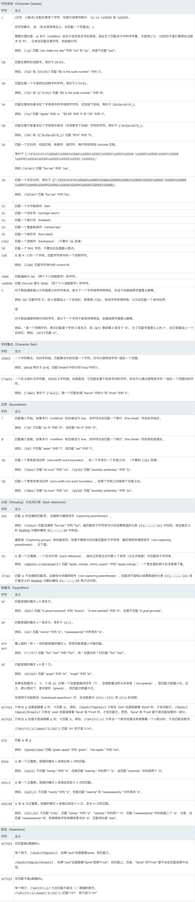

# JavaScript

## var, let 区别

- 顶级作用域 var 声明变量是 window 的属性，let\const 声明变量不是 window 的属性，变量都可以在控制台访问。
- let 声明的变量拥有块级作用域，不存在变量提升
- 暂时性死区

  只要块级作用域内存在 let 命令，它所声明的变量就“绑定”（binding）这个区域，不再受外部的影响。

  ```js
  var tmp = 123;

  if (true) {
    tmp = "abc"; // ReferenceError
    let tmp;
  }
  ```

- 不允许重复声明
- var 的副作用
  - 通过 var 创建的全局变量（任何函数之外的程序中创建）是不能被删除的。
  - 无 var 创建的隐式全局变量（无视是否在函数中创建）是能被删除的。


## 箭头函数

> 没有自己的 `this`，`arguments`，`super` 或 `new.target`。不能用作构造函数。

- 箭头函数不会创建自己的 this，它只会从自己的作用域链的上一层继承 this

  在箭头函数出现之前，每个新定义的函数都有它自己的 this 值（在构造函数的情况下是一个新对象，在严格模式的函数调用中为 undefined，如果该函数被作为“对象方法”调用则为基础对象等）

  > 由于 箭头函数没有自己的 this 指针，通过 call() 或 apply() 方法调用一个函数时，只能传递参数（不能绑定 this---译者注），他们的第一个参数会被忽略。

- 箭头函数不绑定 Arguments 对象。
- 箭头函数不能用作构造器，和 new 一起用会抛出错误。
- **箭头函数没有 prototype 属性。**

## fetch 取消

- [AbortController](https://developer.mozilla.org/zh-CN/docs/Web/API/FetchController)

  > AbortController 接口代表一个控制器对象，允许你在需要时终止一个或多个 DOM 请求。

- [Abortable fetch](https://developers.google.com/web/updates/2017/09/abortable-fetch)

  ```js
    const controller = new AbortController();
    const signal = controller.signal;

    const downloadBtn = document.querySelector('.download');
    const abortBtn = document.querySelector('.abort');

    downloadBtn.addEventListener('click', fetchVideo);
    abortBtn.addEventListener('click', function() {
      controller.abort();
      console.log('Download aborted!');
    })

    function fetchVideo() {
      ...
      fetch(url, {signal}).then(function（res){
        ...
      }).catch(function(err){
        if (err.name === 'AbortError') {
          console.log('Fetch aborted');
        } else {
          console.error('Uh oh, an error!', err);
        }
      })
    }
  ```

  > 当 `abort()` 被调用， `fetch()` promise rejects 一个 `AbortError`。

## symbol

- Symbol()

  Symbol 函数可以接受一个字符串作为参数，表示对 Symbol 实例的描述，主要是为了在控制台显示，或者转为字符串时，比较容易区分。

- Symbol.for()

  接受一个字符串作为参数，然后搜索有没有以该参数作为名称的 Symbol 值。如果有，就返回这个 Symbol 值，否则就新建并返回一个以该字符串为名称的 Symbol 值。

  Symbol.for()与 Symbol()这两种写法，都会生成新的 Symbol。它们的区别是，前者会被登记在全局环境中供搜索，后者不会。

- Symbol.keyFor()

  Symbol.keyFor 方法返回一个已登记的 Symbol 类型值的 key。

  <iframe src="http://es6.ruanyifeng.com/#docs/symbol" width="100%" frameborder="0" height="500px" ></iframe>

## JS 继承

- 原型链：本质是重写原型对象

  - 实现

    ```js
    function SuperType() {
      this.property = true;
    }

    SuperType.prototype.getSuperValue = function () {
      return this.property;
    };

    function SubType() {
      this.subProperty = false;
    }

    // 继承了 SuperType
    SubType.prototype = new SuperType();

    SubType.prototype.constructor = SubType;

    SubType.prototype.getSubValue = function () {
      return this.subProperty;
    };

    var inst = new SubType();
    alert(inst.getSuperValue());
    ```

  - 确定原型和实例关系
    1. `instanceof`
    2. `isPrototypeOf()`
  - 问题

    1. 包含引用类型值的原型

       ```js
       function SuperType() {
         this.colors = ["red", "blue", "green"];
       }

       function SubType() {}

       // 继承了 SuperType
       SubType.prototype = new SuperType();
       var inst1 = new SubType();
       inst1.colors.push("black");
       console.log(inst1.colors); // 'red', 'blue', 'green', 'black'

       var inst2 = new SubType();
       console.log(inst2.colors); // 'red', 'blue', 'green', 'black'
       ```

    2. 在创建子类型实例的时候，不能向超类型的构造函数中传递参数。

- 借用构造函数

  > 解决了原型中包含引用类型值所带来的问题

  > 子类构造函数中向超类构造函数传递参数

  - 实现

    ```js
    function SuperType(name) {
      this.name = name;
      this.colors = ["red", "blue", "green"];
    }

    function SubType(name, age) {
      // 继承了 SuperType, 同时还传递了参数
      SuperType.call(this, name);
      // 实例属性
      this.age = age;
    }

    var inst1 = new SubType("Nicholas", 29);
    inst1.colors.push("black");
    console.log(inst1.colors); // 'red', 'blue', 'green', 'black'

    var inst2 = new SubType("Jerry", 27);
    console.log(inst2.colors); // 'red', 'blue', 'green'
    ```

  - 问题
    1. 方法都在构造函数中定义，函数复用无从谈起。
    2. 超类原型中定义的方法，子类不可见。

- 组合继承

  > 将`原型链` 和 `借用构造函数` 结合到一起

  - 实现

    ```js
    function SuperType(name) {
      this.name = name;
      this.colors = ["red", "blue", "green"];
    }

    SuperType.prototype.sayName = function () {
      console.log(this.name);
    };

    function SubType(name, age) {
      // 继承 SuperType 实例属性并传递参数
      SuperType.call(this, name);

      this.age = age;
    }

    // 继承方法
    SubType.prototype = new SuperType();
    // 修复构造函数
    SubType.prototype.constructor = SubType;
    SubType.prototype.sayAge = function () {
      console.log(this.age);
    };

    var inst1 = new SubType("Nicholas", 29);
    inst1.colors.push("black");
    console.log(inst1.colors); // 'red', 'blue', 'green', 'black'
    inst1.sayName();
    inst1.sayAge();

    var inst2 = new SubType("Jerry", 27);
    console.log(inst2.colors); // 'red', 'blue', 'green'
    inst2.sayName();
    inst2.sayAge();
    ```

  - 问题

    1. 组合继承无论什么情况下，都会`调用两次超类构造函数`：

       - `一次是在创建子类原型的时候`
       - `另一次是在子类构造函数内部调用超类构造函数。`

- 原型式继承

  > `Object.create()`规范化了原型式继承

  - `Object.create(proto, [propertiesObject])`

    `Object.create()` 方法创建一个新对象，使用现有的对象来提供新创建的对象的`__proto__`。

    - proto

      新创建对象的原型对象。

    - propertiesObject

      可选。如果没有指定为 undefined，则是要添加到新创建对象的可枚举属性（即其自身定义的属性，而不是其原型链上的枚举属性）对象的属性描述符以及相应的属性名称。这些属性对应 `Object.defineProperties()` 的第二个参数。

    - 实现

      ```js
      if (typeof Object.create !== "function") {
        Object.create = function (proto, propertiesObject) {
          if (typeof proto !== "object" && typeof proto !== "function") {
            throw new TypeError(
              "Object prototype may only be an Object: " + proto
            );
          } else if (proto === null) {
            throw new Error(
              "This browser's implementation of Object.create is a shim and doesn't support 'null' as the first argument."
            );
          }

          if (typeof propertiesObject != "undefined")
            throw new Error(
              "This browser's implementation of Object.create is a shim and doesn't support a second argument."
            );

          function F() {}
          F.prototype = proto;

          return new F();
        };
      }
      ```

  - 问题

    在没有必要兴师动众的创建构造函数，而只是想让一个对象与另一个对象保持类似的情况下，原型式继承是完全可以胜任的。但是，**包含引用类型值的属性始终都会共享相应的值。**

- 寄生式继承

  > 创建一个仅用于封装继承过程的函数，该函数在内部以某种方式来增强对象。

  - 实现

    ```js
    function createAnother(original) {
      // 通过调用函数创建一个新对象
      var clone = Object.create(original);
      // 以某种方式来增强新对象
      clone.sayHi = function () {
        console.log("Hi");
      };
      return clone;
    }

    var person = {
      name: "Nicholas",
      friends: ["red", "blue", "green"],
    };
    var anotherPerson = createAnother(person);
    anotherPerson.sayHi();
    ```

  - 问题

    1. 不能做到函数复用而降低效率

- 寄生组合式继承

  > 组合继承无论什么情况下，都会`调用两次超类构造函数`：

  > `一次是在创建子类原型的时候`  
  > `另一次是在子类构造函数内部调用超类构造函数。`

  ```js
  // 组合继承🌰

  function SuperType(name) {
    this.name = name
    this.colors = ['red', 'blue', 'green']
  }

  SuperType.prototype.sayName = function() {
    console.log(this.name)
  }

  function SubType(name, age) {
    SuperType.call(this, name) // 第二次调用 SuperType()

    this.age = age
  }

  SubType.prototype = new SuperType() // 第一次调用 SuperType()
  SubType.prototype.constructor = SubType
  SubType.prototype.sayAge = funciton() {
    console.log(this.age)
  }
  ```

  > 第一次调用在原型上有两个属性 `name` 和 `colors`  
  > 调用子类构造函数的时候，又会调用超类构造函数，又会在新对象上创建实例属性 `name` 和 `colors`，于是原型链上的两个同名属性就被屏蔽了

  - 实现

    ```js
    function inheritPrototype(subType, superType) {
      var prototype = Object.create(superType.prototype); // 创建对象
      prototype.constructor = subType; // 增强对象
      subType.protototype = prototype; // 指定对象
    }
    ```

    ```js
    function SuperType(name) {
      this.name = name;
      this.colors = ["red", "blue", "green"];
    }

    SuperType.prototype.sayName = function () {
      console.log(this.name);
    };

    function SubType(name, age) {
      SuperType.call(this, name); // 第二次调用 SuperType()

      this.age = age;
    }

    inheritPrototype(SubType, SuperType);
    SubType.prototype.sayAge = function () {
      console.log(this.age);
    };
    ```

  - 引用类型最理想的继承范式

## Class 的继承

<iframe src="http://es6.ruanyifeng.com/#docs/class-extends#%E7%B1%BB%E7%9A%84-prototype-%E5%B1%9E%E6%80%A7%E5%92%8C__proto__%E5%B1%9E%E6%80%A7" width="100%" frameborder="0" height="500px" ></iframe>

```js
class A {}

class B extends A {}

B.__proto__ === A; // 静态方法
B.prototype.__proto__ === A.prototype; // 原型继承
```

## instanceof

> `instanceof` 运算符用于测试构造函数的 `prototype` 属性是否出现在对象的原型链中的任何位置.  
> 如果左操作数不是对象，则返回 false,如果右操作数不是函数，则抛出 typeError.

- 实现原理

  instanceof 主要的实现原理就是只要右边变量的 prototype 在左边变量的原型链上即可

  ```js
  function new_instance_of(leftVaule, rightVaule) {
    let rightProtoType = rightVaule.prototype; // 取右表达式的 prototype 值
    leftVaule = leftVaule.__proto__; // 取左表达式的__proto__值
    while (true) {
      if (leftVaule === null) {
        return false;
      }
      if (leftVaule === rightProtoType) {
        return true;
      }
      leftVaule = leftVaule.__proto__;
    }
  }
  ```

- 几个有趣的例子

  ```js
  Function instanceof Function; // true  Function.__proto__ === Function.prototype
  Object instanceof Function; // Object 本身是一个函数，由 Function 所创建，所以 `Object.__proto__` 的值是 `Function.prototype`
  Object instanceof Object; // `Function.prototype` 的 `__proto__` 属性是 `Object.prototype`
  Function instanceof Object; // Function.__proto__ === Function.prototype, Function.prototype 是由 Object 所创建，所以 Function.prototype.__proto__ === Object.prototype
  ```

  

## typeof

typeof 在判断一个 object 的数据的时候只能告诉我们这个数据是 object, 而不能细致的具体到是哪一种 object

最好是用 typeof 来判断基本数据类型（包括 symbol）和 function，避免对 null 的判断。

```js
typeof undefined; // "undefined"
typeof true; // "boolean"
typeof function () {}; // "function"
typeof {}; // "object"
typeof []; // "object"
typeof null; // "object"
typeof new String("abc"); // "object"
typeof new Date(); // "object"
```

**还有一个不错的判断类型的方法，就是 Object.prototype.toString**

```js
Object.prototype.toString.call(1); // "[object Number]"
Object.prototype.toString.call("hi"); // "[object String]"
Object.prototype.toString.call({ a: "hi" }); // "[object Object]"
Object.prototype.toString.call([1, "a"]); // "[object Array]"
Object.prototype.toString.call(true); // "[object Boolean]"
Object.prototype.toString.call(() => {}); // "[object Function]"
Object.prototype.toString.call(null); // "[object Null]"
Object.prototype.toString.call(undefined); // "[object Undefined]"
Object.prototype.toString.call(Symbol(1)); // "[object Symbol]"
```

```js
let class2Type = {};
[("Array", "Date", "RegExp", "Error", "Object")].forEach(
  (type) => (class2Type[`[object ${type}]`] = type.toLowerCase())
);

function type(obj) {
  if (obj === null) return String(null);
  return typeof obj === "object"
    ? class2Type[Object.prototype.toString.call(obj)] || "object"
    : typeof obj;
}
```

## [typeof 和 instanceOf 的区别](https://segmentfault.com/a/1190000000730982)

> 只有字面量形式的 `string`、 `number`、 `boolean`、 `undefined`、`function` 才能分辨出来，其他都为 `object`

| Value              | Class     | Type                          |
| :----------------- | :-------- | :---------------------------- |
| "foo"              | String    | string                        |
| new String("foo")  | String    | object                        |
| 1.2                | Number    | number                        |
| new Number(1.2)    | Number    | object                        |
| true               | Boolean   | boolean                       |
| new Boolean(true)  | Boolean   | object                        |
| new Date()         | Date      | object                        |
| new Error()        | Error     | object                        |
| [1,2,3]            | Array     | object                        |
| new Array(1, 2, 3) | Array     | object                        |
| new Function("")   | Function  | function                      |
| /abc/g             | RegExp    | object (function in Nitro/V8) |
| new RegExp("meow") | RegExp    | object (function in Nitro/V8) |
| {}                 | Object    | object                        |
| new Object()       | Object    | object                        |
| null               | Null      | object                        |
| undefined          | Undefined | undefined                     |

> Class 一列表示对象的内部属性 `[[Class]]` 的值。  
> 为了获取对象的 `[[Class]]`，我们需要使用 `Object.prototype.toString`。

## [正则](https://developer.mozilla.org/zh-CN/docs/Web/JavaScript/Guide/Regular_Expressions)



- 标识符：
  - g: 全局
  - i: 忽略大小写
  - m: 多行模式， 在到达一行文本末尾时还会继续查找下一行中是否存在与模式匹配的项。
- 元字符：
  - `([{\^$|}?*+.])`
  - 所有的元字符都必须经过转义
- 使用 `RegExp` 构造函数

  - **由于 `RegExp` 构造函数的模式参数是个字符串，所以在某些情况下要对字符串进行双重转义**

    | 字面量模式         | 等价的字符串          |
    | :----------------- | :-------------------- |
    | `/\[bc\]at/`       | `\\[bc\\]at`          |
    | `/\.at/`           | `\\.at`               |
    | `/name\/age/`      | `name\\/age`          |
    | `/\d.\d{1,2}/`     | `\\d.\\d{1,2}`        |
    | `/\w\\hello\\123/` | `\\w\\\\hello\\\\123` |

- ES5 明确规定，使用正则表达式字面量必须像直接调用 `RegExp` 构造函数一样，每次都创建新的 `RegExp` 实例。
- 实例属性
  - global
  - ignoreCase
  - multiline
  - source: 正则表达式的字符串表示，按照**字面量形式**而非传入构造函数的字符串模式
  - lastIndex: 开始搜索下一个匹配项的字符位置，起始 0
- 实例方法

  - exec(): 专门为捕获组而设计，返回包含第一个匹配项信息的数组，没有匹配项返回 null
    - 返回数组属性
      - 第一项是与整个模式匹配的字符串
      - 其他项是与模式中的捕获组匹配的字符串
      - index: 匹配项在字符串中的位置
      - input: 应用正则表达式的字符串
    - 模式中设置了 `g` 标志,每次也只返回一个匹配项
      - 同一个字符串多次调用 `exec()`,每次调用都会在字符串中继续查找新的匹配项
  - test(): 是否匹配
  - toLocaleString(): 返回正则表达式字面量
  - toString(): 返回正则表达式字面量

- 构造函数属性

  | 长属性名      | 短属性名                                                         | 说明                                   |
  | :------------ | :--------------------------------------------------------------- | :------------------------------------- |
  | input         | \$\_                                                             | 最近一次要匹配的字符串                 |
  | lastMatch     | \$&                                                              | 最近一次匹配项                         |
  | lastParen     | \$+                                                              | 最近一次匹配的捕获组                   |
  | leftContext   | \$`                                                              | input 字符串中 lastMatch 之前的文本    |
  | rightContext  | \$'                                                              | input 字符串中 lastMatch 之后的文本    |
  | multiline     | \$\*                                                             | 布尔值，是否所有的表达式都使用多行模式 |
  | $1,$2,...,\$9 | 存储第一到第九个捕获组，调用 exec()或 test()时，这些属性自动填充 |                                        |
  |               |                                                                  |                                        |

- [正则 test、exec 与 String.prototype.match](https://developer.mozilla.org/zh-CN/docs/Web/JavaScript/Guide/Regular_Expressions)

  - test 匹配与否，返回 Boolean
  - match、exec

    - 如果使用 g 标志，则将返回与完整正则表达式匹配的所有结果，但是不会返回捕获组，未匹配返回 null

      ```js
      const str = "ABCDEFGHIJKLMNOPQRSTUVWXYZabcdefghijklmnopqrstuvwxyz";
      var regexp = /[A-E]/gi;
      var matches_array = str.match(regexp);

      console.log(matches_array);
      // ['A', 'B', 'C', 'D', 'E', 'a', 'b', 'c', 'd', 'e']
      ```

    - 如果未使用 g 标志，则仅返回第一个完整匹配及其相关的捕获组

      > 返回数组第一项为正则匹配的整个字符串，
      > 后面为括号对应的捕获组，
      > index 是整个匹配从零开始的索引，
      > Input 为被解析的原始字符串

      ```js
      var str = "For more information, see Chapter 3.4.5.1";
      var re = /see (chapter \d+(\.\d)*)/i;
      var found = str.match(re);

      console.log(found);

      // logs [ 'see Chapter 3.4.5.1',
      //        'Chapter 3.4.5.1',
      //        '.1',
      //        index: 22,
      //        input: 'For more information, see Chapter 3.4.5.1' ]
      ```

## 判断数组的几种方法及优劣

- Array.isArray
- Object.prototype.toString.call

  - 不能校验自定义类型

    ```js
    function Animal() {}
    let a = new Animal();
    Object.prototype.toString.call(a); // '[objevarct Object]'
    ```

- instanceof

  - 原型可能被修改
  - 不能校验原始类型值

    ```js
    "a" instanceof String; // false
    ```

- arr.constructor === Array
  - 原型被改写

## call/apply 实现

```js
Function.prototype.call = function (oThis, ...args) {
  oThis = oThis || (typeof window === "undefined" ? global : window);
  oThis.func = this;

  const result = oThis.func(...args);

  delete oThis.func; // oThis 上并没有 func 属性，需要移除

  return result;
};

Function.prototype.apply = function (oThis, args = []) {
  oThis = oThis || typeof window === "undefined" ? global : window;

  oThis.func = this;
  const result = oThis.func(...args);

  delete oThis.func;

  return result;
};
```

## Array.prototype.reduce 实现

```js
Array.prototype.reduce = function (callback) {
  const o = Object(this);

  const len = o.length >>> 0;

  let k = 0;
  let value;

  if (arguments.length >= 2) {
    value = arguments[1];
  } else {
    while (k < len && !(k in o)) {
      k++;
    }

    // If len is 0 and initialValue is not present, throw a TypeError exception.
    if (k >= len) {
      throw new TypeError("Reduce of empty array with no initial value");
    }
    value = o[k++];
  }

  // Repeat, while k < len
  while (k < len) {
    if (k in o) {
      value = callback(value, o[k], k, o);
    }
    k++;
  }
  return value;
};
```

## 实现一个 bind 函数

bind()方法创建一个新的函数，在调用时设置 this 关键字为提供的值。并在调用新函数时，将给定参数列表作为原函数的参数序列的前若干项。

`function.bind(thisArg[, arg1[, arg2[, ...]]])`

- thisArg

  调用绑定函数时作为 this 参数传递给目标函数的值。 如果使用 new 运算符构造绑定函数，则忽略该值。当使用 bind 在 setTimeout 中创建一个函数（作为回调提供）时，作为 thisArg 传递的任何原始值都将转换为 object。**如果 bind 函数的参数列表为空，执行作用域的 this 将被视为新函数的 thisArg。**

- arg1, arg2, ...

  当目标函数被调用时，预先添加到绑定函数的参数列表中的参数。

```js
if (!Function.prototype.bind) {
  Function.prototype.bind = function (oThis, ...args) {
    if (typeof this !== "function") {
      throw new TypeError(
        "Function.prototype.bind - what is trying to be bound is not callable"
      );
    }

    var functionToBind = this,
      functionBound = function (...bindArgs) {
        // this instanceof fBound === true时,说明返回的fBound被当做new的构造函数调用
        return functionToBind.apply(
          this instanceof functionBound ? this : oThis,
          // 获取调用时(fBound)的传参.bind 返回的函数入参往往是这么传递的
          args.concat(bindArgs)
        );
      };

    // 我们直接将 fBound.prototype = this.prototype，我们直接修改 fBound.prototype 的时候，也会直接修改绑定函数的 prototype。这个时候，我们可以通过一个空函数来进行中转：

    // 维护原型关系(原型链继承)
    var fNOP = function () {};
    if (this.prototype) {
      fNOP.prototype = this.prototype;
    }

    functionBound.prototype = new fNOP();

    // functionBound.prototype = Object.create(this.prototype);

    return functionBound;
  };
}
```

## 柯里化函数实现

> 柯里化是一种将使用多个参数的一个函数转换成一系列使用一个参数的函数的技术。

```js
function curry(fn) {
  return function judge(...args) {
    return args.length === fn.length
      ? fn(...args)
      : (...arg) => judge(...args, ...arg);
  };
}
```

## 偏函数

> 指固定一个函数的一些参数，然后产生另一个更小元的函数。

```js
function partial(func, ...args) {
  return function (...arg) {
    return func.call(this, ...args, ...arg);
  };
}
/**
 *  占位符版
 */
function partial(fn, ...args) {
  return function (...arg) {
    let position = 0,
      len = args.length;

    // 处理参数中的占位符
    for (let i = 0; i < len; i++) {
      args[i] = args[i] === _ ? arg[position++] : args[i];
    }
    // 两次参数拼接到一起
    while (position < arg.length) {
      args.push(arg[position++]);
    }

    return fn.apply(this, args);
  };
}
```

## [深入理解 new 操作符](https://www.cnblogs.com/onepixel/p/5043523.html)

```js
function _new(constructor, ...args) {
  const obj = {};

  _new.target = constructor;

  obj.__proto__ = constructor.prototype;

  const result = constructor.apply(obj, args);
  // const isObject = result !== null && typeof result === 'object';
  // return isObject ? result : obj; // 忽略 null
  return result instanceof Object ? result : obj;
}
```

## for...in 迭代和 for...of 有什么区别

- for...in

  > 以任意顺序遍历对象的可枚举属性 （enumerable properties），包括对象从其构造函数原型中继承的属性。

- for...of

  > 遍历可迭代对象（iterable object, 定义了 Symbol.iterator 方法） 定义的可迭代的数据 ，比如遍历 Array，Map，Set，String，TypedArray，arguments 等对象的数据。

- [for...in 和 for...of 区别](https://blog.csdn.net/wangjun5159/article/details/51479569)
- [for in 和 for of 的区别](https://www.jianshu.com/p/c43f418d6bf0)

## [深入理解 Babel 原理及其使用](https://www.jianshu.com/p/e9b94b2d52e2)

- 转义过程

  三个阶段：`parsing`、`transforming`、`generating`

  > ES6 代码输入 -> babylon 进行词法解析 -> 得到 AST -> plugin 调用 babel-traverse 对 AST 树进行遍历转译 -> 得到新的 AST 树 -> 用 babel-generator 通过 AST 生成 ES5 代码

  > babel 只是转译新标准引入的语法，新标准引入的原生对象，部分原生对象新增的原型方法，新增的 API 等，需要用户自行引入 polyfill 来解决。

- polyfill: `core-js` 和 `regenerator runtime` 的包装
- babel-runtime

  polyfill 是会污染原来的全局环境，babel-runtime 不会污染全局环境

  babel-runtime 其实也不是真正的实现代码所在，真正的代码实现是在 core-js 中

- [transform-runtime](https://babeljs.io/docs/en/babel-plugin-transform-runtime)

  babel-plugin-transform-runtime 插件依赖 babel-runtime，babel-runtime 是真正提供 runtime 环境的包；也就是说 transform-runtime 插件是把 js 代码中使用到的新原生对象和静态方法转换成对 runtime 实现包的引用

  1. 把代码中的使用到的 ES6 引入的新原生对象和静态方法用 babel-runtime/core-js 导出的对象和方法替代
  2. 当使用 generators 或 async 函数时，用 babel-runtime/regenerator 导出的函数取代（类似 polyfill 分成 regenerator 和 core-js 两个部分）
  3. 把 Babel 生成的辅助函数改为用 babel-runtime/helpers 导出的函数来替代（babel 默认会在每个文件顶部放置所需要的辅助函数，如果文件多的话，这些辅助函数就在每个文件中都重复了，通过引用 babel-runtime/helpers 就可以统一起来，减少代码体积）

  - Why:
    - avoid duplication across your compiled output.
    - create a sandboxed environment for your code. If you directly import core-js or @babel/polyfill and the built-ins it provides such as Promise, Set and Map, those will pollute the global scope. it becomes a problem if your code is a library which you intend to publish for others to use or if you can't exactly control the environment in which your code will run.

  > NOTE: Instance methods such as "foobar".includes("foo") will only work with `core-js@3`. If you need to polyfill them, you can directly import "core-js" or use @babel/preset-env's useBuiltIns option.

  ```js
  var sym = Symbol();
  var promise = Promise.resolve();
  var check = arr.includes("yeah!");
  console.log(arr[Symbol.iterator]());

  // =====>

  import _getIterator from "@babel/runtime-corejs3/core-js/get-iterator";
  import _includesInstanceProperty from "@babel/runtime-corejs3/core-js-stable/instance/includes";
  import _Promise from "@babel/runtime-corejs3/core-js-stable/promise";
  import _Symbol from "@babel/runtime-corejs3/core-js-stable/symbol";

  var sym = _Symbol();
  var promise = _Promise.resolve();
  var check = _includesInstanceProperty(arr).call(arr, "yeah!");
  console.log(_getIterator(arr));
  ```

## [Set 和 Map 数据结构](http://es6.ruanyifeng.com/#docs/set-map)

- Set

  - 属性

    - constructor
    - size

  - 方法

    - add(value): 添加某个值，返回 Set 结构本身。
    - has(value): 返回一个布尔值，表示该值是否为 Set 的成员。
    - delete(value): 删除某个值，返回一个布尔值，表示删除是否成功
    - clear(): 清除所有成员，没有返回值。

  - 遍历操作

    - keys(): keys() 与 values() 行为完全一致
    - values(): keys() 与 values() 行为完全一致
    - entries()

      ```js
      let set = new Set(["red", "green", "blue"]);

      for (let item of set.entries()) {
        console.log(item);
      }
      // ["red", "red"]

      // ["green", "green"]
      // ["blue", "blue"]
      ```

    - forEach()

      ```js
      let set = new Set([1, 4, 9]);
      set.forEach((value, index, thisArgs) =>
        console.log(indexs + ": " + value)
      );
      ```

- WeakSet
  > WeakSet 的成员只能是对象。
  > WeakSet 中的对象都是弱引用，即垃圾回收机制不考虑 WeakSet 对该对象的引用。
  - 属性
    - constructor
  - 方法
    - add(value)
    - has(value)
    - delete(value)
- Map
  - 属性
    - size
  - 方法
    - set(key, value)
    - get(key)
    - has(key)
    - delete(key)
    - clear()
  - 遍历
    - keys()
    - values()
    - entries()
    - forEach()
- WeakMap
  - WeakMap 只接受对象作为键名（null 除外）
  - WeakMap 的键名所指向的对象，不计入垃圾回收机制。
  - 方法
    - get()
    - set()
    - has()
    - delete()

## 异步解决方案

### Promise

- [【剖析 Promise 内部结构，一步一步实现一个完整的、能通过所有 Test case 的 Promise 类】](https://github.com/xieranmaya/blog/issues/3)

- [深入 Promise(一)——Promise 实现详解](https://zhuanlan.zhihu.com/p/25178630)
- [深入 Promise(二)——进击的 Promise](https://zhuanlan.zhihu.com/p/25198178)
- [深入 Promise(三)——命名 Promise](https://zhuanlan.zhihu.com/p/25199781)

- [实现](https://github.com/xieranmaya/Promise3/blob/master/Promise3.js)

  ```js
  function Promise(executor) {
    var self = this;
    self.status = "pending";
    self.value = undefined;
    self.onResolveCallback = [];
    self.onRejectCallback = [];

    function resolve(value) {
      if (value instanceof Promise) {
        return value.then(resolve, reject);
      }
      setTimeout(function () {
        if (self.status === "pending") {
          self.status = "fulfilled";
          self.value = value;
          for (var i = 0; i < self.onResolveCallback.length; i++) {
            self.onResolveCallback[i](value);
          }
        }
      });
    }

    function reject(reason) {
      setTimeout(function () {
        if (self.status === "pending") {
          self.status = "rejected";
          self.value = reason;
          for (var i = 0; i < self.onRejectCallback.length; i++) {
            self.onRejectCallback[i](reason);
          }
        }
      });
    }

    try {
      executor(resolve, reject);
    } catch (e) {
      reject(e);
    }
  }

  function resolvePromise(promise2, x, resolve, reject) {
    var then;
    var thenCalledOrThrow = false;

    if (promise2 === x) {
      return reject(new TypeError("Chaining cycle detected for promise!"));
    }

    if (x instanceof Promise) {
      if (x.status === "pending") {
        x.then(function (value) {
          resolvePromise(promise2, value, resolve, reject);
        }, reject);
      } else {
        x.then(resolve, reject);
      }
      return;
    }

    if (x !== null && (typeof x === "object" || typeof x === "function")) {
      try {
        then = x.then;
        if (typeof then === "function") {
          then.call(
            x,
            function rs(y) {
              if (thenCalledOrThrow) return;
              thenCalledOrThrow = true;
              return resolvePromise(promise2, y, resolve, reject);
            },
            function rj(r) {
              if (thenCalledOrThrow) return;
              thenCalledOrThrow = true;
              return reject(r);
            }
          );
        } else {
          resolve(x);
        }
      } catch (e) {
        if (thenCalledOrThrow) return;
        thenCalledOrThrow = true;
        return reject(e);
      }
    } else {
      resolve(x);
    }
  }

  Promise.prototype.then = function (onResolved, onRejected) {
    var self = this;
    var promise2;

    onResolved =
      typeof onResolved === "function"
        ? onResolved
        : function (value) {
            return value;
          };
    onRejected =
      typeof onRejected === "function"
        ? onRejected
        : function (reason) {
            throw reason;
          };

    if (self.status === "fulfilled") {
      return (promise2 = new Promise(function (resolve, reject) {
        setTimeout(function () {
          try {
            var x = onResolved(self.value);
            resolvePromise(promise2, x, resolve, reject);
          } catch (e) {
            reject(e);
          }
        });
      }));
    }

    if (self.status === "rejected") {
      return (promise2 = new Promise(function (resolve, reject) {
        setTimeout(function () {
          try {
            var x = onReject(self.value);
            resolvePromise(promise2, x, resolve, reject);
          } catch (e) {
            reject(e);
          }
        });
      }));
    }

    if (self.status === "pending") {
      return (promise2 = new Promise(function (resolve, reject) {
        self.onResolvedCallback.push(function (value) {
          try {
            var x = onResolved(value);
            resolvePromise(promise2, x, resolve, reject);
          } catch (e) {
            reject(e);
          }
        });

        self.onRejectedCallback.push(function (reason) {
          try {
            var x = onReject(reason);
            resolvePromise(promise2, x, resolve, reject);
          } catch (e) {
            reject(e);
          }
        });
      }));
    }
  };

  Promise.prototype.catch = function (onReject) {
    return this.then(null, onReject);
  };

  Promise.deferred = Promise.defer = function () {
    var dfd = {};
    dfd.promise = new Promise(function (resolve, reject) {
      dfd.resolve = resolve;
      dfd.reject = reject;
    });
    return dfd;
  };

  Promise.prototype.all = function (promises) {
    return new Promise((resolve, reject) => {
      promises = Array.from(promises);
      const len = promises.length;
      if (len === 0) {
        resolve([]);
      } else {
        let result = [];
        let resolvedCount = 0;
        for (let i = 0; i < len; i++) {
          Promise.resolve(promises[i]).then(
            (data) => {
              result[i] = data;
              resolvedCount++;
              if (resolvedCount === len) {
                resolve(result);
              }
            },
            (err) => {
              return reject(err);
            }
          );
        }
      }
    });
  };

  Promise.prototype.race = function (promises) {
    return new Promise((resolve, reject) => {
      promises = Array.from(promises);
      const len = promises.length;
      if (len === 0) {
        resolve();
      } else {
        for (let i = 0; i < len; i++) {
          Promise.resolve(promises[i]).then(resolve, reject);
        }
      }
    });
  };
  ```

### [generator](http://es6.ruanyifeng.com/#docs/generator)

<iframe src="http://es6.ruanyifeng.com/#docs/generator" width="100%" frameborder="0" height="500px" ></iframe>

### [async/await](http://es6.ruanyifeng.com/#docs/async)

> async 函数的实现原理，就是将 Generator 函数和自动执行器，包装在一个函数里。

```js
function spawn(genF) {
  return new Promise(function (resolve, reject) {
    const gen = genF();

    function step(nextF) {
      let next;
      try {
        next = nextF();
      } catch (err) {
        return reject(err); // return 不向下执行
      }
      if (next.done) {
        return resolve(next.value); // return 不向下执行
      }

      Promise.resolve(next.value).then(
        function (v) {
          step(function () {
            return gen.next(v);
          });
        },
        function (err) {
          step(function () {
            return gen.throw(err);
          });
        }
      );
    }

    step(function () {
      return gen.next(undefined);
    });
  });
}
```

### promise 和 async 区别

async 和 promise 都不会阻塞执行，await 只会对 async 函数内 await 之后的代码产生阻塞。

async 异常捕获用 try...catch, promise 直接用 catch(), try...catch 无法捕获 promise 异常。

async...await 是 Generator 函数语法糖。

[co 模块类似实现](#asyncawait)。

## 防抖与节流

- 防抖

  将多次高频操作优化为只在最后一次执行，通常使用的场景是：用户输入，只需再输入完成后做一次输入校验即可。

  [lodash debounce](https://github.com/lodash/lodash/blob/master/debounce.js)

  ```js
  function debounce(fn, interval) {
    let timeout = null;
    return function () {
      clearTimeout(timeout);

      timeout = setTimeout(() => {
        fn.apply(this, arguments);
      }, interval);
    };
  }
  ```

- 节流

  每隔一段时间后执行一次，也就是降低频率，将高频操作优化成低频操作，通常使用场景: 滚动条事件 或者 resize 事件，通常每隔 100~500 ms 执行一次即可。

  [lodash throttle](https://github.com/lodash/lodash/blob/master/throttle.js)

  ```js
  function throttle(fn, interval) {
    let canRun = true;
    return function () {
      if (!canRun) return;

      canRun = false;

      setTimeout(() => {
        fn.apply(this, arguments);
        canRun = true;
      }, interval);
    };
  }
  ```

## script 属性 defer 和 async 区别

defer 要等到整个页面在内存中正常渲染结束（DOM 结构完全生成，以及其他脚本执行完成），才会执行；async 一旦下载完，渲染引擎就会中断渲染，执行这个脚本以后，再继续渲染。一句话，defer 是“渲染完再执行”，async 是“下载完就执行”。另外，如果有多个 defer 脚本，会按照它们在页面出现的顺序加载，而多个 async 脚本是不能保证加载顺序的。

> “每一个 defer 属性的脚本都是在页面解析完毕之后，按照原本的顺序执行，同时会在 document 的 DOMContentLoaded 之前执行。”
> HTML5 规范要求脚本执行应该按照脚本出现的先后顺序执行，但实际情况下，延迟脚本不一定按照先后顺序执行！！！


## 判断元素是否在视窗之内

- Element.getBoundingClientRect(): 除了 width 和 height 外的属性都是相对于视口的左上角位置而言的。

  - left
  - right
  - top
  - bottom
  - width
  - height
  - x(同 left)
  - y(同 top)

  

- IntersectionObserver

  1. 创建一个 intersection observer

     ```js
     let options = {
       root: document.querySelector("#scrollArea"), // 指定根(root)元素，用于检查目标的可见性。必须是目标元素的父级元素。如果未指定或者为null，则默认为浏览器视窗。
       rootMargin: "0px", // root元素的外边距。类似于css中的 margin 属性，比如 "10px 20px 30px 40px" (top, right, bottom, left)。如果有指定root参数，则rootMargin也可以使用百分比来取值。该属性值是用作root元素和target发生交集时候的计算交集的区域范围，使用该属性可以控制root元素每一边的收缩或者扩张。默认值为0。
       threshold: 1.0, // 可以是单一的number也可以是number数组，target元素和root元素相交程度达到该值的时候IntersectionObserver注册的回调函数将会被执行。
     };
     let observer = new IntersectionObserver(callback, options);
     ```

  2. 为每个观察者配置一个目标

     ```js
     let target = document.querySelector("#listItem");
     observer.observe(target);

     let callback = function (entries, observer) {
       entries.forEach((entry) => {
         // Each entry describes an intersection change for one observed
         // target element:
         //   entry.boundingClientRect
         //   entry.intersectionRatio
         //   entry.intersectionRect
         //   entry.isIntersecting
         //   entry.rootBounds
         //   entry.target
         //   entry.time
       });
     };
     ```

## window.requestIdleCallback()

> 在浏览器空闲时期依次调用函数，这就可以让开发者在主事件循环中执行后台或低优先级的任务，而且不会对像动画和用户交互这样延迟敏感的事件产生影响。函数一般会按先进先出调用的顺序执行，然而，如果回调函数指定了执行超时时间 timeout，则有可能为了在超时前执行函数而打乱执行顺序。

- 语法：`let handle = window.requestIdleCallBack(callback[,options])`

  - 返回值：无符号长整数，可以传入`window.cancelIdleCallback()`结束回调
  - callback
    - 一个在事件循环空闲时即将被调用的函数的引用。函数会接受到一个名为 IdleDeadline 的参数，这个参数可以获取当前空闲时间以及回调是否在超时时间前已经执行的状态。
  - options
    - timeout: timeout 值被指定为正数时，当做浏览器调用 callback 的最后期限。它的单位是毫秒。当指定的时间过去后回调还没有被执行，那么回调会在下一次空闲时期被强制执行，尽管可能会对性能造成负面影响。

- Falling back to setTimeout

  ```js
  window.requestIdleCallback =
    window.requestIdleCallback ||
    function (handler) {
      let startTime = Date.now();

      return setTimeout(function () {
        handler({
          didTimeout: false,
          timeRemaining: function () {
            return Math.max(0, 50.0 - (Date.now() - startTime));
          },
        });
      }, 1);
    };
  window.cancelIdleCallback =
    window.cancelIdleCallback ||
    function (id) {
      clearTimeout(id);
    };
  ```

  > didTimeout 属性用来判断当前的回调函数是否被执行, 因为回调函数存在过期时间(requestIdleCallback 的第二个参数用来指定执行超时时间，即回调函数在规定的时间内是否被执行，如果没有执行 didTimeout 属性将为 true，如果任务是急需完成的此时应该忽略剩余时间逻辑上强制执行回调函数)。

- usage

  ```js
  function enqueueTask(taskHandler, taskData) {
    taskList.push({
      handler: taskHandler,
      data: taskData,
    });

    totalTaskCount++;

    if (!taskHandle) {
      taskHandle = requestIdleCallback(runTaskQueue, { timeout: 1000 });
    }

    scheduleStatusRefresh();
  }

  function runTaskQueue(deadline) {
    while (
      (deadline.timeRemaining() > 0 || deadline.didTimeout) &&
      taskList.length
    ) {
      let task = taskList.shift();
      currentTaskNumber++;

      task.handler(task.data);
      scheduleStatusRefresh();
    }

    if (taskList.length) {
      taskHandle = requestIdleCallback(runTaskQueue, { timeout: 1000 });
    } else {
      taskHandle = 0;
    }
  }
  ```

- [requestIdleCallback 里面可以执行 DOM 修改操作吗？](https://juejin.im/post/6844903592831238157)

  强烈建议不要，从上面一帧的构成里面可以看到，requestIdleCallback 回调的执行说明前面的工作（包括样式变更以及布局计算）都已完成。如果我们在 callback 里面做 DOM 修改的话，之前所做的布局计算都会失效，而且如果下一帧里有获取布局（如 getBoundingClientRect、clientWidth）等操作的话，浏览器就不得不执行强制重排工作,这会极大的影响性能，另外由于修改 dom 操作的时间是不可预测的，因此很容易超出当前帧空闲时间的阈值，故而不推荐这么做。推荐的做法是在 requestAnimationFrame 里面做 dom 的修改，可以在 requestIdleCallback 里面构建 Document Fragment，然后在下一帧的 requestAnimationFrame 里面应用 Fragment。

- [request-idle-callback](https://github.com/santiagogil/request-idle-callback)

## window.requestAnimationFrame(callback)

> 告诉浏览器——你希望执行一个动画，并且要求浏览器在下次重绘之前调用指定的回调函数更新动画。该方法需要传入一个回调函数作为参数，该回调函数会在浏览器下一次重绘之前执行  
> 不会存在过度绘制的问题，动画不会掉帧  
> 页面最小化了，或者被 Tab 切换关灯了。页面绘制全部停止，资源高效利用。

- window.cancelAnimationFrame(id)

## 时间精度问题

- [JavaScript 中的高精度计时](http://jimliu.net/2014/03/16/hrt-in-js/)

  以 Windows 为例，这一类时间戳所使用的系统调用，比如 [GetSystemTime()](https://docs.microsoft.com/en-us/windows/desktop/api/sysinfoapi/nf-sysinfoapi-getsystemtime)、[GetTickCount()](https://docs.microsoft.com/en-us/windows/desktop/api/sysinfoapi/nf-sysinfoapi-gettickcount)，其函数的取值并不是实时的，而是通过硬件的时钟中断被动刷新的，这里的刷新间隔“正好”就是上面那个 16ms。以 GetSystemTime()为例，它返回的是 SYSTEMTIME 结构体，这用来进行时间日期处理的，因为时间日期处理通常根本不需要也不应该用那么高的精度（甚至很多时候只需要秒级别的精度），所以(new Date()).getTime()通过它们实现的确是可以胜任的。

- `webkit` 中提供了 `performance.now()`

  > 和 JavaScript 中其他可用的时间类函数（比如 Date.now ）不同的是，window.performance.now() 返回的时间戳没有被限制在一毫秒的精确度内，而它使用了一个浮点数来达到微秒级别的精确度。

  > 另外一个不同点是，window.performance.now() 是以一个恒定的速率慢慢增加的，它不会受到系统时间的影响（可能被其他软件调整）。另外，performance.timing.navigationStart + performance.now() 约等于 Date.now()。

  ```js
  let t0 = window.performance.now();
  doSomething();
  let t1 = window.performance.now();
  console.log("doSomething 函数执行了" + (t1 - t0) + "毫秒。");
  ```

- node.js 中有 `process.hrtime()`, 返回一个数组 `[seconds, nanoseconds]`

  > HRT 是用来计算时间差的，不是用来计算现实中时间（挂钟时间）的

## 如何主动中止 Promise 调用链

- throw Error, 每个 catch 度需要向后抛 Error
- return new Promise(function(){})
  > 状态是 pending, 潜在的内存泄漏
- 修改原型链 then 方法
  > 状态可能是 pending, 潜在的内存泄漏

```js
(function () {
  const STOP = {};

  Promise.prototype._then = Promise.prototype.then;

  Promise.prototype.then = function (onResolved, onRejected) {
    return this._then((result) => {
      if (result === STOP) {
        return result;
      } else {
        return onResolved(result);
      }
    }, onRejected);
  };
})();
```

## [JavaScript 中的对象拷贝](https://juejin.im/entry/5a28ec86f265da43163cf720)

- 浅拷贝

  - Object.assign()、扩展运算符(...)
    1. 复制对象的可枚举属性
    2. 可以拷贝方法，和循环引用
    3. 复制的嵌套属性是引用，共享

- 深拷贝

  - [深入深入再深入 js 深拷贝对象](https://juejin.im/post/5ad6b72f6fb9a028d375ecf6)
  - [lodash baseClone](https://github.com/lodash/lodash/blob/master/.internal/baseClone.js)
  - JSON.parse(JSON.stringify(obj))  
    原型改变，不能复制对象方法，不能复制循环引用
  - 递归遍历属性，复制属性 Object.getOwnPropertyDescriptor

    - 可枚举属性
    - 循环引用
    - Symbol 键
    - 原型上的属性
    - 不可枚举的属性：属性描述符、setters、getters 等

    ```js
    function isObject(data) {
      return (
        data != null && (typeof data === "object" || typeof data === "function")
      );
    }

    function deepClone(obj, hash = new WeakMap()) {
      if (!isObject(obj)) {
        return obj;
      }
      // 查表，防止循环拷贝
      if (hash.has(obj)) {
        return hash.get(obj);
      }

      let isArray = Array.isArray(obj);
      // 初始化拷贝对象
      let cloneObj = isArray ? [] : {};
      // 哈希表设置
      hash.set(obj, cloneObj);
      // 获取原对象的所有属性描述符
      let descriptors = Object.getOwnPropertyDescriptors(obj);
      // 获取原对象所有 symbol 类型值
      let symbolKeys = Object.getOwnPropertySymbols(obj);
      // 拷贝所有 symbol 属性
      if (symbolKeys.length > 0) {
        symbolKeys.forEach((symbolKey) => {
          cloneObj[symbolKey] = isObject(obj[symbolKey])
            ? deepClone(obj[symbolKey], hash)
            : obj[symbolKey];
        });
      }

      // 拷贝不可枚举属性 ?????
      cloneObj = Object.create(Object.getPrototypeOf(cloneObj), descriptors);

      // 拷贝可枚举属性（包括原型链上的）
      for (let key in obj) {
        cloneObj[key] = isObject(obj[key]) ? deepClone(obj[key]) : obj[key];
      }

      return cloneObj;
    }
    /**
     * 拷贝原型链
     * 拷贝属性描述符
     * 拷贝symbol属性
     */
    function cloneDeep(obj) {
      // 拷贝原型链
      let family = {};
      let parent = Object.getPrototypeOf(obj);
      while (parent != null) {
        family = completeAssign(deepClone(obj), parent); //
        parent = Object.getPrototypeOf(parent);
      }

      // 拷贝所有自有属性的属性描述符,来自于 MDN
      // https://developer.mozilla.org/zh-CN/docs/Web/JavaScript/Reference/Global_Objects/Object/assign
      function completeAssign(target, ...sources) {
        sources.forEach((source) => {
          // 复制属性描述符
          let descriptors = Object.keys(source).reduce(
            (descriptors, curKey) => {
              descriptors[curKeys] = Object.getOwnPropertyDescriptor(
                source,
                curKey
              );
              return descriptors;
            },
            {}
          );

          // 复制可枚举的 symbols 属性
          Object.getOwnPropertySymbols(source).forEach((sym) => {
            let descriptor = Object.getOwnPropertyDescriptor(source, sym);
            if (descriptor.enumerable) {
              descriptors[sym] = descriptor;
            }
          });

          Object.defineProperties(target, descriptors);
        });

        return target;
      }

      return completeAssign(deepClone(obj), family);
    }
    ```

## Array.prototype.flat(depth)

> 按照一个可指定的深度递归遍历数组，并将所有元素与遍历到的子数组中的元素合并为一个新数组返回

```js
// polyfill
function flattenDeep(arr) {
  return arr.reduce(
    (accu, val) => accu.concat(Array.isArray(val) ? flattenDeep(val) : val),
    []
  );
}
```

```js
function flatten(input) {
  if (Array.isArray(input)) {
    let output = [];
    function _flatten(input) {
      for (let i = 0, len = input.length; i < len; i++) {
        let value = input[i];
        if (Array.isArray(value)) {
          _flatten(value);
        } else {
          output.push(value);
        }
      }
    }
    _flatten(input);
    return output;
  } else {
    return input;
  }
}
```

```js
function flatten(input) {
  return Array.isArray(input) ? input.toString().split(",") : input;
}
```

- [位运算](https://developer.mozilla.org/zh-CN/docs/Web/JavaScript/Reference/Operators/Bitwise_Operators)

  | 运算符            | 用法    | 描述                                                                              |
  | :---------------- | :------ | :-------------------------------------------------------------------------------- |
  | &（按位与）       | a & b   | 对于每一个比特位，只有两个操作数相应的比特位都是 1 时，结果才为 1，否则为 0。     |
  | \| （按位或）     | a \| b  | 对于每一个比特位，当两个操作数相应的比特位至少有一个 1 时，结果为 1，否则为 0。   |
  | ~（按位非）       | ~ a     | 反转操作数的比特位，即 0 变成 1，1 变成 0。                                       |
  | ^（按位异或）     | a ^ b   | 对于每一个比特位，当两个操作数相应的比特位有且只有一个 1 时，结果为 1，否则为 0。 |
  | <<（左移）        | a << b  | 将 a 的二进制形式向左移 b (< 32) 比特位，右边用 0 填充。                          |
  | >>（有符号右移）  | a >> b  | 将 a 的二进制表示向右移 b (< 32) 位，丢弃被移出的位。                             |
  | >>>（无符号右移） | a >>> b | 将 a 的二进制表示向右移 b (< 32) 位，丢弃被移出的位，并使用 0 在左侧填充。        |

## [高性能 Javascript](https://juejin.im/post/5a48c63451882560b76c8323)

- 访问字面量和局部变量的速度最快，相反，访问数组元素和对象成员相对较慢。
- 将常用的跨作用域变量存储到局部变量，然后直接访问局部变量
- DOM 编程小结
  - dom 操作天生就慢，尽量减少 dom 操作，减少访问 dom 的次数。
  - 使用 document.querySelect 来做选择器，比其他方式快。
  - 需要多次访问某个 dom 节点，使用局部变量存储。
  - html 集合，把集合长度缓存到一个变量中，然后遍历使用这个变量，如果经常操作集合，建议拷到一个数组中。(集合是动态查询的)
  - 留意浏览器的重绘和重排；批量修改样式的时候，‘离线’操作 DOM 树，使用缓存，并减少访问布局信息的次数。
  - 动画中使用绝对定义，使用拖放处理。
  - 使用事件委托来减少事件处理器的数量。
- 算法和流程控制小结
  - for、while 和 do-while 循环性能差不多，for-in 循环速度只有前面几种类型的 1/7，所以尽量避免使用 for-in 循环，除非你需要遍历一个属性数量未知的对象。
  - forEach 比 for 慢，如果运行速度要求严格，不建议使用。
  - 改善循环性能的最佳方式是减少每次迭代的工作量和减少循环迭代的次数。
  - if-else 与 switch：条件数量越大，越倾向于使用 switch。
    - 优化 if-else
      - 把最可能出现的条件放在首位
      - 使用二分法把值域分成一系列的区间。
- 字符串和正则表达式小结

  - 字符串合并的时候使用简单的'+'和'+='操作符。

    ```js
    str += "abc" + "efg"; // 2个以上的字符串拼接，会产生临时字符串
    str = str + "abc" + "efg"; //推荐，提速10%~40%
    ```

  - [正则表达式工作原理, 回溯](https://blog.csdn.net/c_kite/article/details/77875328)

    - 第一步: 编译

      > 当你创建了一个正则表达式对象(使用正则直接量或 RegExp 构造函数), 浏览器会验证你的表达式, 然后把它转化为一个原生代码程序, 用于执行匹配工作. 如果你把正则对象赋值给一个变量, 可以避免重复执行这一步骤。

    - 第二步: 设置起始位置

      > 当正则类进入使用状态, 首先要确定目标字符串的起始搜索位置. 它是字符串的起始字符, 或者由正则表达式的 lastIndex 属性指定, 但是当它从第四步返回到这里时(由于尝试匹配失败), 此位置则在最后一次匹配的起始位置的下一个字符的位置上.  
      > 浏览器厂商优化正则表达式引擎的办法是, 通过提前决定跳过一些不必要的步骤, 来避免大量无意义的工作. 举个例子, 如果正则表达式由^开始, IE 和 Chrome 通常会判断字符串的起始位置能否匹配, 如果匹配失败, 那么可以避免愚蠢地搜索后续位置. 另一个例子是匹配第三个字母是 x 的字符串, 一个聪明的做法是先找到 x, 然后再将起始位置回退两个字符

    - 第三步: 匹配每个正则表达式字元

      > 一旦正则表达式知道开始位置, 它会逐个检查文本和正则表达式模式. 当一个特定的字元匹配失败时, 正则表达式会试着回溯到之前尝试匹配的位置上, 然后尝试其他可能的路径

    - 第四步: 匹配成功或失败

      > 如果在字符串当前位置发现了一个完全匹配, 那么正则表达式宣布匹配成功. 如果正则表达式所有的可能路径都没有匹配到, 正则表达式引擎会回退到第二步, 然后从下一个字符重新尝试. 当字符串的每一个字符(以及最后一个字符串后面的位置)都经历这个过程, 如果还没有成功匹配, 那么正则表达式就会宣布彻底匹配失败。

    - 回溯

      > 当正则表达式匹配目标字符串时, 它从左到右逐个测试表达式的组成部分, 看是否能找到匹配项. 在遇到量词和分支时, 需要决策下一步如何处理. 如果遇到量词(诸如 \*,+?或{2, }), 正则表达式需决定何时尝试匹配更多字符; 如果遇到分支(来自|操作符)那么必须从可选项中选择一个尝试匹配。

      > 每当正则表达式做类似的决定时, 如果有必要的话, 都会记录其他选择, 以备返回时使用. 如果当前选项匹配成功, 正则表达式继续扫描表达式, 如果其他部分也匹配成功, 那么匹配结束. 但是如果当前选项找不到匹配值, 或后面的部分匹配失败, 那么正则表达式会回溯到最后一个决策点, 然后在剩下的选项中选择一个. 这个过程会一直进行, 直到找到匹配项, 或者正则表达式中量词和分支选项的所以排列组合都尝试失败, 那么它将放弃匹配, 转而移动到字符串中的下一个字符, 再重复此过程。

- 编程实践小结

  - 避免双重求值：避免使用 eval()和 function()构造器来避免双重求值带来的性能消耗，同样的，给 setTimeout()和 setInterval()传递函数而不是字符串作为参数。

    ```js
    //双重求值：就是在js代码中执行另一段js代码，不建议使用下面这些方式
    eval('代码')
    function构造函数--new function('代码')
    setTimeout(‘代码’,100)和setInterval(‘代码’,100)
    ```

  - 尽量使用直接量创建对象和数组。直接量的创建和初始化都比非直接量形式要快。
  - js 原生方法总会比你写的任何代码都要快

- 构建并部署高性能 js 应用小结

  - 合并、压缩 js 文件。可使用 Gzip 压缩，能够减少约 70%的体积！
  - 通过正确设置 HTTP 响应头来缓存 js 文件，通过向文件名增加时间戳来避免缓存问题。
  - 使用 CDN 提供 js 文件；CDN 不仅可以提升性能，它也为你管理文件的压缩与缓存。

## [CDN 是什么？使用 CDN 有什么优势？](https://www.zhihu.com/question/36514327)

## [对函数式编程的理解](http://taobaofed.org/blog/2017/03/16/javascript-functional-programing/)

## ES+ 新特性

- ES7

  - Array.prototype.includes()

    > indexOf 与 includes 的区别: `indexOf` 严格 `===` ， `includes` 稍有区别

    ```js
    let arr = [NaN, ""];

    arr.indexOf(NaN) > -1; // false
    arr.includes(NaN); // true

    arr = new Array(3);
    arr.indexOf(undefined) > -1; // false
    arr.includes(undefined); // true
    ```

  - 指数操作符`**`: 相当于 `Math.pow()`

    ```js
    Math.pow(2, 10);
    // 等价
    2 ** 10;
    ```

- ES8

  - async function

    ```js
    async function asyncFunc() {
      const result1 = await otherAsyncFunc1();
      console.log(result1);
      const result2 = await otherAsyncFunc2();
      console.log(result2);
    }

    function asyncFunc() {
      return otherAsyncFunc1()
        .then((result1) => {
          console.log(result1);
          return otherAsyncFunc2();
        })
        .then((result2) => {
          console.log(result2);
        });
    }
    ```

  - SharedArrayBuffer 和 Atomics

  - Object.values / Object.entries
  - String padStart / padEnd
  - Object.getOwnPropertyDescriptors()
  - 函数参数列表和调用中的尾逗号

    减少多人协作过程中不必要的代码改动

    ```js
    // 函数参数尾逗号
    function foo(param1, param2) {}
    // 函数调用尾逗号
    foo(1, 2);
    ```

- ES9

  - 异步迭代

    ```js
    const promises = [
      new Promise((resolve) => resolve(1)),
      new Promise((resolve) => resolve(2)),
      new Promise((resolve) => resolve(3)),
    ];

    async function test() {
      for await (const p of promises) {
        console.log(p);
      }
    }
    test(); //1, 2, 3
    ```

  - Promise.prototype.finally()

  - Rest/Spread 属性

    ES6 中的作用对象仅限于数组

    ```js
    restParam(1, 2, 3, 4, 5);

    function restParam(p1, p2, ...p3) {
      // p1 = 1
      // p2 = 2
      // p3 = [3, 4, 5]
    }

    const values = [99, 100, -1, 48, 16];
    console.log(Math.max(...values)); // 100
    ```

    ES9 为对象提供了像数组一样的 rest 参数和扩展运算符

    ```js
    const obj = {
      a: 1,
      b: 2,
      c: 3,
    };
    const { a, ...param } = obj;
    console.log(a); //1
    console.log(param); //{b: 2, c: 3}

    function foo({ a, ...param }) {
      console.log(a); //1
      console.log(param); //{b: 2, c: 3}
    }
    ```

  - 正则表达式命名捕获组

    - 编号的捕获组

      ```js
      //正则表达式命名捕获组
      const matchObj = /([0-9]{4})-([0-9]{2})-([0-9]{2})/.exec("1999-12-31");
      const year = matchObj[1]; // 1999
      const month = matchObj[2]; // 12
      const day = matchObj[3]; // 31
      ```

      - 缺点

        - 上述捕获组是通过数组索引来访问
        - 可读性不强
        - 更改捕获组的顺序，则还必须更改匹配代码

    - 命名的捕获组

      使用命名捕获组可以解决这些问题

      ```js
      const matchObj = /(?<year>[0-9]{4})-(?<month>[0-9]{2})-(?<day>[0-9]{2})/.exec(
        "1999-12-31"
      );
      const year = matchObj.groups.year; // 1999
      const month = matchObj.groups.month; // 12
      const day = matchObj.groups.day; // 31

      // 使用解构语法更为简便
      const {
        groups: { day, year },
      } = RE_DATE.exec("1999-12-31");
      console.log(year); // 1999
      console.log(day); // 31
      ```

  - 正则表达式反向断言

    ```js
    const reLookBehind = /(?<=\D)[\d\.]+/,
      match = reLookBehind.exec("$123.89");
    console.log(match[0]); //123.89
    ```

  - 正则表达式 dotAll 模式

    正则表达式中点.匹配除回车外的任何单字符，标记 s 改变这种行为，允许行终止符的出现

    ```js
    /hello.world/.test("hello\nworld"); // false
    /hello.world/s.test("hello\nworld"); // true
    ```

  - 正则表达式 Unicode 转义

    该特性允许您使用`\p{}`通过提及大括号内的 Unicode 字符属性来匹配字符,在正则表达式中使用标记 `u (unicode)` 设置

    ```js
    /^\p{White_Space}+$/u.test('\t \n\r')
    // true
    /^\p{Script=Greek}+$/u.test('μετάπ')
    // true


    // 新方法匹配中文字符
    oldReg=/[\u4e00-\u9fa5]/
    newReg=/\p{Script=Han}/u

    oldReg.test('abc')
    // false
    newReg.test('abc')
    // false

    oldReg.test('地平线')
    // true
    newReg.test('地平线')
    // true

    oldReg.test('𬬭')
    // false
    newReg.test('𬬭')
    // true
    ```

  - 非转义序列的模板字符串

    ES2018 移除对 ECMAScript 在带标签的模版字符串中转义序列的语法限制。之前，\u 开始一个 unicode 转义，\x 开始一个十六进制转义，\后跟一个数字开始一个八进制转义。这使得创建特定的字符串变得不可能，例如 Windows 文件路径 C:\uuu\xxx\111。

    ```js
    `\u{54}`;
    // "T"
    String.raw`\u{54}`;
    // "\u{54}"
    ```

- ES10

  - 行分隔符（U + 2028）和段分隔符（U + 2029）符号现在允许在字符串文字中，与 JSON 匹配
  - 更加友好的 JSON.stringify
  - 新增了 Array.prototype.flat() 方法和 Array.prototype.flatMap() 方法

    - Array.prototype.flat()

      - flat()方法最基本的作用就是数组降维

        ```js
        var arr1 = [1, 2, [3, 4]];
        arr1.flat();
        // [1, 2, 3, 4]

        var arr2 = [1, 2, [3, 4, [5, 6]]];
        arr2.flat();
        // [1, 2, 3, 4, [5, 6]]

        var arr3 = [1, 2, [3, 4, [5, 6]]];
        arr3.flat(2);
        // [1, 2, 3, 4, 5, 6]

        //使用 Infinity 作为深度，展开任意深度的嵌套数组
        arr3.flat(Infinity);
        // [1, 2, 3, 4, 5, 6]
        ```

      - 利用 flat()方法的特性来去除数组的空项

        ```js
        var arr4 = [1, 2, , 4, 5];
        arr4.flat(); // [1, 2, 4, 5]
        ```

    - Array.prototype.flatMap()

      flatMap() 方法首先使用映射函数映射每个元素，然后将结果压缩成一个新数组。它与 map 和 深度值 1 的 flat 几乎相同，但 flatMap 通常在合并成一种方法的效率稍微高一些。

      ```js
      var arr1 = [1, 2, 3, 4];

      arr1.map((x) => [x * 2]);
      // [[2], [4], [6], [8]]

      arr1.flatMap((x) => [x * 2]);
      // [2, 4, 6, 8]

      // 只会将 flatMap 中的函数返回的数组 “压平” 一层
      arr1.flatMap((x) => [[x * 2]]);
      // [[2], [4], [6], [8]]
      ```

  - 新增了 String 的 trimStart()方法和 trimEnd()方法
  - Object.fromEntries(): 是 Object.entries() 的反转
  - Symbol.prototype.description: 直接访问描述
  - String.prototype.matchAll
  - Function.prototype.toString()现在返回精确字符，包括空格和注释

    ```js
    function /* comment */ foo /* another comment */() {}

    // 之前不会打印注释部分
    console.log(foo.toString()); // function foo(){}

    // ES2019 会把注释一同打印
    console.log(foo.toString()); // function /* comment */ foo /* another comment */ (){}

    // 箭头函数
    const bar /* comment */ = /* another comment */ () => {};

    console.log(bar.toString()); // () => {}
    ```

  - 简化 try {} catch {},修改 catch 绑定

    ```js
    // 之前
    try {
    } catch (e) {}
    // 现在
    try {
    } catch {}
    ```

  - 新的基本数据类型 BigInt
  - globalThis
  - import()
