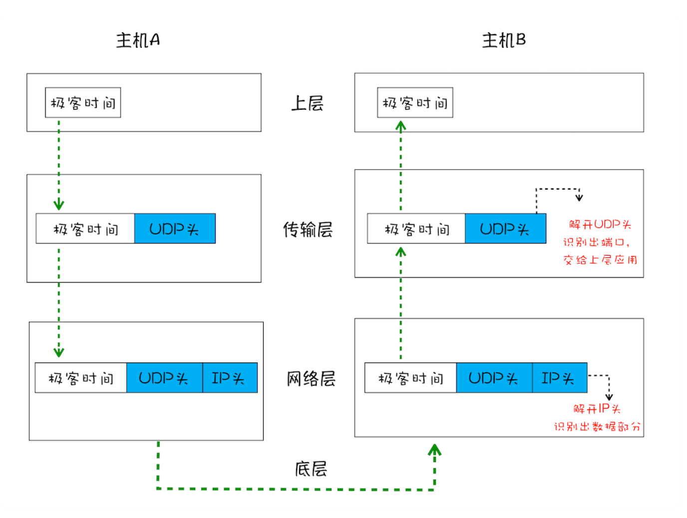
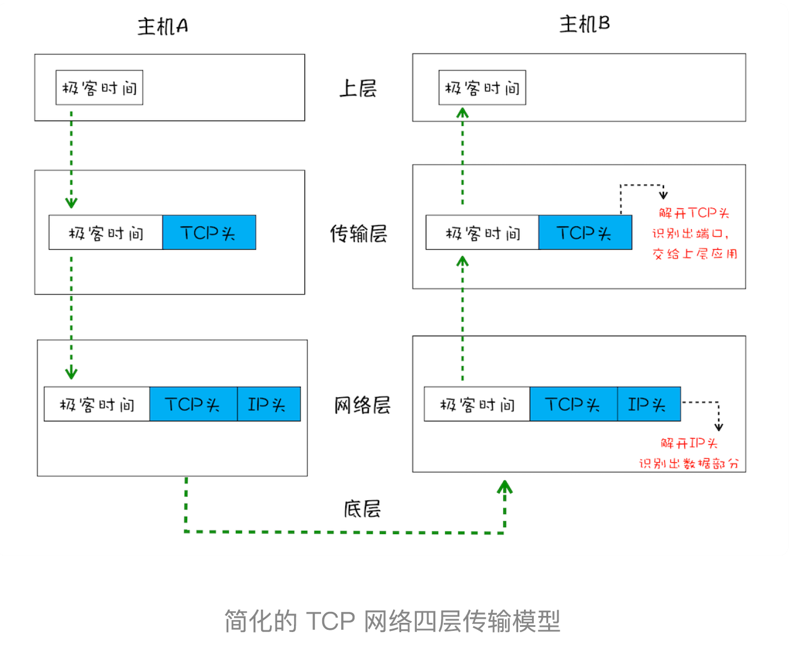
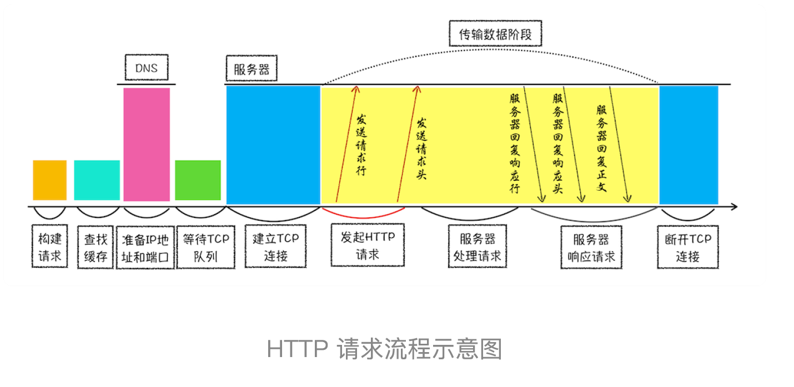

# 网络层

## UDP(User Datagram Protocol) 用户数据报协议

- UDP 中⼀个最重要的信息是端⼝号，端⼝号其实就是⼀个数字，每个想访问⽹络的程序都需要绑定⼀个端⼝号，通过端⼝号 UDP 就能把指定的数据包发送给指定的程序了。所以通过 IP 地址信息把数据包发送给指定的电脑，⽽ UDP 通过端⼝号把数据包分发给正确的程序。和 IP 头⼀样，端⼝号会被装进 UDP 头⾥⾯，UDP 头再和原始数据包合并组成新的 UDP 数据包。UDP 头中除了⽬的端⼝，还有源端⼝号等信息。

  

- 在使⽤ UDP 发送数据时，有各种因素会导致数据包出错，虽然 UDP 可以校验数据是否正确，但是对于错误的数据包，UDP 并不提供重发机制，只是丢弃当前的包，⽽且 UDP 在发送之后也⽆法知道是否能达到⽬的地。
- 虽说 UDP 不能保证数据可靠性，但是传输速度却⾮常快，所以 UDP 会应⽤在⼀些关注速度、但不那么严格要求数据完整性的领域，如在线视频、互动游戏等。
- 使⽤ UDP 来传输会存在两个问题
  - 数据包在传输过程中容易丢失
  - ⼤⽂件会被拆分成很多⼩的数据包来传输，这些⼩的数据包会经过不同的路由，并在不同的时间到达接收端，⽽ UDP 协议并不知道如何组装这些数据包，从⽽把这些数据包还原成完整的⽂件。

## TCP（Transmission Control Protocol，传输控制协议）

- ⼀种⾯向连接的、可靠的、基于字节流的传输层通信协议

  - 面向连接： 三次握手 -> 传输数据 -> 四次挥手
  - 对于数据包丢失的情况，TCP 提供重传机制；
  - TCP 引⼊了数据包排序机制，⽤来保证把乱序的数据包组合成⼀个完整的⽂件

  

  - TCP 为了保证数据传输的可靠性，牺牲了数据包的传输速度

- [三次握手的误解与错误类比(RFC 解读)](https://yonghaowu.github.io/2019/01/11/http_rfc_handshake/)

  TCP 需要 seq 序列号来做可靠重传或接收，而避免连接复用时无法分辨出 seq 是延迟或者是旧链接的 seq，因此需要三次握手来约定确定双方的 ISN（初始 seq 序列号）。

  TCP 设计中一个基本设定就是，通过 TCP 连接发送的每一个包，都有一个 sequence number。而因为每个包都是有序列号的，所以都能被确认收到这些包。

  确认机制是累计的，所以一个对 sequence number X 的确认，意味着 X 序列号之前(不包括 X) 包都是被确认接收到的。

  这条连接突然断开重连后，TCP 怎么样识别之前旧链接重发的包？——这就需要独一无二的 ISN（初始序列号）机制。

  当一个新连接建立时，初始序列号（ initial sequence number ISN）生成器会生成一个新的 32 位的 ISN。

  这个生成器会用一个 32 位长的时钟，差不多 4µs 增长一次，因此 ISN 会在大约 4.55 小时循环一次（`2^32 位的计数器，需要 2^32*4 µs 才能自增完，除以 1 小时共有多少 µs 便可算出 2^32*4 /(1*60*60*1000*1000)=4.772185884`）

  而一个段在网络中并不会比最大分段寿命（Maximum Segment Lifetime (MSL) ，默认使用 2 分钟）长，MSL 比 4.55 小时要短，所以我们可以认为 ISN 会是唯一的。

  1). A –> B SYN my sequence number is X

  2). A <– B ACK your sequence number is X, SYN my sequence number is Y

  3). A –> B ACK your sequence number is Y

- [TCP 三次握手](https://www.zhihu.com/question/24853633/answer/115173386)
- [TCP 三次握手、四次挥手](https://zhuanlan.zhihu.com/p/35768805)

  

- [通俗大白话来理解 TCP 协议的三次握手和四次分手](https://github.com/jawil/blog/issues/14)
- [TCP 的滑动窗口与拥塞窗口](https://blog.csdn.net/zhangdaisylove/article/details/47294315)
- [TCP 滑动窗口（发送窗口和接收窗口）](https://my.oschina.net/xinxingegeya/blog/485650)
- [解析 TCP 之滑动窗口(动画演示)](https://blog.csdn.net/yao5hed/article/details/81046945)
- [TCP-IP 详解：滑动窗口（Sliding Window）](https://blog.csdn.net/wdscq1234/article/details/52444277)
- [TCP 拥塞控制-慢启动、拥塞避免、快重传、快启动](https://blog.csdn.net/jtracydy/article/details/52366461)

  - 拥塞窗口

    发送方为了流控动态变化的发送窗口叫做拥塞窗口，拥塞窗口的大小取决于网络的拥塞程度

  - 慢启动

    网络出现超时，发送方收不到确认 ACK，设置 ssthresh 为 cwnd / 2, 设置 cwnd = 1，然后开始慢启动算法。慢启动算法每经过一个传输轮次（认为发送方都成功接收接收方的确认），拥塞窗口 cwnd 就加倍。当 cwnd = ssthresh 后，慢启动算法发变为拥塞避免算法，cwnd 按照线性的速度进行增长。

  - 快重传

    接收方收到一个失序的报文段后就立刻发出重复确认，而不要等待自己发送数据时才进行捎带确认。如果发送方一连收到三个重复的 ACK,那么发送方不必等待重传计时器到期，由发送方尽早重传未被确认的报文段。

    当发送发连续接收到三个确认时，就执行乘法减小算法，把慢启动开始门限（ssthresh）减半，执行拥塞避免算法，使拥塞窗口缓慢增大。

- [TCP-IP 详解: 慢启动和拥塞控制](https://blog.csdn.net/wdscq1234/article/details/52517420)
- [TCP 协议详解(慢启动,流量控制,阻塞控制之类)](https://blog.csdn.net/rock_joker/article/details/76769404)
- [TCP 协议与 UDP 协议的区别](https://zhuanlan.zhihu.com/p/47064829)
- [TIME_WAIT 累积与端口耗尽](https://blog.csdn.net/u010585120/article/details/80826999)
- [TIME_WAIT 的意义](https://blog.csdn.net/qq_36132127/article/details/81138873)

  - 可靠地实现 TCP 全双工连接的终止

    为了保证 A 发送的最后一个 ACK 报文段能够到达 B。

    A 给 B 发送的 ACK 可能会丢失，B 收不到 A 发送的确认，B 会超时重传 FIN+ACK 报文段，此时 A 处于 2MSL 时间内，就可以收到 B 重传的 FIN+ACK 报文段，接着 A 重传一次确认，重启 2MSL 计时器。最后，A 和 B 都能够正常进入到 CLOSED 状态。

    如果 A 在发完 ACK 后直接立即释放连接，而不等待一段时间，就无法收到 B 重传的 FIN+ACK 报文段，也就不会再次发送确认报文段，这样，B 就无法按照正常步骤进入 CLOSED 状态。

  - 允许旧的报文段在网络中消逝

    MSL 全称是 Maximum Segment Lifetime，是一个 TCP 包的最大存活时间，一个 TCP 包一旦在网络上存活超过 MSL，会直接被丢弃。

    A 发送确认后，该确认报文段可能因为路由器异常在网络中发生“迷途”，并没有到达 B，该确认报文段可以称为旧的报文段。A 在超时后进行重传，  发送新的报文段，B 在收到新的报文段后进入 CLOSED 状态。在这之后，发生迷途的旧报文段可能到达了 B，通常情况下，该报文段会被丢弃，不会造成任何的影响。但是如果两个相同主机 A 和 B 之间又建立了一个具有相同端口号的新连接，那么旧的报文段可能会被看成是新连接的报文段，如果旧的报文段中数据的任何序列号恰恰在新连接的当前接收窗口中，数据就会被重新接收，对连接造成破坏。为了避免这种情况，TCP 不允许处于 TIME_WAIT 状态的连接启动一个新的连接，因为 TIME_WAIT 状态持续 2MSL，就可以保证当再次成功建立一个 TCP 连接的时，来自之前连接的旧的报文段已经在网络中消逝，不会再出现在新的连接中。

## http

[短连接](https://developer.mozilla.org/zh-CN/docs/Web/HTTP/Connection_management_in_HTTP_1.x) -> 长连接 [keep-alive](https://developer.mozilla.org/zh-CN/docs/Web/HTTP/Headers/Keep-Alive)(HTTP/1.1) -> HTTP 管线化 -> 域名分片 -> HTTP/2]

- 从输入 url 到页面呈现浏览器都做了啥？

  - 构建请求
    - 构建请求行信息，构建好后，浏览器准备发起网络请求
      ```http
        GET /index.html HTTP/1.1
      ```
  - 查找缓存
    - 在真正发起⽹络请求之前，浏览器会先在浏览器缓存中查询是否有要请求的⽂件
  - 准备 IP 地址和端⼝
    - DNS 查询
    - 默认端口 80/443
  - 等待 TCP 队列
    - Chrome 有个机制，同⼀个域名同时最多只能建⽴ 6 个 TCP 连接，如果在同⼀个域名下同时有 10 个请求发⽣，那么其中 4 个请求会进⼊排队等待状态，直⾄进⾏中的请求完成。
    - 如果当前请求数量少于 6，会直接进⼊下⼀步，建⽴ TCP 连接。
  - 建⽴ TCP 连接
  - 发送 HTTP 请求
    - 发送请求行
    - 发送请求头
    - 发送请求体
  - 服务器端处理 HTTP 请求流程
    - 返回响应⾏
    - 返回响应头
    - 返回响应体
  - 断开 TCP 连接？

  

- [HTTP 报文](https://www.cnblogs.com/klguang/p/4618526.html)
  - 请求
    - 起始行：`method`、`path`、`HTTP version`
    - 首部
    - 主体
  - 响应
    - 起始行：`HTTP version`、`status code`、`status description`
    - 首部
    - 主体
- [HTTP 协议](https://zhuanlan.zhihu.com/p/24913080)
- [HTTP 请求方法：GET、HEAD、POST、PUT、DELETE、CONNECT、OPTIONS、TRACE、PATCH](https://itbilu.com/other/relate/EkwKysXIl.html)

  - PUT 和 PATCH 区别
    - PUT 一般是资源的整体更新，PATCH 一般是资源的部分更新
    - 当资源不存在时，PATCH 会创建一个新的资源，PUT 只会对已在资源进行更新。

- HTTP 响应头

  - X-Frame-Options (禁止页面被加载进 iframe 中):
    - `DENY`: 表示该页面不允许在 frame 中展示，即便是在相同域名的页面中嵌套也不允许。
    - `SAMEORIGIN`: 表示该页面可以在相同域名页面的 frame 中展示。
    - `ALLOW-FROM uri`: 表示该页面可以在指定来源的 frame 中展示。
  - X-XSS-Protection 对于反射型 XSS 进行一些防御
  - [Content-Security-Policy(内容安全策略( CSP ))](https://developer.mozilla.org/zh-CN/docs/Web/HTTP/CSP)
  - [Content-Security-Policy](https://developer.mozilla.org/zh-CN/docs/Web/HTTP/Headers/Content-Security-Policy__by_cnvoid)

    `Content-Security-Policy: default-src 'self'; img-src *; media-src media1.com media2.com; script-src userscripts.example.com`

    - 所有内容均来自站点的同一个源 (不包括其子域名)

      ```js
      Content-Security-Policy: default-src 'self';
      ```

    - 允许内容来自信任的域名及其子域名 (域名不必须与 CSP 设置所在的域名相同)

      ```js
      Content-Security-Policy: default-src 'self' *.trusted.com;
      ```

    - 所有内容均来自站点的同一个源 (不包括其子域名)

      ```js
      Content-Security-Policy: default-src 'self'; img-src *; media-src media1.com media2.com; script-src userscripts.example.com;
      ```

* [HTTP 中 GET 与 POST 的区别](https://mp.weixin.qq.com/s?__biz=MzI3NzIzMzg3Mw==&mid=100000054&idx=1&sn=71f6c214f3833d9ca20b9f7dcd9d33e4)

  **GET 和 POST 本质上就是 TCP 链接，并无差别。但是由于 HTTP 的规定和浏览器/服务器的限制，导致他们在应用过程中体现出一些不同。**

  1. GET 在浏览器回退时是无害的，而 POST 会再次提交请求。
  2. GET 产生的 URL 地址可以被 Bookmark，而 POST 不可以。
  3. GET 请求会被浏览器主动 cache，而 POST 不会，除非手动设置。
  4. GET 请求只能进行 url 编码，而 POST 支持多种编码方式。
  5. GET 请求参数会被完整保留在浏览器历史记录里，而 POST 中的参数不会被保留。
  6. GET 请求在 URL 中传送的参数是有长度限制的，而 POST 么有。
  7. 对参数的数据类型，GET 只接受 ASCII 字符，而 POST 没有限制。
  8. GET 比 POST 更不安全，因为参数直接暴露在 URL 上，所以不能用来传递敏感信息。
  9. GET 参数通过 URL 传递，POST 放在 Request body 中。
  10. **GET 产生一个 TCP 数据包；POST 产生两个 TCP 数据包。**  
      对于 GET 方式的请求，浏览器会把 http header 和 data 一并发送出去，服务器响应 200（返回数据）；  
      而对于 POST，浏览器先发送 header，服务器响应 100 continue，浏览器再发送 data，服务器响应 200 ok（返回数据）。

- HTTP 请求优化
  - 问题
    - TCP 慢启动
    - 多条 TCP 连接竞争带宽
    - 队头阻塞
  - [前端性能优化之 http 请求的过程](https://juejin.im/post/59f44c5ef265da4327177b98)

## https

- [SSL/TLS 握手过程详解](https://www.jianshu.com/p/7158568e4867)
- [HTTPS 原理详解](https://zhuanlan.zhihu.com/p/27395037)
- [HTTPS](https://zhuanlan.zhihu.com/p/24854237)

## HTTP/2

- [HTTP/2 幕后原理](https://www.ibm.com/developerworks/cn/web/wa-http2-under-the-hood/index.html)
- [HTTP2 详解](https://juejin.im/post/5b88a4f56fb9a01a0b31a67e)

  1. 二进制分帧层
  2. 多路复用
     - HTTP2 采用二进制格式传输，取代了 HTTP1.x 的文本格式，二进制格式解析更高效。
     - 多路复用代替了 HTTP1.x 的序列和（队头）阻塞机制，所有的相同域名请求都通过同一个 TCP 连接并发完成。在 HTTP1.x 中，并发多个请求需要多个 TCP 连接，浏览器为了控制资源会有 6-8 个 TCP 连接都限制。
       HTTP2 中:
       - 同域名下所有通信都在单个连接上完成，消除了因多个 TCP 连接而带来的延时和内存消耗。
       - 单个连接上可以并行交错的请求和响应，之间互不干扰
  3. 服务端推送
  4. Header 压缩（使用 HPACK 算法来压缩首部内容）
  5. 流量控制（可以设置请求的优先级）

- ⼀个域名只使⽤⼀个 TCP ⻓连接来传输数据，这样整个⻚⾯资源的下载过程只需要⼀次慢启动，同时也避免了多个 TCP 连接竞争带宽所带来的问题。
- 问题
  - 多个请求是跑在⼀个 TCP 管道中的，如果其中任意⼀路数据流中出现了丢包的情况，那么就会阻塞该 TCP 连接中的所有请求（阻塞问题更加严重）
  - 随着丢包率的增加，HTTP/2 的传输效率也会越来越差

## HTTP/3(QUIC)


- 实现了类似 TCP 的流量控制、传输可靠性的功能
- 集成了 TLS 加密功能。
- 实现了 HTTP/2 中的多路复⽤功能
  QUIC 实现了在同⼀物理连接上可以有多个独⽴的逻辑数据流（如下图）。实现了数据流的单独传输，就解决了 TCP 中队头阻塞的问题。
  
- 实现了快速握⼿功能
