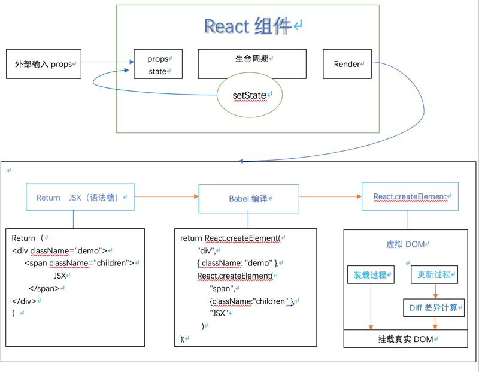

# React

- [从 React 渲染流程分析 Diff 算法](https://segmentfault.com/a/1190000016304921)
  - 什么是虚拟 DOM
    - 其实所谓的 virtual DOM 就是 JavaScript 对象到 Html DOM 节点的映射；即使用 JavaScript 对象将 Html 结构表示出来，而这个对象就是 virtual DOM。
  - 什么时候会生成到 virtual DOM
    - render 执行的结果得到的并不是真正的 DOM 节点，结果仅仅是轻量级的 JavaScript 对象，即在 render 函数调用时将会创建出虚拟 DOM；
      
    - 通过 React.createElemen 创建出虚拟 DOM（React Element），而该函数只在 Render 函数中调用，所以在 React 装载和更新的过程中才会有虚拟 DOM 的生成；至于挂载到真实 DOM 自然而然是 ReactDom.render 函数啦。
  - 为什么需要使用 virtual DOM
    - DOM 管理历史阶段：
      - JS 或者 jQuery 操作 DOM： 当应用程序越来越复杂，需要在 JS 里面维护的字段也越来越多，需要监听事件和在事件回调用更新页面的 DOM 操作也越来越多，应用程序会变得非常难维护。
      - 后来产出 MVC、MVP 的架构模式，期望从代码组织方式来降低维护难度。但是 MVC 架构并没办法减少维护的状态，也没有降低状态更新时需要对页面的更新操作，你需要操作的 DOM 还是需要操作，只是换了个地方。
      - 既然状态改变了要操作相应的 DOM 元素，为什么不做一个东西让视图和状态进行绑定，状态变更了视图自动变更。这就是后来人们想出了 MVVM 模式，只要在模版中声明视图组件是和什么状态进行绑定的，双向绑定引擎就会在状态更新的时候自动更新视图;
      - 但 MVVM 双向数据绑定并不是唯一的办法，还有一个非常直观的方法：一旦状态发生了变化，就用模版引擎重新渲染整个视图，然后用新的视图更换掉旧的视图。
    - React 采用的就是第四种模式；但是我们都知道对于操作 DOM 成本太高，而相对操作 JavaScript 就快速多了，而 Html DOM 可以很简单的用 JavaScript 对象表示出来（Virtual DOM 就这样诞生了）
    - 这样的做法会导致很多的问题，最大的问题就是这样做会很慢，因为即使一个小小的状态变更都要重新构造整棵 DOM，性价比太低；而 React Virtual DOM 在状态更新过程加了一些特别的操作来避免整棵 DOM 树变更。
- [Deep In React 之浅谈 React Fiber 架构(一)](https://juejin.im/post/5d12c907f265da1b6d4033c5)

- React 基础模块

  ```js
    const React = {
      Children: {...},

      createRef,
      Component,
      PureComponent,

      createContext,
      forwardRef,

      Fragment: REACT_FRAGMENT_TYPE,
      StrictMode: REACT_STRICT_MODE_TYPE,
      unstable_AsyncMode: REACT_ASYNC_MODE_TYPE,
      unstable_Profiler: REACT_PROFILER_TYPE,

      createElement,
      cloneElement,
      createFactory,
      isValidElement,

      version: ReactVersion,

      __SECRET_INTERNALS_DO_NOT_USE_OR_YOU_WILL_BE_FIRED: ReactSharedInternals,
    }
  ```

  ```js
  function Component(props, context, updater) {
    this.props = props;
    this.context = context;
    // If a component has string refs, we will assign a different object later.
    this.refs = emptyObject;
    // We initialize the default updater but the real one gets injected by the
    // renderer.
    this.updater = updater || ReactNoopUpdateQueue;
  }

  Component.prototype.isReactComponent = {};
  Component.prototype.setState = function(partialState, callback) {
    this.updater.enqueueSetState(this, partialState, callback, 'setState');
  };
  Component.prototype.forceUpdate = function(callback) {
    this.updater.enqueueForceUpdate(this, callback, 'forceUpdate');
  };
  ```

- React 渲染模块

  ```js
    const ReactDOM: Object = {
      createPortal,
      findDOMNode(
        componentOrElement: Element | ?React$Component<any, any>,
      ): null | Element | Text {
        ...
      },
      hydrate(element: React$Node, container: DOMContainer, callback: ?Function) {
        return legacyRenderSubtreeIntoContainer(null, element, container, true, callback,);
      },

      render(element: React$Element<any>, container: DOMContainer, callback: ?Function,) {
        return legacyRenderSubtreeIntoContainer(null, element, container, false, callback,);
      },
      ...
    };
  ```

- Reconciliation 模块（协调模块）：主要负责任务协调，生命周期管理

  - stack Reconciler

    > 通过递归的形式遍历 Virtual DOM，存在难以中断和恢复的问题，如果 react 更新任务运行时间过长，就会阻塞布局、动画等的运行，可能导致掉帧。

  - Fiber Reconciler

## Fiber

- [React16 源码之 React Fiber 架构](https://juejin.im/post/5b7016606fb9a0099406f8de)
- [React 16 带来了什么以及对 Fiber 的解释](https://juejin.im/post/59de1b2a51882578c70c0833)

## 生命周期

[react-lifecycle-methods](http://projects.wojtekmaj.pl/react-lifecycle-methods-diagram/)


[React v16.4 生命周期的理解](https://juejin.im/post/5b6f1800f265da282d45a79a)

- 挂载阶段

  - constructor
  - static getDerivedStateFromProps(nextProps, prevState)

    一个静态方法，所以不能在这个函数里面使用 this，这个函数有两个参数 props 和 state，分别指接收到的新参数和当前的 state 对象，这个函数会返回一个对象用来更新当前的 state 对象，如果不需要更新可以返回 null

  - <s>componentWillMount/UNSAFE_componentWillMount</s>

    或者 `<span style="text-decoration: line-through">componentWillMount/UNSAFE_componentWillMount</span>`

  - render() 纯函数
  - componentDidMount()

- 更新阶段

  - <s>componentWillReceiveProps/UNSAFE_componentWillReceiveProps</s>
  - static getDerivedStateFromProps(nextProps, prevState)
  - shouldComponentUpdate(nextProps, nextState)
  - <s>componentWillUpdate(nextProps, nextState)/UNSAFE_componentWillUpdate(nextProps, nextState)</s>
  - render()
  - getSnapshotBeforeUpdate(prevProps, prevState)

    函数有一个返回值，会作为第三个参数传给 componentDidUpdate，如果你不想要返回值，请返回 null，不写的话控制台会有警告

  - componentDidUpdate(prevProps, prevState, snapshot)

- 卸载阶段
  - componentWillUnmount // 组件卸载前的清理工作

## **setState**

- 在 React 的 setState 函数实现中，会根据一个变量 isBatchingUpdate 来判断是直接同步更新 this.state 还是放到队列中异步更新 。**React 使用了事务的机制，React 的每个生命周期和合成事件都处在一个大的事务当中。在事务的前置钩子中调用 batchedUpdates 方法修改 isBatchingUpdates 变量为 true，在后置钩子中将变量置为 false**。**原生绑定事件和 setTimeout 异步的函数没有进入到 React 的事务当中**，或者当他们执行时，刚刚的事务已近结束了，后置钩子触发了，所以此时的 setState 会直接进入非批量更新模式，表现在我们看来成为了同步 SetState。

- react@16.x
  - Calling setState with null no longer triggers an update. This allows you to decide in an updater function if you want to re-render.
  - Calling setState directly in render always causes an update. This was not previously the case. Regardless, you should not be calling setState from render.
  - setState callback (second argument) now fires immediately after `componentDidMount / componentDidUpdate` instead of after all components have `rendered`.
- [setState](https://imweb.io/topic/5b189d04d4c96b9b1b4c4ed6)
- [React16——看看 setState 过程中 fiber 干了什么事情](https://juejin.im/post/5afe491e6fb9a07aca7a66a7)

  组件实例中，`_reactInternalFiber` 是当前组件的 fiber，而 `_reactInternalInstance` 是在 react15 使用的对象

  - updater 更新器

  ```js
  var updater = {
    isMounted: false,
    /*
     * instance: 上一步传入的App组件实例，
     * partialState：需要执行更新的箭头函数，
     * callback：undefined
     */
    enqueueSetState: function(instance, partialState, callback) {
      //获取到当前实例上的fiber
      var fiber = get(instance);
      //计算当前fiber的到期时间（优先级）
      var expirationTime = computeExpirationForFiber(fiber);
      //一次更新需要的配置参数
      var update = {
        expirationTime: expirationTime, //优先级
        partialState: partialState, //更新的state，通常是函数而不推荐对象写法
        callback: callback, //更新之后执行的回调函数
        isReplace: false, //
        isForced: false, //是否强制更新
        capturedValue: null, //捕获的值
        next: null //
      };
      //将update上需要更新的信息添加到fiber中
      insertUpdateIntoFiber(fiber, update);
      //调度器调度fiber任务
      scheduleWork(fiber, expirationTime);
    },
    //替换更新state，不关注
    enqueueReplaceState: function(instance, state, callback) {},
    //执行强制更新state，不关注
    enqueueForceUpdate: function(instance, callback) {}
  };
  ```

## virturl Dom\diff 的原理

- [Virtual DOM 的实现和 React Fiber 简介](https://www.jianshu.com/p/b189b2949b33)

  - vDOM

    ```js
    var element = {
      type: 'ul',
      props: {
        id: 'list',
        children: [
          { type: 'li', props: { className: 'item', children: ['Item 1'] } },
          { type: 'li', props: { className: 'item', children: ['Item 2'] } },
          { type: 'li', props: { className: 'item', children: ['Item 3'] } },
          { type: 'li', props: { className: 'item', children: ['Item 4'] } }
        ]
      }
    };
    ```

    - 用 JavaScript 对象结构表示 DOM 树结构；然后用这个树构建真正的 DOM 树，插入到文档中
    - 当状态变更时，重新构建一个新的对象树，然后新旧树作对比，记录两棵树的差异
    - 把差异应用到真正的 DOM 树上，视图就更新了

- [react diff](https://zhuanlan.zhihu.com/p/20346379)
- [vDOM 比真实 DOM 快吗？](https://www.zhihu.com/question/31809713/answer/53544875)

## [合成事件（SyntheticEvent）](https://reactjs.org/docs/events.html)

- SyntheticEvent object

  ```js
    boolean bubbles
    boolean cancelable
    DOMEventTarget currentTarget
    boolean defaultPrevented
    number eventPhase
    boolean isTrusted
    DOMEvent nativeEvent
    void preventDefault()
    boolean isDefaultPrevented()
    void stopPropagation()
    boolean isPropagationStopped()
    DOMEventTarget target
    number timeStamp
    string type
  ```

- Event Pooling

  SyntheticEvent 对象会被重用，并且在调用事件回调后，所有属性都将无效。**切勿异步调用访问 SyntheticEvent 对象**

  > 如果要以异步方式访问事件属性，则应在事件上调用 event.persist()，这将从池中删除合成事件，并允许用户代码保留对事件的引用。

- 捕获阶段添加事件

  事件处理程序由冒泡阶段的事件触发。要为捕获阶段注册事件处理程序，请将 Capture 附加到事件名称；例如，您可以使用 onClickCapture 来处理捕获阶段中的 click 事件，而不是使用 onClick。

- [React 合成事件和 DOM 原生事件混用须知](https://juejin.im/post/59db6e7af265da431f4a02ef)

## 受控组件和非受控组件

- [React 中受控与非受控组件](https://segmentfault.com/a/1190000012404114)
- [React 中组件间通信的几种方式](https://www.jianshu.com/p/fb915d9c99c4)

## [Hooks](https://zh-hans.reactjs.org/docs/hooks-intro.html)

> Hook 使用了 JavaScript 的闭包机制，而不用在 JavaScript 已经提供了解决方案的情况下，还引入特定的 React API。

- 引入 Hooks 的动机

  - 无需修改组件结构的情况下复用状态逻辑

    > 复用状态逻辑的方式，它不复用 state 本身。

    - React 没有提供将可复用性行为“附加”到组件的途径（例如，把组件连接到 store）。
    - 一些解决此类问题的方案，比如 `render props` 和 `高阶组件(HOC)`。
    - 这类方案需要重新组织你的组件结构，这可能会很麻烦，使你的代码难以理解。如果你在 React DevTools 中观察过 React 应用，你会发现由 providers，consumers，高阶组件，render props 等其他抽象层组成的组件会形成“嵌套地狱”。

    ```jsx
    import React, { useState, useEffect } from 'react';

    function useFriendStatus(friendID) {
      const [isOnline, setIsOnline] = useState(null);

      function handleStatusChange(status) {
        setIsOnline(status.isOnline);
      }

      useEffect(() => {
        ChatAPI.subscribeToFriendStatus(friendID, handleStatusChange);
        return () => {
          ChatAPI.unsubscribeFromFriendStatus(friendID, handleStatusChange);
        };
      });

      return isOnline;
    }
    ```

    ```js
    // 在组件中使用
    function FriendStatus(props) {
      const isOnline = useFriendStatus(props.friend.id);

      if (isOnline === null) {
        return 'Loading...';
      }

      return isOnline ? 'Online' : 'Offline';
    }
    ```

    ```jsx
    // 在组件中使用
    function FriendListItem(props) {
      const isOnline = useFriendStatus(props.friend.id);

      return <li style={{ color: isOnline ? 'green' : 'block' }}>{props.friend.name}</li>;
    }
    ```

  - 将组件中相互关联的部分拆分成更小的函数（比如设置订阅或请求数据），而并非强制按照生命周期划分。

    - 组件起初很简单，但是逐渐会被状态逻辑和副作用充斥。
    - 每个生命周期常常包含一些不相关的逻辑。组件常常在 `componentDidMount` 和 `componentDidUpdate` 中获取数据。但是，同一个 `componentDidMount` 中可能也包含很多其它的逻辑，如设置事件监听，而之后需在 `componentWillUnmount` 中清除。相互关联且需要对照修改的代码被进行了拆分，而完全不相关的代码却在同一个方法中组合在一起。
    - 多数情况下，不可能将组件拆分为更小的粒度，因为状态逻辑无处不在。同时，这也是很多人将 React 与状态管理库结合使用的原因之一。

    ```js
    Function FriendStatusWithCounter(props) {
      const [count, setCount] = useState(0);
      useEffect(() => {
        document.title = `You clicked ${count} times`;
      })

      const [isOnline, setIsOnline] = useState(null);
      useEffect(() => {
        ChatAPI.subscribeToFriendStatus(props.friend.id, handleStatusChange);
        return () => {
          ChatAPI.unsubcribeFromFriendStatus(props.friend.id, handleStatusChange);
        }
      })

      function handleStatusChange(status) {
        setIsOnline(status.isOnline);
      }
    }
    // ...
    // 通过使用 Hook，你可以把组件内相关的副作用组织在一起（例如创建订阅及取消订阅），而不要把它们拆分到不同的生命周期函数里。
    ```

  - 在非 class 的情况下可以使用更多的 React 特性。

    - 组件预编译。
    - 使用 class 组件会无意中鼓励开发者使用一些让优化措施无效的方案。
    - class 不能很好的压缩，并且会使热重载出现不稳定的情况。因此，我们想提供一个使代码更易于优化的 API。

- Hooks 使用规则

  - 只能在函数最外层调用 Hook。不要在循环、条件判断或者子函数中调用。
    > React 靠的是 Hook 调用的顺序来保证哪个 state 对应哪个 useState。因为 Hook 的调用顺序在每次渲染中都是相同的，所以它能够正常工作。
  - 只能在 React 的函数组件中调用 Hook。不要在其他 JavaScript 函数中调用。
    - 在 React 的函数组件中调用 Hook
    - 在自定义 Hook 中调用其他 Hook
  - 自定义 Hook 是一个函数，其名称以 “use” 开头，函数内部可以调用其他的 Hook。

- [Hook API 索引](https://zh-hans.reactjs.org/docs/hooks-reference.html)

  - 基础 Hook

    - useState

      - 被更新的 state 需要基于之前的 state, 函数写法

        ```jsx
        function Counter({ initialCount }) {
          const [count, setCount] = useState(initialCount);
          return (
            <>
              Count: {count}
              <button onClick={() => setCount(initialCount)}>Reset</button>
              <button onClick={() => setCount(prevCount => prevCount + 1)}>+</button>
              <button onClick={() => setCount(prevCount => prevCount - 1)}>-</button>
            </>
          );
        }
        ```

      - 与 class 组件中的 setState 方法不同，useState 不会自动合并更新对象。

    - useEffect

      > 传递给 useEffect 的函数在每次渲染中都会有所不同，这是刻意为之的。事实上这正是我们可以在 effect 中获取最新的 count 的值，而不用担心其过期的原因。每次我们重新渲染，都会生成新的 effect，替换掉之前的。  
      > 默认会在调用一个新的 effect 之前对前一个 effect 进行清理。  
      > React 会等待浏览器完成画面渲染之后才会延迟调用 useEffect  
      > 在浏览器完成布局与绘制之后，传给 useEffect 的函数会延迟调用。虽然 useEffect 会在浏览器绘制后延迟执行，但会保证在任何新的渲染前执行。  
      > 为防止内存泄漏，清除函数会在组件卸载前执行。  
      > 如果组件多次渲染（通常如此），则在执行下一个 effect 之前，上一个 effect 就已被清除。

      - 无需清除的 effect

        > 比如发送网络请求，手动变更 DOM，记录日志，这些都是常见的无需清除的操作。  
        > 在执行 DOM 更新之后调用它。默认情况下，它在第一次渲染之后和每次更新之后都会执行。

        ```jsx
        import React, { useState, useEffect } from 'react';

        function Example() {
          const [count, setCount] = useState(0);

          useEffect(() => {
            document.title = `You clicked ${count} times`;
          });

          return (
            <div>
              <p>You clicked {count} times</p>
              <button onClick={() => setCount(count + 1)}>Click me</button>
            </div>
          );
        }
        ```

      - 需要清除的 effect

        > 如果你的 effect 返回一个函数，React 将会在执行清除操作时调用它

        ```js
        import React, { useState, useEffect } from 'react';

        function FriendStatus(props) {
          const [isOnline, setIsOnline] = useState(null);

          useEffect(() => {
            function handleStatusChange(status) {
              setIsOnline(status.isOnline);
            }

            ChatAPI.subscribeToFriendStatus(props.friend.id, handleStatusChange);

            return function cleanUp() {
              ChatAPI.unsubscribeFromFriendStatus(props.friend.id, handleStatusChange);
            };
          });

          if (isOnline === null) {
            return 'Loading ...';
          }

          return isOnline ? 'Online' : 'Offline';
        }
        ```

      - 通过跳过 Effect 进行性能优化,**传递数组作为 useEffect 的第二个可选参数即可**。

        ```js
        useEffect(() => {
          document.title = `You clicked ${count} times`;
        }, [count]);
        ```

      > 如果想执行只运行一次的 effect（仅在组件挂载和卸载时执行），可以传递一个空数组（[]）作为第二个参数。


    - useContext

      `useContext` 让你不使用组件嵌套就可以订阅 `React` 的 `Context`。

      ```js
      function Example() {
        const locale = useContext(LocaleContext);
        const theme = useContext(ThemeContext);
      }
      ```

- 额外的 Hook

  - useReducer

    `useReducer` 可以让你通过 `reducer` 来管理组件本地的复杂 `state`。

    ```js
    function Todos() {
      const [todos, dispatch] = useReducer(todosReducer, initialState);
    }
    ```

  - useCallback
  - useMemo
  - useRef
  - useImperativeHandle
  - useLayoutEffect
    - 和 useEffect 的结构相同，区别只是调用时机不同。
  - useDebugValue

## React 性能优化

- 页面渲染 1000 个元素

  - [在 React 项目中，如何优雅的优化长列表](https://juejin.im/post/5c048f25e51d450d16620d8d)

## react-router 内部实现机制

```js
/**
 * hash router 简单实现
 */
function Router() {
  this.routes = {};
  this.currentUrl = '';
}
Router.prototype.route = function(path, callback) {
  this.routes[path] = callback || function() {};
};
Router.prototype.refresh = function() {
  this.currentUrl = location.hash.slice(1) || '/';
  console.log('refresh', 'currentUrl: ', this.currentUrl);
  this.routes[this.currentUrl]();
};
Router.prototype.init = function() {
  window.addEventListener('load', this.refresh.bind(this), false);
  window.addEventListener('hashchange', this.refresh.bind(this), false);
};

window.Router = new Router();
window.Router.init();

let content = document.querySelector('body');
function changeBackgroundColor(color) {
  content.style.backgroundColor = color;
}

Router.route('/', function() {
  changeBackgroundColor('white');
});
Router.route('/blue', function() {
  changeBackgroundColor('blue');
});
Router.route('/green', function() {
  changeBackgroundColor('green');
});
```

- [前端路由实现与 react-router 源码分析](https://github.com/joeyguo/blog/issues/2)
- [单页面应用路由实现原理：以 React-Router 为例](https://github.com/youngwind/blog/issues/109)

- React-Router 路由实现

```js
/**
 * history 实现，发布订阅模式
 */

function createTransitionManage() {
  let prompt = null;

  function setPrompt(nextPrompt) {
    warning(prompt == null, 'A history supports only one prompt at a time');
    prompt = nextPrompt;
    return () => {
      if (prompt === nextPrompt) prompt = null;
    };
  }

  function confirmTransitionTo(location, action, getUserConfirmation, callback) {
    if (prompt != null) {
      const result = typeof prompt === 'function' ? prompt(location, action) : prompt;

      if (typeof result === 'string') {
        if (typeof getUserConfirmation === 'function') {
          getUserConfirmation(result, callback);
        } else {
          warning(false, 'A history needs a getUserConfirmation function in order to use a prompt message');
          callback(true);
        }
      } else {
        callback(result !== false);
      }
    } else {
      callback(true);
    }
  }

  let listeners = [];

  function appendListener(fn) {
    let isActive = true;

    function listener(...args) {
      if (isActive) fn(...args);
    }

    listeners.push(listener);

    return () => {
      isActive = false;
      listeners = listeners.filter(item => item !== listener);
    };
  }

  function notifyListeners(...args) {
    listeners.forEach(listener => listener(...args));
  }

  return {
    setPrompt,
    confirmTransitionTo,
    appendListener,
    notifyListeners
  };
}

function createBrowserHistory(props = {}) {
  const globalHistory = window.history;

  ...

  const transitionManager = createTransitionManager();

  function setState(nextState) {
    Object.assign(history, nextState);
    history.length = globalHistory.length;
    transitionManager.notifyListeners(history.location, history.action);
  }

  function handlePop(location) {
    if(forceNextPop) {
      forceNextPop = false;
      setState();
    } else {
      const action = 'POP';

      transitionManager.confirmTransitionTo(
        location, action, getUserConfirmation,
        ok => {
          if(ok) {
            setState({
              action, location
            });
          } else  {
            revertPop(location);
          }
        }
      );
    }
  }

  function push(path, state) {
    warning(
      !(
        typeof path === 'object' &&
        path.state !== undefined &&
        state !== undefined
      ),
      'You should avoid providing a 2nd state argument to push when the 1st ' +
        'argument is a location-like object that already has state; it is ignored'
    );

    const action = 'PUSH';
    const location = createLocation(path, state, createKey(), history.location);

    transitionManager.confirmTransitionTo(
      location, action, getUserConfirmation, ok => {
        if(!ok) return ;

        const href = createHref(location);
        const {key, state} = location;

        if(canUseHistory) {
          globalHistory.pushState({key, state}, null, href);

          if(forceRefresh) {
            window.location.href = href;
          } else {
            const prevIndex = allKeys.indexOf(history.location.key);
            const nextKeys = allKeys.slice(0, prevIndex === -1 ? 0 : prevIndex+1);

            nextKeys.push(location.key);
            allKeys = nextKeys;

            setState({action, location});
          }
        } else {
          warning(
            state === undefined,
            'Browser history cannot push state in browsers that do not support HTML5 history'
          );
          window.location.href = href;
        }
      }
    )
  }

  function replace(path, state) {
       warning(
      !(
        typeof path === 'object' &&
        path.state !== undefined &&
        state !== undefined
      ),
      'You should avoid providing a 2nd state argument to replace when the 1st ' +
        'argument is a location-like object that already has state; it is ignored'
    );

    const action = 'REPLACE';
    const location = createLocation(path, state, createKey(), history.location);

    transitionManager.confirmTransitionTo(
      location,
      action,
      getUserConfirmation,
      ok => {
        if(!ok) return;

        const href = createHref(location);
        const {key, state} = location;

        if(canUseHistory) {
          globalHistory.replaceState({key, state}, null, href);

          if(forceRefresh) {
            window.location.replace(href);
          } else {
            const prevIndex = allKeys.indexOf(history.location.key);

            if(prevIndex !== -1)  allKeys[prevIndex] = location.key;

            setState({action, location});
          }
        } else {
          warning(
            state === undefined,
            'Browser history cannot replace state in browsers that do not support HTML5 history'
          );

          window.location.replace(href);
        }
      }
    )
  }

  function go(n) {
    globalHistory.go(n);
  }

  function goBack() {
    go(-1);
  }

  function goForward() {
    go(1);
  }

  function listen(listener) {
    const unlisten = transitionManager.appendListener(listener);
    checkDOMListeners(1);

    return () => {
      checkDOMListeners(-1);
      unlisten();
    }
  }

  const history = {
    length: globalHistory.length,
    action: 'POP',
    location: initialLocation,
    createHref,
    push,
    replace,
    go,
    goBack,
    goForward,
    block,
    listen,
  }

  return history
}
```

```jsx
/**
 * React-Router 实现，RouterContext.Provider / RouterContext.Consumer
 */
class BrowserRouter extends React.Component {
  history = createHistory(this.props);

  render() {
    return <Router history={this.history} children={this.props.children} />;
  }
}

if (__DEV__) {
  BrowserRouter.prototype.componentDidMount = function() {
    warning(
      !this.props.history,
      '<BrowserRouter> ignores the history prop. To use a custom history, ' +
        'use `import { Router }` instead of `import { BrowserRouter as Router }`.'
    );
  };
}

function Link({ component = LinkAnchor, replace, to, ...rest }) {
  return (
    <RouterContext.Consumer>
      {context => {
        return React.createElement(component, {
          ...rest,
          href,
          navigate() {
            const location = resolveToLocation(to, context.location);
            const method = replace ? history.replace : history.push;

            method(location);
          }
        });
      }}
    </RouterContext.Consumer>
  );
}

class Router extends React.Component {
  constructor(props) {
    super(props);

    this.state = {
      location: props.history.location
    };

    this._isMounted = false;
    this._pendingLocation = null;

    if (!props.staticContext) {
      this.unlisten = props.history.listen(location => {
        if (this._isMounted) {
          this.setState({ location });
        } else {
          this._pendingLocation = location;
        }
      });
    }
  }

  componentDidMount() {
    this._isMounted = true;

    if (this._pendingLocation) {
      this.setState({ location: this._pendingLocation });
    }
  }

  componentWillUnmount() {
    if (this.unlisten) this.unlisten();
  }

  render() {
    return (
      <RouterContext.Provider
        children={this.props.children || null}
        value={{
          history: this.props.history,
          location: this.state.location,
          match: Router.computeRootMatch(this.state.location.pathname),
          staticContext: this.props.staticContext
        }}
      />
    );
  }
}

class Route extends React.Component {
  render() {
    return (
      <RouterContext.Consumer>
        {context => {
          const location = this.props.location || context.location;
          const match = this.props.computedMatch
            ? this.props.computedMatch
            : this.props.path
            ? matchPath(location.pathname, this.props)
            : context.match;

          const props  = {..context, location, match};

          return (
            <RouterContext.Provider value={props}>
              {
                children && !isEmptyChildren(children)
                  ? children
                  : props.match
                    ? component
                      ? React.createElement(component, props)
                      : render
                        ? render(props)
                        : null
                    : null
              }
            </RouterContext.Provider>
          )
        }}
      </RouterContext.Consumer>
    );
  }
}
```

## react-redux

```js
// Provider
class Provider extends Component {
  constructor(props) {
    super(props)

    // 获取store
    const { store } = props

    // 初始化state, storeState为初始的redux state
    this.state = {
      storeState: store.getState(),
      // 保存init store
      store
    }
  }

  componentDidMount() {
    // 文件收索_isMounted， 共三处， componentWillUnmount中赋值为false
    // 先假设为标记componentDidMount -> componentWillUnmount中
    this._isMounted = true
    // 来看下subscribe
    this.subscribe()
  }

  // 使用store.subscribe方法，保证storeState的最新
  subscribe() {
    const { store } = this.props
    // 监听subscribe
    this.unsubscribe = store.subscribe(() => {
     // 获取最新的state赋值给newStoreState
      const newStoreState = store.getState()
      // 不在本次生命周期中return
      if (!this._isMounted) {
        return
      }

      this.setState(providerState => {
        // If the value is the same, skip the unnecessary state update.
        // 如果state是相同的引用， 直接跳过state的更新
        if (providerState.storeState === newStoreState) {
          return null
        }

        // 更新当前storeState
        return { storeState: newStoreState }
      })
    })

    const postMountStoreState = store.getState()
    if (postMountStoreState !== this.state.storeState) {
      this.setState({ storeState: postMountStoreState })
    }
  }

  render() {
    // ReactReduxContext为默认context, 点过去看一下默认值。 看 -> context.js文件，createContext参数是null
    const Context = this.props.context || ReactReduxContext

    // value 为this.state
    return (
      <Context.Provider value={this.state}>
        {this.props.children}
      </Context.Provider>
    )
  }

```

```js
// connectAdvanced高阶函数

export default function connectAdvanced() {
  return function wrapWithConnect(WrappedComponent) {
    class Connect extends OuterBaseComponent {
      renderWrappedComponent(value) {
        // 获取redux state和store
        const { storeState, store } = value;

        // 定义wrapperProps为this.props
        let wrapperProps = this.props;

        // 导出props
        let derivedProps = this.selectDerivedProps(storeState, wrapperProps, store);

        // 返回最终的组件,传入最终的props和ref -> 看selectChildElement发放
        return this.selectChildElement(derivedProps, forwardedRef);
      }

      render() {
        // 默认情况下公用的ReactReduxContext
        const ContextToUse = this.props.context || Context;

        return (
          // <Privoder />的消费者
          <ContextToUse.Consumer>{this.renderWrappedComponent}</ContextToUse.Consumer>
        );
      }
    }
    return hoistStatics(Connect, WrappedComponent);
  };
}
```

## redux 基本组成和设计单向数据流


- [redux 源码解读](https://juejin.im/post/5ae7db125188253dc6127bc7)

- Redux 试图让 state 的变化变得可预测。这些限制条件反映在 Redux 的三大原则中。

- 三大原则

  - 单一数据源

    整个应用的 state 被存储在一棵 Object tree 中，并且这个 Object tree 只存在于唯一一个 store 中。

  - State 是只读的

    唯一改变 State 的方法就是触发 Action, Action 是一个用于描述已发生事件的普通对象。

  - 使用纯函数来执行修改

    为了描述 Action 如何改变 state tree，需要编写 reducers。

    - [征服 JavaScript 面试：什么是纯函数？](https://zcfy.cc/article/master-the-javascript-interview-what-is-a-pure-function-2186.html)
      - 相同的输入，相同的输出
      - 没有副作用
      - 不会依赖外部状态

## [【译】Redux 还是 Mobx，让我来解决你的困惑！](https://segmentfault.com/a/1190000011148981)

## Immutable.js

> Immutable Data 就是一旦创建，就不能再被更改的数据。对 Immutable 对象的任何添加、修改、删除操作都会返回一个新的 Immutable 对象。  
> Immutable 实现原理是持久化数据结构（Persistent Data Structure），也就是使用旧数据创建新数据时，要保证旧数据同时可用且不变。同时为了避免 deepCopy 把所有节点都复制一遍带来的性能损失，Immutable 使用了结构共享（Structural Sharing），即如果对象中的一个节点发生了变化，只修改这个节点和受它影响的父节点，其他节点则进行共享。


- 优缺点

  1. 降低 Mutable 带来的复杂度

     ```js
     let obj = { a: 1 };
     let copy_obj = obj;
     copy_obj.a = 2;
     console.log(obj.a); // 2
     ```

  2. 节省内存空间（结构共享）
  3. 拥抱函数式编程
     纯函数式编程比面向对象更适用于前端开发。因为只要输入一致，输出必然一致，开发的组件更易于调试和安装。

- [你需要 Mobx 还是 Redux？](https://juejin.im/post/5a7fd72c5188257a766324ae)

# Angular

- [AngularJS 脏检查深入分析](https://www.cnblogs.com/likeFlyingFish/p/6183630.html)

```js
/**
 * 藏检查的内部实现
 *
 * 每当我们将数据绑定到 UI 上，angular 就会向你的 watchList 上插入一个 $watch。
 * 只有当触发UI事件，ajax请求或者 timeout 延迟，才会触发脏检查。
 *
 * getter 和 setter 是Vue 采用的机制,我觉得他两个最大的区别就是 Angular 采用事件驱动,而Vue 采用数据驱动 .所以 Angular 是当界面事件 或者其他 来触发脏检查, 而Vue 是检测后台数据变化,一旦变化 被 setter 捕捉, 然后来触发 界面更新.
 */
function $Scope() {
  this.$$watchList = [];
}

$Scope.prototype.$watch = function(name, getNewValue, listener) {
  const watch = {
    name: name,
    getNewValue: getNewValue,
    listener: listener || function() {}
  };

  this.$$watchList.push(watch);
};

$Scope.prototype.$digest = function() {
  let dirty = true;
  let checkTimes = 0;
  while (dirty) {
    dirty = this.$digestOnce();
    checkTimes++;
    if (checkTimes > 10 && dirty) {
      throw new Error('检测次数超过10次');
    }
  }
};

$Scope.prototype.$digestOnce = function() {
  let dirty = false;
  const list = this.$$watchList;

  for (let i = 0, len = list.length; i < len; i++) {
    const watch = list[i];
    const newValue = watch.getNewValue(this); // 传入 scope 获取 scope 内值
    const oldValue = watch.last;

    if (newValue !== oldValue) {
      watch.listen(newValue, oldValue);
      dirty = true;
    }

    watch.last = newValue;
  }

  return dirty;
};

/***************************************************/

const scope = new $Scope();
scope.first = 1;
scope.secode = 10;

scope.$watch(
  'first',
  function(_scope) {
    return _scope[this.name]; //  getNewValue 通过 watch.getNewValue 方式调用，this 指向 watch
  },
  function(newValue, oldValue) {
    scope.second++;
    console.log('first:      newValue:' + newValue + '-----' + 'oldValue:' + oldValue);
  }
);

scope.$watch(
  'second',
  function(_scope) {
    return _scope[this.name];
  },
  function(newValue, oldValue) {
    scope.first++;
    console.log('second:     newValue:' + newValue + '-----' + 'oldValue:' + oldValue);
  }
);

scope.$digest();
```

- [如何衡量一个人的 AngularJS 水平？](https://www.zhihu.com/question/36040694/answer/65624196)
- [基于 getter 和 setter 撸一个简易的 MVVM](https://www.cnblogs.com/likeFlyingFish/p/6201106.html)
