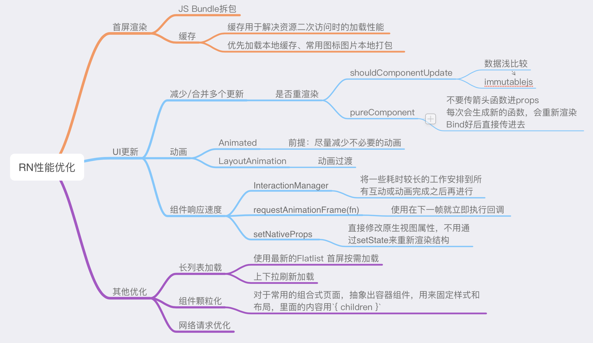

# RN 优化实践

## 可能会导致产生性能问题的常见原因

- console.log 会拖慢页面性能

  - 安装 babel-plugin-transform-remove-console

- 长列表性能问题

  - 使用 FlatList, 配合 getItemLayout 计算布局（本质是虚拟列表渲染， 不可见元素，只渲染轮廓）

- 重绘问题

  - React 常规优化（减少 reRender）

- JS 线程阻塞导致的掉帧问题

  - InteractionManager：监听页面动画完成
  - LayoutAnimation
  - Animated: useNativeDriver: true(本质计算好所有动画数据，一次性传给原生)

## 优化

## 参考

- [React Native 性能优化总结](https://github.com/amandakelake/blog/issues/49)
